# Learner’s Guide to Validation Rules (Use)

# What is this guide?

This guide contains all exercises and detailed steps to perform them related to the use of validation rules session for the Analytics Tools Level 1 academy. Please perform each of the exercises when prompted by your instructors.

# Learning objectives for this session

1. Understand some of the key principles associated with data quality
2. Define what a validation rule in DHIS2 is
3. Understand how validation rules can be used to measure consistency in DHIS2
4. Execute validation rule review in data entry
5. Execute validation rule review in bulk via validation analysis
6. Describe how validation rules can be compared against calculated thresholds
7. Execute validation rule analysis using validation rules with defined thresholds

# Time needed for this session

Live demo: 4 demos/presentations, ~ 20 mins each

Hands-on activities: 4 activities, ~ 15 mins each

# Table of Contents/Quick Guide

- [Learner’s Guide to Validation Rules (Use)](#learners-guide-to-validation-rules-use)
- [What is this guide?](#what-is-this-guide)
- [Learning objectives for this session](#learning-objectives-for-this-session)
- [Time needed for this session](#time-needed-for-this-session)
- [Table of Contents/Quick Guide](#table-of-contentsquick-guide)
- [Hands On Activities](#hands-on-activities)
    - [Review the rules in data entry](#review-the-rules-in-data-entry)
  - [Activity 2 - Run a validation rule in validation rule analysis](#activity-2---run-a-validation-rule-in-validation-rule-analysis)
    - [Review the validation details](#review-the-validation-details)
  - [Activity 3 - Examples with mathematical operations](#activity-3---examples-with-mathematical-operations)
    - [Review the rules in data entry](#review-the-rules-in-data-entry-1)
    - [Run a validation rule in validation rule analysis](#run-a-validation-rule-in-validation-rule-analysis)
    - [Review the validation details](#review-the-validation-details-1)
  - [Activity 4 - Run the validation rule using a threshold in data entry](#activity-4---run-the-validation-rule-using-a-threshold-in-data-entry)
  - [Activity 5 - Run the “Immunisation thresholds” validation rules in validation rule analysis](#activity-5---run-the-immunisation-thresholds-validation-rules-in-validation-rule-analysis)
    - [Check the messages app](#check-the-messages-app)
    - [Check your email to review the notification](#check-your-email-to-review-the-notification)

# Hands On Activities

  

### Review the rules in data entry

After you run the rules, review and interpret them. This will help you to identify any issues with the data currently. The validation rules are pointing us to where there are problems in our data. Close the results page and review the data entry screen to verify what is being calculated.

The first and second values are being taken from the sex section HIV tests performed and HIV tests positive categorized by gender/sex (Female and Male).

Reviewing our data, this means that one of these values must be incorrect. We may need to verify with the facility, but let us assume this has already been done and we understand the HIV tests positive were counted incorrectly. 

We can update this to “40” and “98” respectively. Run the validation again. 

It should now pass as the number of HIV tests positive is now less than the HIV tests performed in this period (April 2021).

## Activity 2 - Run a validation rule in validation rule analysis

In order to run validation rule analysis, go to the data quality app and select “Run validation”

Select a single month (for example, March 2021) and District and run the “HIV validation rules.” This will allow for all of the HIV validation rules to be run against all the facilities within the district for the time period you have selected. This is much more useful when trying to review many org units at once rather than selecting each org unit in data entry and running the validation rules. 

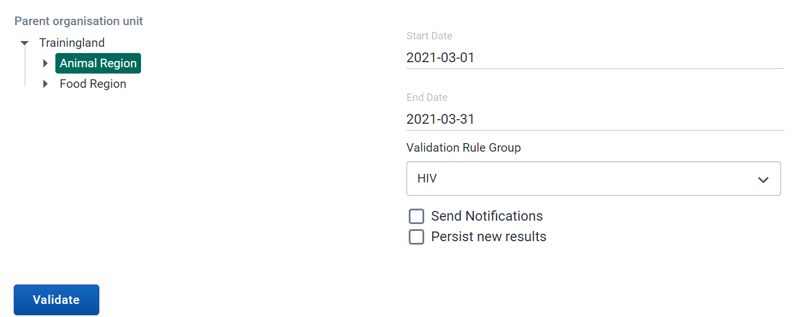

Once you have selected the inputs select “Validate”

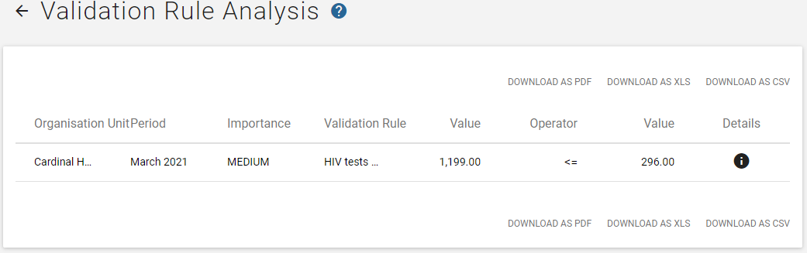

### Review the validation details

You should see all violations during this period. Select the details button of one of the violations so you can see in more detail what the issue is. This example is Cardinal  in March 2021.

The validation details show all of the data elements that are part of the validation rule along with their values. In this example, the total number of HIV tests positive should be &lt;= the total HIV tests performed.

Therefore, HIV tests positive (1199) > Total HIV tests performed (296), not less than or equal to the number of tests performed, hence the identification of a violation. 

We can see how this view will be useful in reviewing the violations for multiple org units at once, as we can also see all the component parts of the violation. This can allow us to potentially identify exactly which value is incorrect. 

## Activity 3 - Examples with mathematical operations 

Select the following in data entry:

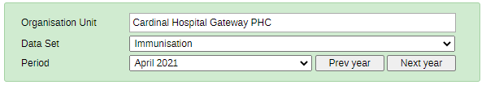

First, review the data entry page briefly. We will start by running logical rules, which are checking the correctness of the data. These rules will essentially tell us if the data should be fixed based on the output it provides. 

There are several places you can check if your data entry page passes the configured validation rules.

At the top right corner:

At the bottom of the page:

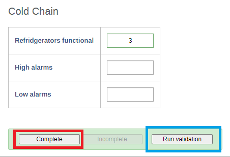

**Note** that validation will run everytime you click on complete. The complete button, is that it contributes to two of the factors of data quality previously discussed: the completeness and timeliness of the data. When selecting the complete button, the dataset registers as being complete (data is saved automatically as it is entered, complete does not save the data). The date in which the complete button is selected is used to compare against the defined timeliness of the dataset. So if my timeliness is defined as having the data submitted within 15 days of the next month, and I click complete on March 8 for February data, the dataset will be complete for February as well as timely!

After reviewing these concepts, run the validation rule(s)

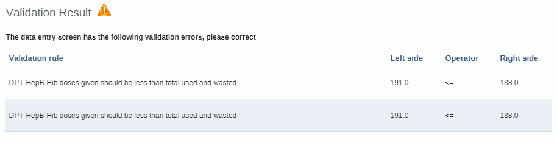

### Review the rules in data entry

After you run the rules, review them. This will help you to identify any issues with the data currently. The validation rules are pointing us to where there are problems in our data. Close the results page and review the data entry screen to verify what is being calculated.

The first value is being taken from the total number of DPT doses that are administered. 

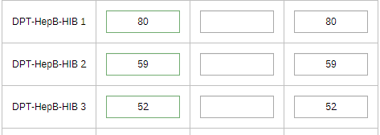

The second value is being taken from our stock section

Reviewing our data, this means that one of these values must be incorrect. We may need to verify with the facility, but let us assume this has already been done and we understand the received balance was counted incorrectly. 

### Run a validation rule in validation rule analysis

In order to run validation rule analysis, go to the data quality app and select “Run validation”

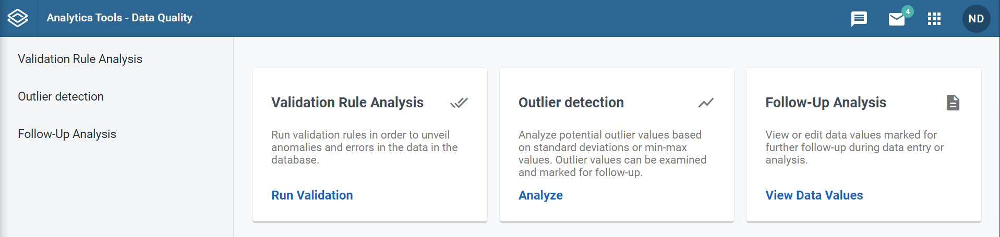

Select a single month (ex. January 2021) and District and run the “Immunisation validation rules.” This will allow for all of the immunisation validation rules to be run against all the facilities within the district for the time period you have selected. This is much more useful when trying to review many org units at once rather than selecting each org unit in data entry and running the validation rules. 

Once you have selected the inputs select “Validate”

### Review the validation details

You should see a number of violations during this period. Select the details button of one of the violations so you can see in more detail what the issue is. This example is Cheesecake dispensary in January 2019.

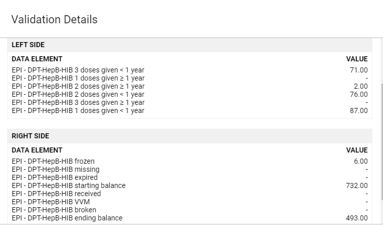

The validation details show all of the data elements that are part of the validation rule along with their values. In this example, the total number of DPT doses given should be &lt;= the total used and wasted.

1. The total DPT doses = 71+2+76+87= 236
2. Total used and wasted = 732-(6+493) = 233

Therefore, DPT doses (236) > Total used and wasted (233), not less than or equal to the number used and wasted, hence the identification of a violation. 

We can see how this view will be useful in reviewing the violations for multiple org units at once, as we can also see all the component parts of the violation. This can allow us to potentially identify exactly which value is incorrect. 

## Activity 4 - Run the validation rule using a threshold in data entry

**_This should be done after presenting slide 14 in the presentation._**

Select the following in data entry

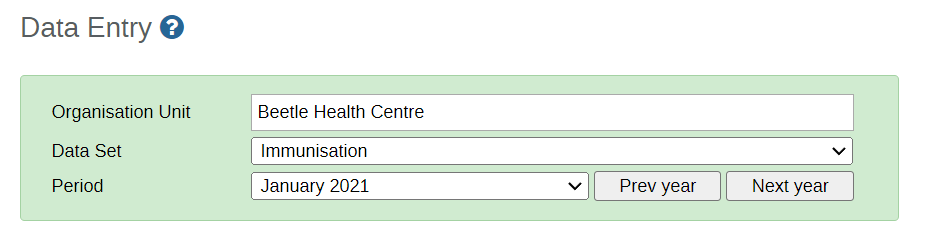

Run the validation rule and review the results

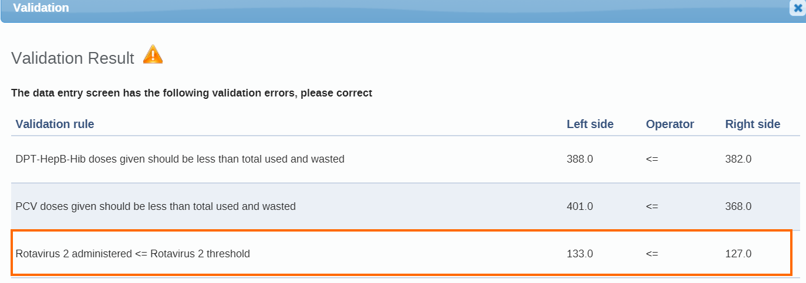

**Note** that it runs both the logical rules, which we have already reviewed, as well as the rules that check consistency using outliers that have been generated via the predictor function in this case. These rules can run using outliers that have been imported into the system as well if required.

## Activity 5 - Run the “Immunisation thresholds” validation rules in validation rule analysis

Perform this after finishing the presentation.

In Validation Rule Analysis, select:

* Org Unit: Animal Region
* Period: January 1 - April 30 2021
* Validation Rule Group : Immunisation thresholds
* Ensure the send notifications option is selected

Run the rules and also _send the notifications** **_for any identified violations. Select validate to proceed.

As we sent the notification out, we will also receive this via the messages app and potentially e-mail as well if this has been configured. 

### Check the messages app

Navigate to the messages app and review the validation violations that have been sent. You will have a small notification that there are new validation rule messages in your messages inbox (the number within the circle in this image). 

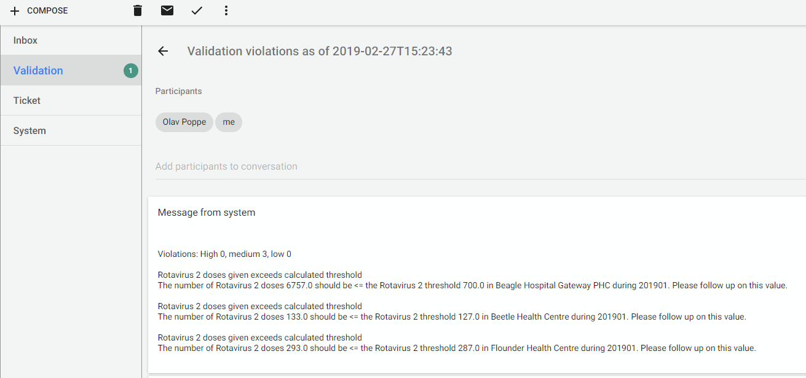

This message will be sent to multiple users. Who receives this message is dependent on the configuration. How to configure these will be covered later on. You should receive this message both in DHIS2 messaging as well as your email.

 

### Check your email to review the notification

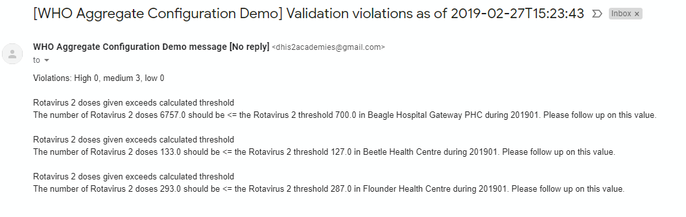

