# Learner’s Guide to Dashboards

## What is this guide?

This guide contains all exercises and detailed steps to perform them related to the use of dashboards for the Analytics Tools Level 1 academy. Please perform each of the exercises when prompted to by your instructors.

## Learning objectives for this session

1. Describe how to navigate the dashboard
2. Demonstrate how to create and manage a dashboard
3. Demonstrate how to add previously created tables, charts and maps to the dashboard
4. Describe the concept of user org units as it applies to saved items in more detail
5. Describe how to share dashboards, with an emphasis on how user org units can supplement sharing

## Time needed for this session

Live demo: 3 demos,~ 15 minutes each

Hands-on exercises: 3 exercises, ~ 15 minutes each

Assignment : ~ 20 mins

## Table of Contents/Quick Guide

- [Learner’s Guide to Dashboards](#learners-guide-to-dashboards)
  - [What is this guide?](#what-is-this-guide)
  - [Learning objectives for this session](#learning-objectives-for-this-session)
  - [Time needed for this session](#time-needed-for-this-session)
  - [Table of Contents/Quick Guide](#table-of-contentsquick-guide)
  - [Exercises](#exercises)
  - [Exercise 1 - Using Dashboards](#exercise-1---using-dashboards)
    - [Use the filter](#use-the-filter)
    - [Discuss how descriptions and interpretations are added to the dashboard](#discuss-how-descriptions-and-interpretations-are-added-to-the-dashboard)
    - [Review the interactivity of dashboard items](#review-the-interactivity-of-dashboard-items)
    - [Printing Dashboards](#printing-dashboards)
    - [Accessing Dashboards from a Mobile Device](#accessing-dashboards-from-a-mobile-device)
    - [Making dashboards available offline](#making-dashboards-available-offline)
  - [Exercise 2 - Creating Dashboards](#exercise-2---creating-dashboards)
    - [Create a new dashboard](#create-a-new-dashboard)
    - [Discuss the filter settings](#discuss-the-filter-settings)
  - [Exercise 3 - Re-Using Dashboards Across Many Users](#exercise-3---re-using-dashboards-across-many-users)
    - [Review user org units](#review-user-org-units)
    - [Review sharing](#review-sharing)
    - [Login as Cat District Manager](#login-as-cat-district-manager)
    - [Login as Staple District Manager](#login-as-staple-district-manager)

## Exercises

## Exercise 1 - Using Dashboards

We can use the “HIV national” dashboard to explain the dashboard interface. Participants will be familiar with the dashboard by now as this was discussed in the initial overview demo and they have seen it every time they log in at this stage, so you may not need to spend a lot of time here. 

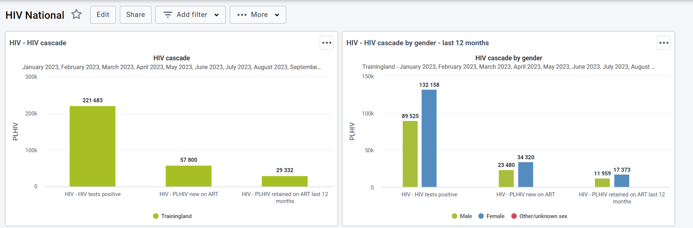

The top of the dashboard has the various dashboards the user has access to along with the search bar. Dashboards that have been “starred” appear first in the list of dashboards. You can ‘star’ the dashboard by using the star icon next to the name of the dashboard. You can also click on the “info” button to see a description of the dashboard. 

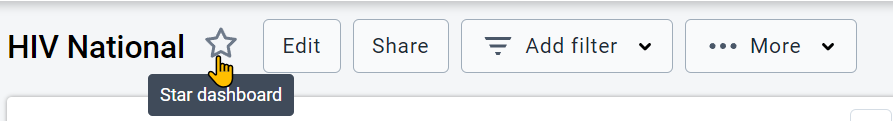

The “more” button allows you to access several additional features, such as viewing the description and printing the dashboard.

You can use the search bar to find particular dashboards.  

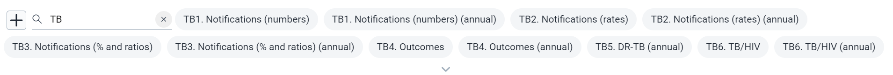

You can also expand the list of dashboards by using the “Show More” button or dragging the bar to be wider and include more dashboard items.

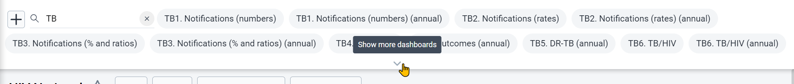

### Use the filter

Within the dashboard interface, we can decide which level of data we are seeing by using the filter. In the HIV National Dashboard, at the moment, all of the outputs are displaying data for Trainingland. Select “Add filter” and “Organisation Unit” to apply an org unit filter. Select a region within the org unit filter and update the dashboard.

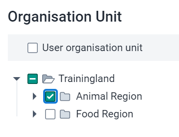

All of the outputs will be updated to use the filter that you have applied. You will also see a message at the top of the dashboard showing the filter you have applied.

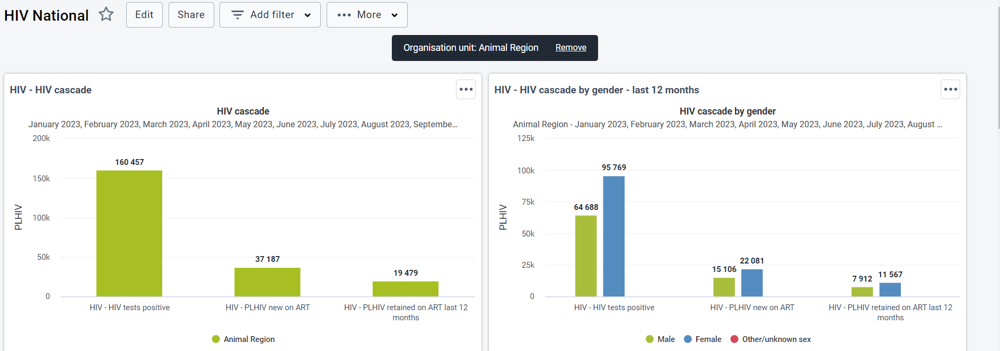

We can add other filters to the dashboard as well. This includes a period or data dimension. This feature is very useful as it filters all of the items on the dashboard at once. For example, you could also add a filter for the period, only viewing the a specific month of data.

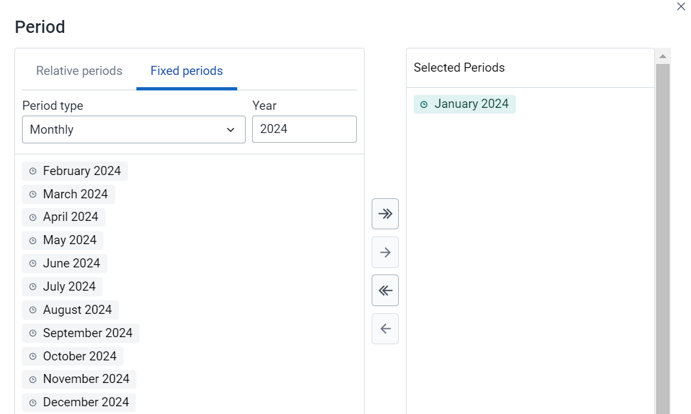

This will update all of the items on the dashboard to include data from the options you have filtered out only.

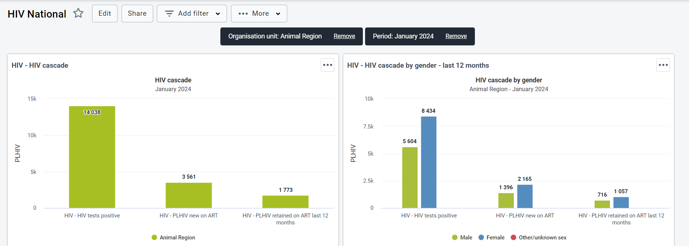

You can remove these filters by clicking on the “Remove” text next to the filter on the top of the dashboard.

### Discuss how descriptions and interpretations are added to the dashboard

Select the chart HIV - HIV Cascade from the HIV National dashboard. When we save an item, we are asked for a description. This description appears in the panel within each app and can also appear within the dashboard item. It is recommended that all outputs have a description attached to them. 

To show the description, select the menu icon for the dashboard item followed by “Show interpretations and details.”

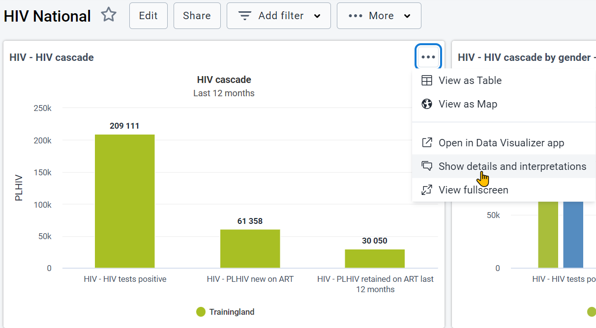

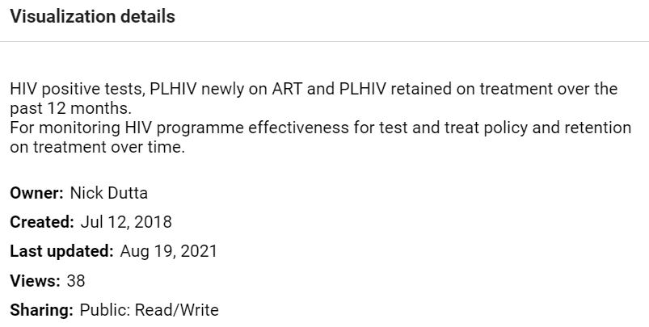

You can also add interpretations directly on the dashboard. When making these interpretations, you can directly tag individuals in your comment. They will receive a notification in the messages app and e-mail if it is configured. 

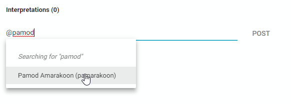

### Review the interactivity of dashboard items

Dashboard items are meant to be interactive. This is true of charts, maps, and tables. De-select the male disaggregation on the chart HIV - HIV cascade by gender - last 12 months chart. This will cause those items to disappear. You can add it back in before proceeding. Hovering over items in the chart will also show a small description of the chart item.

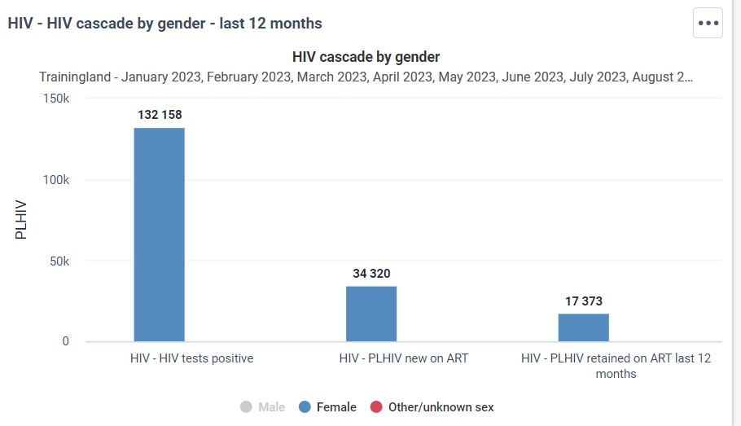

Tables allow you to sort them within the dashboard. You can do this by selecting a column heading within a table.

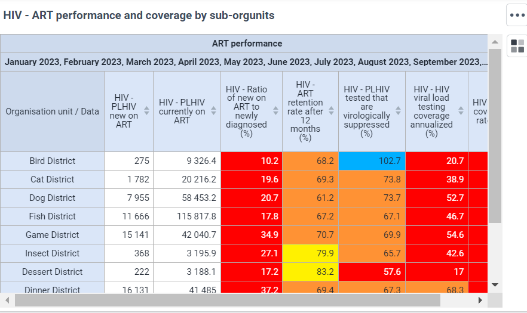

While maps allow you to show the legend, hover over thematic layers to see a more detailed description of the item you are reviewing

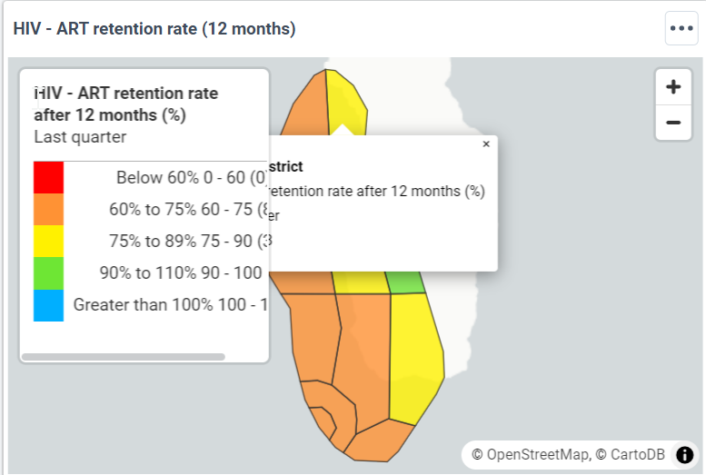

Note that all items (maps, tables, charts) can now be viewed in full screen by using the menu option.

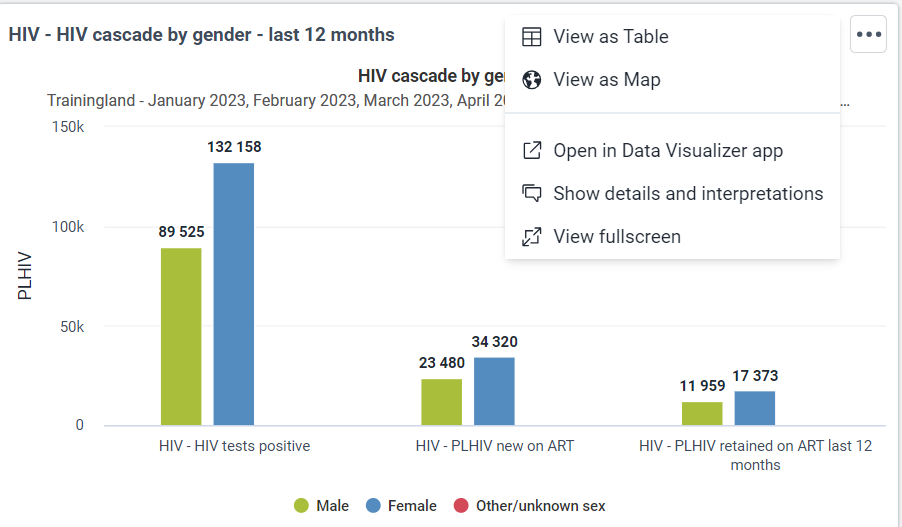

Dashboard items also allow for you to change between different output types. View the map HIV - ART retention rate (12 months). You can change to a chart

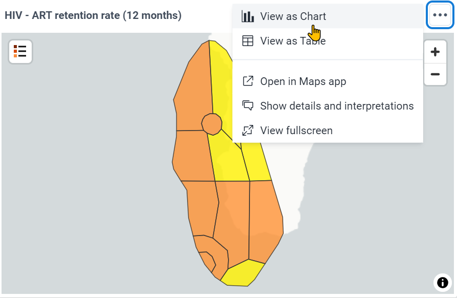
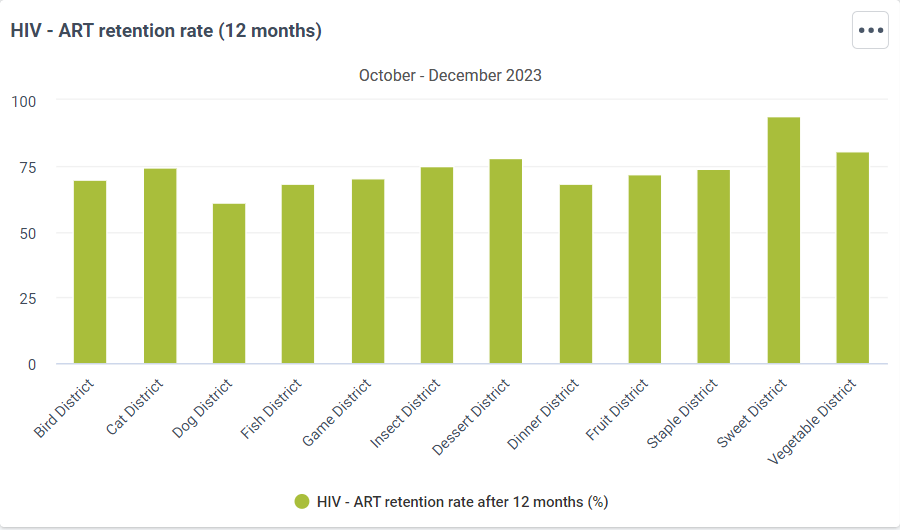

Or to a table

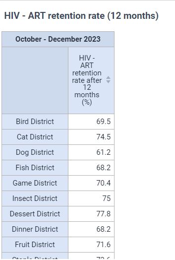

Lastly, you can also make any dashboard item display in fullscreen. This may be useful if you want to focus on a specific dashboard item. You can do this by selecting the “View fullscreen” option in the menu for a dashboard item.

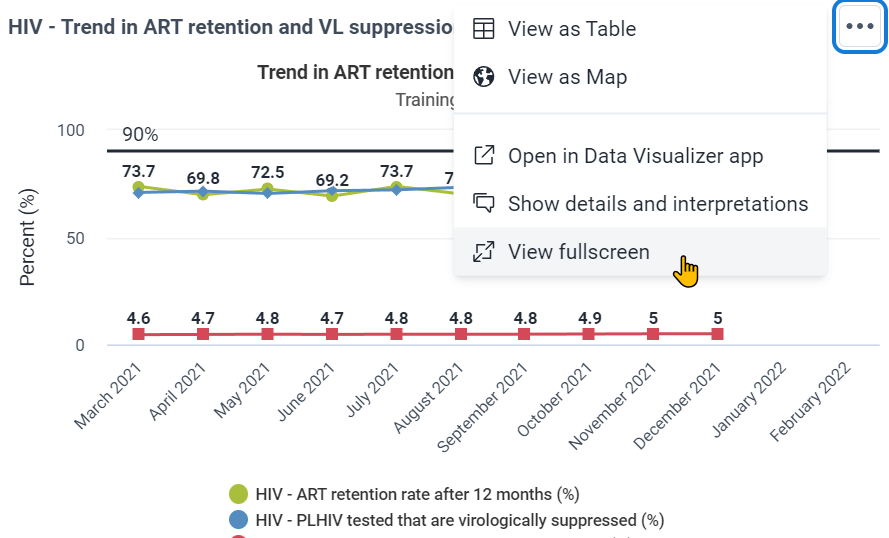

### Printing Dashboards

From version 2.35 onwards DHIS2 supports printing of dashboards. 

To perform this click on the ‘More’ button at the top of the dashboard next to the ‘Add filter’ button. 

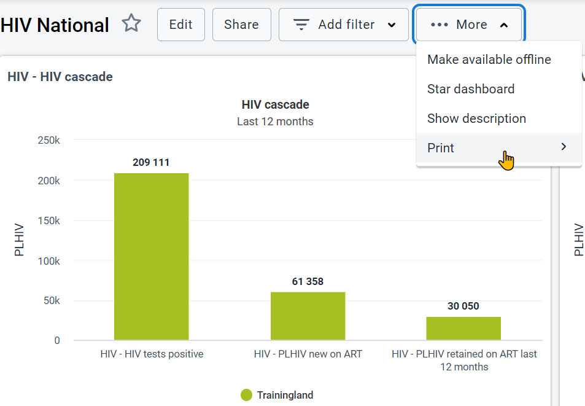

In the sub-menu that appears we have 2 options.

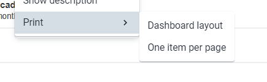

* Dashboard layout - will print in the same layout as it appears in the DHIS2 dashboard (eg: can have more than one dashboard item per row)
* One item per page - will print only one dashboard item per page and that item will occupy the entire page

Once you click on either of the options above, a print preview window will open. Following points are recommended for best print results.

* Use Chrome or Edge web browser
* Wait for all dashboard items to load before printing
* Use A4 landscape paper size and default margin settings in the browser print dialog

You will see a preview of the dashboard

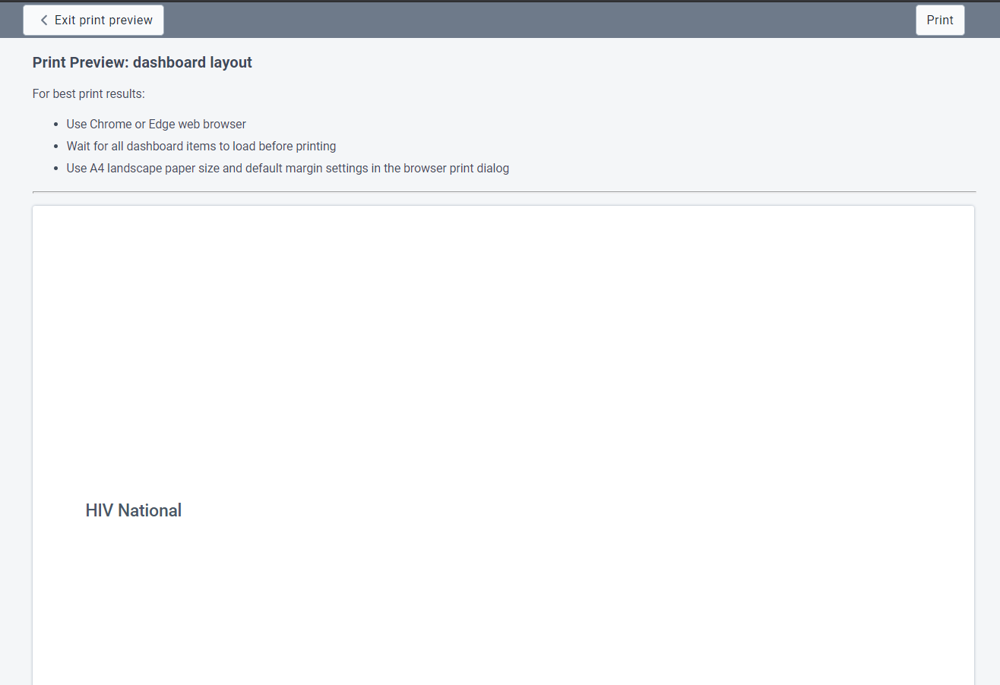

Once all the dashboard items are finished loading, click on the ‘Print’ button on the right top corner.

In the next window, select the printer as ‘Destination’ and click on the ‘Print’ button on the bottom of the window.

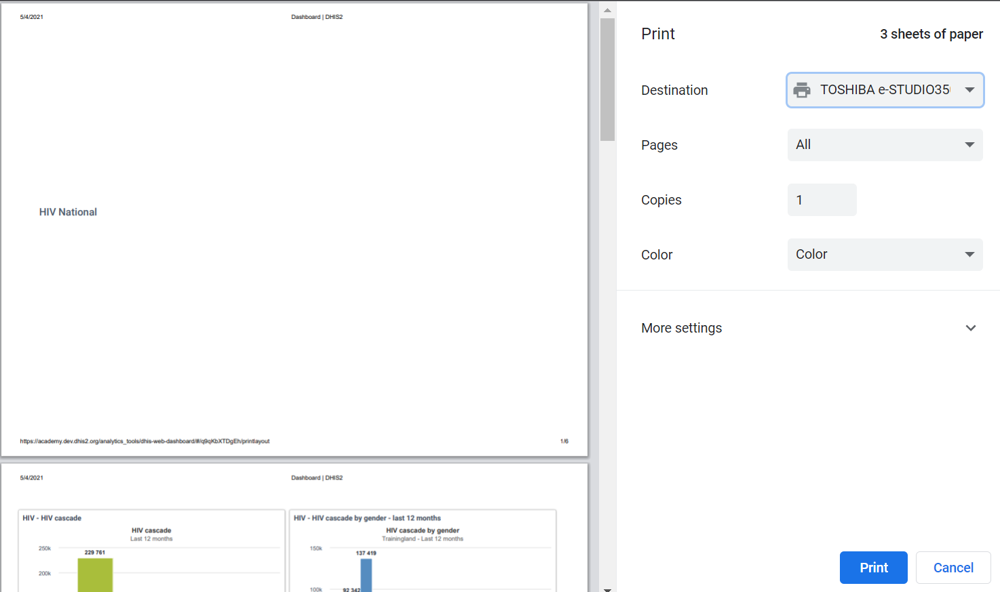

### Accessing Dashboards from a Mobile Device

From 2.36, dashboards can be accessed via a mobile device without any additional customization requirements. You can just log in via your mobile device using a mobile browser and the dashboard will adjust its layout to fit the items accordingly. Both portrait and landscape orientations are supported.

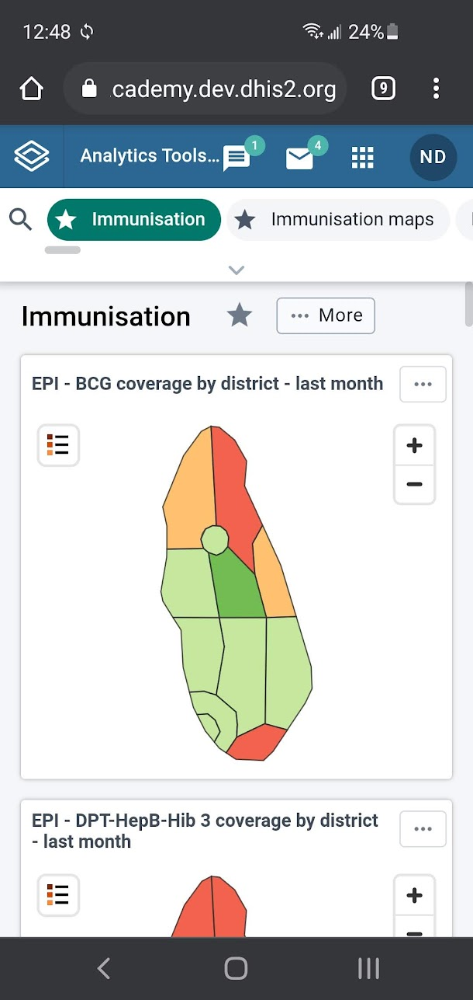

### Making dashboards available offline

Dashboard can be made available to work offline. They will be stored in cache. As long as the person does not log out of DHIS2 while online/offline, they will be able to access the offline dashboard. You will not be able to demonstrate this fully, as if you turn your internet connection off you will disconnect from the demo.

To save a dashboard offline select More -> Make available offline

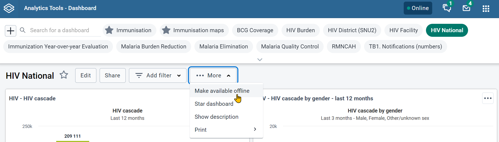

The dashboard will download to your cache and you will see an indicator beside the name of the saved dashboard.

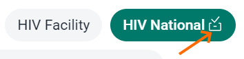

Now, if you go offline, you will be able to access this dashboard as long as you do not log out of DHIS2. You can even close the tab/browser as long as you have saved the link to access it next time.

If you no longer want the dashboard stored offline, you can turn this off via the menu

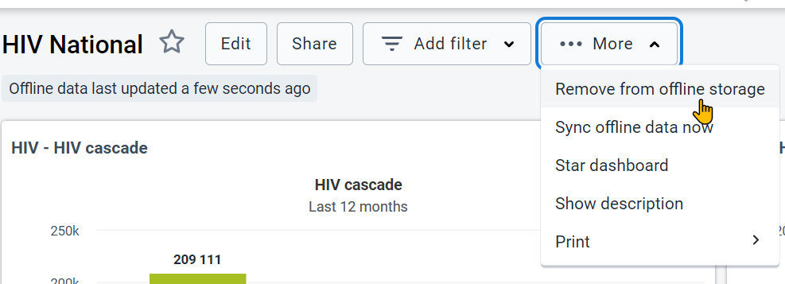

***End Exercise 1***

## Exercise 2 - Creating Dashboards

### Create a new dashboard

Review slide 6-8 in the presentation

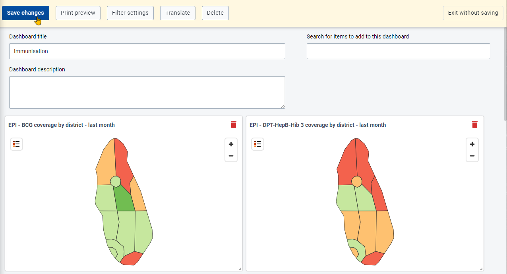

This will discuss adding new items to the dashboard. These are meant as reference only. They can be shared with the group, but go through the process of actually creating a new dashboard using a demo.

To add a new dashboard, click on the “+” sign at the top of the dashboard page.

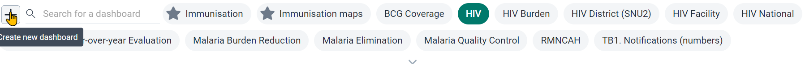

Outline the steps required in order to add the item to the dashboard. You can use some of the previously saved items from the exercises, or previous items used in the WHO examples.

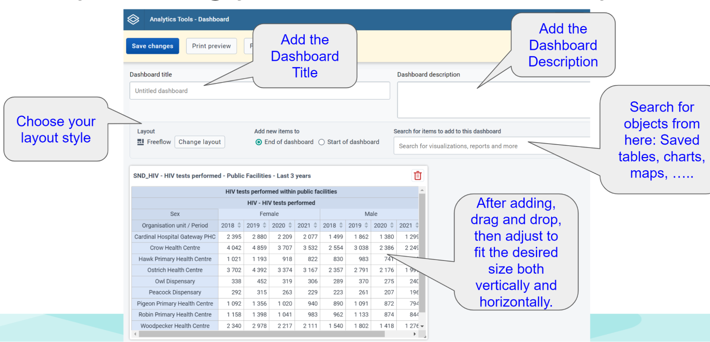

### Discuss the filter settings

Note that there are now some additional options for managing the dashboard filter settings. As an example, you may want to remove the category filters or only include the category filters relevant for the dashboard items you have added. Do this by accessing “Filter settings” when creating or editing a dashboard.

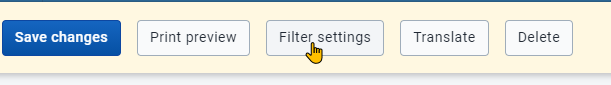

From here, you can select which filters you want to include in the dashboard. This can help in reducing confusion as you can ensure that only filters that will work with the dashboard are included and can limit the options for the end-user based on the information you want them to see.

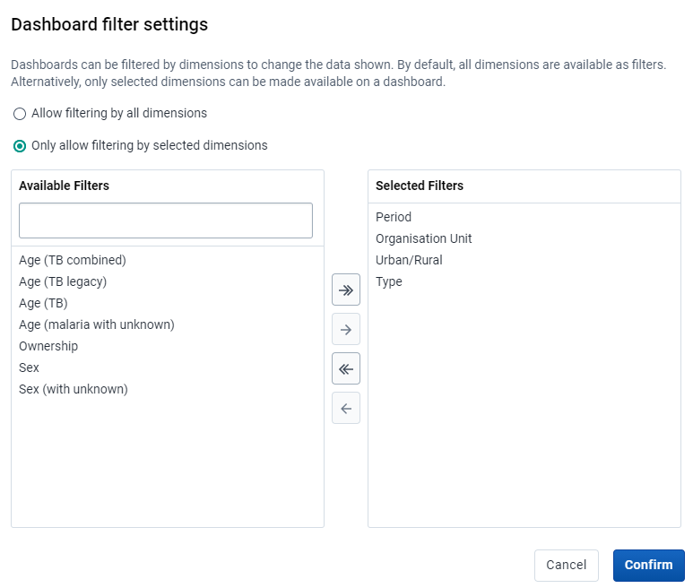

These changes get applied to the “Add filter” button after you have saved the changes for the dashboard you are working on.

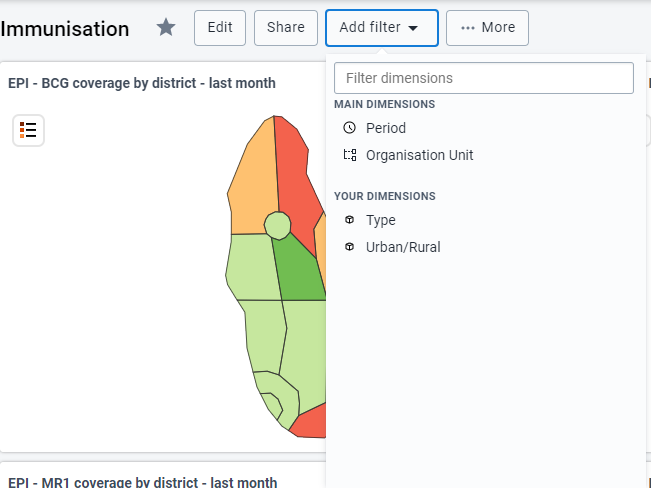

When you are done, select “Save changes” to save the dashboard

***End Exercise 2***

## Exercise 3 - Re-Using Dashboards Across Many Users

### Review user org units

We can now review user organisation units and sharing.

Let us do this by reviewing one of the already available WHO dashboards (“**Malaria Burden Reduction”**)

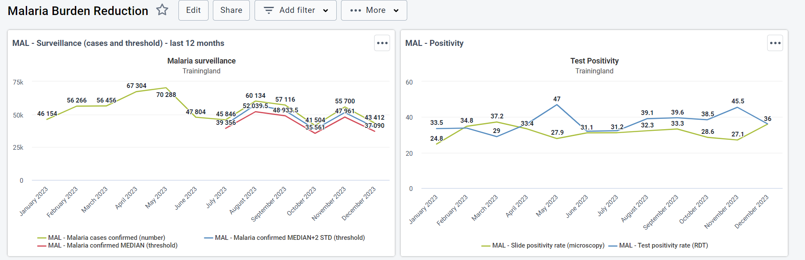

You can open up one of these outputs to discuss this function. This example uses the output MAL - Positivity.

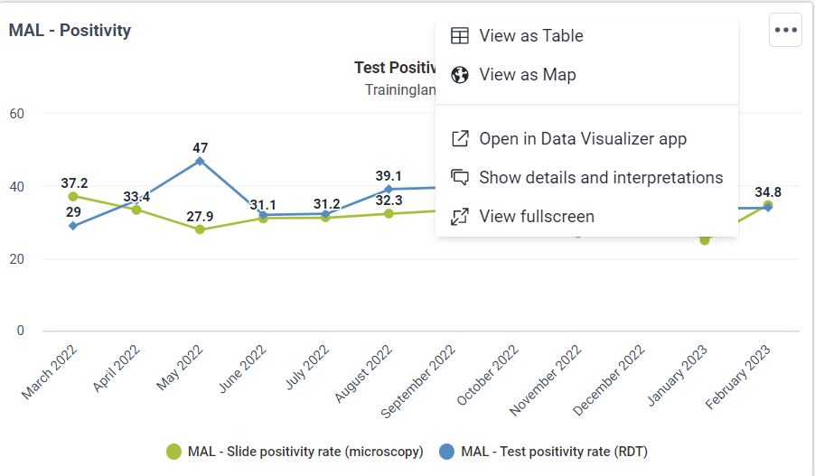

Review the organisation unit selection. In the example of the chart, the selection being made is the “User organisation unit.” If I am currently logged in as user which has access to the entire country, organisation unit is the country. “User sub x2 units” would be Districts for this particular user, as that would be 2 levels below their immediately assigned organisation unit. The user sub units can therefore be considered a “relative” org unit selection; being that it is relative to the org unit the user has been assigned to. 

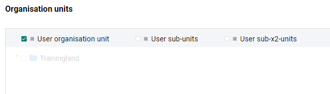

If you go back to the dashboard you can see this in the various outputs that are present; note that user organisation units have been selected for all of these outputs. You may want to discuss a couple of examples to reinforce this point.

### Review sharing

Refer to slide 9 in the presentation

We have tried to create this dashboard so it can be re-used multiple times. In using user org units, the data a user sees should be dependent on the org units they are assigned. This allows you to make one dashboard that can be shared to many users at once, with all of these different users seeing different outputs. 

In order to share a dashboard you need to open the sharing dialog via the “Share” button at the top of the dashboard. 

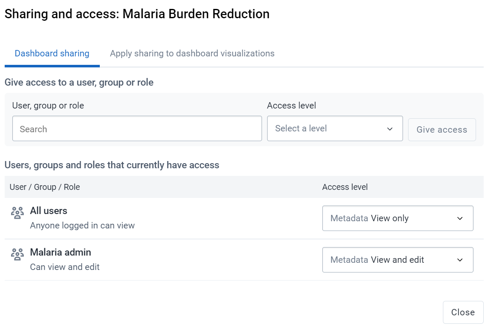

You can share items with either users or user groups. It is often more advantageous to share via a user group so you can share the item with many users at once. To add a user or user group, start typing their name in the search box, you will then see the name of the user or group appear. Select it to add it to the sharing dialog.

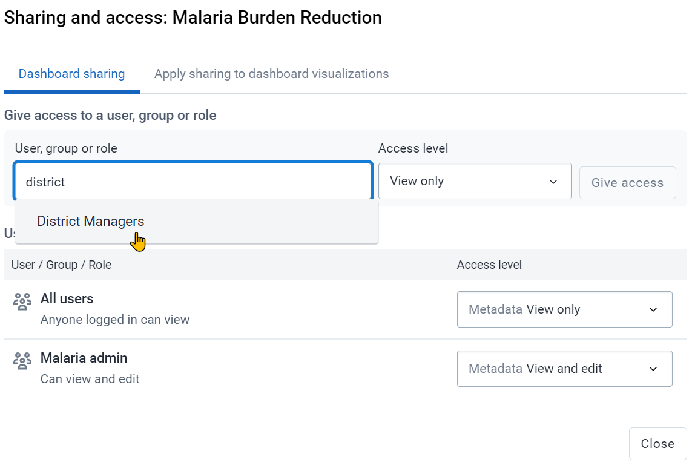

Before you add users/groups to the sharing settings for the dashboard, you can assign them different permissions (note: this can also be edited after they are given access)

* Can edit and view: Can both alter/edit the dashboard (rename, add/remove items, delete dashboard) as well as view the dashboard
* Can view: Can view the dashboard but can not make any changes.

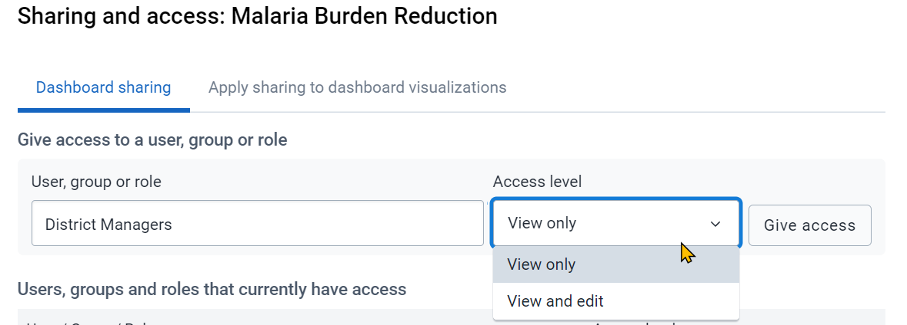

By combining the concept of sharing with user org units, we can have one dashboard that can be re-used many times. As an example, we do not need to make outputs for every district; we can instead use the user org units  feature combined with sharing to make one set of outputs that different different users can access to see their own data. We can review this concept in more detail. Clear your cache or open a new incognito window to log in as a different user.

### Login as Cat District Manager

Username: cat_district_manager

Password: District1#

Review the same malaria dashboard that you were looking at before (**Malaria Burden Reduction**)

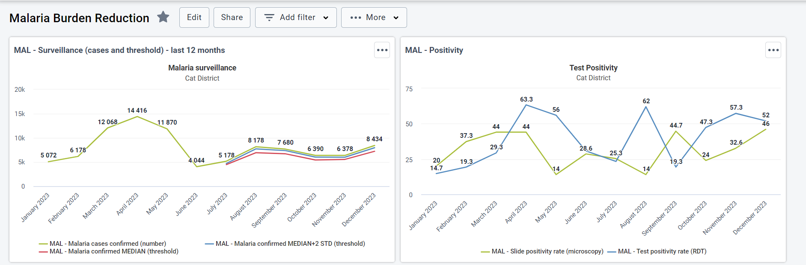

It is now using org units that are assigned to this user in order to generate outputs. In the chart for example, we see that it is Cat District now instead of Trainingland.

Review the HIV national dashboard as well. A similar approach has been applied to this dashboard; as it is now showing Cat District as the organisation unit.

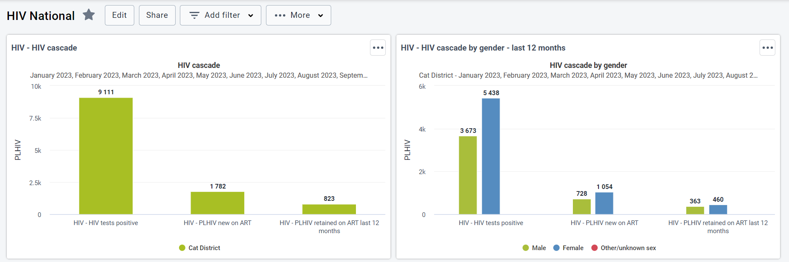

### Login as Staple District Manager

Username: staple_district_manager

Password: District1#

When we login as this district manager, we can see that the same effect as what had happened with cat district is now true of staple district.

Data from the example dashboard is now using data from staple district.

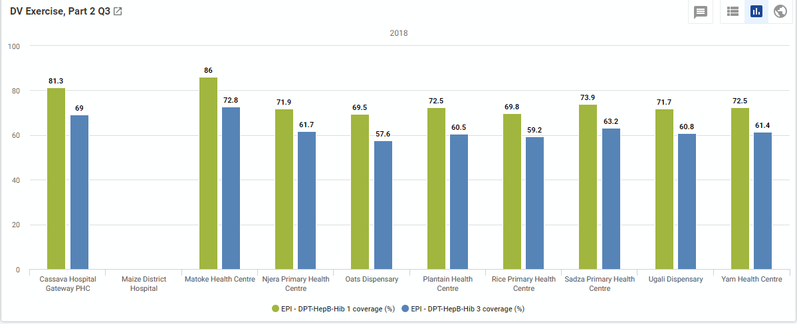

This is also true of the HIV national dashboard. 

***End Exercise 3***