# Learner’s Guide to Data Visualizer

## What is this guide?

This guide contains all exercises and detailed steps to perform them related to the use of data visualizer for the Analytics Tools Level 1 academy. Please perform each of the exercises when prompted to by your instructors.

## Learning objectives for this session

1. Demonstrate how to:
    1. Select data dimensions
    2. Modify the chart layout
    3. Save the chart
    4. Select different chart types
    5. Use the chart options to modify the look of a chart
    6. Download a chart
2. Create the following chart types:
    7. Column
    8. Line
    9. Stacked Column
    10. Bar
    11. Pie
    12. Radar
    13. Gauge
    14. Single Value
    15. Cumulative Value
    16. Year over year
    17. 2-category 
    18. Combination

## Table of Contents

- [Learner’s Guide to Data Visualizer](#learners-guide-to-data-visualizer)
  - [What is this guide?](#what-is-this-guide)
  - [Learning objectives for this session](#learning-objectives-for-this-session)
  - [Table of Contents](#table-of-contents)
    - [Exercises](#exercises)
    - [Exercise 1 - Altering data dimension and Working with the Layout](#exercise-1---altering-data-dimension-and-working-with-the-layout)
      - [Open a chart - HIV - HIV Cascade](#open-a-chart---hiv---hiv-cascade)
      - [Alter the data dimensions](#alter-the-data-dimensions)
      - [Modify the layout](#modify-the-layout)
      - [Review the layout in more detail](#review-the-layout-in-more-detail)
      - [End Exercise 1](#end-exercise-1)
    - [Exercise 2 - Saving, Reviewing the interface, Line Charts](#exercise-2---saving-reviewing-the-interface-line-charts)
      - [Save the chart](#save-the-chart)
      - [Review the data visualizer interface](#review-the-data-visualizer-interface)
      - [Create a new line chart](#create-a-new-line-chart)
      - [End Exercise 2](#end-exercise-2)
    - [Exercise 3 - Stacked Column Chart, Disaggregations, Chart Options](#exercise-3---stacked-column-chart-disaggregations-chart-options)
      - [Review a stacked column chart](#review-a-stacked-column-chart)
      - [Create the chart](#create-the-chart)
      - [Add in Urban/Rural Disaggregation](#add-in-urbanrural-disaggregation)
      - [Move org units to category](#move-org-units-to-category)
      - [Open and explain the chart options](#open-and-explain-the-chart-options)
      - [Review the chart options in more detail](#review-the-chart-options-in-more-detail)
      - [Data, Axes \& legend, Style](#data-axes--legend-style)
      - [End Exercise 3](#end-exercise-3)
    - [Exercise 4 - Stacked Bar Charts \& Target Lines](#exercise-4---stacked-bar-charts--target-lines)
      - [Create a stacked bar chart](#create-a-stacked-bar-chart)
      - [Download the chart](#download-the-chart)
      - [Create a chart which uses sort order, target lines and a predefined legend](#create-a-chart-which-uses-sort-order-target-lines-and-a-predefined-legend)
      - [Modify the sort order and add in the target line](#modify-the-sort-order-and-add-in-the-target-line)
      - [Apply a pre-defined legend](#apply-a-pre-defined-legend)
      - [End Exercise 4](#end-exercise-4)
    - [Exercise 5 - Pie \& Radar Charts](#exercise-5---pie--radar-charts)
      - [Create a Pie Chart](#create-a-pie-chart)
      - [Create a Radar Chart](#create-a-radar-chart)
      - [End Exercise 5](#end-exercise-5)
    - [Exercise 6 - Gauge \& Single Value Charts](#exercise-6---gauge--single-value-charts)
      - [Create a Gauge Chart](#create-a-gauge-chart)
      - [Create a Single Value Chart](#create-a-single-value-chart)
      - [End Exercise 6](#end-exercise-6)
    - [Exercise 7 - Cumulative Value Chart](#exercise-7---cumulative-value-chart)
      - [Use a line chart to create a cumulative chart](#use-a-line-chart-to-create-a-cumulative-chart)
      - [Review the chart](#review-the-chart)
      - [Change to a cumulative chart](#change-to-a-cumulative-chart)
      - [Review the chart](#review-the-chart-1)
      - [End Exercise 7](#end-exercise-7)
    - [Exercise 8 - Year over Year chart](#exercise-8---year-over-year-chart)
      - [Create a year-over-year chart](#create-a-year-over-year-chart)
      - [Open the following chart - BCG Coverage YoY - 3 Year Comparison](#open-the-following-chart---bcg-coverage-yoy---3-year-comparison)
      - [Switch to the favorite: BCG Coverage by month - BCG Coverage by month - 2020 - 2022](#switch-to-the-favorite-bcg-coverage-by-month---bcg-coverage-by-month---2020---2022)
      - [Switch back to the year-over-year chart: BCG Coverage YoY - 3 Year Comparison](#switch-back-to-the-year-over-year-chart-bcg-coverage-yoy---3-year-comparison)
      - [Select the YoY Chart Type](#select-the-yoy-chart-type)
    - [Explain the interface - Period selection and filter](#explain-the-interface---period-selection-and-filter)
      - [Explain the interface - Category](#explain-the-interface---category)
      - [Explain the interface - Series](#explain-the-interface---series)
      - [Explain the interface - Data](#explain-the-interface---data)
      - [Update and review the chart](#update-and-review-the-chart)
      - [End Exercise 8](#end-exercise-8)
    - [Exercise 9 - 2-category charts](#exercise-9---2-category-charts)
      - [Review the chart “RMNCAH - Institutional Delivery by Locality - Last 12 Months”](#review-the-chart-rmncah---institutional-delivery-by-locality---last-12-months)
      - [Clear the chart and make a new one](#clear-the-chart-and-make-a-new-one)
      - [Swap the order of the period and locality in the category and change to an area chart](#swap-the-order-of-the-period-and-locality-in-the-category-and-change-to-an-area-chart)
      - [End Exercise 9](#end-exercise-9)
    - [Exercise 10 - Combination Charts](#exercise-10---combination-charts)
      - [Review the chart “EPI - BCG Doses Given, Coverage - Last 12 Months”](#review-the-chart-epi---bcg-doses-given-coverage---last-12-months)
      - [Clear the chart and make a new one](#clear-the-chart-and-make-a-new-one-1)
      - [Modify the series in the chart options](#modify-the-series-in-the-chart-options)
      - [Label the axes](#label-the-axes)
      - [Add a 2nd category to the chart](#add-a-2nd-category-to-the-chart)
      - [End Exercise 10](#end-exercise-10)
    - [Part 11 - Scatterplots](#part-11---scatterplots)
      - [Review the chart “RMNCAH - ANC1 - ANC4 Outlier Analysis - Last Year”](#review-the-chart-rmncah---anc1---anc4-outlier-analysis---last-year)
      - [Create a scatterplot](#create-a-scatterplot)
      - [Add outlier details](#add-outlier-details)
      - [End Exercise 11](#end-exercise-11)

### Exercises

### Exercise 1 - Altering data dimension and Working with the Layout

#### Open a chart - HIV - HIV Cascade

To get familiar with the dimensions, we will have the participants open up a chart and alter the dimensions to see what effect this has on the chart. After this we will then create a chart from scratch. 

Open the following chart

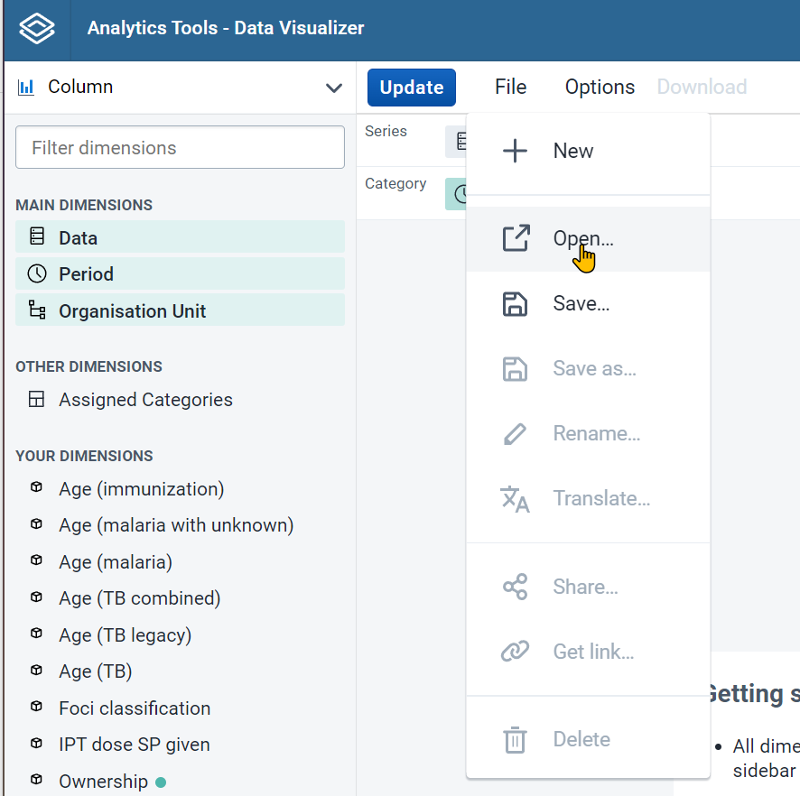

**Chart name: HIV - HIV Cascade**

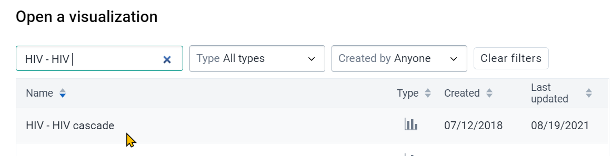

You should now see the following in visualizer (the values may be slightly different)

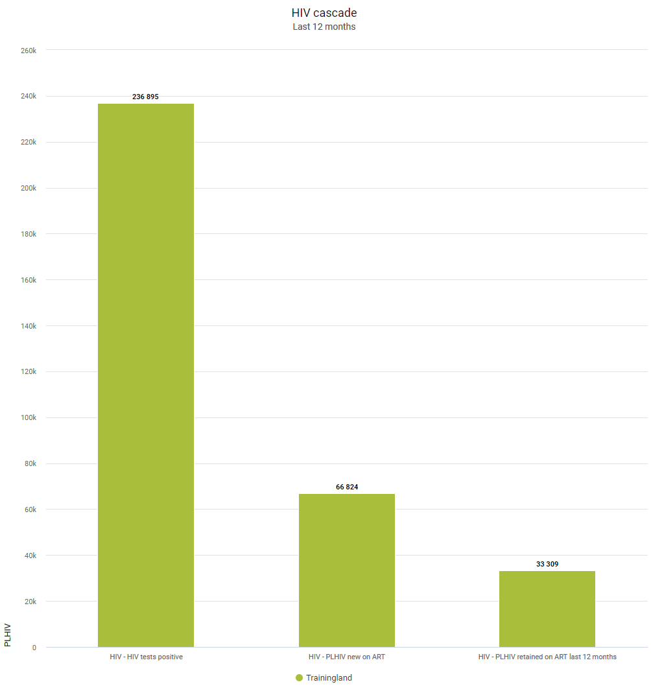

Review various elements that are present on the chart. Currently, you have the data items along the x-axis. The values are represented via the y-axis. You have a title for the y-axis as well as the chart itself. You can also see the periods which have been selected for this graph. 

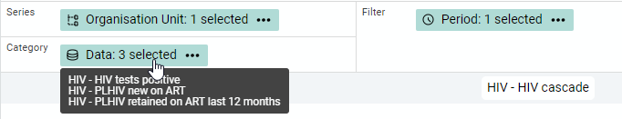

You can also use the layout to verify what has been selected. Do this by hovering over an item in the layout. We will be working with the layout more momentarily.

#### Alter the data dimensions

Now that we have a chart open, there are various dimensions we could change in order to effect the chart that is produced by DHIS2. Let us first alter the period. You can do this by either selecting period from the layout or the left-side menu

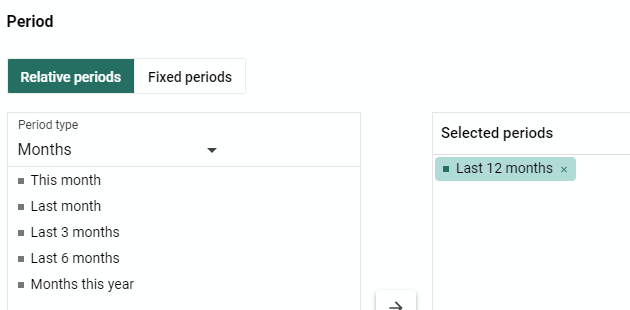

The currently selected period is the last 12 months. We could verify this by scrolling over the period in the layout. The period is currently in the filter. What these means is that we do not actually see the periods on either the x or y-axis. It does however determine what data is seen on the graph. 

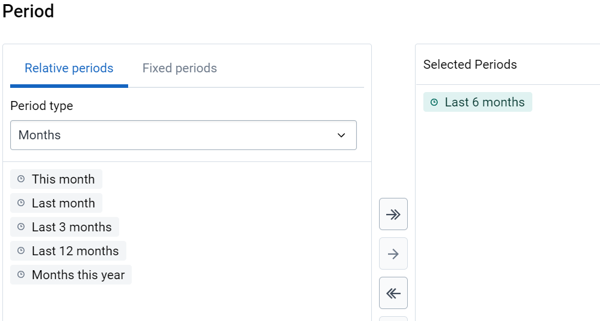

Select the last 6 months and update the chart (the values may be slightly different)

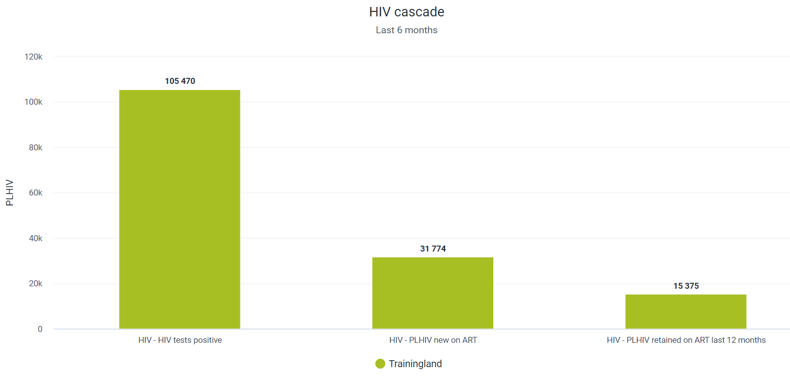

You should see a noticeable change in the data values. 

#### Modify the layout

What if we do not want the total of these months, but instead want to see the individual values for each month separately? In order to do this, we can modify the layout. Move the period to the series and update the chart. Now we can see the groups for each individual month. These are grouped together by the data item in this case. In this case, it might make a little more sense to have our period as our category. 

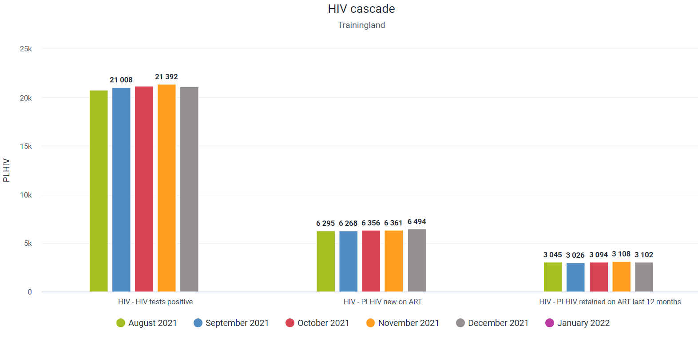

Now, move the period to the category and the data to the series and update the chart.

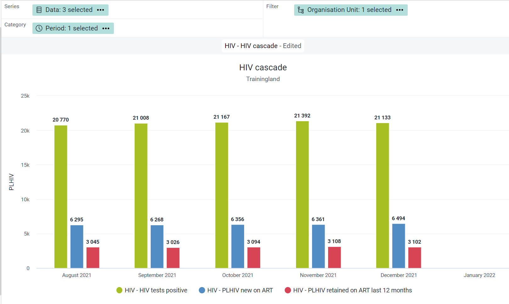

Now we can more clearly see the effect of the cascade within a given month. 

#### Review the layout in more detail

Now we can review the category, series and filter in a bit more detail using this chart as an example. 

Column, Stacked Column, Line and Area charts all have similar properties when discussing the category, series, and filter. These are not given commonly understood names such as x and y-axis as different graph types are affected differently by these options; some chart types simply do not have traditional axes. 

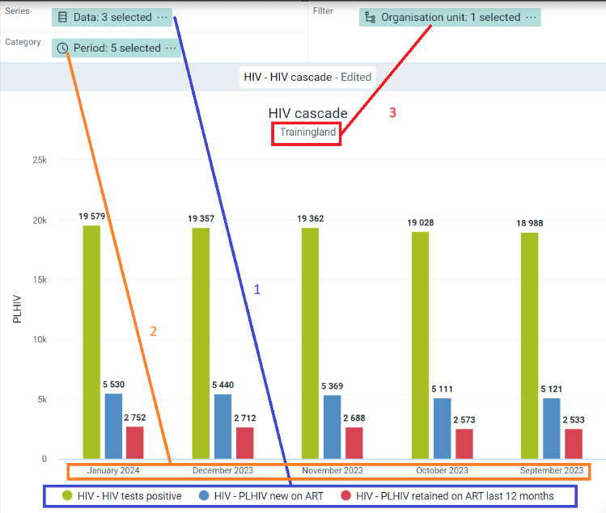

Let us review how the category, series and filter have affected the output of the chart. We have moved the dimensions around a little to see that these do indeed result in completely different charts depending on its placement in the layout. You can also use slide 2 in the guide companion presentation. 

1. First, let’s review the **category**. In this type of chart, the category will always be the x-axis essentially. We can see the period is the x-axis in this example. When we first opened the chart, data was in the category and the data items were listed along the x-axis. The y-axis in all versions of this chart is the actual data value. This does not change regardless of which item is placed where. The category also determines how we group (or categorise!) the series together. We can see that the category (in this case the months) groups together the series (in this case the data item).
2. The **series** determines what is displayed within each individual category. In this case we have months as the category and for each month, we can see that the data items we have selected are being displayed within that month as a result of being in the category. When we first moved the period to the category, this was the opposite, as the the periods were grouped together by the data item along the x-axis. Now the data items are grouped together by the period along the x-axis as a result of the current layout. 
3. The **filter** simply determines where data is being selected from. When we first opened this chart, it was filtering data by the last 12 months. When we altered the chart to the last 3 months, there was a decrease in the data values as it was taking data from less periods. Now we have the organisation unit as the filter. In this case Trainingland is selected, so it is displaying data from the entire country. You could alter the filter and select a region for example to emphasize the effect the filter has on the chart. It is usually not recommended to add multiple data items to the filter as it will add up these data items and display a total on the chart. 
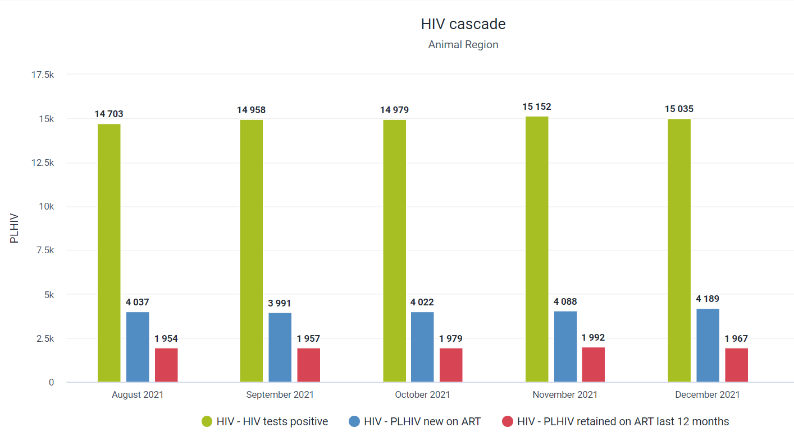

Prior to moving on, ensure that these concepts are clear. We will work with different chart types to see the effect the layout has on them later on.

#### End Exercise 1

### Exercise 2 - Saving, Reviewing the interface, Line Charts

#### Save the chart

Let’s say we are happy with this chart. As we do not want to overwrite the previous chart, let us save a new version of this chart.

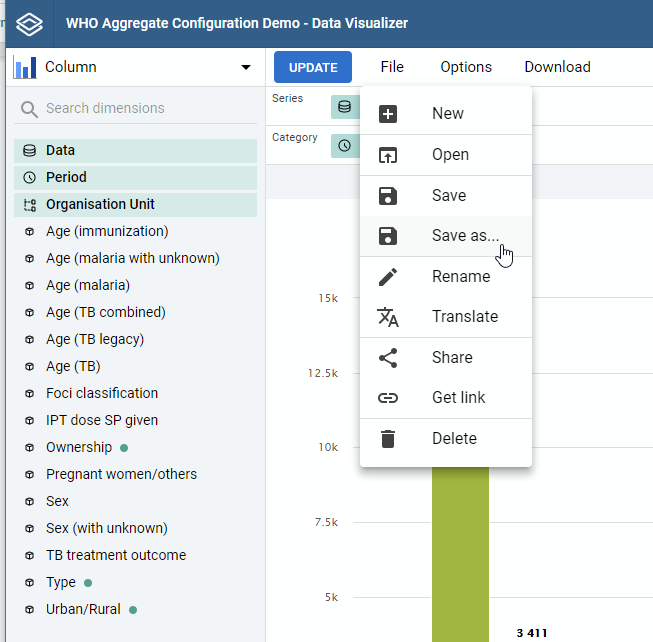

In this case you are saving an existing chart so existing properties may appear. You can remove this and have everyone save their own version of this chart. Have them use their initials in the chart name. 

#### Review the data visualizer interface

There are descriptions for each of the items within the interface included in the guide companion presentation (slides 4 - 10). 

#### Create a new line chart

Clear the previous chart by going to File -> New. We will now go through the process of making a chart from scratch. 

In this example we will create a chart for TB notifications. TB data is typically reported quarterly in an aggregate system, and we want to see if there are any significant changes in the TB notification rate over a significant period of time. 

**Question for participants** What type of chart do they think would be the most useful for displaying significant changes in trends over time? 

In this case, we will use a line chart to display these values. 

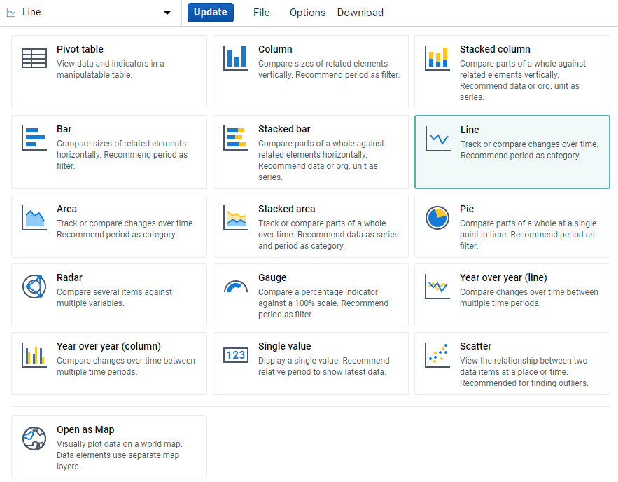

Select a line chart to start.

For the data we will select the following:

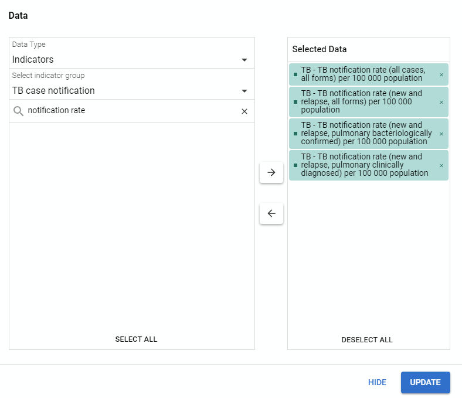

Do not update the chart, but instead hide the data selection. Note that by default the data is on the series in the layout. 

**Question** Based on what we learned in the bar chart example, what effect will the data being in the series have on the chart? 

The series identifies how we display our data together in our selected category. So if we have data in the series, we will see values for each of the selected indicators within the category we have selected.

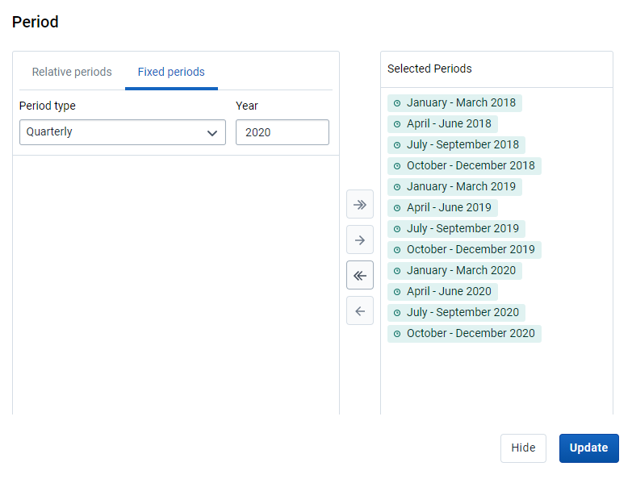

Update the period selection to include quarters from 2020 - 2022 and hide the period selection.

**Question** Period is our category and data is our series.
What will we see on the line chart?

The period will appear along our x-axis. This means we should see each quarter along the x-axis. We have selected 4 indicators as our data. So for each quarter along the x-axis, we should see 4 data values, one for each of the indicators selected, reflecting the value within that particular quarter. 

**Question** what about the filter? 

The indicator values will reflect all of Trainingland, unless we change the organisation unit selection. The filter determines where the data is being pulled from and filters by this selection on th chart directly.

Update the chart.

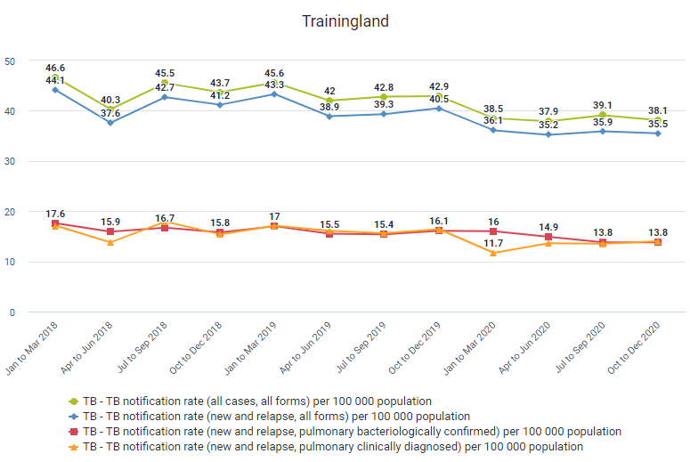

We can see the effect our various selections have had on the chart output. The periods are along the x-axis. These **categorise** our data, which is our series. We see a value for each series item we have selected within the categorisation. In this case, this means we see a value for each indicator we have selected within the period displayed along the x-axis. 

**Question** What happens if we alter the data and periods?

Proceed to alter them and update the chart

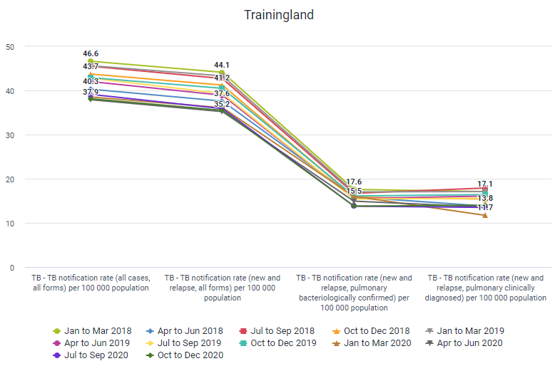

Does this seem like a better representation of the data in this situation? It is quite difficult to tell what is happening over time for a particular indicator. There is a sudden drop in the values between indicator types composed of different TB populations as well. It is often important to consider how the layout will affect the chart output, however it is very quick to move between different layouts to test if the output is being displayed as you had envisioned. There is no harm in a little bit of trial and error!

#### End Exercise 2

### Exercise 3 - Stacked Column Chart, Disaggregations, Chart Options

#### Review a stacked column chart

Review the chart “HIV - HIV tests performed by locality” (the values might be different then this screenshot)

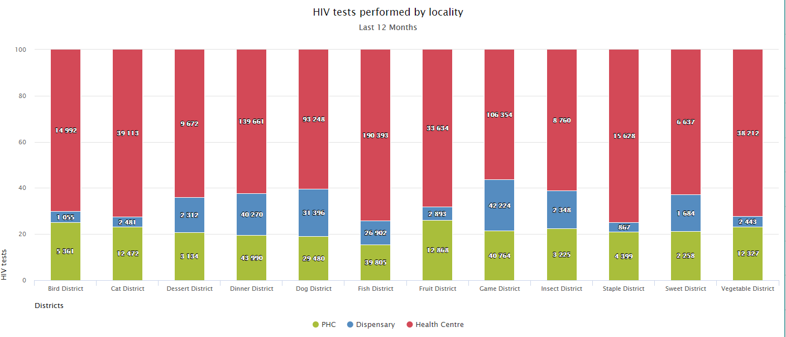

In this chart, we have the number of HIV tests performed separated by their locality type. This comparison is also using Districts as the comparison in the x-axis. Based on what we know, the category will have to be the organisation units.

#### Create the chart

In this example we will be working with a stacked column chart. Select this chart type to proceed.

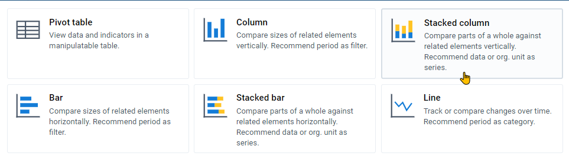

Select the data

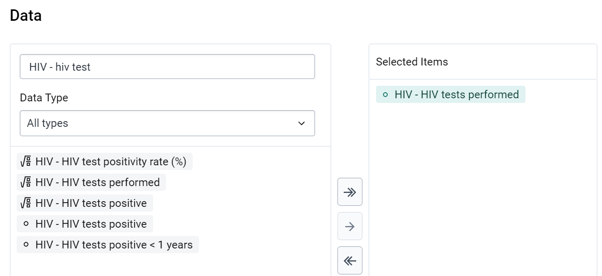

Leave the periods as default. 

Select the org units

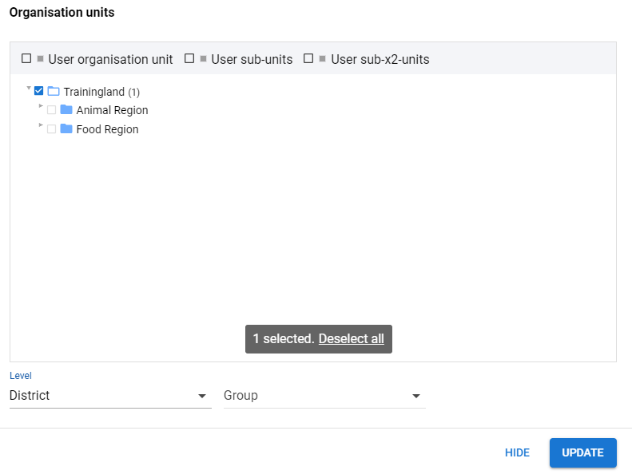

In this example we want to use the districts to separate out our data. This will give us an idea of the spread of testing throughout various localities within a district. With trainingland highlighted, use the level selector to select district. 

You can update the chart so everyone can see what it currently looks like. 

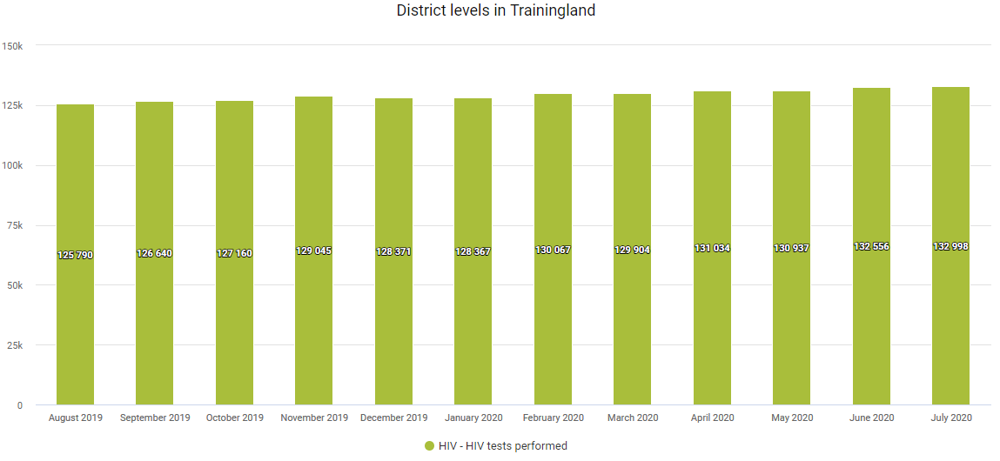

At the moment the chart is not very interesting and not really conveying information that is critical. All we can see is that, from month to month, the number of HIV tests performed remains relatively consistent. It is not the chart we initially conceived, stacked and showing us the separation of this data by locality. 

#### Add in Urban/Rural Disaggregation

Select the urban/rural org unit group set as well as all the options within this group set.

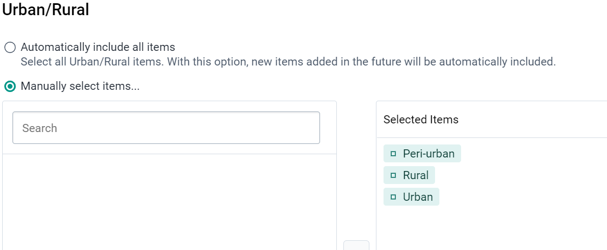

Org unit group sets are defined by the user. This should have been discussed prior in the maintenance overview as well as the pivot table session, however a review of this can be conducted if required. 

We will add these options to the filter. This will allow us to manipulate the layout to display exactly what we want.

Start by moving the org unit group set to the series and updating the chart. As always, the series determines what is displayed within each individual category. In this case, the series is used to divide each portion of the cart into the localities by the category that is selected.

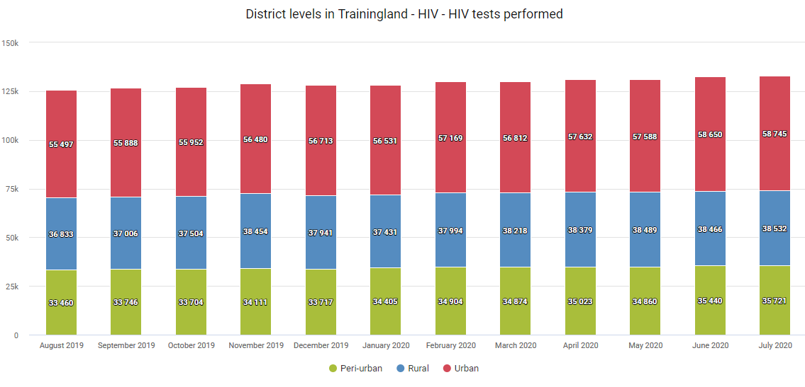

**Question** If we want the organisation units to be our x-axis in order to display the number of HIV tests performed within each locality by district, where do we move the organisation units to?

#### Move org units to category

Move the organisation units to the category and the period to the filter and update the chart

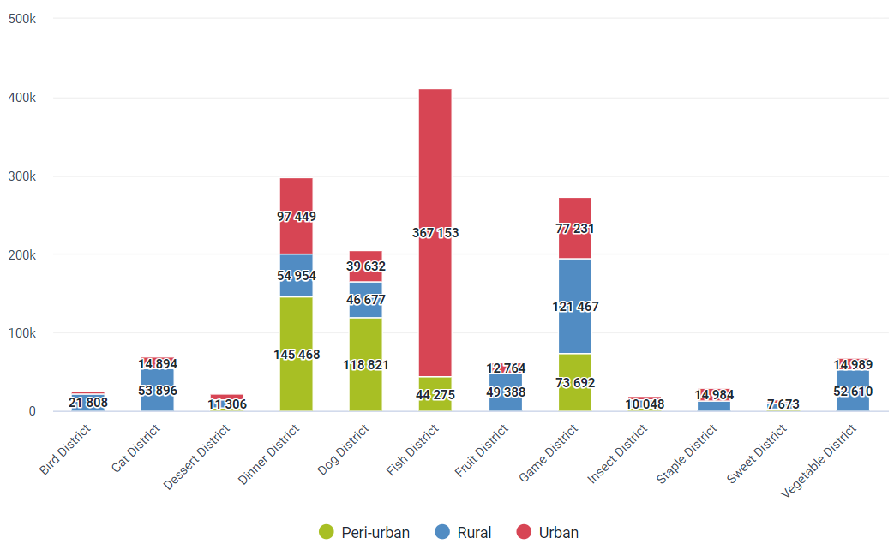

We are getting closer now! Large disparities in the data make it difficult to compare the districts however. As we are using raw values, some of the districts have much more tests being performed within them, which skews the graph and makes it difficult to interpret. 

We can remedy this by using the chart options!

#### Open and explain the chart options

Open the chart options and select “stacked values add up to 100%.” We will come back and explain the many other options available here. 

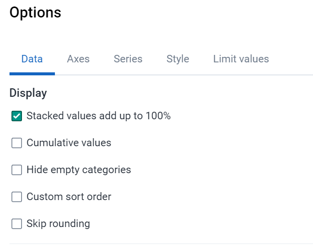

Update the chart

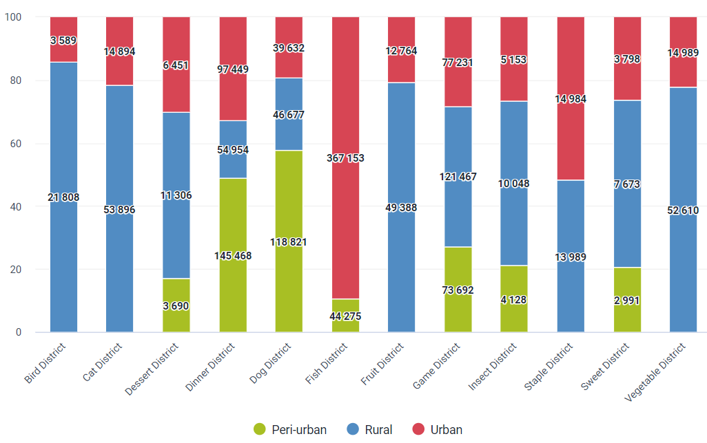

Now we have our final output that we were shown at the beginning. Here we can clearly see how many tests are being done in each locality as a proportion of the total. Notice the y-axis changes from having values to displaying % in order to reflect this change. 

#### Review the chart options in more detail

Let us review the remainder of our chart options to see how we can enhance this chart. The chart options are separated into 3 tabs:

#### Data, Axes & legend, Style

The data tab is the tab we just used in order to modify the stacked column chart so it used %’s instead of raw values. There are other additional options and you can review. Not many of these apply to this particular chart, however we will make another chart which uses more of the data options. Please review the documentation if clarification on these options are needed.

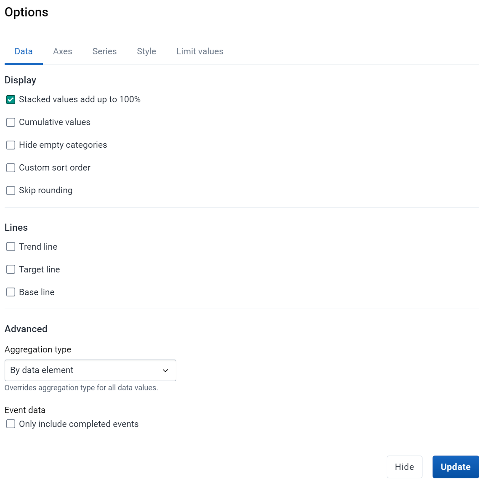

The next tab is axes. Here we can modify how the x and y axis are displayed and labeled. We can also add chart and axes titles. Many of these options are useful to this chart. We can add in a title for the vertical (y-axis in this case) horizontal (x-axis) axes.

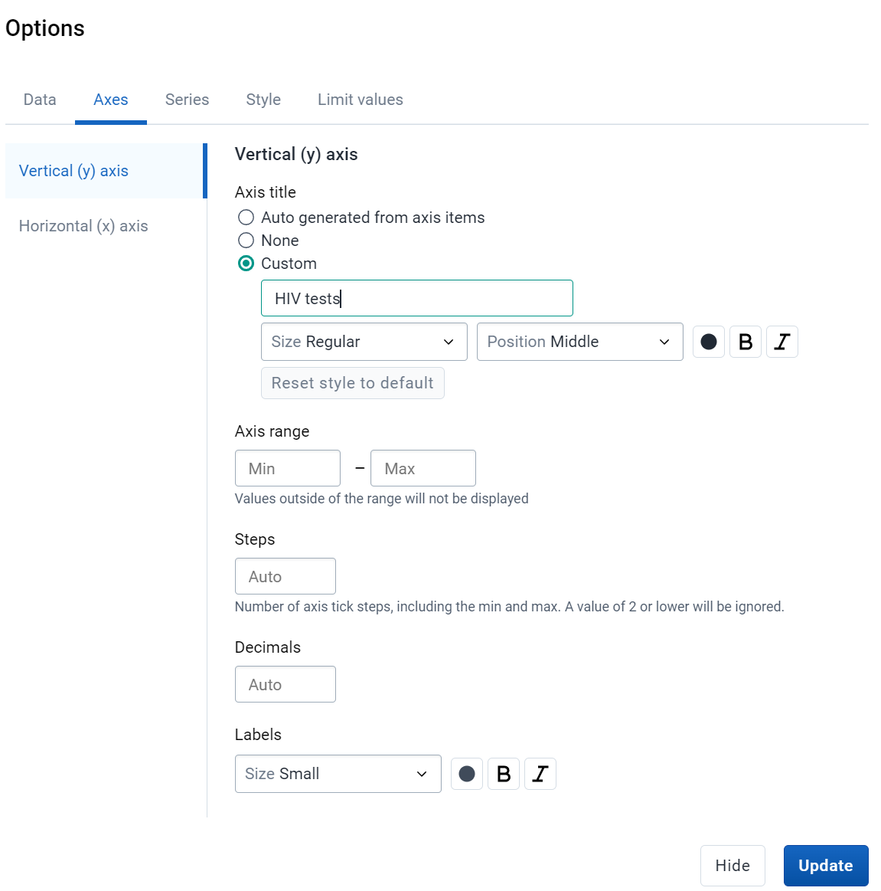

We can skip the series tab for now as it doesn’t apply to the chart type currently open. Next is the style tab. Here we can modify the titles for the chart as well as the colors being used to represent our data values. 

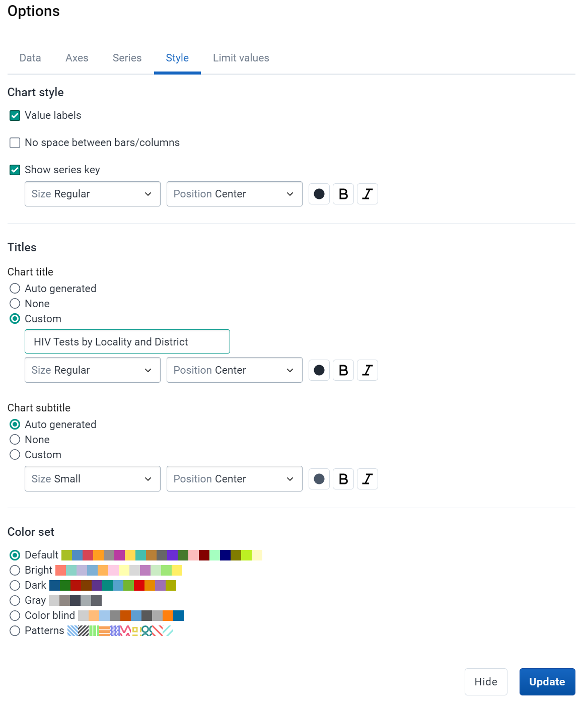

After updating, the chart should look a bit cleaner with more identifiers available for the titles of the axes and chart itself.

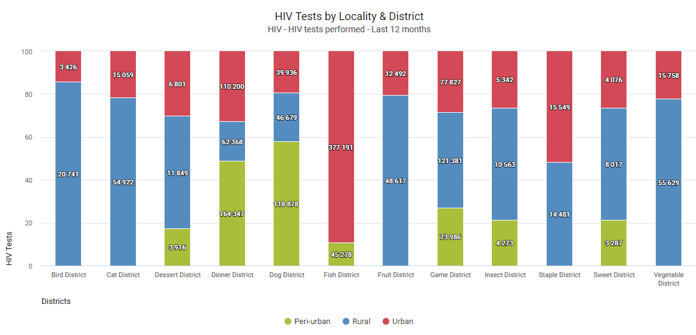

Save the chart and continue.

#### End Exercise 3 

### Exercise 4 - Stacked Bar Charts & Target Lines

#### Create a stacked bar chart

Change the previous chart to a stacked bar chart.

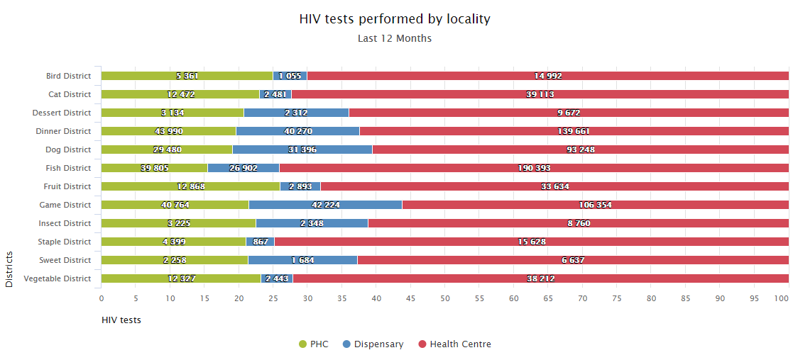

Review the category and series with the participants. Note that these have not changed, but due to the nature of the chart the axis on which they lie has in fact been switched. Now the category is running along the y-axis, with the data values along the x-axis. The series is still being separated by each category, which in this case is the districts. As different charts have different layouts, labeling these items as x and y-axis respectively is not possible. This point will be driven further home when other chart types are introduced in the next session. 

#### Download the chart

You can now review the download options. 

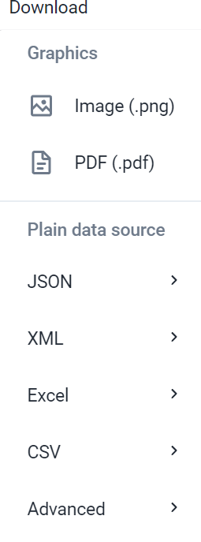

You can download the chart as an image or PDF file. The other formats are  Downloading an image or PDF allows you to take the chart and use it offline as necessary. 

#### Create a chart which uses sort order, target lines and a predefined legend

Open the following line chart:

EPI - DPT Coverage - last year

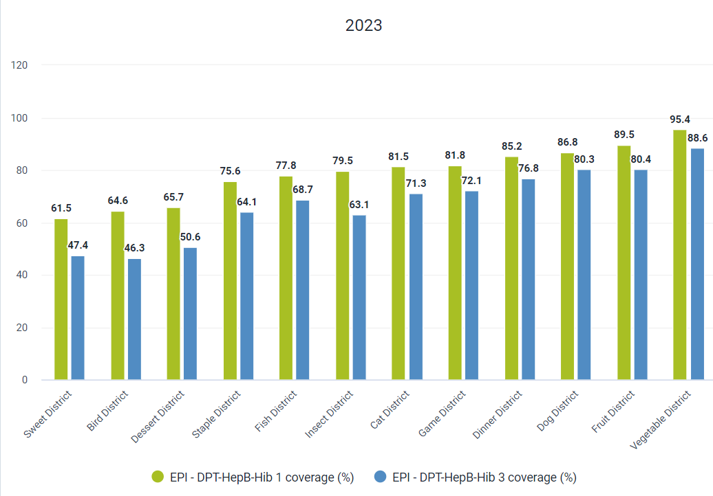

This chart is currently sorted from low to high. Note that, as there are two indicators selected, it uses the first indicator in order to determine the order/arrangement of the values in the chart. You can see this as the values for DPT 3 coverage in Bird District is lower than Sweet District, as it is using DPT 1 coverage to sort the chart values. 

#### Modify the sort order and add in the target line

Add in a sort order to the chart. Modify the chart options to display the target line.

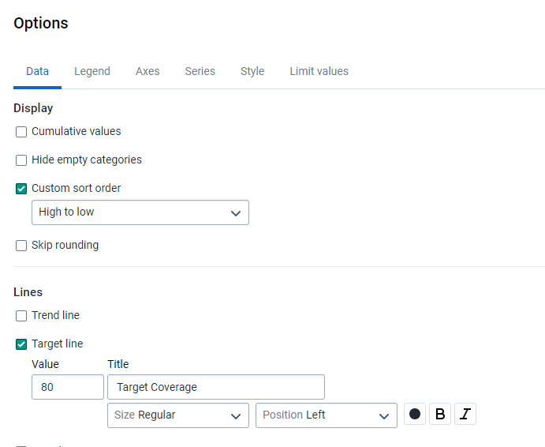

After you update the chart, you can discuss how the options have affected the chart view.

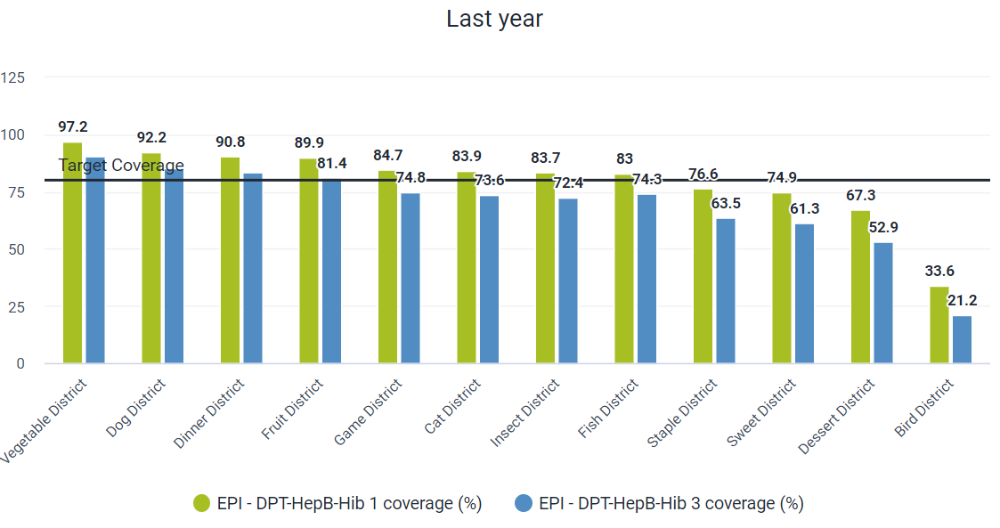

#### Apply a pre-defined legend

Open the options tab and navigate to legend. From here you can apply a legend to your chart. Select the “EPI coverage” legend and update your chart.

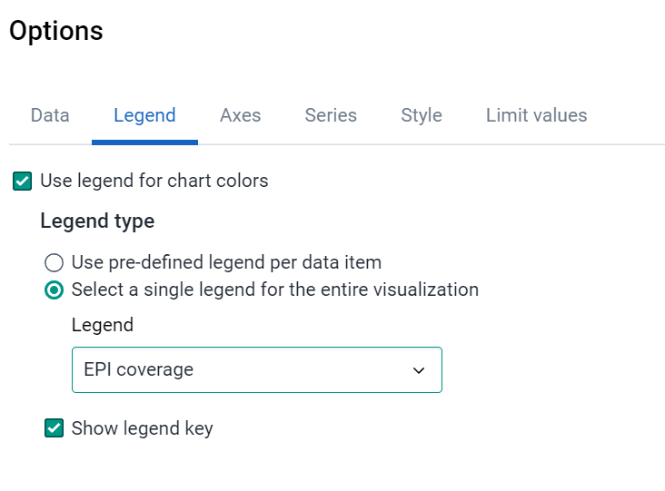

The updated chart will look like this. This can be quite useful when you want to apply a specific color scheme to your chart. **_A legend can be applied to bar, column, gauge and single value charts_**. We will revisit applying legends for these other chart types.

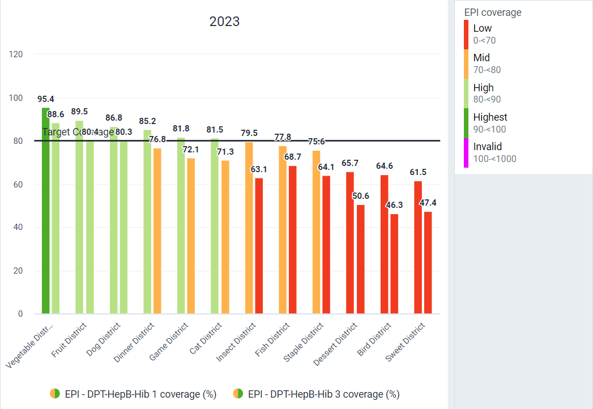

#### End Exercise 4

### Exercise 5 - Pie & Radar Charts

#### Create a Pie Chart

Pie charts use the layout a bit more differently when compared to other charts. They are quite simple to make as the most prominent feature you need to consider is the category. You can refer to Slide 11 within the presentation.

As well as the following saved chart :

MAL - Malaria RDT by age

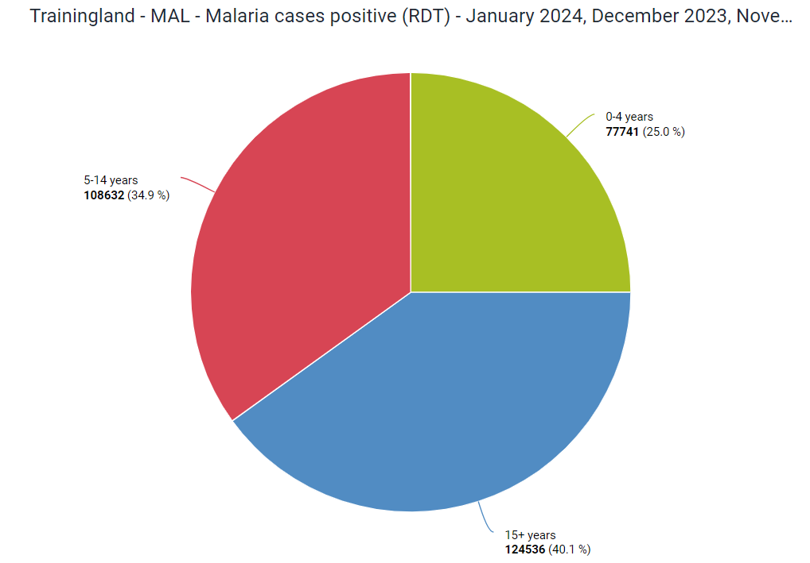

For additional explanation.

Data: MAL - Malaria cases positive (RDT) [Malaria Data element group]

Period: Last 12 months

Org Unit: Trainingland

Age (malaria) : select all 3 age groups

See that the “series” determines the slices of the pie in this case. As the Age is in the series, we see the pie chart separated by these values.

You can also swap the period with the age to see the effect it has on the chart. Since the series determines how the slices of the pie divide this chart, in this case we can see the periods now divide the pie chart rather than the age groups.

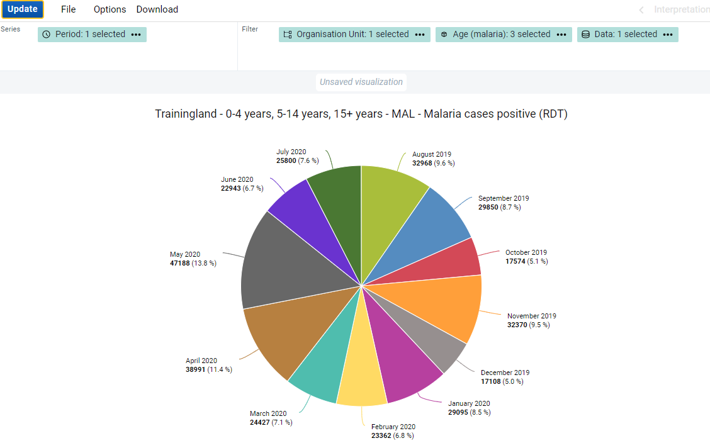

#### Create a Radar Chart

A radar chart is best used when comparing values in which there is some significant variation. Smaller variations/changes in data values will make a radar chart difficult to interpret. In addition, a minimal amount of data items should be compared within this type of chart. We should not for example try to compare 4-5 indicators on a radar chart, particularly if they have similar values. It is often a good idea to review up to 2 related indicators or 1 indicator which is disaggregated on a radar chart. This will let you make an easier comparison of the values you are comparing within this chart type. 

See Slide 12+13+14 for more explanation.

Create the following chart to show this process, in particular focusing on explaining the layout.

Data: Malaria cases positive (RDT) [Malaria data element group]

Periods: Last 12 months

Org Unit: Trainingland

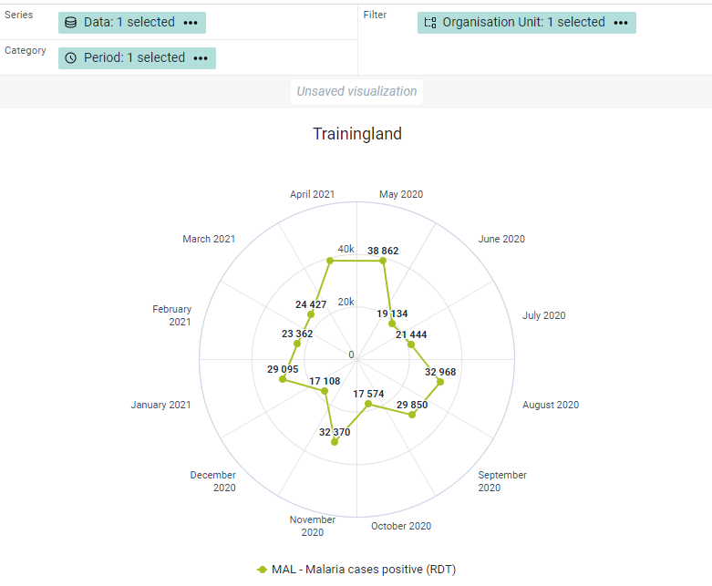

Add in the malaria age groups and move this to the series

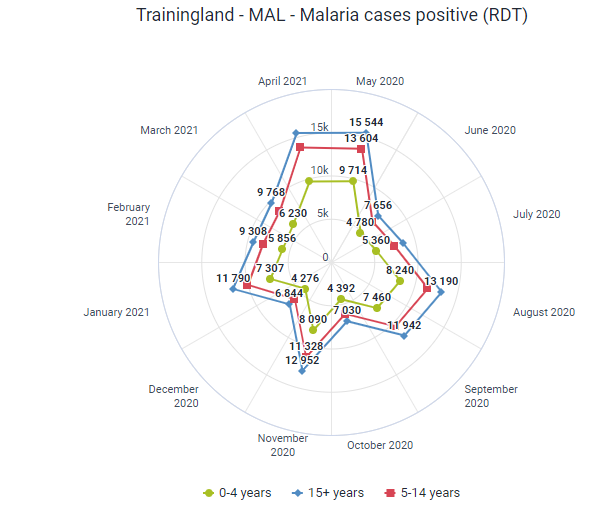

You will now see that the values within the chart are displayed by the age group. While this example works in practice, it is a bit busy and difficult to interpret. You can switch to a column or stacked column chart type from this chart to show that some chart types are not always the most appropriate and that consideration in how a chart will be interpreted should be made.

#### End Exercise 5

### Exercise 6 - Gauge & Single Value Charts

#### Create a Gauge Chart

Gauge charts are one of the simplest chart types in DHIS2. They are recommended when displaying a proportion of some kind. You should not use this chart type when evaluating data elements or rate-based indicators as the output will not provide anything meaningful. 

In these types of charts, the organisation unit should always be in the filter. The series, similar to a pie chart or radar chart, should be either the data or a disaggregation of some kind

Data: OPV 3 coverage [Immunization coverages indicator group]

Period : Last 12 months

Organisation Unit: Trainingland

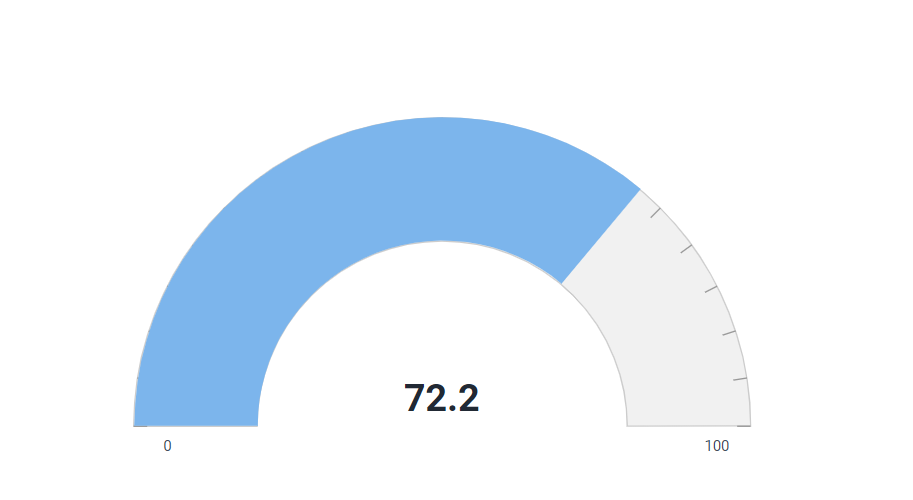

You can apply legends to these charts. This will change the colour that you see within the gauge. We could, for example, apply the EPI coverage legend to this chart

This will then apply the relevant legend to this chart when we update it

#### Create a Single Value Chart

Single value chart types are a great way to highlight key indicators, particularly on a dashboard. Here is a good example of this in practice

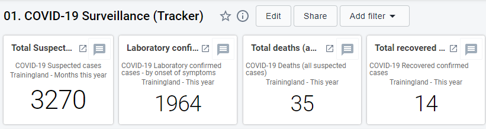

Create a single value chart by selecting this chart type

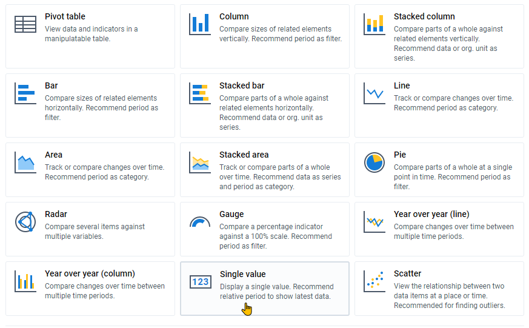

We then select our inputs. For example:

Data: OPV3 Coverage [Immunization - coverages indicator group]

Period: This Year

Organisation Unit: Animal Region

It is a very simple chart to make, as only one data value can be displayed at a time. As mentioned, it is most useful when placed on a dashboard next to other related outputs. Note that we can also apply a legend to single value charts, using the same process as a gauge chart.

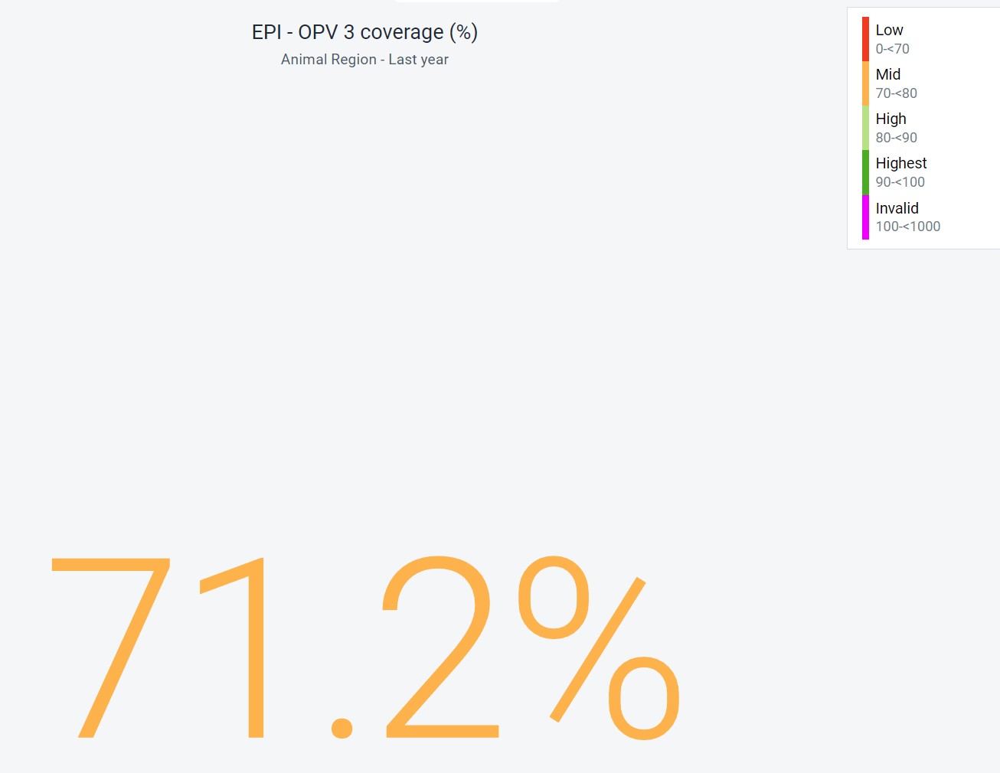

#### End Exercise 6

### Exercise 7 - Cumulative Value Chart

#### Use a line chart to create a cumulative chart

Discuss which chart type would be appropriate to show a trend over a long period of time

In this example, the most effective chart type to use will be a line chart. Prior to creating this however, discuss with the group to ensure everyone comes to a similar conclusion. You have already created a line chart so this part should be a review.

Create the chart

Data: PLHIV new on ART [HIV data element group]

Period: Last 12 months

Org Unit: Trainingland

Sex: Add Male and Female

Click on Update

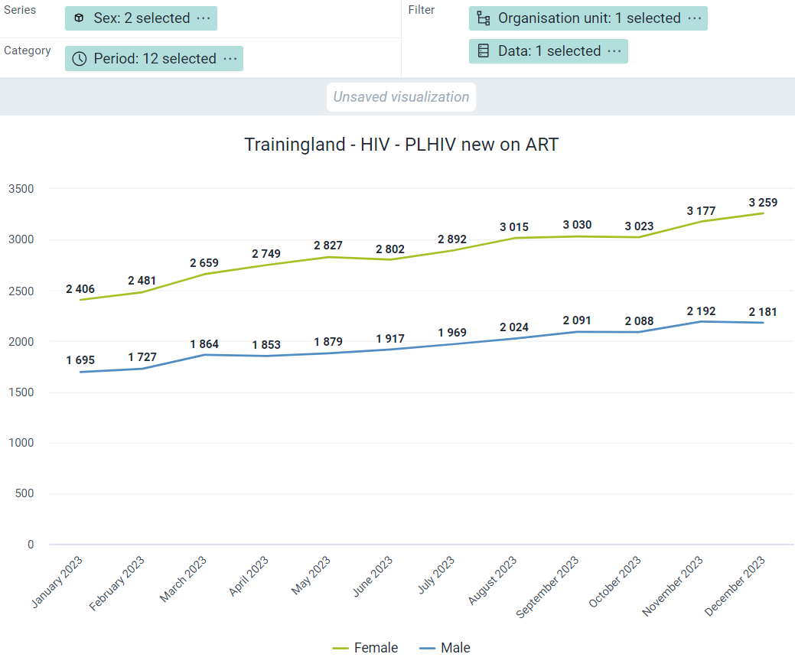

#### Review the chart

In this chart, we can see that the new number of females on ART is higher than males, but it is difficult to identify the gap over the entire 12 month period. It may be better to show this chart using **cumulative** values rather than raw data each month

#### Change to a cumulative chart

Go to options and select “Use cumulative values” and update the chart

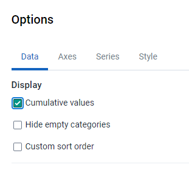

Update

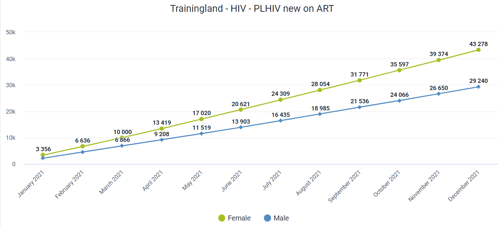

This is saved as “HIV - PLHIV new on ART - last 12 months (cumulative)” if you want to review the chart prior.

#### Review the chart

Now we can really see the disparity, the new number of females on ART is roughly 1.5x greater than the new number of males on ART during the last 12 months. This was more difficult to visualize when we were just seeing the new total for every month.

Additionally, we can see, as of the last month, the total number of new ART patients that have been registered over the last 12 month period. This was not possible when the cumulative values was not being used. Other time periods can be used to see the cumulative total over a defined period as well. You can have a small discussion about other charts that may be more impactful if they are using cumulative numbers.

#### End Exercise 7

### Exercise 8 - Year over Year chart 

#### Create a year-over-year chart

#### Open the following chart - BCG Coverage YoY - 3 Year Comparison

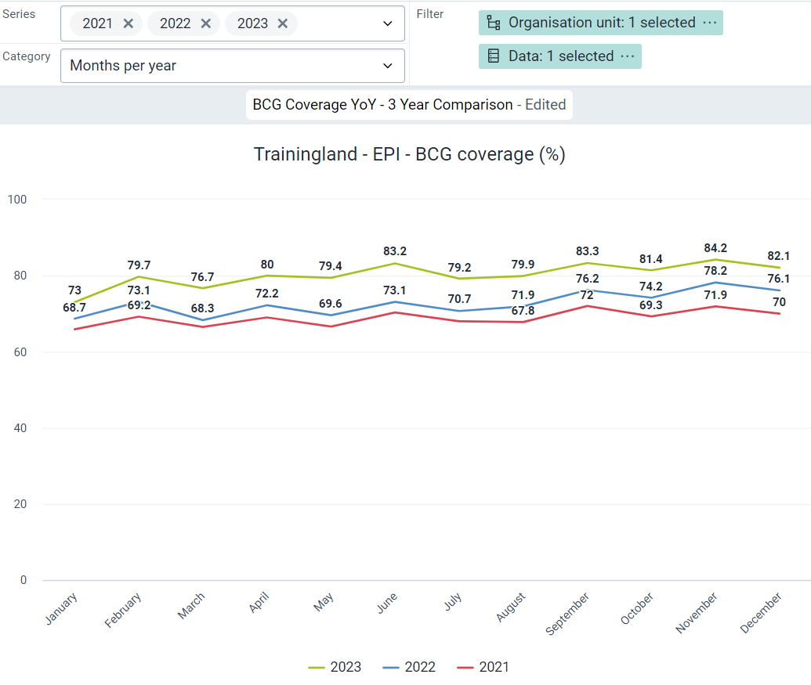

This is a year-over-year chart, a new chart type introduced in DHIS 2.31. A year over year chart can be used to more easily compare data over time from multiple periods. These type of charts allow you to select two period types and compare the data within them. In this example, we are displaying data for BCG coverage for all 12 months within a year for 2020, 2021 and 2022. Here we can easily identify improvements in coverage from month to month between the different years.

#### Switch to the favorite: BCG Coverage by month - BCG Coverage by month - 2020 - 2022

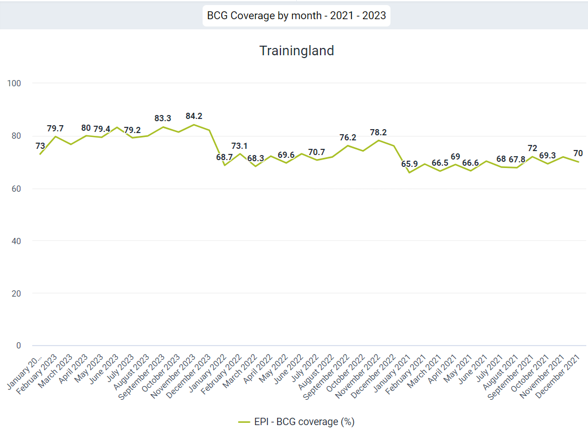

If we compare this with a regular line chart, we are still able to identify these differences but it is not nearly as intuitive. If we want to see the difference in coverage between January 2020, January 2021 and January 2022 we will have refer back to each point on the chart. 

#### Switch back to the year-over-year chart: BCG Coverage YoY - 3 Year Comparison

In the year over year chart, this type of comparison is made much easier. Let us get into the details of how this chart type is made. Make a duplicate tab and keep this chart open so you can keep referring to as you make the new chart.

#### Select the YoY Chart Type

In order to get started in creating a year over year chart, we first have to select a year-over-year chart type that we would like to use. In this example, we will work with the year over year line chart type. Remember to keep the final chart open in a separate tab.

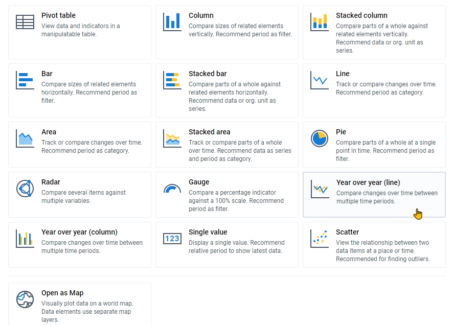

### Explain the interface - Period selection and filter

After we select this chart type, we can see that both the category and the series are automatically populated with period types. The period selection on the left menu where other dimensions are selected is also greyed out. Organisation units and data are automatically placed in the filter. For this reason, this chart type works best when only one data item is selected for comparison. Multiple org units can be used in the filter however depending on what you want displayed (it will filter the data belonging to these org units).

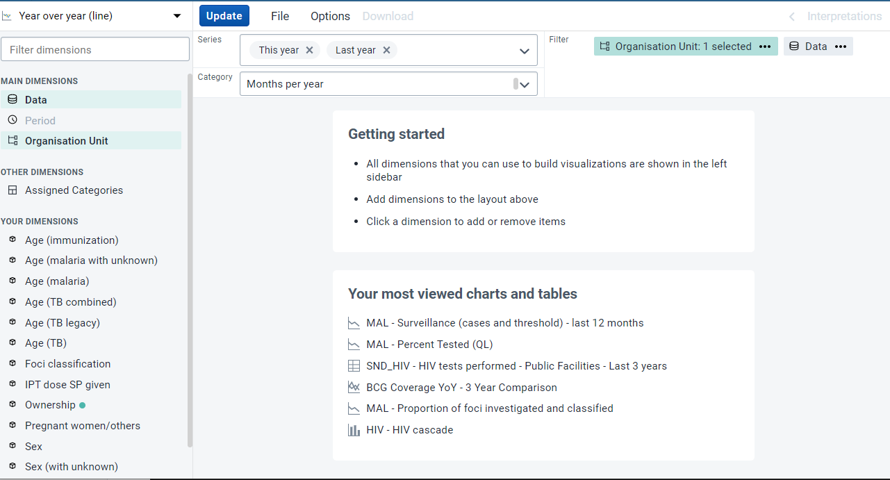

#### Explain the interface - Category

In the example of the line chart, the category determines the periods that will be displayed along the x-axis and group the data together. So with “months per year” selected, all the months within a year from January - December will be displayed. If we were to select “Quarters per year” it would instead display the 4 quarters of a year along the x-axis.

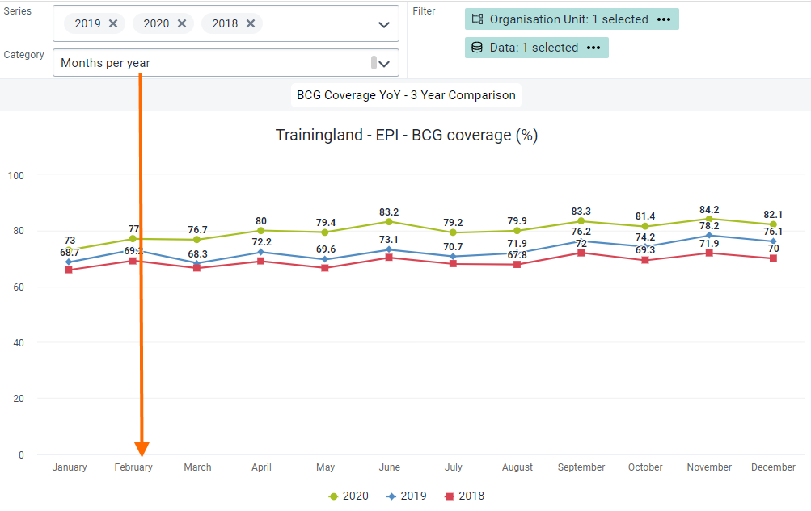

You will notice that the selections in the categories are all relative periods, you can not select for example specific months in the category in this chart type.

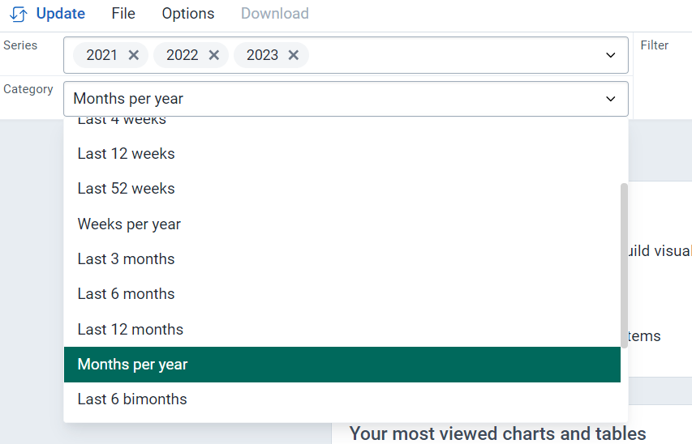

#### Explain the interface - Series 

The series determines for which years you will be displaying data for. If I have this year and last year selected, it will display data from 2021 and 2020 respectively. I can also specify years rather than a relative period, for example 2020, 2021 and 2022.

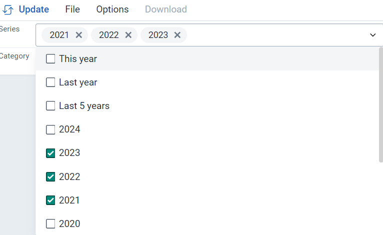

With these two options selected I am now creating a chart which will display data from January - December (due to the category selection) along the x-axis. And with 2020, 2021 and 2022 selected as my series, data values from these 3 years will be displayed by month on the year over year chart.

#### Explain the interface - Data

When selecting data, it is best to only select one data item. These could be supplemented by choosing groups or disaggregations to further filter the data by, however as the data selection is automatically added to the filter and can not be moved, adding in more than one data item will have no effect on the chart.

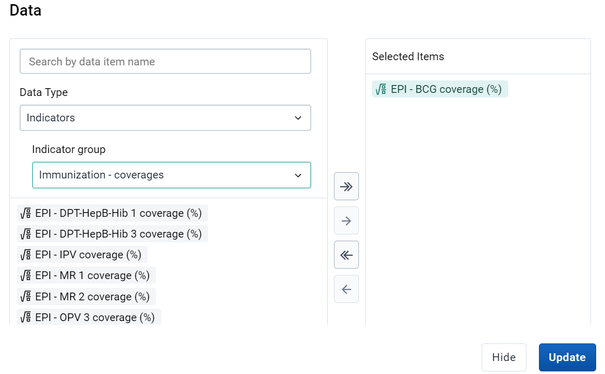

If I have two or more data items selected, it will use the top most item to generate the year over year chart and ignore any of the data items below it. It is therefore recommended to select one data item.

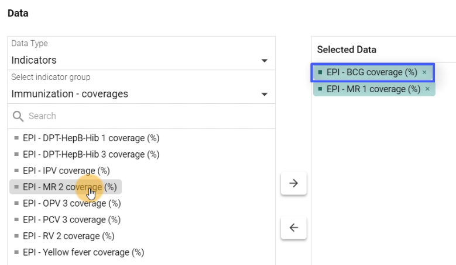

#### Update and review the chart

We can now update our chart. In this case we are using the default country organisation unit, however we could also change this if necessary. 

We can see how the chart has been generated based on our category and series period selection as well as the selection of our data item (in this case BCG coverage). 

The series has determined which years we are displaying data for, while the category determines how to group the data along the x-axis.

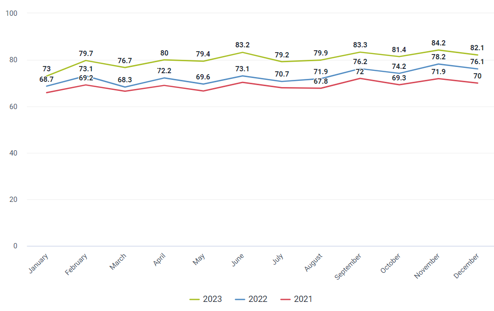

We could quickly change the category to “Quarters per year” in order to show how this category selection effects how the data is grouped together. After we make this change we can see that the quarters in a year are displayed along the x-axis and group the data from the 3 selected years together rather than using the months in a year. 

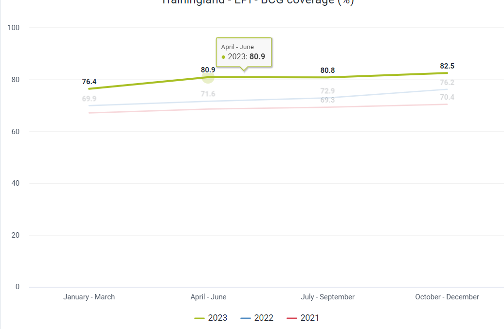

This type of chart is much more intuitive in reviewing variances in data from year-to-year and we look forward to receiving feedback on how these chart types are being used in practice. 

#### End Exercise 8

### Exercise 9 - 2-category charts

#### Review the chart “RMNCAH - Institutional Delivery by Locality - Last 12 Months”

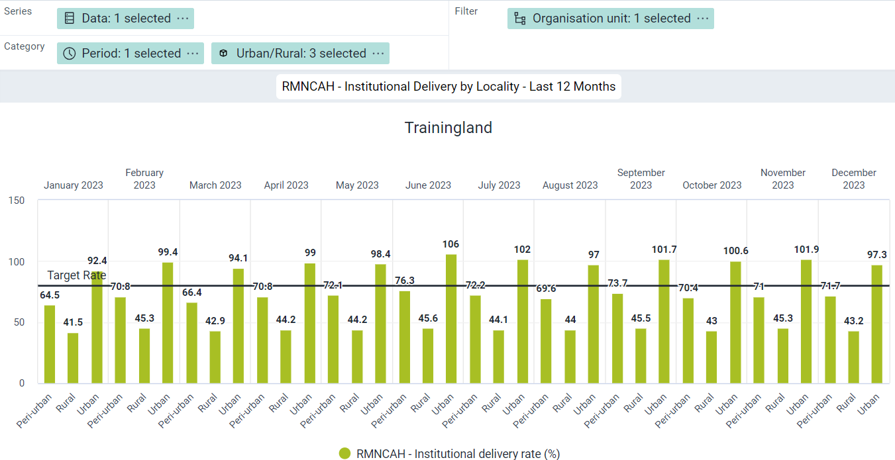

This is a 2-category chart. It receives its name as you can add 2 dimensions to the category. It is not a specific chart type, as this can be applied to a number of different chart types. These chart types include:

* Column
* Stacked column
* Bar
* Stacked Bar
* Line
* Area
* Stacked Area

This chart shows institutional delivery rate, and has both the period and locality selected in the category. The order in which the categories appear on the chart depends on how they are ordered within the layout. In this example, period is first, so it shows at the top of the chart. The second category, locality, shows at the bottom of the chart.

You can swap the period and locality to show the effect of this by updating the chart.

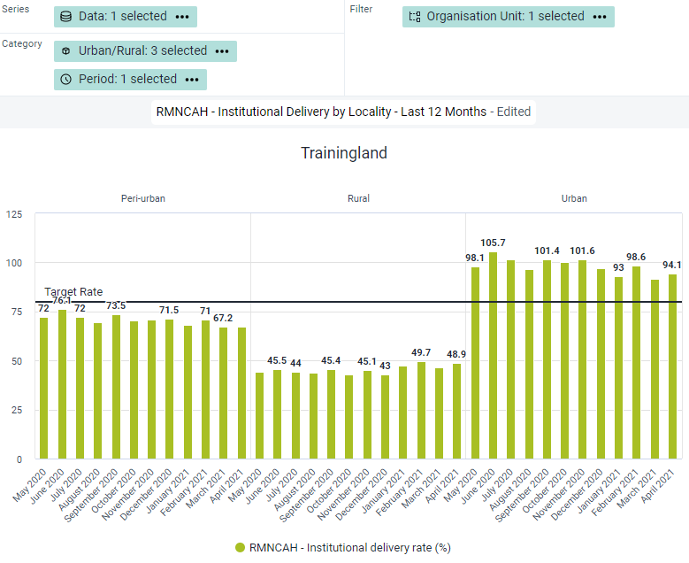

#### Clear the chart and make a new one

Clear the chart and select column as the chart type. Select the data, period and organisation units as usual.

* Data : RMNCAH - Institutional delivery rate (%) [Indicator group : RMNCAH]
* Period : Last 12 months
* Org unit : Trainingland

Update the chart, nothing special so far.

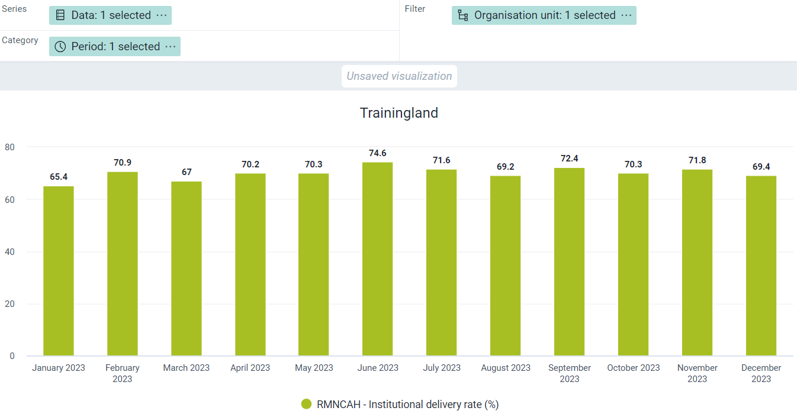

Add in the Urban/Rural org unit groups to the category.

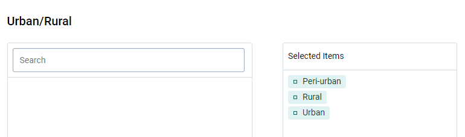

Now you will see the chart using 2-categories. As discussed, this follows our order that is in the layout.

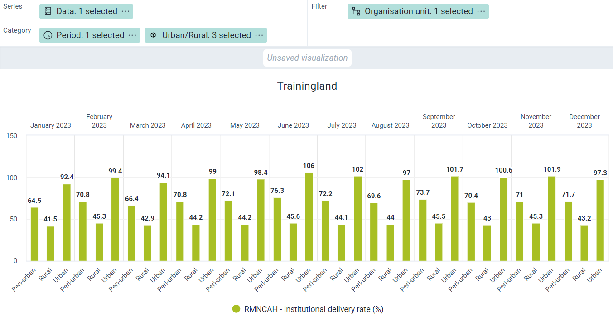

#### Swap the order of the period and locality in the category and change to an area chart

A line chart or bar chart would also be appropriate to display this data.

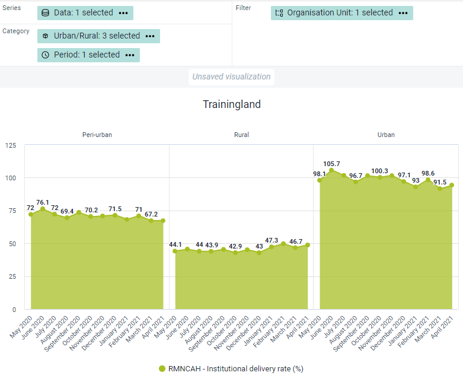

#### End Exercise 9

### Exercise 10 - Combination Charts

#### Review the chart “EPI - BCG Doses Given, Coverage - Last 12 Months”

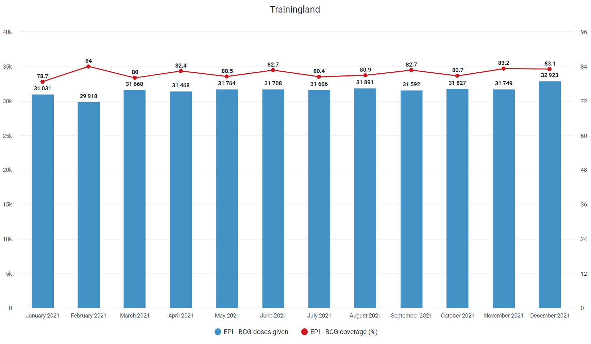

This is a combination chart. This feature allows you to combine a line and column chart together within the same visualization. In addition, we can assign data values to different axes. DHIS2 now supports up to 4 different vertical axes. 

We are using the chart shown to compare the number of doses given (blue columns, left vertical axis) with the coverage (red line, right vertical axis). If these values were presented on the same y-axis, it would be very difficult to review them together as the number of doses given is so much larger than the % values for coverage. Charts which use this feature are therefore useful when we are comparing values of two different value types or scales to try and understand how they correlate with one another.

#### Clear the chart and make a new one

Create a column chart with the following inputs:

* Data 
    * EPI - BCG doses given [DE group : Immunization Vaccinations]
    * EPI - BCG Coverage (%) [Indicator group : Immunization - coverages]
* Period : Last 12 months
* Org unit : Trainingland

Update the chart. We can see the different scales of the two data values negatively affect the output of the chart and make it difficult to relate the values to one another.

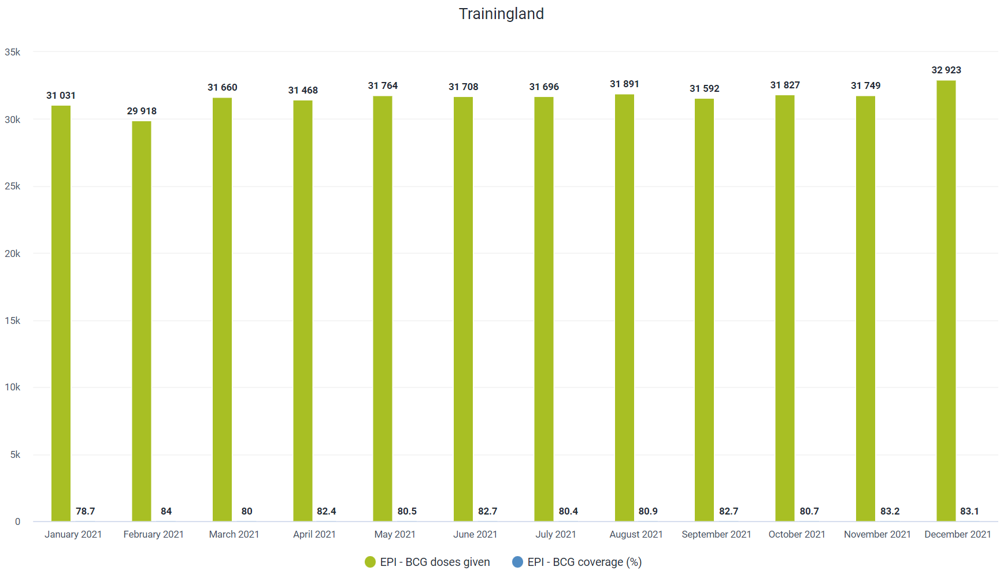

#### Modify the series in the chart options

Go to Options - Series. Modify the coverage indicator to be a line chart, and move it to 2nd axis. Explain all these steps as you perform them.

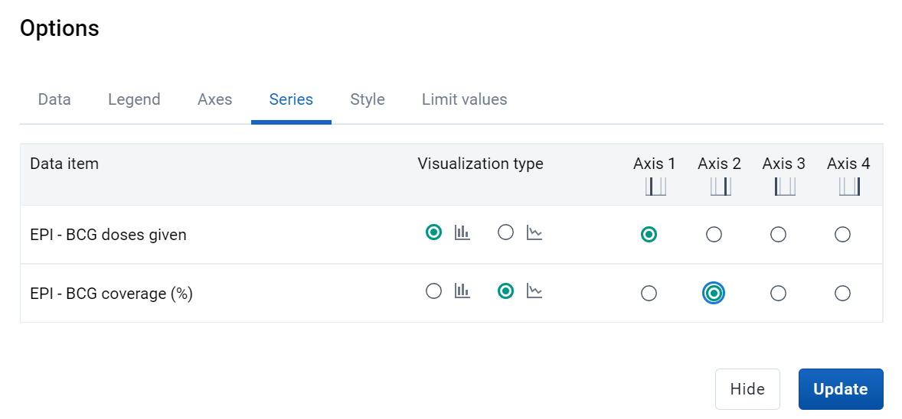

Update the chart. Now we have the output we are looking for.

#### Label the axes

Using the chart options, label both of the y-axes

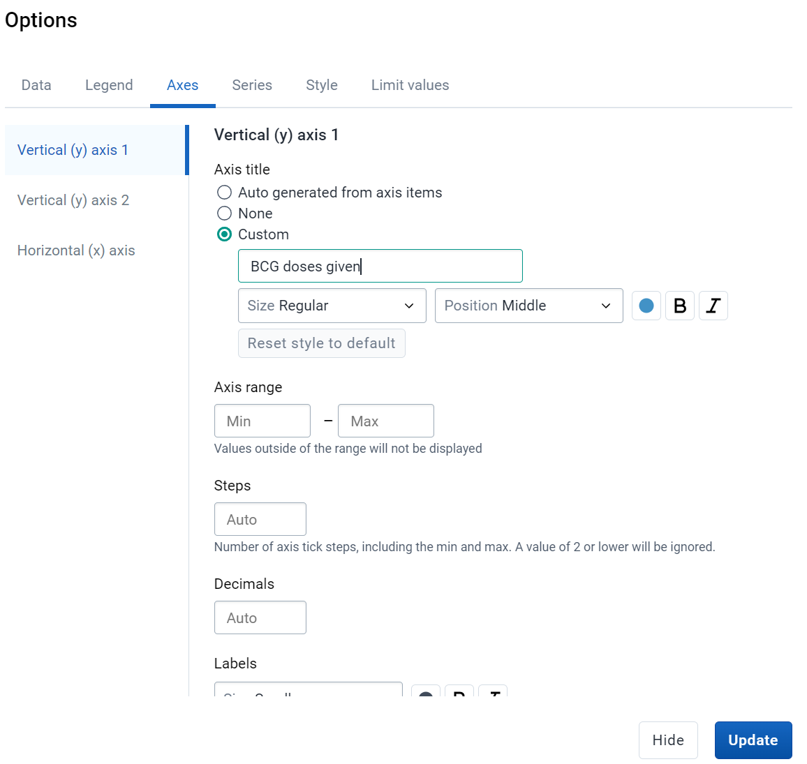

#### Add a 2nd category to the chart

We can also combine the features of 2-category charts with those of combination charts. Add in the Urban/Rural org unit groups to the category

And modify the category order in the layout.

You can see that we are able to combine these 2 features together. 

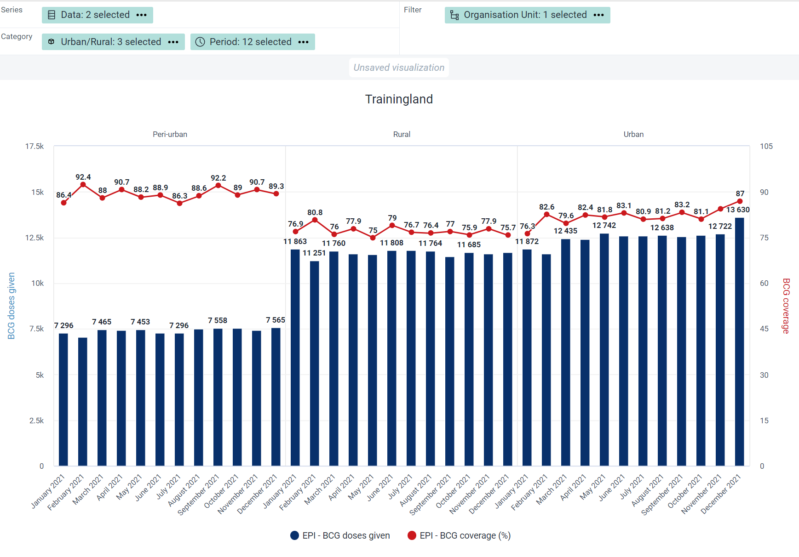

#### End Exercise 10

### Part 11 - Scatterplots

#### Review the chart “RMNCAH - ANC1 - ANC4 Outlier Analysis - Last Year”

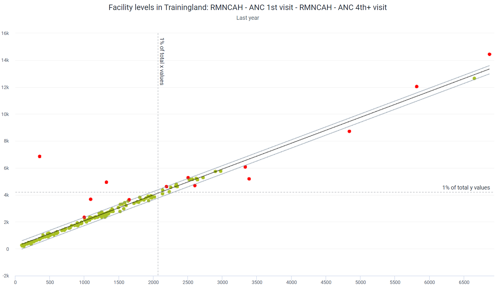

This is a scatterplot in which an outlier analysis at the facility level is being performed. The two variables on this chart are related to one another - ANC 1 and ANC 4 - and this is why you can see many of the values so closely clustered together in green colour. 

Outlier analysis using scatterplots allows you to identify if related values fit into an expected model or deviate in some way. Red values on the chart do not fit the expected model, and the farther these red values are from the outlier lines, the more likely there is an underlying issue causing these values to not fit the expected model correctly. 

These scatterplots can use several methods to identify these outliers, and each of these methods have different levels of sensitivity (ie. each one will detect more or less outliers based on their calculation). The different methods currently available are :

* Interquartile range
* Z-score
* Modified z-score

Z-score has been included as it is a well understood method; however it is the least sensitive of the 3 methods and it is recommended to use either interquartile range or modified z-score to detect your outliers. 

#### Create a scatterplot

Clear the chart by selecting File -> New. Start the process by selecting the scatterplot from the visualization selector.

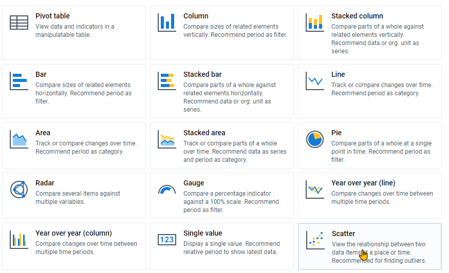

Review the layout after selecting this chart type. Certain items are locked which differentiates it from a number of charts. You must select data items for both the vertical (Y) and horizontal (X) axes of the chart. The points will also always be org units. As discussed, you should select related data items for this type of chart. If you select unrelated data items, your output is unlikely to be useful.

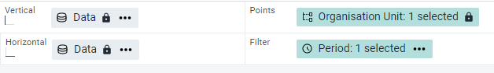

Select your vertical and horizontal data. We will select ANC 1 and ANC 4 as they are related (you will typically see less ANC4 than ANC1 within an identified period for example). 

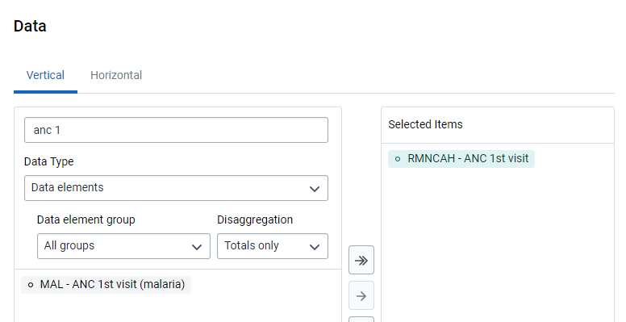
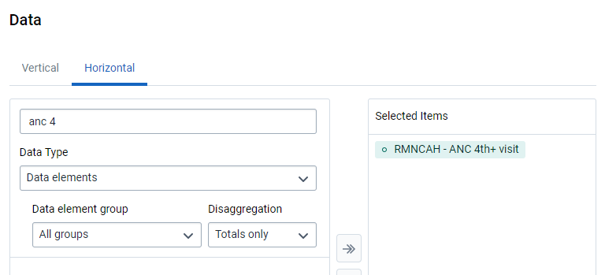

Select your org unit (in this case all facilities)

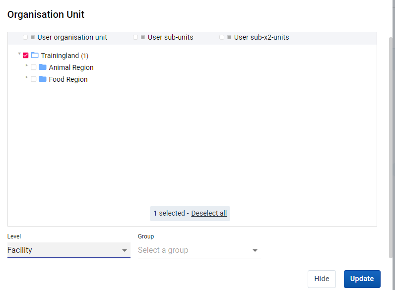

Select your period

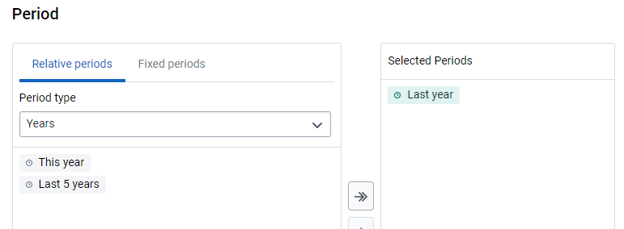

Update your chart.

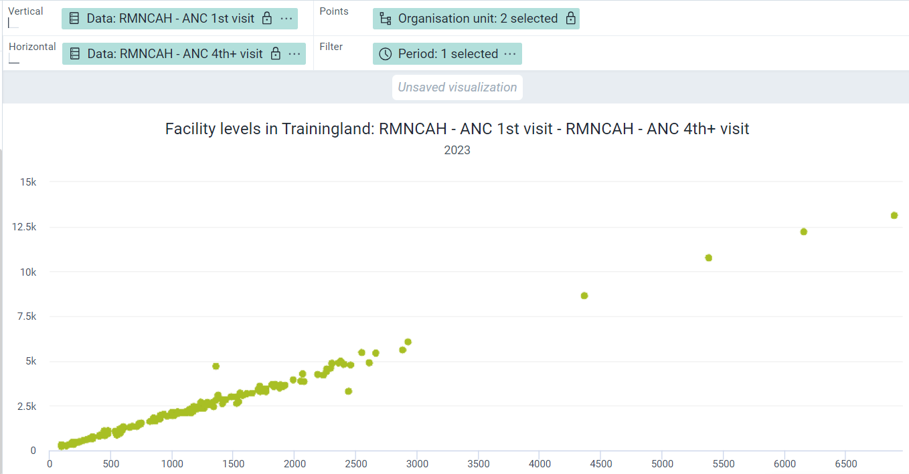

You will now see the scatterplot between these two related items. We can see how they are clustered closely in the bottom left corner of the chart as this is where the majority of values lie. We have not yet added our outlier information to this chart; we can do this as a next step.

#### Add outlier details

To add in the outlier details select the chart options and the “outliers” section. 

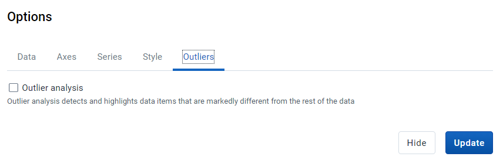 

Enable both the outlier analysis as well as the extreme lines. 

For the outlier analysis, we will use the method of interquartile range. This is a method of outlier detection that can be applied to scatterplot data. Here is a reference if you need more info : https://medium.com/analytics-vidhya/outliers-in-data-and-ways-to-detect-them-1c3a5f2c6b1e

Participants do not need to completely understand this method of outlier detection; just note that all 3 methods will determine outliers by seeing if they fit a model as described by the different methods selected.  

You can also select the “Extreme lines” option. This will help you to identify the most extreme outlier values that are potential sources of error. 

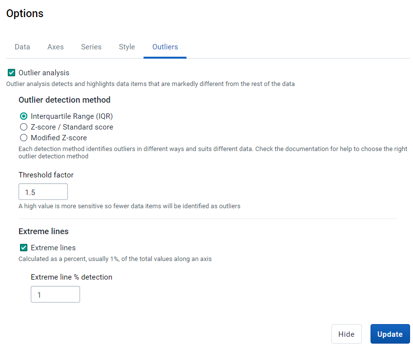 

After selecting these options, update your chart.

 

Let us review how we can interpret our output. First, let us zoom in on our cluster of values to review them more closely. We can do this by dragging our mouse cursor over the area we want to zoom into.

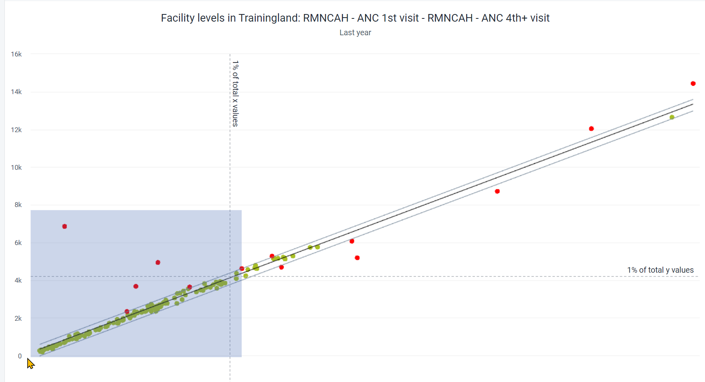

We can reset the zoom if needed by selecting “reset zoom” after we have zoomed in

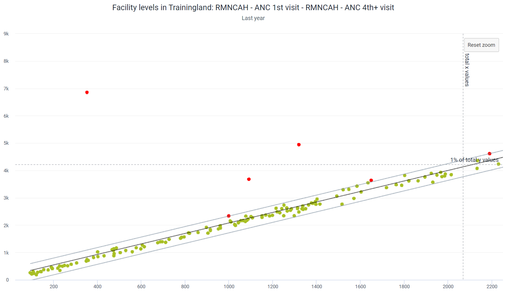

Review one of the outlier values highlighted in red

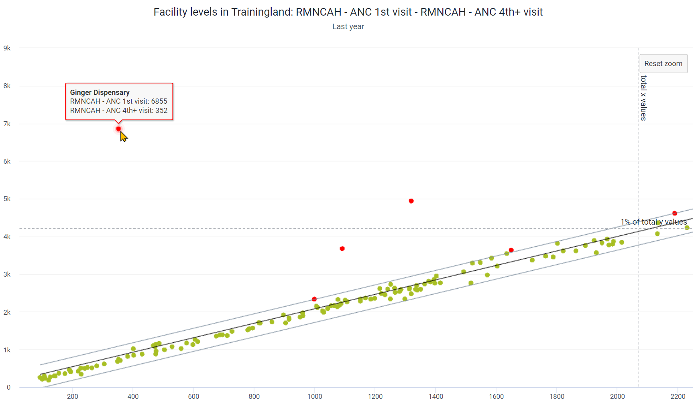

The model for this data is very narrow (ie, most values are closely clustered together); however we see some values that are quite far outside of the outlier boundaries. Neither of these values on its own may be considered an outlier (there are other ANC 1 values that are higher, and other ANC4 values that are higher); however, this value pairing lies outside of the range of 1% of the total y values (which represents ANC1). This is because a typical ANC4 value in this range has a much lower ANC1 value in comparison when reviewing the majority of the other data values.

When reviewing this type of chart, you therefore must review the relationship between the two items being compared and also compare the values to the cluster that falls within the boundaries of the outlier model. In this case, either ANC 1 or ANC 4 values could be incorrect (if we decrease the ANC 1 values OR increase the ANC 4 values, this facility will likely fit in the model accordingly); or this could just be an anomaly having a different ratio between ANC1 and ANC4 higher than the interquartile range threshold of 1.5 that has been defined (ie. these values are correct and do not need to be modified). As it is such a high outlier as compared to the rest of the data however (given its distance from the outlier boundary and that is outside the 1% y-value line) it does warrant investigation to determine if these values are correct within this facility. 

#### End Exercise 11
