# Learners Guide to Interpretations

## What is this guide?

This guide contains detailed information on the steps associated with performing each of the learning objectives associated with the interpretations session. This is not meant to be the session exercise, rather an overview of the features demonstrated in this session.

## Learning objectives for this curriculum

* Create and upload Data-to-Action frameworks in DHIS2 visualizations
* Demonstrate how to write interpretations in DHIS2 visualizations
* Demonstrate how to share and subscribe to interpretations

## Background on this topic/module

The Data-to-Action (D2A) framework is a set of supporting information that should accompany each DHIS2 visualization to help the user to understand:

* What data he is looking at,
* Why the data is important, 
* Where the data comes from,
* What can he do with the data?

The D2A framework allows users to strengthen use of program data and makes it easier to engage with data. The D2A framework highlights data users’ information and data visualization needs, furthermore, the expected actions to be taken based on benchmarked performance. The D2A framework is uploaded into the Details panel of a DHIS2 visualization, so that it provides more context to the DHIS2 visualization and prompts users to think critically of the data they are looking at.

## Demonstration Reference

## Part 1 - How to plug a Data-to-Action framework into a DHIS2 visualization

* Open the HIV National dashboard.
* Scroll down to the map “HIV - ART retention rate (12 months)”
* Open the item in Maps app by selecting the menu button followed by open in maps app

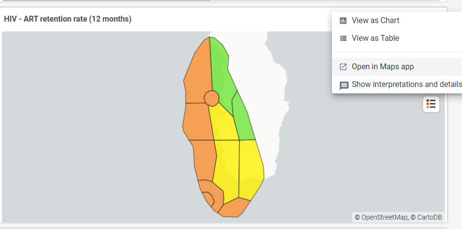

* Once opened in Maps application, it should look like below. Take a moment to understand the map. Focus on legend.

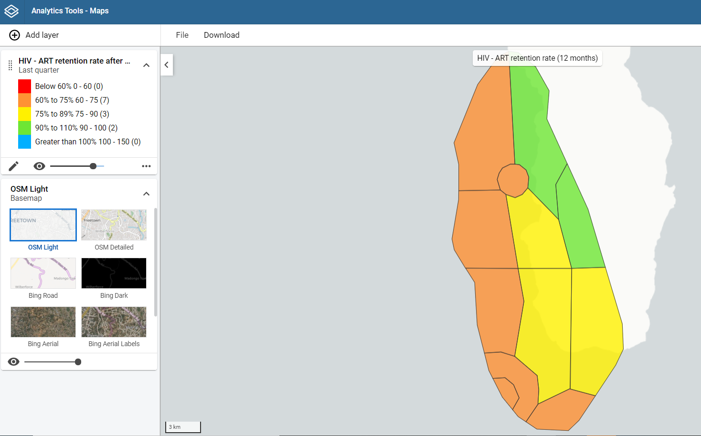

It looks like except for Dessert & Sweet districts, all other districts are having ART retention rates <90%

* Click on ‘Interpretations’ button on top right corner to write a description for the map

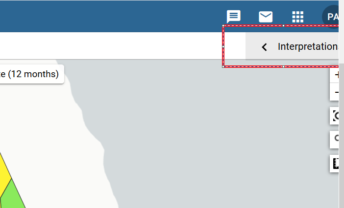

* You will see that currently no description is available

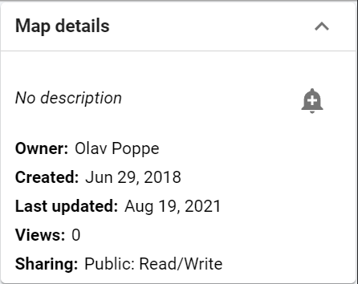

* Let’s formulate a description based on Data to Action framework
* Write the D2A framework. We can use rich text to format bold and italic text. In order for words to render in bold and italics, we need to use html. Copy and paste the following text into the Details panel and replace the text in blue with relevant text according to the visualization. Make sure you skip a row between each line.

```
*Indicators* : Insert name of indicator here

*Objective* : Insert objective of having the indicator as well as the performance

target/benchmark

*Data source* : Insert data source here

*Action that follows* :

_If insert benchmark here is met_ :

Insert action for when target is met

_If insert benchmark here is not met_ :
Insert some of the questions that can guide the data user to establishing the action to take
(e.g. was there a stock out issue? Was there challenges with transportation?) and/or any specific actions to take where applicable

Example of D2A framework you can copy and paste for the map **ART retention after 12 months**:

*Indicators* : ART retention rate after 12 months (%)

*Objective* : To track the % of patients retaining on ART after 12 months of initiation of treatment

*Data source* : HIV monthly reports from facilities

_Numerator_ : PLHIV retained on ART last 12 months 

_Denominator_ : PLHIV started ART 12 months ago  

*Action that follows*:

_If % of ART retention rate after 12 months >90 percent_ :

Sustain the efforts.

_If % of ART retention rate after 12 months &lt;90 percent_ :

Investigate whether there been shortage of ART at facilities

Check whether there has been under-reporting

Check whether facility staff has conducted awareness and education programmes on HIV

Check whether any side-effects of ART reported leading to lack of compliance
```

* Click on ‘Rename’ from the menu and paste the above text under description.
  

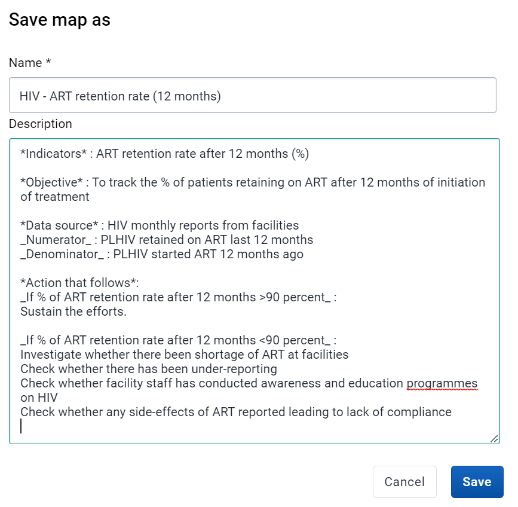

## Part 2 - How to retrieve a Data-to-Action framework from a dashboard
 
Go to HIV National Dashboard.

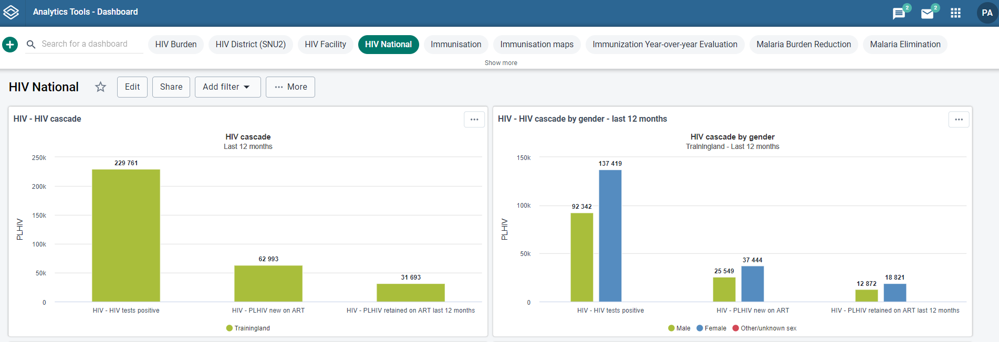

* Scroll down till you find HIV – ART Retention Rate (12 months). Find the show details and button within the item “ART Retention Rate (12 months)”. Click on it.

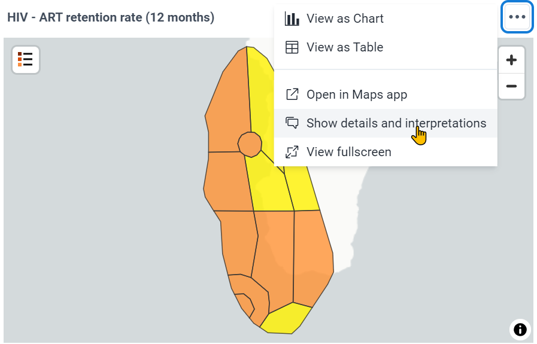

* Select “Show more” to show the full description

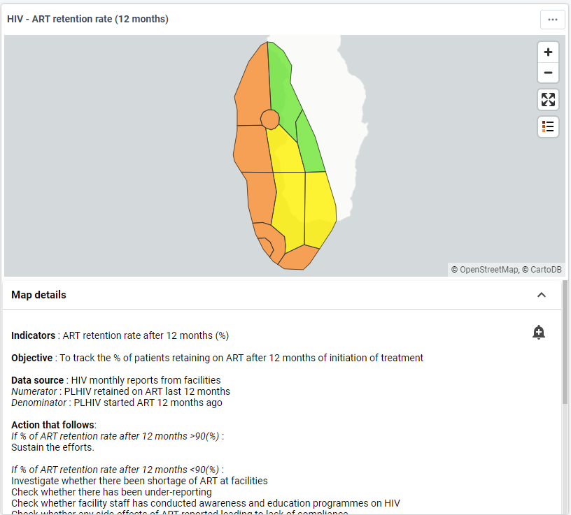


## Part 3 - Subscribing / Interpretations

* Let’s open the HIV Retention Rate (12 months) in Maps App.
* Click on “Interpretations” on top right corner

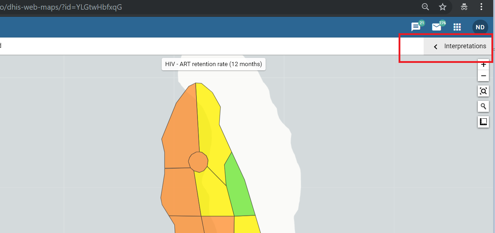


* Click on Bell Like ‘Subscribe’ icon. This will enable you to receive notifications every time someone comments on an interpretation. This is an effective way of tracking progress on feedbacks received on an indicator of interest.

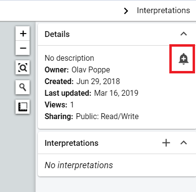    


### Login as a different user and write an interpretation.

Add an interpretation

* In Maps App/Data Visualizer/Pivot Table within the interpretations pane
    * Click on the box where interpretations are present

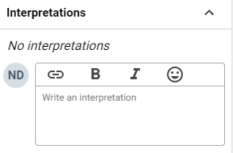


* You can save your comment. Once done you should be able to see the interpretation. This will provide you more options to interact with the comment including Like, Reply and Share. If you are the owner or having adequate permissions you can delete the comment as well.

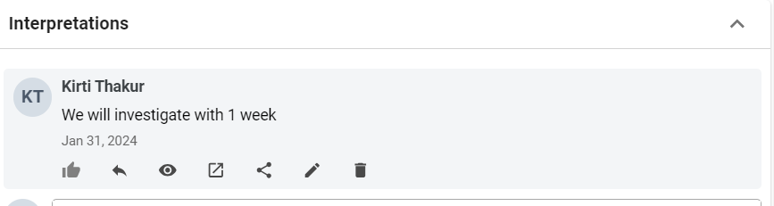


**NOTE: **Interpretations are tied to  how the output looked when the interpretation was written. We do this by selecting the “view” button on the interpretation. This is to ensure the interpretation will always properly align with what the user is seeing when they made the interpretation. There is a ‘view in maps app’ button which will open the interpretation in maps app as how it was at the time of making the interpretation. 

### Interpreting through dashboard items

* Open HIV National dashboard and scroll down to “**HIV - ART retention rate (12 months)**” 
* Click on the ‘Show interpretation and details’ button


* Scroll down and observe that previous comment made in Maps Apps is present.


* We can also tag a user in the system responsible to attend to the interpretation in the comment itself. To do that start typing with ‘@’. This will list out the users/user groups in system who we can tag to the comment. 

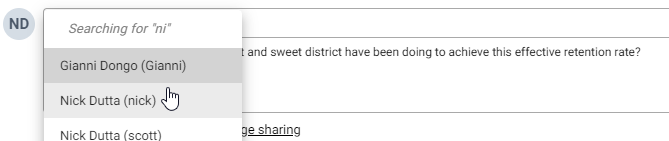  

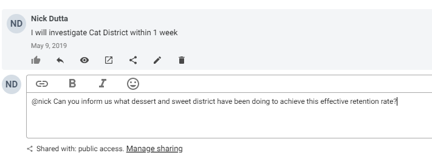  

### Log back in as the original user who subscribed to the item.

* Scroll all the way to top of dashboard. You should be able to see the interpretations icon at the top as highlighted in red below

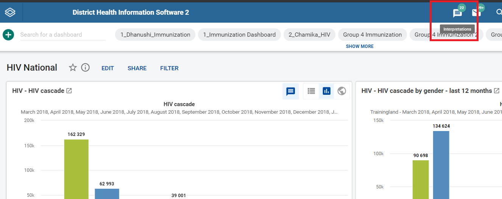

* Along with the icon it will also display how many pending interpretation notifications are awaiting you. This number is calculated from all interpretations that you have subscribed to or you have engaged (user tagging/commenting etc).
* Click on interpretations icon. This will open the interpretations app as shown above.

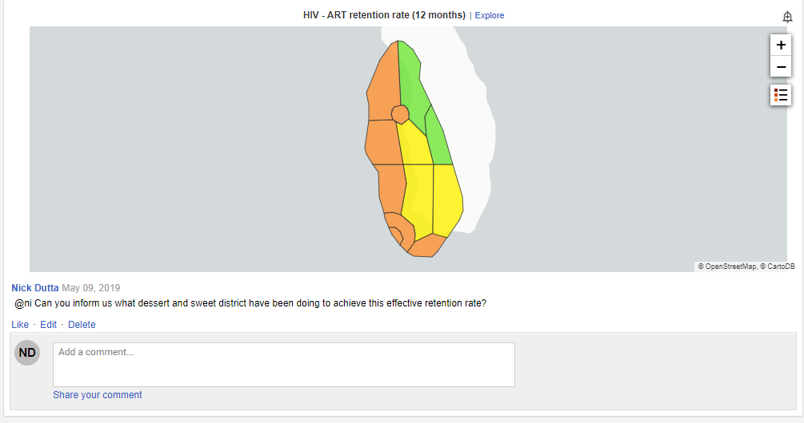

* This will provide you an overview and a quick access to all interpretations that you have subscribed to or engaged. You can easily comment on each of interpretation by scrolling down.’
* In addition, the left side pane will summarise top 5 interpretations, top 5 authors and top 5 commentators
