# Learner’s Guide to Maps

## What is this guide?

This guide contains all exercises and detailed steps to perform them related to the use of maps for the Analytics Tools Level 1 academy. Please perform each of the exercises when prompted by your instructors.

## Learning objectives for this session

1. Describe how maps can be used in DHIS2
2. Demonstrate how to:
    1. Navigate the maps app interface
    2. Add a thematic layer
    3. Interpret a map legend
    4. Add Boundary and facility layers
    5. Add a customized legend
    6. Review the map data table
    7. Create split view, timeline and bubble maps

## Background on this topic/module

The maps app allows you to do thematic mapping of areas and points, view facilities based on classifications, and visualize catchment areas for each facility. You can define custom legend sets and link them to indicators.

Maps are a great tool to understand the geographical distribution of data. The maps tool integrates seamlessly with the Data Visualiser. You can at any time choose to visualise your map as a chart or table, and switch back to map view again.

## Best practices, tips & tricks

1. Try not to put many overlapping layers on a map that will be difficult to interpret
2. Use different color schemes when displaying multiple layers on a map

## Introduction to GIS Concepts

It can be useful to start with a brief introduction to GIS to provide some context to what GIS (Geographic Information Systems) is.GIS is a large topic however you refer to some background on thematic mapping to get started. ([http://en.wikipedia.org/wiki/Thematic_map](http://en.wikipedia.org/wiki/Thematic_map)).

All maps in the DHIS2 maps module are choropleth, bubble or proportional symbols when they are linked with data. Basically, choropleth maps display geographical data (such as district boundaries) as colored polygons based on the data value for that particular area. Proportional symbol maps display coordinates of sites with symbols (circles in DHIS2) whose size depends on the value which corresponds to that particular site. Sites with larger values would typically have a larger circle, while sites with a small value would have a small circle. It is also possible to combine proportional symbols with differing colors. 

The DHIS2 maps app supports multiple “layers”. You can think of a GIS layer as a particular type of data. Layers can be stacked on top of each other to be combined into a single visual analysis. A satellite image (think Google Maps) can be used as a layer, often the base layer, upon which you add additional layers (such as site locations) on top of. Layers can also have “transparency” which determines the degree to which the layers blend into each other visually. The following diagram may help users to understand how layers are used in GIS a bit better. 

## Table of Contents/Quick Guide
- [Learner’s Guide to Maps](#learners-guide-to-maps)
  - [What is this guide?](#what-is-this-guide)
  - [Learning objectives for this session](#learning-objectives-for-this-session)
  - [Background on this topic/module](#background-on-this-topicmodule)
  - [Best practices, tips \& tricks](#best-practices-tips--tricks)
  - [Introduction to GIS Concepts](#introduction-to-gis-concepts)
  - [Table of Contents/Quick Guide](#table-of-contentsquick-guide)
  - [Exercises](#exercises)
    - [Exercise 1 - Maps interface and data dimensions](#exercise-1---maps-interface-and-data-dimensions)
      - [Open a map - TB - Notified TB cases (new and relapse, all forms) - last quarter](#open-a-map---tb---notified-tb-cases-new-and-relapse-all-forms---last-quarter)
      - [Edit the layer to review the layer selection options](#edit-the-layer-to-review-the-layer-selection-options)
      - [Review the data selection](#review-the-data-selection)
      - [Review the period selection](#review-the-period-selection)
      - [Review the org unit selection](#review-the-org-unit-selection)
      - [End Exercise 1](#end-exercise-1)
    - [Exercise 2.1 - Working with Layers](#exercise-21---working-with-layers)
      - [Make a new map](#make-a-new-map)
      - [Cycle through the basemaps (need online connectivity to perform this)](#cycle-through-the-basemaps-need-online-connectivity-to-perform-this)
      - [Review the “add layer” feature](#review-the-add-layer-feature)
      - [Add a organisation unit layer at the District level](#add-a-organisation-unit-layer-at-the-district-level)
      - [Add in a Thematic Layer](#add-in-a-thematic-layer)
      - [Click on Add layer to view the map](#click-on-add-layer-to-view-the-map)
      - [Review how equal counts has separated the values and interpret the map](#review-how-equal-counts-has-separated-the-values-and-interpret-the-map)
      - [Change to equal intervals](#change-to-equal-intervals)
      - [Save the map](#save-the-map)
      - [End Exercise 2.1](#end-exercise-21)
    - [Exercise 2.2 - Facility Layers \& Filter](#exercise-22---facility-layers--filter)
      - [Add in the Facility Layer to the map you saved previously](#add-in-the-facility-layer-to-the-map-you-saved-previously)
      - [Update to see the map with the facilities (zoom in a bit if required)](#update-to-see-the-map-with-the-facilities-zoom-in-a-bit-if-required)
      - [Edit the low/high color size of the thematic layer and update so the data values are more visible](#edit-the-lowhigh-color-size-of-the-thematic-layer-and-update-so-the-data-values-are-more-visible)
      - [Remove the facility layer from the map](#remove-the-facility-layer-from-the-map)
      - [Re-set the low/high color size](#re-set-the-lowhigh-color-size)
      - [Add in a filter](#add-in-a-filter)
      - [End Exercise 2.2](#end-exercise-22)
    - [Exercise 2.3 - Add in a Second Thematic Layer to the map you just saved.](#exercise-23---add-in-a-second-thematic-layer-to-the-map-you-just-saved)
      - [Update the Map](#update-the-map)
      - [Save the map](#save-the-map-1)
      - [Review the Map](#review-the-map)
      - [End Exercise 2.3](#end-exercise-23)
    - [Exercise 2.4 - Pre defined legends](#exercise-24---pre-defined-legends)
      - [Legends](#legends)
    - [Create a Map for BCG Coverage using the automatic legend](#create-a-map-for-bcg-coverage-using-the-automatic-legend)
      - [Review the map](#review-the-map-1)
      - [End Exercise 2.4](#end-exercise-24)
    - [Part 3.1 - Drilling Down](#part-31---drilling-down)
      - [Open the map “EPI - BCG Coverage by district - last year”](#open-the-map-epi---bcg-coverage-by-district---last-year)
      - [Drill down on a red district](#drill-down-on-a-red-district)
      - [Drill up one level](#drill-up-one-level)
      - [End Exercise 3.1](#end-exercise-31)
    - [Exercise 3.2 - Data Table and Download](#exercise-32---data-table-and-download)
      - [Load the map “HIV - HIV tests performed by facility - last 6 months”](#load-the-map-hiv---hiv-tests-performed-by-facility---last-6-months)
      - [Review the data table](#review-the-data-table)
      - [Filter data using the table](#filter-data-using-the-table)
      - [Download the map](#download-the-map)
      - [End Exercise 3.2](#end-exercise-32)
    - [Optional - Download the map data (use the play.dhis2.org server)](#optional---download-the-map-data-use-the-playdhis2org-server)
      - [Open the data file in qGIS (or another GIS software)](#open-the-data-file-in-qgis-or-another-gis-software)
    - [Exercise 4 - Split View and Timeline Maps](#exercise-4---split-view-and-timeline-maps)
      - [Create a map using split map view](#create-a-map-using-split-map-view)
      - [Add in a Thematic Layer](#add-in-a-thematic-layer-1)
      - [Data:](#data)
      - [Period:](#period)
      - [Org Units](#org-units)
      - [Review the style tab](#review-the-style-tab)
      - [Update the layer and review the map](#update-the-layer-and-review-the-map)
      - [Modify this to timeline view](#modify-this-to-timeline-view)
      - [Update the layer](#update-the-layer)
      - [End Exercise 4](#end-exercise-4)
    - [Exercise 5 - Create a Bubble Map](#exercise-5---create-a-bubble-map)
      - [Review Bubble Maps](#review-bubble-maps)
      - [Add a org unit layer before the thematic layer](#add-a-org-unit-layer-before-the-thematic-layer)
      - [Add in a Thematic Layer](#add-in-a-thematic-layer-2)
      - [Update the layer](#update-the-layer-1)
      - [End Exercise 5](#end-exercise-5)

## Exercises

### Exercise 1 - Maps interface and data dimensions

#### Open a map - TB - Notified TB cases (new and relapse, all forms) - last quarter

After the map is open, we can review the maps interface. 

Review these items. We will discuss each one in more detail as we proceed through the demo. 

**_Legends:_**

The legends take the thematic data we have selected and categorize them. Once they are categorized, they are displayed on the map according to the categorization. We can define the colours used as well as the categorization. We will discuss this a bit more later on.

**_Map Title:_**

The map title is the title of the saved map. By default, no title is generated for the map.

**_Map Display:_**

This is the actual map that has been created as a result of the inputs we have selected. We will discuss how a map can be created next.

#### Edit the layer to review the layer selection options

Click on the edit button to edit the layer. Here we can describe each element of the layer selection with options already pre-filled. We can see that all the selections for data, period and org units have been grouped together. These are not selected in individual menus as is the case with data visualizer and pivot table. 

#### Review the data selection

First, we see our data selection. We can see in this case one indicator has already been selected. Maps use the concept of layers to add data. There can only be one data item selected in each layer. We will make a map with multiple layers later in the session. 

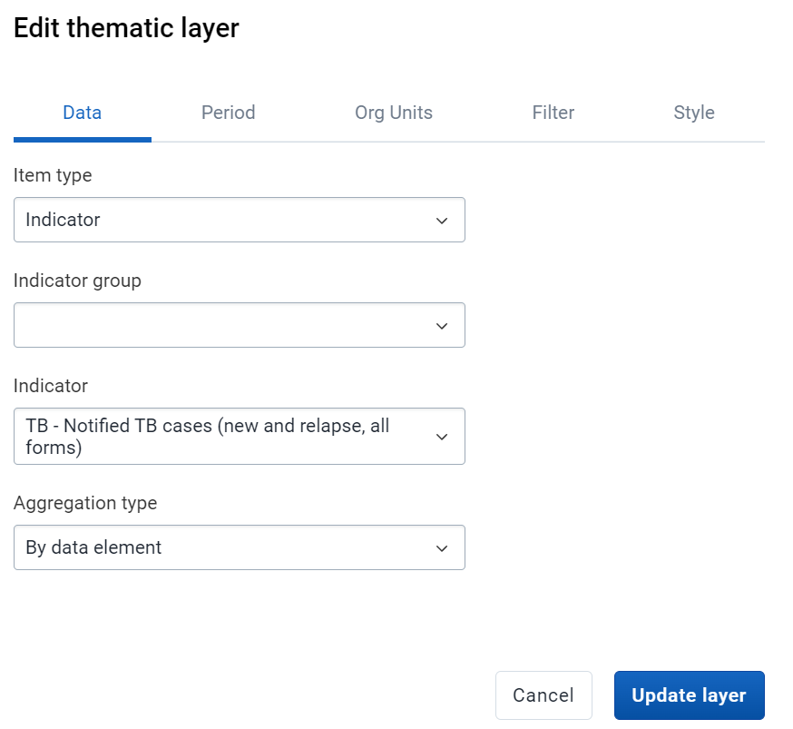

#### Review the period selection

Next we have the period. We can see that this is a bit different when compared to other apps. We have to first select the period type we are working with, which will then alter which periods we can select from. Within a map layer, we can only select one period type and one period as we are only working with displaying one data item at a time.

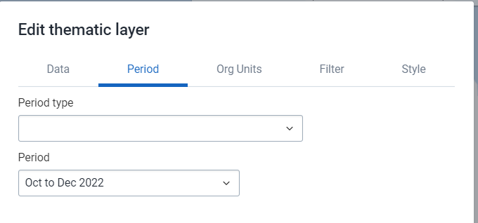

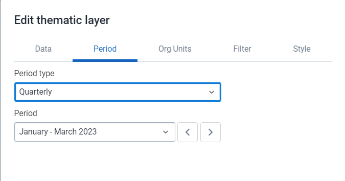

#### Review the org unit selection

The org unit selection decides what geography will be filled in and categorized with the data we have selected. We can individually select org units; however levels, groups or user org units are going to be used in most cases. This interface is slightly different than the one used in data visualizer however has similar design elements so should be somewhat familiar.

You can alter the org unit selection (Animal Region - Level : District) to see the effect this has on the map. 

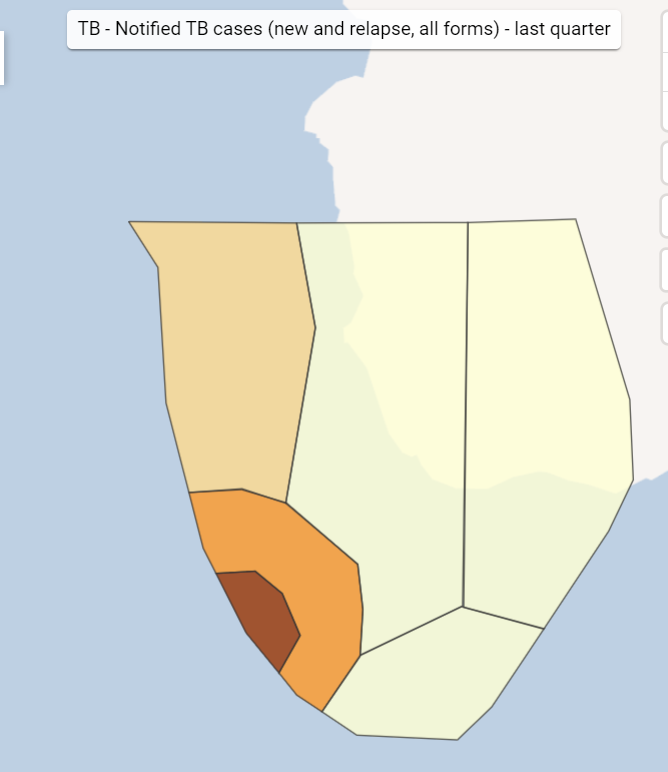

#### End Exercise 1

### Exercise 2.1 - Working with Layers

#### Make a new map

Clear the map by going to File -> New. This will give us a fresh canvas in which we can make a new map. 

#### Cycle through the basemaps (need online connectivity to perform this)

Basemaps provide the background layer for any map we create. By default, there are 6 basemaps within DHIS2 (OSM Light, OSM Detailed, Bing Road, Bing Dark, Bing Aerial, Bing Aerial Labels [Bing maps replaces google maps in 2.34]).  Note that users can also import/add their own layers as external layers. This could be for example more complex satellite imagery of their country or additional background layers for example. 

#### Review the “add layer” feature

When we select add layer, all of the different layers we can add to the map are displayed. Go through and explain these different layers. Google Earth Engine layers are not set up by default so will not be shown (this requires some additional setup that you can review in the [documentation](https://docs.dhis2.org/en/topics/tutorials/google-earth-engine-sign-up.html)). 

#### Add a organisation unit layer at the District level

Select boundary layer and go through the process of adding this to the map. 

#### Add in a Thematic Layer

- Value Type: Data Element
- Data Element Group: HIV
- Data Element: HIV tests performed
- Period Type: Relative
- Period: Last six-month
- Display Periods: Single (aggregate) [Note: we will explain time and split view later on]
- Organisation units: Facility

**Periods**

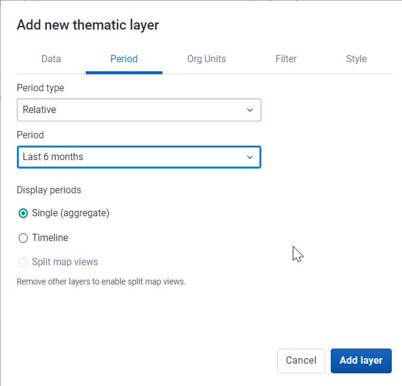

**Org Units**

**Filter**

We will come back to the filter

**Style**

You can review the different options available in the Thematic Layers. 

* We have two new modes that have been implemented since version 2.35. They are "Choropleth" and "Bubble map" mode. Choropleth is the default mode of the style we have always used in previous versions. The use of the "Bubble map" mode will be discussed later.  
* Automatic color legend types means that the application will create a legend set for you based on the classification, number of classes, and color scale you select. We will explain interpreting the classes after the map is updated.
* When automatic color legends are used, the color scale can be selected using colorbrewer scales available.
* Pre-defined legends will be discussed later in the tutorial. These are defined by the user. 
* If you have facilities in your thematic layer, you can set the radius for maximum and minimum values by changing the values in the Low color / size and High color size boxes.
* You can show the labels of the org units within the level you have selected by selecting “Labels.” The size and color of these labels can also be chosen.
* “Show no data” will be used later. 

#### Click on Add layer to view the map

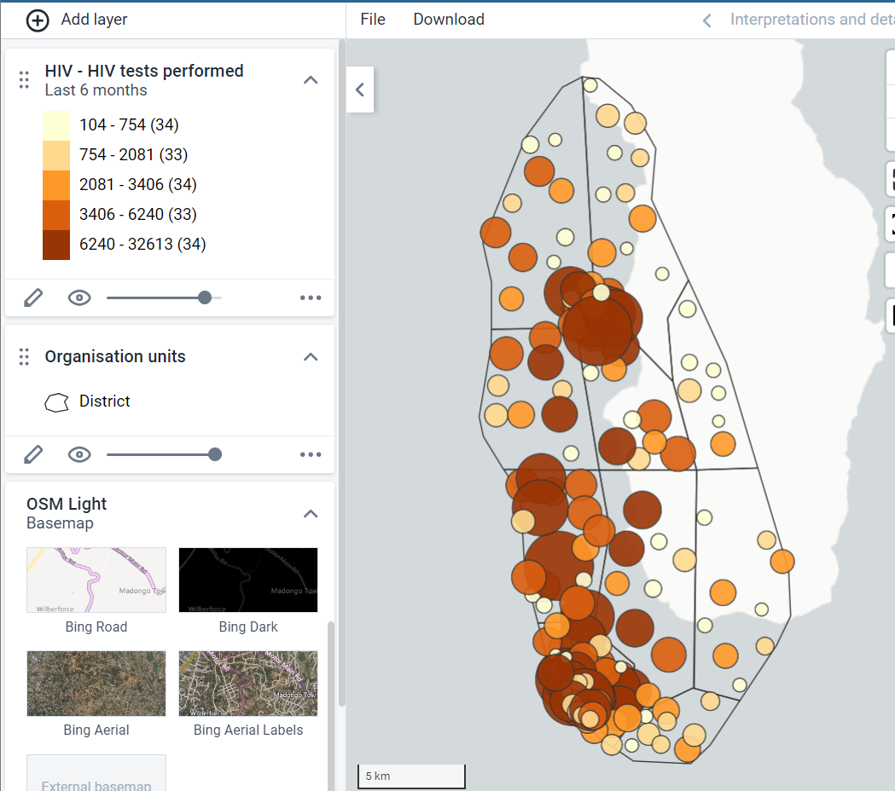

#### Review how equal counts has separated the values and interpret the map

* Equal counts will try and distribute the data values equally along the # of classes that are made (ie, I have 100 org units and 4 classes, each class will contain 25 values).
* Equal intervals will try and distribute the range of values equally. If I have data that ranges from 0-20000 and I select 5 classes, the data range for the legend will be separated by values of 4000.

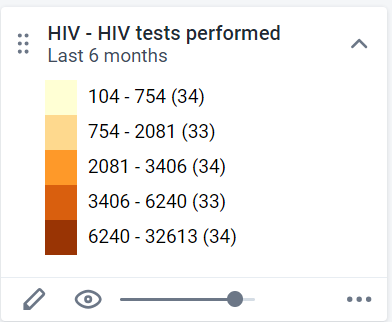

See how the legend has separated the values.  It tries to maintain an equal number of facilities across the five classes that are available within this legend. This may not be suitable depending on how you want to interpret the map. 

#### Change to equal intervals

If we change the map to equal intervals, than it looks a bit different.

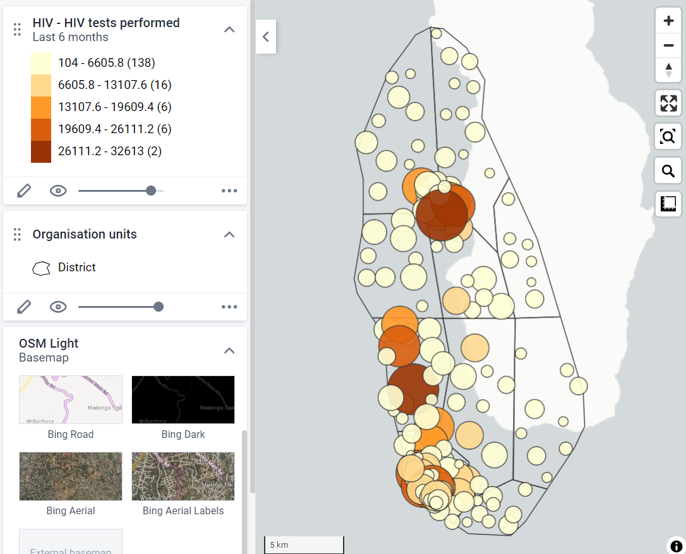

Here we can see the interval between each class is consistent 

**_Question: Which type of interval is better in this example?_**

As we are dealing with raw data values in this example, equal intervals seems to be more appropriate to measure the difference in the **scale** of the number of tests being performed in each facility. Those areas that are darker in color have performed a significantly greater number of HIV tests compared to those which are lighter in color. Previously (in the equal count legend) this disparity was not as well defined due to how the items were grouped. 

#### Save the map 

File - Save. Provide a name and save the map. Use your initials when saving the map.

#### End Exercise 2.1

### Exercise 2.2 - Facility Layers & Filter

#### Add in the Facility Layer to the map you saved previously

**Add layer -> Facilities**

**Org Units : Facility**

**Style : Style by group set - Type**

#### Update to see the map with the facilities (zoom in a bit if required)

#### Edit the low/high color size of the thematic layer and update so the data values are more visible

Note that the size functionality only affects point style data, not polygon data used for a thematic layer for a district for example.

#### Remove the facility layer from the map

You can use the hide layer button first to hide the layer if you want to temporarily disable a layer. After you hide the layer, you can use the options button to remove the layer entirely from the map. 

#### Re-set the low/high color size

#### Add in a filter

Edit the thematic layer and navigate to the filter tab. The filter tab allows you to filter what is displayed on the map using any of the available data dimensions you have configured in your system. As an example, we can filter out the map so it only shows tests performed on females.

From the filter tab, select “Add Filter”

Then Select “Sex” as the dimension and “female” as the item

**Update your layer.** You should see new data being displayed! Save the map before proceeding.

#### End Exercise 2.2

### Exercise 2.3 - Add in a Second Thematic Layer to the map you just saved.

Layers can be added and rearranged as required in the maps app. Consideration of the order in which layers are added is not too important as they can be dragged/dropped as required in the proper order.

We will compare the number of HIV tests performed with the number of positives to determine if there is any correlation here.

**Add another thematic layer to get started**

- Value Type: Data Element
- Data Element Group: HIV
- Data Element: HIV tests positive
- Period Type: Relative
- Period: Last six-month
- Organisation units: District
- Filter: Female cases

**Data**

**Period**

**Org Units**

**Filter **

Add a filter to show only female positives

**Style**

Make sure to select a color scale that will contrast appropriately with the color scale from the 1st layer. The Classes/method should be the same as the previous layer, as you want to compare these two data values.

#### Update the Map

Note that the map now has both layers and data displayed, but the second layer has been superimposed on top of the first layer.

To change the layer order simply drag and drop the layers so the facility layer is above the district layer. You may also want to try change the transparency for one of the layers at this time.

#### Save the map

Use File - > Save as in this example so you don’t save over the previous map. If you use save it will just save over the previous map you have made and not create a new favourite.

#### Review the Map

There seems to be a fairly straightforward correlation, in that the more tests that were performed the more HIV positives there are. We can see this by examining the colors as well as the scale and frequency of the circles. 

This is Fish District zoomed in.

We can see that a high number of positive tests were identified (it is the darkest green color available in our legend and you can see the number when scrolling over).

We can also see a high number of HIV tests performed in this District, with several large brown circles and a number of darker orange circles appearing within this District alone.  

This is similar in Dinner District

If we contrast this with Insect District, we can see it is light green in color. The number of HIV tests positive is low in comparison to Fish District. We can also see that the facilities are all small dots that are light yellow in color, indicating that there are a lower number of tests performed within those facilities. 

The map as a whole gives us a good idea of the geographical location of HIV burden in the country. In particular, we can single out the central and south-west portions of Trainingland as HIV-dense areas when compared to the other districts in Trainingland.

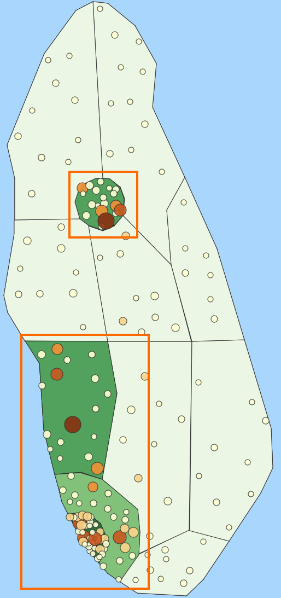

#### End Exercise 2.3

### Exercise 2.4 - Pre defined legends

#### Legends

Legends allow you to define your own range of values and colors to apply to the data that you are displaying on the map. 

Legends work best when you understand the range of values for your data. Without this, it will be difficult to define ranges that will provide meaningful representations of your data. You should always review the data itself in one of the tools to understand how it is broken up in order to create meaningful ranges for your legends. We will do that in this demo.

### Create a Map for BCG Coverage using the automatic legend

- Add layer - > Thematic Layer
- Value Type: Indicator
- Indicator Group: Immunization - coverages
- Indicator: EPI - BCG Coverage (%)
- Period Type: Relative
- Period: Last Year
- Organisation units: District

**Data**

**Period**

**Org Unit**

It will automatically apply the pre-defined legend to your map.

In order to see how this was applied, go to the style tab for the layer.

In this case, we can see that “predefined” has been selected as the legend type, and the legend select is “EPI Coverage.” This legend is associated with this indicator so that is why the custom legend is applied automatically.

#### Review the map

The custom legend allows those district with low coverage to really pop out using the red colour, while those districts with high coverage are shown with green. There are also less arbitrary cut-offs for each class within the legend as the legend has been defined by the user. 

You may also want to add in the District labels. Edit the thematic layer and add the labels in the style tab. 

**Update the layer**

Now it is very easy to identify those districts that are performing well vs. those that are not. Bird District, for example, requires immediate intervention and can perhaps learn from Cat, Dog and Vegetable District which are on or above target [target being 80%]. It would be useful to investigate what is occurring at the facility level as well in this case to dig a bit deeper and understand what the factors are that are contributing to this low rate in Bird District. 

#### End Exercise 2.4

### Part 3.1 - Drilling Down

#### Open the map “EPI - BCG Coverage by district - last year”

#### Drill down on a red district

Drill down on one of the red districts

There is varying performance within this district at the facility level. Focusing on improving performance in the very poor performing facilities would make sense in this scenario.

#### Drill up one level

Right click on a facility, then drill up

#### End Exercise 3.1

### Exercise 3.2 - Data Table and Download

#### Load the map “HIV - HIV tests performed by facility - last 6 months”

#### Review the data table

Select options for the layer followed by data table.

The data table shows all of the underlying data related to the map layer that has been produced based on the data item which you have selected. In this case, we are working with an indicator, and we can see that the data table displays all of the values for this indicator, the legend it belongs to as well as all of the relevant organisation unit information. 

#### Filter data using the table

Not only can we use the data table to review the underlying data, we can also use it to filter data, both on the table itself as well as the map. 

We can start by adding in a simple filter in the value column (>5000)

We can add in additional criteria. In this case we can use the and symbol in order to define a range that we want to filter on both the map and the table (ex. >5000&&lt;15000).

After we add in the filter we can see that the map is altered. We can select the heading to arrange the column either from lowest-highest or highest-lowest. We can also arrange by any of the other columns, either when there is a filter or when no filter has been applied. 

#### Download the map

The first download option we will highlight is the “Download” button next to the file menu. 

This button allows us to download our map so we can use it offline. It downloads exactly what is seen on screen within the maps display, so if you are zoomed in it will download a zoomed in image of the map! With that in mind, make sure to frame your map correctly before you download the map.

When I select the “Download” button, I have a couple options I can select. The first is whether or not I want to show the name of the map. This name is based on the favorite name that is assigned to the map you are working with. If it is not saved as a favorite, this option will not apply. 

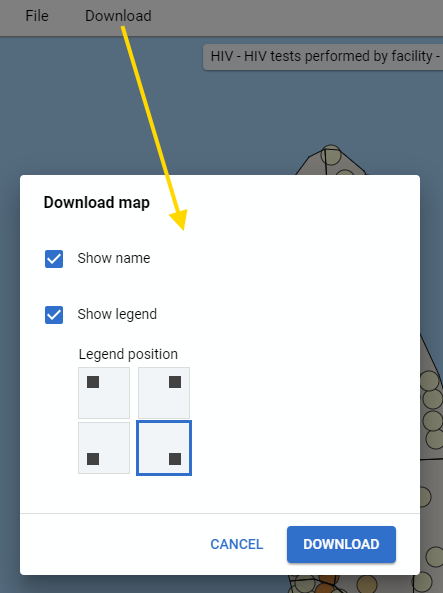

Secondly, I can decide where I want the legend to be positioned in my download. You will see a preview of the legend before you download it. After selecting these items, you can click on download.

When I open the image, we can see a clear image of my map has been downloaded to my computer which I can now use in presentations and other material as required!

#### End Exercise 3.2 

### Optional - Download the map data (use the play.dhis2.org server)

> NB: These are instructions for downloading map data. You do not need to perform this exercise if you are not familiar with other GIS apps. The instructions are included for those who are familiar with them to have some guidance after the academy.

Going back to the maps app, let us discuss one final feature, the “Download data” button. This allows us to download the map data so we can use the data generated by the map in another tool. In this example, I will download the data and open it is a vector layer in qGIS. 

Have a map open that uses district level data (ex. ANC: IPT 2 Coverage this year)

To start the process, I will select the more actions button next to the layer I want to download, followed by the “Download data” button. 

It will provide you with a prompt, indicating how I can potentially use this downloaded data. Click on download to download the actual data file.

#### Open the data file in qGIS (or another GIS software)

Using QGIS as an example I can add the downloaded data as a layer within this application. 

Note that it doesn’t download the style or legends that have been applied to the map within DHIS2. 

I can see that the values associated with those chiefdoms have been downloaded along with the rest of the map data. 

We can use qGIS (or another GIS application of your choice) in order to add the correct symbology to the map if we wanted to, as well as perform more advanced spatial analysis than would be possible in DHIS2. Note that we can bring in multiple layers, so each thematic layer created in DHIS2 could be added to the external GIS app if required.

### Exercise 4 - Split View and Timeline Maps

#### Create a map using split map view

We can create a map using split view, as this will allow us to create and compare a map over multiple time periods.

You can open up this saved map to see an example of what a split view map looks like.

**EPI - BCG Coverage, district, last 12 months - split view**

#### Add in a Thematic Layer

Let’s create the map we just showed.

* **Value Type: Indicator**
* **Indicator Group: Immunization - coverages**
* **Indicator: EPI - BCG Coverage**
* **Period Type: Relative**
* **Period: Last 12 months**
* **Display Period: Split map views**
* **Organisation units: District level**

#### Data:

#### Period:

When selecting the period, if working with **_relative periods_** we can use either a timeline or split view in order to show data over multiple periods.

* The **_Single (aggregate)_ **option takes the relative period and aggregates all of the data for that period to create one map, rather than showing the map over different periods.
* Timeline view allows you to show maps from multiple periods and **_play_ _them back like a video_**; we will demonstrate it to show how it can be used
* Split map view is the example we showed, in which it displays one map for each period all within the same map canvas

We will start by selecting split map views for this first example.

#### Org Units

Select District as the org unit

#### Review the style tab

It will apply the legend associated with the indicator.

#### Update the layer and review the map

#### Modify this to timeline view

We can also present this as a timeline view

Edit the layer and go to the period. Here we can select timeline

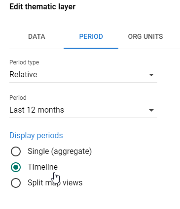

#### Update the layer

In the map view, you will see a timeline underneath the map representing the relative period that you have selected. The map that you see is representing the highlighted period in the timeline. You can play the timeline map by hitting the play button at the bottom of the timeline. Click on the play button to view the timeline map.

#### End Exercise 4

### Exercise 5 - Create a Bubble Map

#### Review Bubble Maps

Bubble maps are a new map feature which has been intruded from DHIS 2.35. You can open the map “MAL - Malaria cases positive - last year” to see an example of a bubble map.

Note the difference between Choropleth et Bubble map.

* Choropleth will assign a color to each org unit shape according to the data value. This is the recommended technique if the data is normalised (per capita).
* Bubble map will show data values as proportional circles. Use this technique if the data is not normalised (absolute numbers). The circles are placed in the center of each org unit.

Please click on the link to get more details: [https://docs.dhis2.org/2.35/en/dhis2_user_manual_en/using-the-maps-app.html](https://docs.dhis2.org/2.35/en/dhis2_user_manual_en/using-the-maps-app.html)

And [https://www.youtube.com/watch?v=lWJM6k4RxWQ](https://www.youtube.com/watch?v=lWJM6k4RxWQ)

#### Add a org unit layer before the thematic layer

Clear the map by selecting File - > New 

#### Add in a Thematic Layer

- Value Type: Indicator
- Indicator Group: Malaria
- Indicator:  MAL - Malaria cases positives microscopy
- Period Type: Relative
- Period: This year
- Organisation units: District level
- Style: Bubble Map → Automatic color legend

**Data:**

**Period:**

**Organisation units:**

**Style:**

#### Update the layer

In the map view, you will see a thematic map that represents each org unit as a single point/bubble. The size and the color of the bubble proportional to the value of that org unit compared to the range or legend. This is a popular way to visualize cases and other disease maps where hotspots need to be easily identifiable.

#### End Exercise 5
