# Learner’s Guide to Pivot Tables

***PERFORM THESE EXERCISES IN THE ANALYSIS SYSTEM***

## What is this guide?

This guide contains all 8 exercises and detailed steps to perform them related to the use of pivot tables session for the Analytics Tools Level 1 academy. Please perform each of the exercises when prompted by your instructors.

## Learning objectives for this session

1. Describe what a pivot table is
2. Demonstrate how to: 
    1. Modify pivot table dimensions
    2. Create tables in the Data Visualizer app
    3. Use Pivot Table Options and Pivot Table Layout
    4. Add in categories and org unit groups as disaggregations
3. Download pivot table data
4. Explain how different number types can be used
5. Explain how to set up sharing for saved items
6. Demonstrate how to apply legends to pivot tables
7. Demonstrate how to freeze rows and columns

## Time needed for this session

* Live demo: 1.5 hours
* Hands-on exercises: 2 hours
* Graded Assignment : 1 hour

## Background on this topic/module

The Pivot Table module is a dynamic tool where you can perform data manipulations and visualizations in a tabular format. It is inspired by the Excel Pivot Tables and has some of the same dynamic features, but being a web-based tool it can’t replicate all the features of Excel. 

The Pivot Tables is a great tool if you want to analyze larger chunks of the data or look at more details with multiple data dimensions at the same time. It allows for more flexibility in terms of selecting and visualizing multiple data dimensions (groupings and disaggregation) than the Data Visualiser and the maps tools.

These exercises assume it is not your first time interacting with pivot tables as this is covered during the online fundamentals academy; however it is likely that not every person in the academy would be advanced users of pivot tables. In this academy, we will build on the online fundamentals by working with disaggregation, organization unit groups and legend in more detail. 

The first component of the demo will be a review for anyone who has taken the online aggregate fundamentals course. 

## Best practices, tips & tricks

1. Hide empty rows/columns is a very useful Pivot Table option when analyzing data across many org units or periods with gaps in the data.
2. Sort your table quickly by clicking on the sort symbol inside the column header cells
3. You must always save your table before you can add it to your dashboard or share it with colleagues
4. You can add color legends to your table (coloring of cells based on their values) under Options. Multiple legends can now be assigned within the same table and are created in the “Legends” portion of the maintenance app. 

## Table of Contents
- [Learner’s Guide to Pivot Tables](#learners-guide-to-pivot-tables)
  - [What is this guide?](#what-is-this-guide)
  - [Learning objectives for this session](#learning-objectives-for-this-session)
  - [Time needed for this session](#time-needed-for-this-session)
  - [Background on this topic/module](#background-on-this-topicmodule)
  - [Best practices, tips \& tricks](#best-practices-tips--tricks)
  - [Table of Contents](#table-of-contents)
  - [Exercises](#exercises)
    - [Exercise 1 - Access the Data Visualizer App and Modify the Dimensions after opening a saved item](#exercise-1---access-the-data-visualizer-app-and-modify-the-dimensions-after-opening-a-saved-item)
    - [Review the table](#review-the-table)
    - [Modify the Data](#modify-the-data)
    - [Review the Periods](#review-the-periods)
    - [Review Organisation Units](#review-organisation-units)
    - [Exercise 2 - Table Layout, Options, Sorting and Saving](#exercise-2---table-layout-options-sorting-and-saving)
      - [Table Options](#table-options)
      - [Sorting](#sorting)
      - [Saving](#saving)
    - [Exercise 3 - Disaggregations / Group Sets](#exercise-3---disaggregations--group-sets)
      - [Add in the sex dimension](#add-in-the-sex-dimension)
      - [Add in PHC, Dispensary and Health Centre from the Type dimension](#add-in-phc-dispensary-and-health-centre-from-the-type-dimension)
    - [Exercise 4 - Additional Table Options](#exercise-4---additional-table-options)
      - [Row/Column Totals/Subtotals](#rowcolumn-totalssubtotals)
      - [Show Hierarchy](#show-hierarchy)
    - [Exercise 5 - Download Data](#exercise-5---download-data)
    - [Exercise 6 - Demonstrate Number Type, Measure Criteria, Sharing](#exercise-6---demonstrate-number-type-measure-criteria-sharing)
      - [Number Type](#number-type)
      - [Filtering the Table](#filtering-the-table)
      - [**Share** Saved Item](#share-saved-item)
    - [Exercise 7 - Working with Legends, Drilling Down](#exercise-7---working-with-legends-drilling-down)
      - [Legends](#legends)
      - [Drill Down](#drill-down)
    - [Exercise 8 - Freeze rows/columns](#exercise-8---freeze-rowscolumns)
    - [Part 9 - Last Value Aggregation Type](#part-9---last-value-aggregation-type)
      - [Last Value Aggregation Type](#last-value-aggregation-type)

## Exercises

### Exercise 1 - Access the Data Visualizer App and Modify the Dimensions after opening a saved item

Go to Apps -> Data Visualizer

Open the table “HIV - HIV testing performance by sub-orgunits”

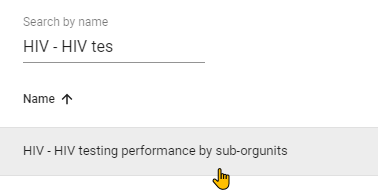

### Review the table

Data is arranged in a simple tabular output which is arranged in columns and rows. We see that rows represent the region (Where) dimension, columns shows HIV tests performed, number positive and the positivity rate which is something to do with data (What) dimension and at the top we see the months as period dimension to which the data in table is displayed.

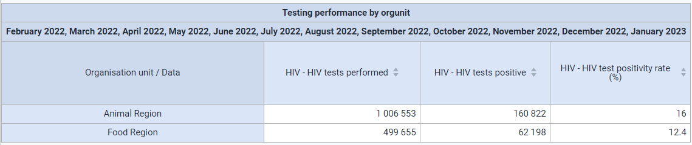

Now focus on the left side of the screen where we configure the output. This is where we select what to be displayed for each dimension. 

Review of DHIS2 dimensions; data, periods and organization units.

|*Understanding DHIS2 data dimensions*|
|---|
|When selecting what data to add to a TABLE, at minimum you need to make selections in terms of “what”, “where” and “when” the data is describing. 
“What” described indicators (calculated by formulas), data elements (raw data as collected in the data entry forms) or reporting rates. Both are organised as groups, so know your groups to quickly find what you are looking for.
“Where” is found under Organisation Units, that is the location hierarchy from global to country and finally to sites, with all the intermediary levels in between. Know your orgunit levels to quickly navigate to the correct locations.
“When” is found under “Periods”. There you can specify what periodicity or time you want to visualise data for. Periods are organised by Period Types (“frequency groups”), so to find “January 2022” you must look under Period type “Monthly”. “January-March 2022” is found under “Quarterly”, “2022” is found under “Yearly”.
In addition to these “core dimensions” there are quite a few additional dimension providing more granularity to the “what” dimension, e.g. the age, sex and test results dimensions.|

### Modify the Data

Demonstrate that it is possible to select data from data elements, indicators or data sets

In current selection both data elements and indicators are selected.

Relate the data elements and indicators to the session regarding Metadata (where you discussed how outputs link to metadata configuration). Ask them to identify each selected item in this example as a data element or an indicator.

Demonstrate how to select data elements/indicators. You can do this by removing one of the selected items and adding it back into the table.

### Review the Periods

Next move on to Periods selection. 

In DHIS2, there are two methods to select Periods. These are referred to as “fixed” and “relative” periods. 

* Fixed periods specify the exact timeframe you wish to review the data you are analyzing. These are not subject to change over time and will not update automatically.
* Relative periods are relative to the current date. These will update automatically and can be useful if you want the item to be modified as time moves forward.

You can select various fixed period types depending on the time period you wish to review your data. You can also select multiple fixed period types if you wish to analyze your data in this manner.

Start with the fixed period selection.

Next, review what relative periods are. These periods are relative to today’s date. They will constantly update as time goes forward and therefore are often a good choice for favorites. For example, if you are in 2021 and choose “Last Year” as the relative period, 2020 will be selected. In 2022, this will automatically shift to 2021. Over time, you will not have to edit each of the items you have saved as the selection of its data will constantly change.

You can see ‘last 12 months’ is already selected. Go ahead and modify this selection to the “last 6 months” and **update** the table to see what effect this has on the output.

### Review Organisation Units

Next focus on **Organisation Units**.

What is currently selected is the user sub-units. This concept allows us to display data relevant to the organization units that a user has been assigned. This allows us to use one saved item with many different users, updating our output based on the organization units that have been assigned to them. In this example, a “sub-unit” is one organization unit level below what the user has been assigned.

Let’s uncheck user sub-units to provide a clearer view on options available for organization units.

Review the different selection modes for orgunits:

1)	Select organisation units

2)	Select levels

3)	Select groups  

***Select organisation units***

This is the default way of selecting orgunits, simply select the units in the hierarchy that you want to use in the output. By default the “root” or top level unit is selected in the hierarchy. For most users this will be the Trainingland unit or a country unit in the real production environment. If you just want the country totals simply leave the top most unit (in this case Trainingland) selected. The org unit hierarchy supports multiple selections, just select the org units that you want to include in your output.

This is the most flexible way of selecting org units as any combination of selected units is allowed, mixing units from different levels etc. You can **update** he table to see how this affects the output.

***Select levels***

The ‘Select levels’ mode may be faster and more convenient when selecting all units at the same level. You can select a level by using the dropdown select available within the organization unit pop up menu. 

Select District as the level (in the drop-down box) and make sure Trainingland is selected in the hierarchy. This will give us all units at the District level in Trainingland. If we just wanted the districts in the Food Region we could change the selected unit in the hierarchy from Trainingland to Food Region. If we wanted all districts in Trainingland, we could make the selection as below:

You can go ahead and **update** the table in order to see the effect this has on the table.

***Select Groups***

‘Select groups’ is the third way of selecting orgunits. Orgunits can be grouped in as many orgunit groups as you like, and these groups can then be used as a filter to select all units of a particular type or another common set of characteristics. For example, this could be a hospital group for all hospital units or a public group for all public health facilities. There are several org unit groups available in Trainingland, which have grouped similar facilities together for analysis as shown below.

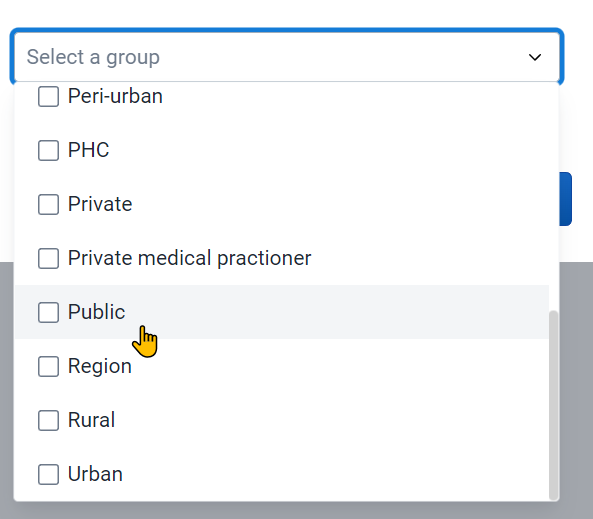

Select the “Public” organization unit group with Trainingland selected and **update **the table. DHIS2 will select all of the Public facilities within Trainingland.

***End Exercise 1***

### Exercise 2 - Table Layout, Options, Sorting and Saving

The layout will also persist on top of the table within the data visualizer app

The organization units are appearing in rows and what was selected for the ‘Data’ dimension appears for columns. The report filter defines the filtering criteria or scope and in this case it’s the period. You can hover over each of the icons in the layout in order to see what has been selected as options for each item

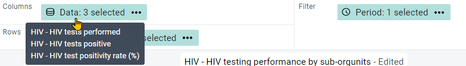

Alter the layout so it appears as below.

Click on **update**

The updated table will look like this.

The Data and Periods are both appearing as columns.

#### Table Options

Select only “HIV - HIV tests performed” for the Data dimension.

Click on options. 

**From the “Data” tab**

* Add the column and row totals
* Hide empty rows
* Hide empty columns

**From the “Style” tab**
* Modify the table title/font size

**Update** the table and review how the changes have affected the table

#### Sorting

Click on the column header for one of the months to show how you can sort the table.

#### Saving

Now, let’s save the table!

Please use the convention (Username - Program: What - Where - When; for example SND_HIV - HIV tests performed - Public Facilities - Last 6 months). **Note that username is only for the academy to keep the name unique, in production systems you should not need to use your username as a prefix as you can easily filter out the saved items that you have made.**

***End Exercise 2***

### Exercise 3 - Disaggregations / Group Sets

Review the additional dimensions present in the pivot table for this instance. This is closely tied to how DHIS2 is configured and will be different for every implementation.

Note that there is a mix of categories (data disaggregation), organization unit group sets and data element group sets. Unfortunately there are no clear icons that differentiate them. There are however green dots besides the name of some of these dimensions. This means the selected data item will be compatible with those data dimensions at minimum. It does have some difficulty identifying categories correctly; however does work correctly with org unit groups. We will focus on using categories and organization unit group sets to analyze our data in this example.

#### Add in the sex dimension

Note that this requires being familiar with the disaggregation that is linked to the data element. You can show them how to do this relatively easily by having the HIV data set open in data entry.

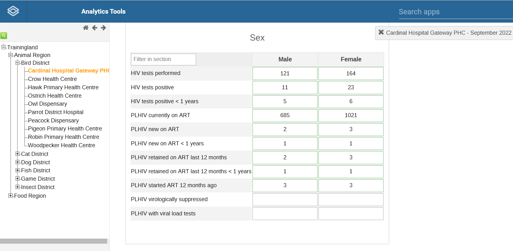

Let’s update the table with the following criteria.

* Data: HIV tests performed
* Periods: Last 5 years
* Organization unit: Bird District, Level: facility
* Table options : Hide empty columns, Hide empty columns, show row totals, show column totals
* Add the sex disaggregation as an additional dimension.

Click on update to see the following table

#### Add in PHC, Dispensary and Health Centre from the Type dimension

Alter the table layout as follows.

Ensure the “Hide empty columns" option is selected.

Update the table

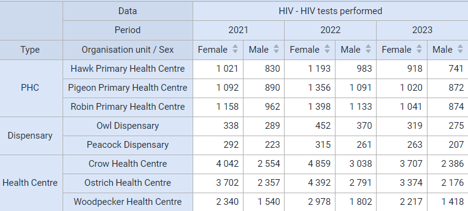

***End Exercise 3***

### Exercise 4 - Additional Table Options

#### Row/Column Totals/Subtotals

Open the options and check show column subtotals in options within the “Data” tab

Click **Update** and you should see the table like below.

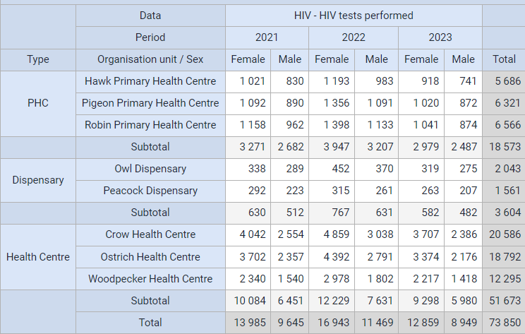

For each facility type you will have subtotals available. This shows you, by sex, the total number of HIV tests performed within a particular period for that facility type.

#### Show Hierarchy

Sometimes it is worthwhile to have the entire hierarchy displayed in the table rather than displaying just the name of the facility. This may become useful when you are demonstrating outputs at regional or national level where the audience may not be familiar with facility names.

Click on options, navigate to the “Style” tab and select show hierarchy

Click **update**. This will give you the following output.

The entire organisation unit hierarchy is now visible up to facility level.

***End Exercise 4***

### Exercise 5 - Download Data

Select Download and choose a format that you want to download the data in.

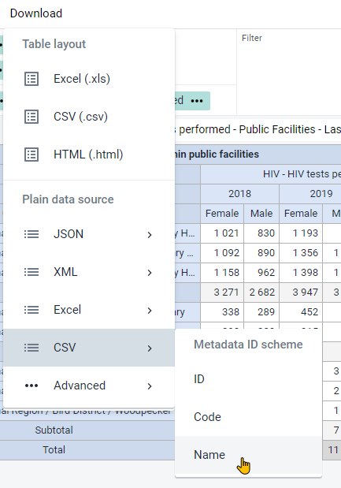

Plain data source is useful as it can be used to further analyze the data using statistical software such as SPSS, STATA or R. You can also open it in Excel and use pivot tables etc. to further review the data

***End Exercise 5***

### Exercise 6 - Demonstrate Number Type, Measure Criteria, Sharing

#### Number Type 

Using your previous table, modify the options in the “Data” tab as follows.

* Number type: Percentage of column
* Remove the “row totals”

Click on ‘Update’

This will display values as percentages of the column total (instead of summing the aggregated value). Also, as you are showing the percentages of the column, the row totals would not make sense in this scenario.

We can see that HIV tests performed have been arranged per year with a percentage contribution of each facility type. We can see that health centers have performed the largest % of tests when reviewing this table, which can provide us some information on where the majority of testing burden lies.

#### Filtering the Table

It is sometimes useful to filter data visualized in a pivot table based on a value range defined by a minimum and/or maximum value. This could be achieved by filtering the table using the “Limit Values” option. This will filter the data requested based on the criteria defined.

* Open up the previously saved favorite item ‘yourusername_HIV - HIV tests performed - Public Facilities - Last 6 months (you may see different periods of data depending on the current period)’.

* Click on the options button, followed by the “Limit values” tab. Let’s define criteria to visualize only values between 500 and 4000.

* Click ‘update’ and you will see the table below which only shows values >= 500 and &lt;=4000. 
* Change the options to “Hide empty rows” within the “Data” tab to clean up the table

The table should show you monthly values from only between 500 and 4000

#### **Share** Saved Item

Saved items designed in Pivot Tables can be shared with users/user groups.

Open up the previously saved favorite item ‘yourusername_HIV - HIV tests performed - Public Facilities - Last 6 months’ and Select File - Share

This will bring up the sharing dialog and allow you to share your pivot table

Share the table with the user group “HIV access.” Provide them with “Can view only” access. This means that they can see the table but can not edit or modify it.

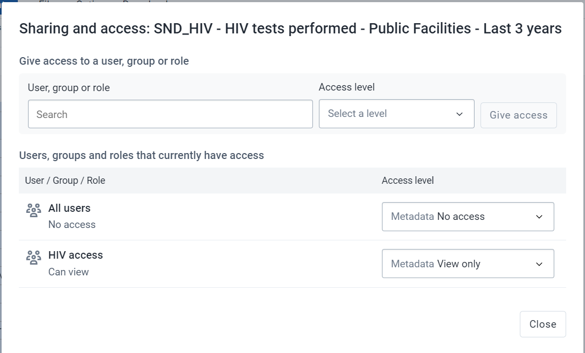

***End Exercise 6***

### Exercise 7 - Working with Legends, Drilling Down

#### Legends

Legends provide a colorful visualization to tables, allowing for a quick and meaningful understanding of the table.

Create a new pivot table with following criteria.

* Data: Coverage indicators (BCG, DPT-HepB-Hib3, OPV3)
* Period: last year
* Org Unit: Trainingland by district

Layout should be as follows

**Update** the table to see the following output:

The table output doesn’t look very different from anything we have already reviewed.

Results could be easily understood if we could add a visual cue to the output table. We can use legends to achieve this.

* Add in the legend set EPI Coverage (70-80-90%); use the style background color

This is what the current EPI Coverage legend represents. 

* Red is the lowest performance at 0 - 70
* Yellow is getting better, 70 - 80
* Light green is good performance, 80 - 90
* Dark green is the target coverage, 90 – 100

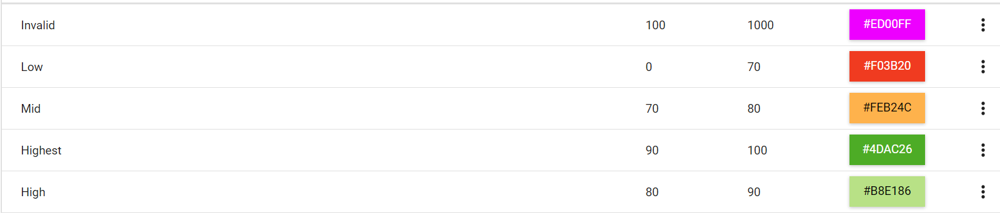

To apply the legend, open the table options and navigate to the “Legend” tab.

Then

1. Select Use legend for chart colors
2. Choose from the legend style, in this case we will choose “Legend changes background color”
3. Choose from the Legend type, in this case we will “Select a single legend for the entire visualization.” This allows you to select a legend that has already been configured
    1. You can use the “Use predefined legend per data item” if your data element or option set has a legend associated with it. This can be done within maintenance when you manage your indicator or data element.
4. Select the “EPI coverage” legend 
5. Select “show legend key”
6. Select **Update**

The updated table:

You will notice the legend key on the right side of the table.

You can sort the table before proceeding. After you sort it, we can see districts with low coverage are both sorted on the bottom of the list and have the dark red color associated with it. As the districts increase in coverage, their spot on the list increases and the color associated with the data value is also changing in line with the definitions of our legend. These types of tables are easier to interpret as there are multiple visual cues (the order, the color, the data value itself) that allows us to understand what the table itself is representing.

#### Drill Down

* Left click on a cell of Bird District to bring up the drill down/up function. Refer to the screenshot below.

  
Explain that this allows you to dive into more detail directly via the pivot table. Note that you can still use the org unit/period selections on the left-hand menu to drill up and down if that is your preference. This method however allows a bit more interactivity within the table itself.

You will see following table when drilled-down

How can you interpret the above table?

We can observe that all of the facilities are having issues with their immunization coverage indicators, contributing to the low district totals observed in the previous table. Parrot district hospital does not have any data values and is therefore not contributing to the district total. 

***End Exercise 7***

### Exercise 8 - Freeze rows/columns

When you have large amounts of data, it may be useful to lock the first row and column similar to excel. 

Open the saved table “HIV - HIV testing performance by facility, last 3 years”

Scroll up and down on this table, you will see the columns and rows disappear.

Open the table options, navigate to style and select 

* fix column headers to top of table
* fix row headers to left of table
  
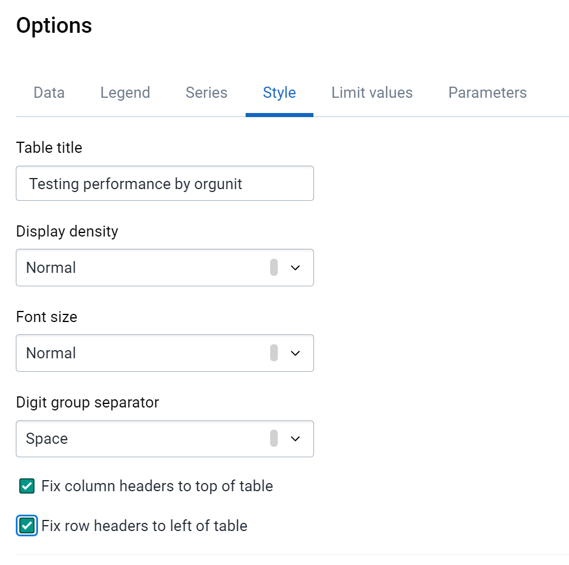

Proceed to scroll left/right and up/down you will note these headers are now locked

***End Exercise 8***

### Part 9 - Last Value Aggregation Type

#### Last Value Aggregation Type

The last value aggregation type is a special value type which takes the last value that has been entered at a specific level and displays it within the analysis apps. This is useful if, for example, you are entering a number which represents the current number of people on treatment from period to period. For example, in November 2020 you could have 100 people on treatment, in December 2020 you could have 87. If you want to know the amount of people currently on treatment within the year, you are looking for the value of 87. By default, DHIS2 would have aggregated these values (87+100+values for other months in 2020); however this is not what we want, we only want the most recent value that has been entered. 

As an example, let us review our data entry page for HIV

Here, PLHIV currently on ART in February 2021 is 721+1036 =1757

In March 2021, this changes to 690+1034 = 1724

If I were interested in the number of PLHIV currently on ART for MARCH, I would want the value only from March, I would not want the sum of January + February + March.

In pivot tables, let us apply this across the last 12 months. Here I would want the most recent value that has been entered for PLHIV currently on ART and not a sum of the last 12 months. We can do this in 2 ways:

1. We set the data element to aggregate using the last value type in maintenance
2. We can modify the way the data element aggregates in the pivot table options. This can be useful to move between aggregation methods for a particular data element depending on the output you require.

Let us look at an example by creating a new pivot table/

* Data: HIV - PLHIV currently on ART (Data Element within the **HIV **group)
* Periods: Last 12 months
* Organisation Units: Health Centre Group in Animal Region

The data element PLHIV currently on ART is currently set to aggregate using the “average (sum in org unit hierarchy)” function in maintenance. This causes the average of the values from the last 12 months to be displayed in this particular table. 

If we change this to aggregate via last value, it will select the last value that was entered during that 12 month period that has been filtered and place it in the output of the table. To aggregate values this way, open table options and set the aggregation type to “last value” within the “Data” tab. 

Note that you can set your value to aggregate any way you would like here if you want to modify the output using the default method of aggregating the data element and we are using last value to demonstrate this feature.

This gives us a better indication of who is on ART at the end of the point in time we have selected. In this case, using the last 12 months, we will get the number currently on ART at the end of the last 12 month period we have selected. 

Select **Update** to update the table and review the returned result

