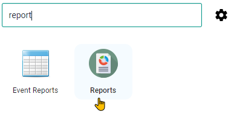
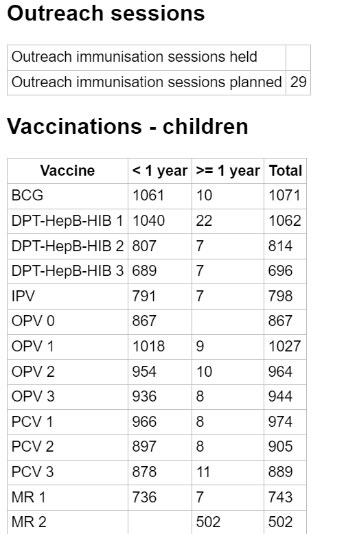
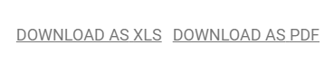
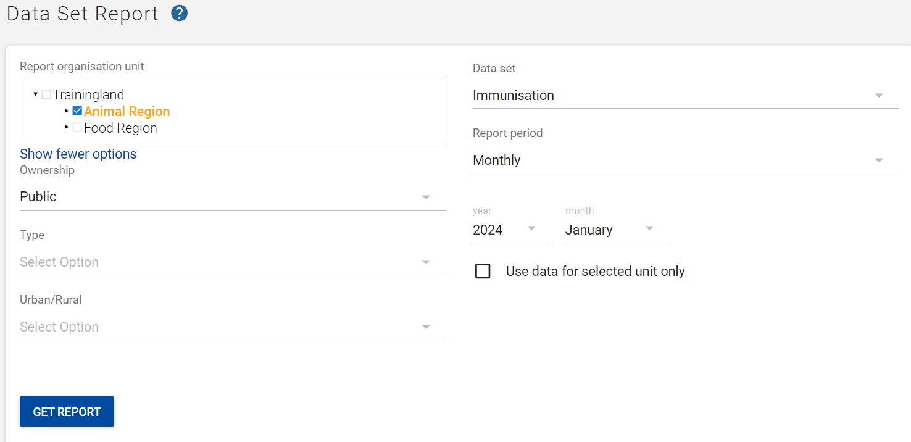
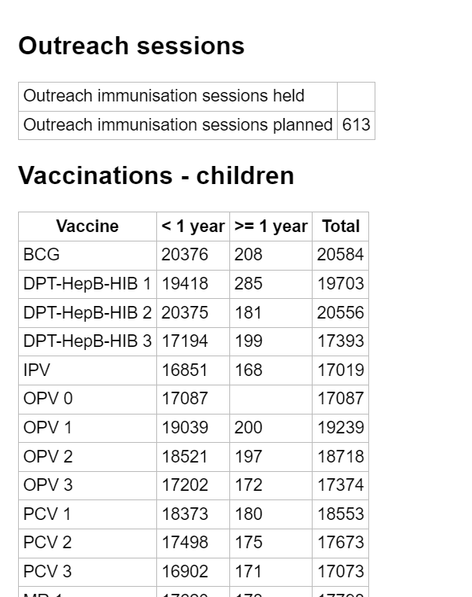
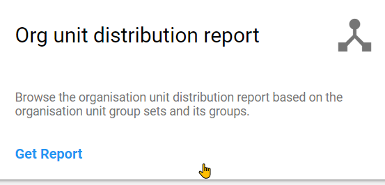
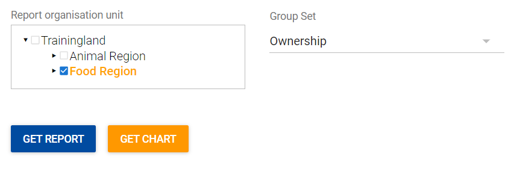
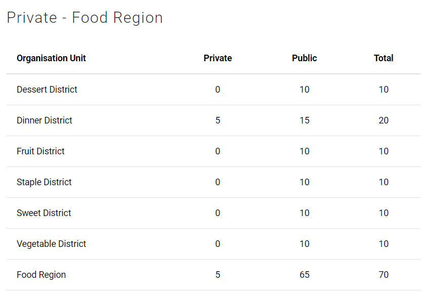
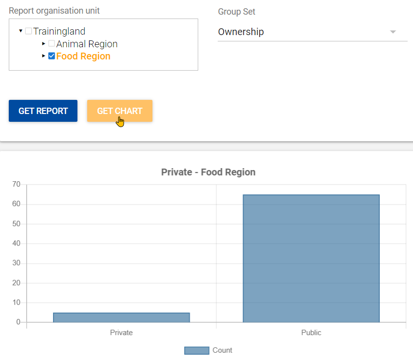

# Learner’s Guide to Reports

## What is this guide?

This guide contains all exercises and detailed steps to perform them related to the use of the reports app for the Analytics Tools Level 1 academy. Please perform each of the exercises when prompted to by your instructors.

## Learning objectives for this session

1. Create a data set report
2. Create a reporting rate summary
3. Describe how reporting rates can be viewed in other applications
4. Create an organisation unit distribution report
5. Describe how resources can be uploaded

## Time needed for this session

Live demo: 2 demos, ~ 20 mins each

Hands-on exercises: 5 exercises, 5-15 mins each

## Table of Contents/Quick Guide

- [Learner’s Guide to Reports](#learners-guide-to-reports)
  - [What is this guide?](#what-is-this-guide)
  - [Learning objectives for this session](#learning-objectives-for-this-session)
  - [Time needed for this session](#time-needed-for-this-session)
  - [Table of Contents/Quick Guide](#table-of-contentsquick-guide)
  - [Exercises](#exercises)
  - [Exercise 1 - Data Set Report](#exercise-1---data-set-report)
    - [Access the reports app](#access-the-reports-app)
    - [Review the reports app](#review-the-reports-app)
    - [Open the data set report module](#open-the-data-set-report-module)
    - [Run the data set report](#run-the-data-set-report)
    - [Review the data set report](#review-the-data-set-report)
    - [Review download options](#review-download-options)
  - [Exercise 2 - Run a data set report within an orgunit group](#exercise-2---run-a-data-set-report-within-an-orgunit-group)
    - [Select an orgunit group in addition to the other inputs for the report](#select-an-orgunit-group-in-addition-to-the-other-inputs-for-the-report)
    - [Review the data set report](#review-the-data-set-report-1)
  - [Exercise 3 - Reporting Rate Summary](#exercise-3---reporting-rate-summary)
    - [Select the Reporting Rate Summary module from within the reports app](#select-the-reporting-rate-summary-module-from-within-the-reports-app)
    - [Reviewing the reporting rate summary concept](#reviewing-the-reporting-rate-summary-concept)
    - [Run the reporting rate summary](#run-the-reporting-rate-summary)
    - [Review the reporting rate summary](#review-the-reporting-rate-summary)
    - [Review download options](#review-download-options-1)
  - [Exercise 4 - Reporting Rates in Other Tools](#exercise-4---reporting-rates-in-other-tools)
    - [Open the chart “EPI - Completeness - 2022 months” in Data Visualizer](#open-the-chart-epi---completeness---2022-months-in-data-visualizer)
    - [Edit the data selection](#edit-the-data-selection)
  - [Exercise 5 - Org Unit Distribution](#exercise-5---org-unit-distribution)
    - [Select the “Org Unit Distribution report” module from within the reports app](#select-the-org-unit-distribution-report-module-from-within-the-reports-app)
    - [Review the org unit distribution report](#review-the-org-unit-distribution-report)
    - [Run the org unit distribution report](#run-the-org-unit-distribution-report)
    - [Review the org unit distribution report](#review-the-org-unit-distribution-report-1)
    - [Review download options](#review-download-options-2)
    - [Run the report again by selecting “Get Chart”](#run-the-report-again-by-selecting-get-chart)

## Exercises

## Exercise 1 - Data Set Report

### Access the reports app

Apps -> Reports

### Review the reports app

The modules that are available here are described in this presentation: 

### Open the data set report module

This is an example of a data set report from the Immunization data set.

### Run the data set report

Select inputs for the Org unit, Data Set and Period. In this example, the data set report is being run using the following:

* Org Unit : Bird District
* Data Set : Immunisation
* Report period : Monthly, Year: 2022, Month: October

After selecting your inputs, select “Get report”

### Review the data set report

Review the report with the group. Note that this is an output of the data set exactly as it appears in data entry. Depending on your outputs, it may have aggregated values from various org units and time periods and placed them into the data set for review.

### Review download options

You are able to download the data set report as either an excel or PDF file

## Exercise 2 - Run a data set report within an orgunit group

Create another data set report. This time select the “Show more options” button to show available org unit group sets.

After selecting “Show more options” you will see the available org unit group sets 

### Select an orgunit group in addition to the other inputs for the report

Select inputs for the Org unit, Data Set and Period. In this example, the data set report is being run using the following:

* Org Unit : Animal Region
* Data Set : Immunisation
* Report period : Monthly, Year: 2022, Month: October

In addition, the “Public” Org unit group has been selected from the “Ownership” group set. Select “Get report” in order to retrieve the report.

### Review the data set report

The data set report is the same as before, however now it has filtered out the aggregation. Only data from public facilities has been included in the data set report.

## Exercise 3 - Reporting Rate Summary

### Select the Reporting Rate Summary module from within the reports app

OR

### Reviewing the reporting rate summary concept

This is available within the accompanying slides if you require additional review. Reporting rate summary allows you ro check the system-defined completeness and timeliness for one period of any aggregate data set in the system. There are several drawbacks to the reporting rates as calculated by DHIS2, but may often be used as a best estimate in a number of circumstances. 

This is an example summary from the Immunisation data set.

### Run the reporting rate summary

Select inputs for the Org unit, Data Set and Period. In this example, the reporting rate summary is being run using the following:

* Org Unit : Dog District
* Data Set : Immunisation
* Report period : Yearly, Year: 2022

Note that, just like for data set reports you are also able to select “show more options” and select additional org unit group filters if you need to. In this example, none have been selected but the same principles as data set reports would apply. 

After selecting your inputs, select “Get report”

### Review the reporting rate summary

Review the report with the group and explain the outputs. 

### Review download options

You are able to download the data set report as either an excel or PDF file

## Exercise 4 - Reporting Rates in Other Tools

The reporting rate summary is a very user-friendly tool; however one critical disadvantage of the reporting summary is that only one period can be viewed at a time. In addition, the report rate summary does not respect the organisation unit “closing date;” this may cause a problem if you have permanently closed a facility but the data set you are reviewing is still assigned to that facility. 

We can also review reporting rates in charts, tables or maps and even combine them with other data by using combination charts. 

### Open the chart “EPI - Completeness - 2022 months” in Data Visualizer

Here we can see that we review completeness over many periods. 

### Edit the data selection

If we open the data tab and select “Data sets” you will be able to see the various metrics associated with data set reporting rates. 

Add in the reporting rate “HIV Monthly Reporting rate” as an example. 

Select Update to review the chart. Another advantage when using these apps is that you can view reporting rates not only across multiple periods, but also across multiple data sets at the same time.

## Exercise 5 - Org Unit Distribution

### Select the “Org Unit Distribution report” module from within the reports app

OR

### Review the org unit distribution report

This is available within the accompanying slides if you need to review it. This report allows you to review the number of organisation units that belong to an organisation unit group. It is a good tool to verify this count is correct and to determine if you can use these groups in indicator values and expect the correct result. 

This is an example from the Ownership group set.

### Run the org unit distribution report

Select inputs for the Org unit and Org unit Group Set. In this example, the org unit dist. report  is being run using the following:

* Org Unit : Food Region
* Group Set : Ownership

After selecting your inputs, select “Get report”

### Review the org unit distribution report

Review the report and explain the outputs.

### Review download options

You are able to download the data set report as either an excel or PDF file

### Run the report again by selecting “Get Chart”

You can also output org unit distribution via chart options; we can see that it is not nearly as detailed however as a breakdown by the child orgunits is not available in this view.

