# Learner’s Guide to Validation Rules (Config)

***PERFORM THIS EXERCISE ON THE CONFIGURATION SYSTEM***

## What is this guide?

This guide contains 3 exercises and detailed steps to perform them related to the use of configuring validation rules for the Analytics Tools Level 1 academy. Please perform each of the exercises when prompted by your instructors.

## Learning objectives for this session

1. Define a validation rule after reviewing a data set
2. Create a validation rule to measure internal consistency
3. Create a validation rule measuring against a generated threshold

## Time needed for this session

Live demo: 3 demos, ~ 30 mins each

Hands-on exercises: 3 exercises, ~ 30 mins each

## Background on this topic/module

Validation rules are an excellent tool that can be used to measure a number of consistency measures within a DHIS2 system. As an example, they can be used to manage internal consistency by comparing two or more data items collected during the same process (for example, 2 malaria data items collected at the same time) as well as measuring external consistency by measuring values collected using different mechanisms (for example, data collected via a DHIS2 dataset along with data imported into DHIS2 from a survey).

Thes rules can be run directly in data entry - recommended if measuring internal consistency - as well as through a batch operation called validation analysis. In this session, you will review how to configure these rules in DHIS2.

## Table of Contents/Quick Guide

- [Learner’s Guide to Validation Rules (Config)](#learners-guide-to-validation-rules-config)
  - [What is this guide?](#what-is-this-guide)
  - [Learning objectives for this session](#learning-objectives-for-this-session)
  - [Time needed for this session](#time-needed-for-this-session)
  - [Background on this topic/module](#background-on-this-topicmodule)
  - [Table of Contents/Quick Guide](#table-of-contentsquick-guide)
  - [Exercise 1 - Create a Validation Rule for HIV](#exercise-1---create-a-validation-rule-for-hiv)
    - [Review the data entry page and decide on a logical validation rule to create](#review-the-data-entry-page-and-decide-on-a-logical-validation-rule-to-create)
    - [Create the validation rule HIV tests positive \<= HIV tests performed](#create-the-validation-rule-hiv-tests-positive--hiv-tests-performed)
      - [Open and explain the Left Side Expression](#open-and-explain-the-left-side-expression)
      - [Select the Operator](#select-the-operator)
      - [Open the Right Side Expression](#open-the-right-side-expression)
    - [Create a Validation Rule Group](#create-a-validation-rule-group)
    - [Test the rule in validation rule analysis within the Data Quality App](#test-the-rule-in-validation-rule-analysis-within-the-data-quality-app)
    - [End Exercise 1](#end-exercise-1)
  - [Activity 2 - Create Validation Rule #2 for stock](#activity-2---create-validation-rule-2-for-stock)
    - [Review the data entry page and decide on a logical validation rule to create](#review-the-data-entry-page-and-decide-on-a-logical-validation-rule-to-create-1)
    - [Create the validation rule DPT-HepB-Hib doses given \<= Total Used DPT-HepB-Hip doses](#create-the-validation-rule-dpt-hepb-hib-doses-given--total-used-dpt-hepb-hip-doses)
      - [Open and explain the Left Side Expression](#open-and-explain-the-left-side-expression-1)
      - [Select the Operator](#select-the-operator-1)
      - [Open the Right Side Expression](#open-the-right-side-expression-1)
      - [Save the Rule when finished](#save-the-rule-when-finished)
    - [Create a Validation Rule Group](#create-a-validation-rule-group-1)
    - [Test the rule in validation rule analysis within the Data Quality App](#test-the-rule-in-validation-rule-analysis-within-the-data-quality-app-1)
    - [End Activity 2](#end-activity-2)
  - [\[OPTIONAL\] Activity 3 - Create a validation rule #3 using the DPT-HepB-Hib 2 threshold](#optional-activity-3---create-a-validation-rule-3-using-the-dpt-hepb-hib-2-threshold)
      - [Note: A Predictor is used to calculate the threshold value; this will not be covered in this academy](#note-a-predictor-is-used-to-calculate-the-threshold-value-this-will-not-be-covered-in-this-academy)
    - [Create the validation rule \[DPT-HepB-Hib 2 administered \<= DPT-HepB-Hib 2 dose threshold \]](#create-the-validation-rule-dpt-hepb-hib-2-administered--dpt-hepb-hib-2-dose-threshold-)
      - [Open the Left Side Expression](#open-the-left-side-expression)
      - [Select the Operator](#select-the-operator-2)
      - [Open the Right Side Expression](#open-the-right-side-expression-2)
      - [Save the Rule when finished](#save-the-rule-when-finished-1)
    - [Create a Validation Rule Group](#create-a-validation-rule-group-2)
    - [Test the validation rule in validation analysis within the Data Quality app](#test-the-validation-rule-in-validation-analysis-within-the-data-quality-app)
    - [End Activity 3](#end-activity-3)

## Exercise 1 - Create a Validation Rule for HIV

**Example 1 from HIV Monthly Form**

### Review the data entry page and decide on a logical validation rule to create

We can use the following HIV dataset at the **Facility** level

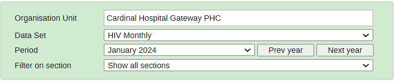

Let’s create a rule in which HIV tests positive are less than or equal to HIV tests performed

### Create the validation rule HIV tests positive &lt;= HIV tests performed

Navigate to the maintenance application in DHIS2 and select the “Validation” tab 

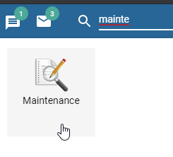

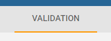

Create a new rule by selecting the “+” icon underneath validation rule

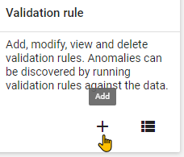

Review the fields that will be used to describe the rule. Use your initials to create the rule. **[Note: this is only for practice purposes, you would not use initials in a real life scenario]**

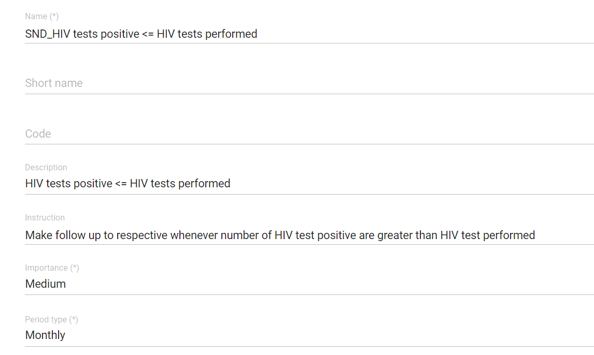

Here is the description and instruction

HIV tests positive should be less than or the same as HIV tests performed, if not make follow ups to respective facility

Describe the importance and period type as it relates to the validation rule before proceeding.

#### Open and explain the Left Side Expression

Open the left side expression and explain what you are intending to do. The rule you are creating is total HIV tests positive between male and female hence for the left side, select the (HIV tests positive Male + HIV tests positive Female)

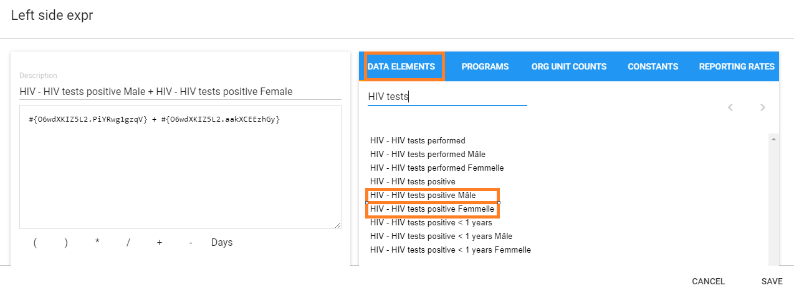

>**Note:**
>
>It is recommended to use the disaggregated data elements instead of the total data element as shown in the figure above e.g. HIV tests positive Male + HIV tests positive Female. This is because during validation rule analysis, when looking at the details, if the total data element was selected the details will be empty and you will not be able to drill down to identify where the problem originates from.

Select “Save” once the left side has been selected.

#### Select the Operator

It is “Less than or equal to” in this case, hence select the Less than or equal to operator.

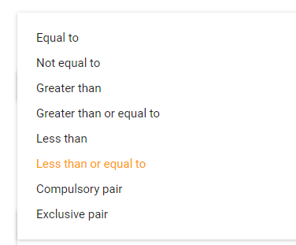

#### Open the Right Side Expression

You will need to do the following for the right side expression:

HIV tests performed Male + HIV tests performed Female,

Create this expression, explaining what you are doing during each step of the way

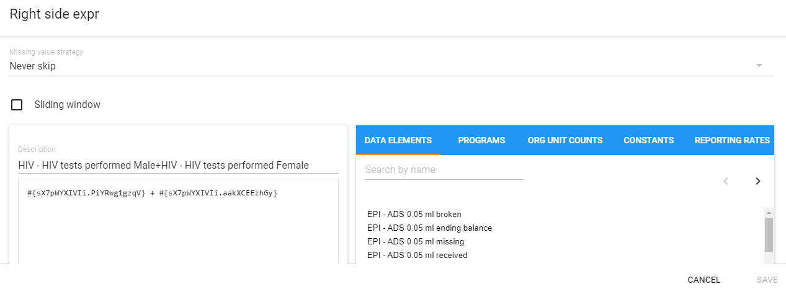

Click on “Save” when the expression is complete.

### Create a Validation Rule Group

Go to Maintenance> Validation> Validation Group

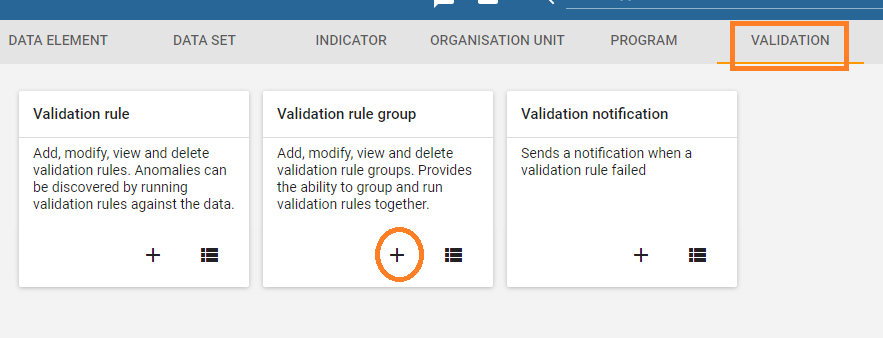

Click the add button and fill in the details of the validation group. Use your initials to create the validation rule group.

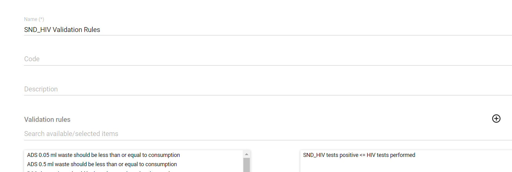

Place the validation rule you have created into the group and select “Save”

### Test the rule in validation rule analysis within the Data Quality App

Navigate to the Data Quality app

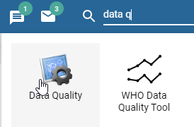

Select “Run validation”

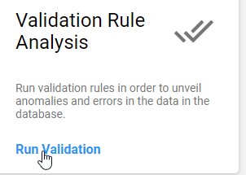

Select the following inputs:

* **Date : January 1 2023 - April 1 , 2023**
* **Rule Group : The group you have just made**
* **Parent Organisation unit : Animal Region**

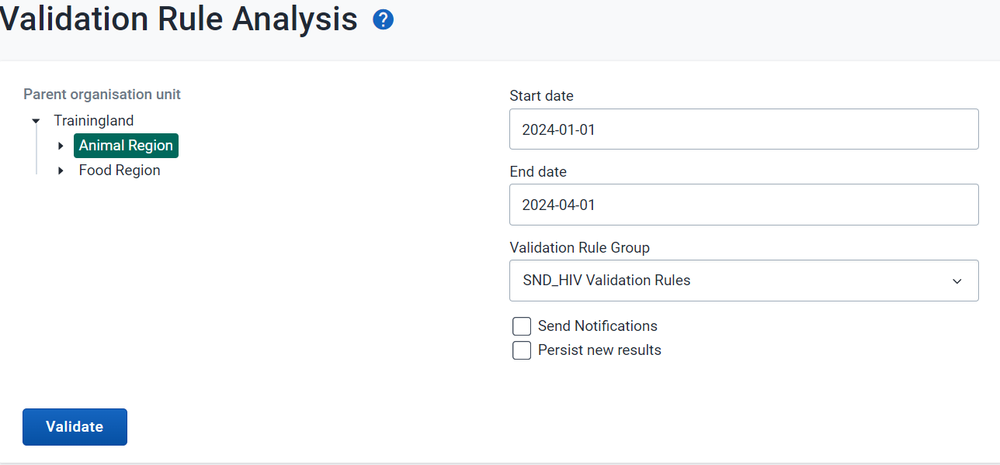

You should see the below violations

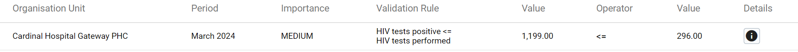

Did it work for you?

### End Exercise 1

## Activity 2 - Create Validation Rule #2 for stock

### Review the data entry page and decide on a logical validation rule to create

We can use the following dataset at the **Facility **level

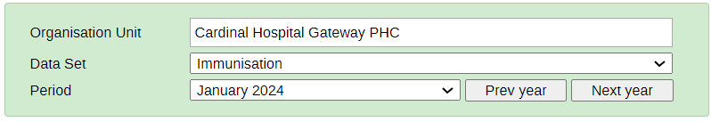

Let’s create a rule in which DPT-HepB-Hib doses given are less than or equal to Total DPT-HepB-Hib doses used and wasted.

**Note:**

Total used= **(Starting balance + Received)** - **(VVM + Frozen + Expired + Broken + Missing + Ending balance)**

### Create the validation rule DPT-HepB-Hib doses given &lt;= Total Used DPT-HepB-Hip doses

Navigate to the maintenance application in DHIS2 and select the “Validation” tab 

Create a new rule by selecting the “+” icon underneath validation rule

Review the fields that will be used to describe the rule. Use your initials to create the rule **[Note: this is only for practice purposes, you would not use initials in a real life scenario]**

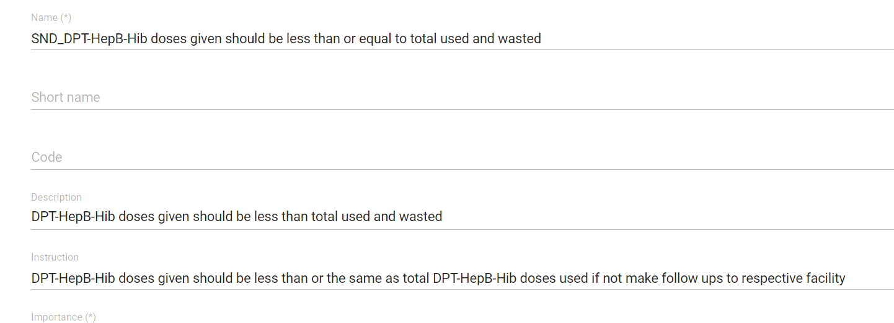

Here is the description and instruction

DPT-HepB-Hib doses given should be less than or the same as total DPT-HepB-Hib doses used and

DPT-HepB-Hib doses given should be less than or the same as total DPT-HepB-Hib doses used if not make follow ups to respective facility

Describe the importance and period type as it relates to the validation rule before proceeding.

#### Open and explain the Left Side Expression

Open the left side expression. The rule you are creating is total DPT-HepB-Hib doses given which comprises dose 1 to 3; for the left side, select the (DPT-HepB-HIB 1 doses given + DPT-HepB-HIB 2 doses given + DPT-HepB-HIB 3 doses given)

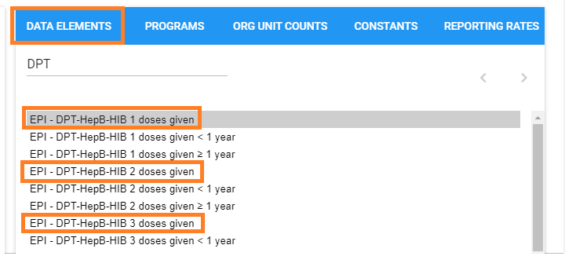

Add a description to the left side to clearly state what does the computed items mean

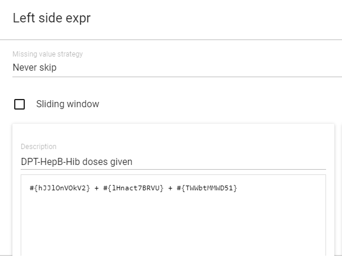

Select “Save” once the left side has been selected.

#### Select the Operator

It is “Less than or equal to” in this case, hence select the Less than or equal to operator.

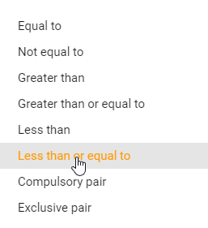

#### Open the Right Side Expression

You will need to do the following for the right side expression:

DPT-HepB-HIB doses used = (DPT-HepB-HIB doses starting balance + DPT-HepB-HIB doses received) - (DPT-HepB-HIB doses VVM + DPT-HepB-HIB doses frozen + DPT-HepB-HIB doses expired + DPT-HepB-HIB doses broken + DPT-HepB-HIB doses missing + DPT-HepB-HIB doses ending balance)

Create this expression, with reference to the definition of **Total Used stated above**

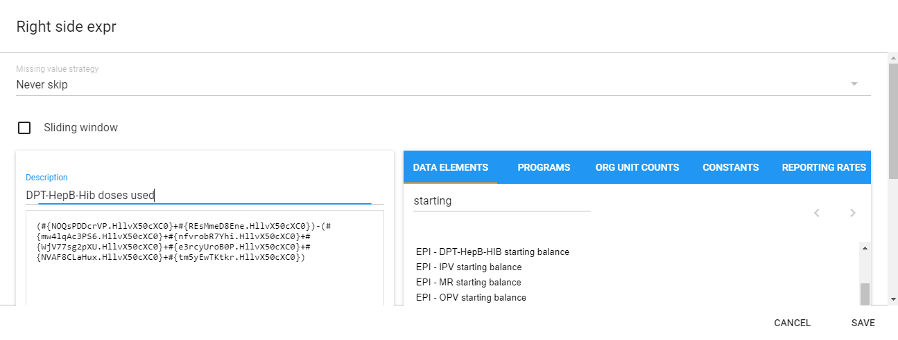

Click on “Save” when the expression is complete.

#### Save the Rule when finished

### Create a Validation Rule Group

Go to Maintenance> Validation> Validation Group

Click the add button and fill in the details of the validation group

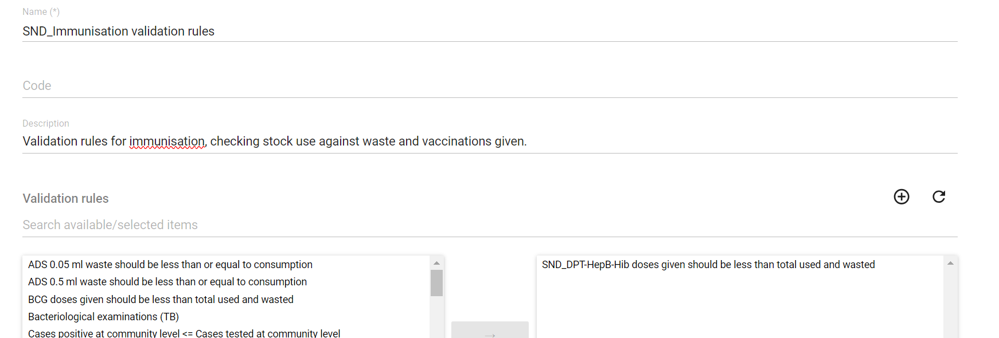

Place the validation rule you have created into the group and select “Save”

### Test the rule in validation rule analysis within the Data Quality App

Navigate to the Data Quality app

Select “Run validation”

Select the following inputs:

* **Date : January 1, 2023 - April 1, 2023**
* **Rule Group : The group you have just made**
* **Parent Organisation unit : Dog District**

You should see the below violations

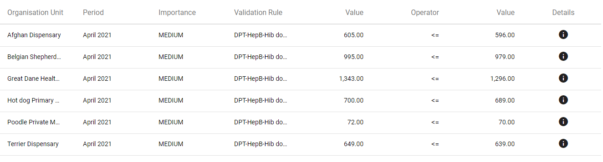

Did it work for you?

### End Activity 2

## [OPTIONAL] Activity 3 - Create a validation rule #3 using the DPT-HepB-Hib 2 threshold

***Note: this is an optional exercise and may not be covered by your instructor. You can perform this exercise if you want to have additional practice outside of the academy timeframe.***

In this example, a rule will be created in which we compare an entered value to a calculated threshold. The steps to create the rule are very similar to the other examples.

#### Note: A Predictor is used to calculate the threshold value; this will not be covered in this academy

### Create the validation rule [DPT-HepB-Hib 2 administered &lt;= DPT-HepB-Hib 2 dose threshold ]

>Review and understand the fields that will be used to create the rule. 
As mentioned above the data element used for the threshold is a computed variable generated from a predictor, a concept that is not covered in this academy. It has already been configured and available within the list of data elements; in practice you would also need to make this yourself if not already available.

Use your initials to create the rule.

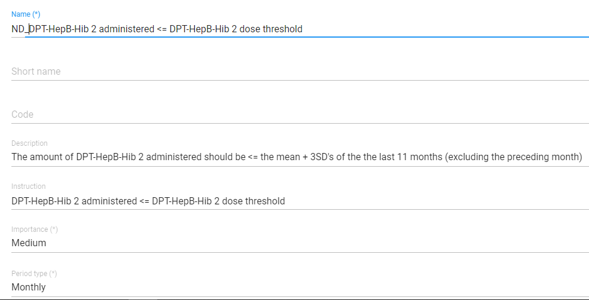

#### Open the Left Side Expression

Open the left side expression and add the required data element. You are trying to create the rule comparing the amount of DPT-HepB-Hib 2 dose with a calculated threshold. Select the data element “EPI - DPT-HepB-Hib 2 doses given Female and EPI - DPT-HepB-Hib 2 doses given Male” for the left side.

Select “Save” once the left side has been selected.

#### Select the Operator

It is “less than or equal to” in this case. Explain why this is.

#### Open the Right Side Expression

Select the data element “EPI - DPT-HepB-Hib 2 doses given threshold” for the right side.

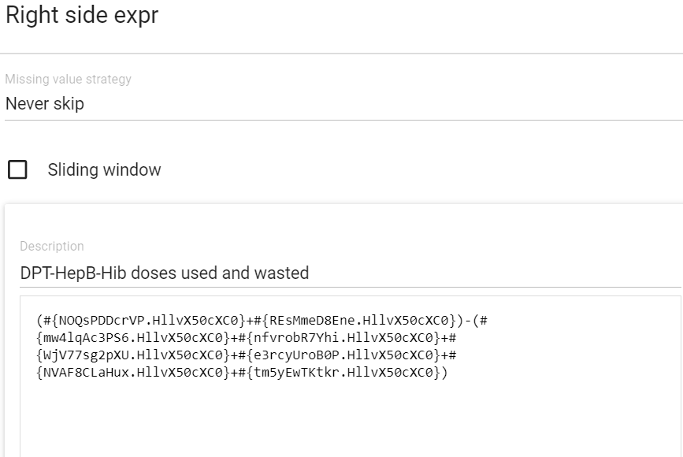

Click on “Save” when the expression is complete.

#### Save the Rule when finished

### Create a Validation Rule Group

Place the validation rule you have created into the group and select “Save.” Use your initials to create the group.

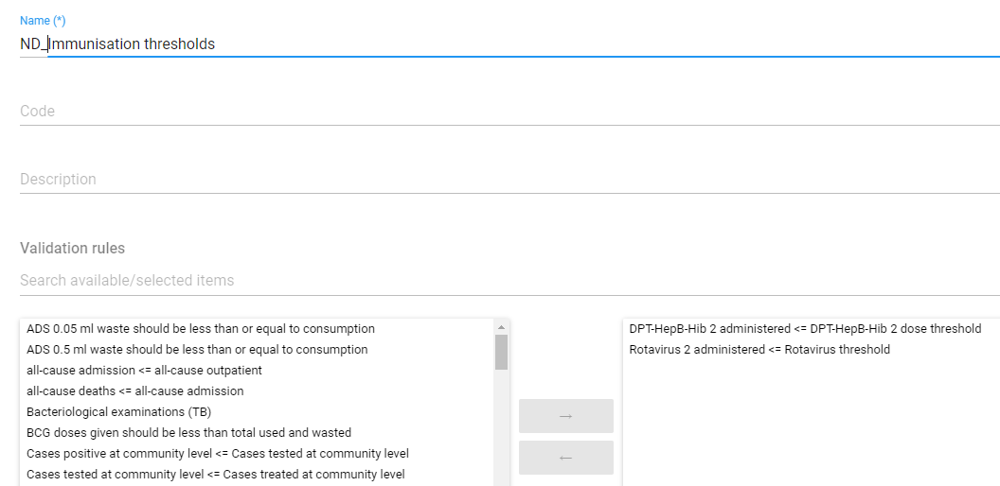

### Test the validation rule in validation analysis within the Data Quality app

Navigate to the data quality app

Select “Run validation”

Select the following inputs:

* **Date : January 1 2023 - April 1, 2023**
* **Rule Group : The group you have just made**
* **Parent Organisation unit : Dog District**
* 
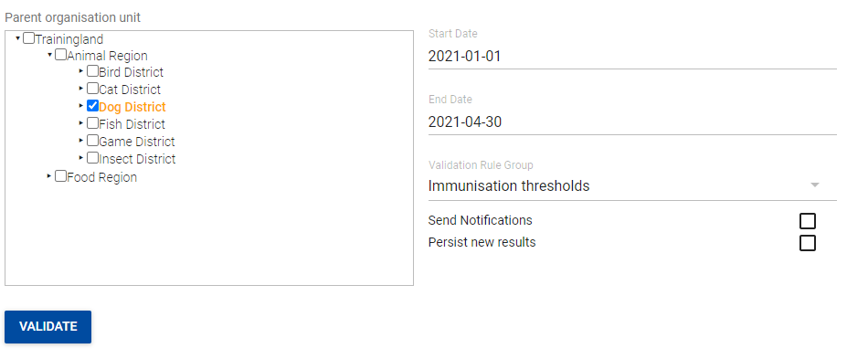

You should see the violations. Does it work for you?

### End Activity 3
