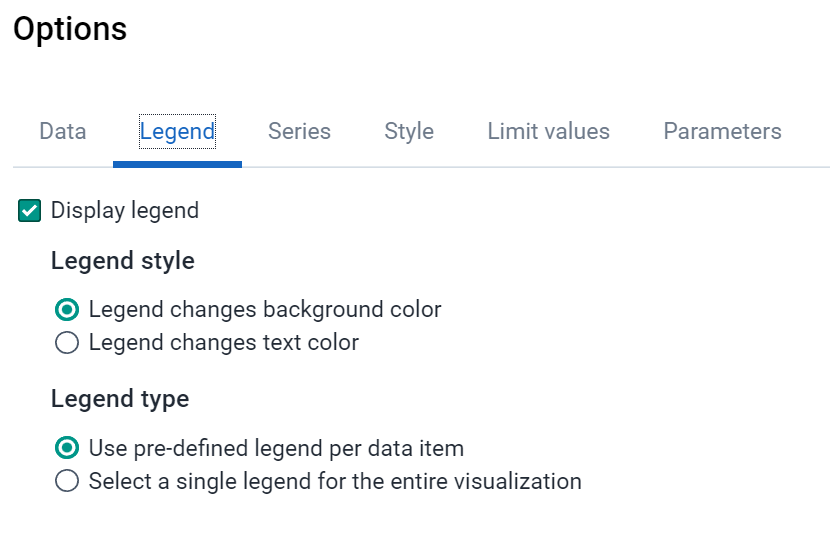
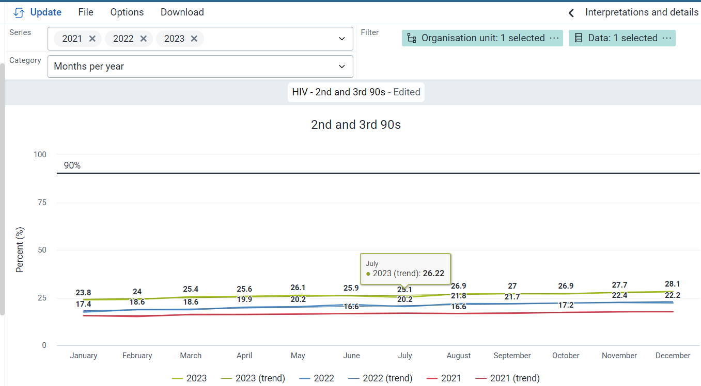

# Trainer’s Guide to Analytics Demo

The demo starts as a national HIV coordinator. You want to figure out where to prioritize support and supervision next quarter. 

## **Dashboard**

1. Open the HIV District (SNU2) Dashboard. Point out that there are many dashboards but this one will be the most important for your work. Mark it as a favorite and point out that now it appears at the front of the list of dashboards
 

2. Point out that there are charts, maps, and tables on this dashboard and ask “Ask where is this data representing?” Answer – Trainingland. 
Point out that this is the whole country. Ask, “Can I see any districts here?” 
Answer – No. 
 

3. Open the filter and select both animal and food regions.
 

Add in an additional period and select last 3 months 
 
    
The dashboard items will change accordingly. 

4. Point out the filters that are being applied at the top of the dashboard.
  

5. Note that on the “HIV Cascade” chart that Animal region has the most HIV test positives
  

6. Select the menu icon for “HIV cascade” and click on the “Show interpretations and details” option in the dashboard item menu. Point out that a description is provided that tells the viewer that is presented in this dashboard item. 
 

7. Add to the interpretation by starting with a mention. Write @ from the user selection popup select admin_district and finish the interpretation with “HIV – HIV tests positive seems unusually high this period. Have you performed data quality reviews for this information?”
 

8. Now on a new tab (or if you prefer in another browser as you will have to log back in as the original user) log in as the **admin_district (admin_district/District1#) **user and navigate to the messenger application and show that the district admin user received a notification that they were mentioned and a link to the chart where they were mentioned. Also note that a notification of being mentioned can be pushed out as an email.

    
 
 

When you are done log back in as the original user.

9. Scroll down to the HIV- ART performance by sub-orgunits. Ask what district has the lowest HIV-Ratio of new on ART to newly diagnosed” and sort that column to find the answer – Bird District
    

10. Now look at the map “HIV-ART retention rate (12 months) by user and sub-org units.” Toggle between a chart and a map. Point out that each gives you a different perspective to look at the data. On the chart layout ask, “What district has the highest ART retention rate?” – > Sweet District
 

11.  Open the “HIV-HIV testing performance by sub-org units” pivot table by selecting the open in data visualizer app button. 
 

## **Pivot Table**

1. In the HIV-HIV testing performance by org unit pivot table. 
2. Turn on the column totals 
 

3. Modify the org units to show facilities.
 

4. Apply the legend “HIV Test Positivity Rate” and point out that now we have made a simple scorecard.
 
 

5. Sort by positivity rate and notice that there are several facilities with no values. Ask, “Does this mean that they have not reported or they have reported zero.” – Could be both, but in this case it means they have not reported and it is because they are hospitals and do not report on this indicator.
 

6. Hide the empty rows since they are not needed
 
 

7. Save the table 

## **Charts**

1. Navigate back to the HIV District (SNU2) dashboard 
2. Open the HIV – 2nd and 3rd 90s Chart by clicking the open in data visualizer.
  

3. Point out that all indicators are performing below the target.
 
4. Say, “We want to look at the trends of these indicators over the last 12 months to see if any months were close to the target.”

5. Change the following:
    1. Periods to category 
    2. Data to series and change
    3. Org units to filter
    4. Chart type to a line chart.

    
    

6. Ask, “Did any months come close to the target?” – No
7. Ask, “Is the trend improving”
    

8. Turn on the linear trend lines (options - data tab - trend line - linear) and deselect the indicators in legend so only the trend lines are showing. 
    

9. Ask again, “Is the trend improving” – some are improving (only slightly) while others are not. 
10. Say, “For better trend analysis we will do a year on year chart for HIV-Ratio of new on ART to newly diagnosed (%)”
11. Remove all indicators except “HIV-Ratio of new on ART to newly diagnosed (%)” from “Data” dimension
12. Change the chart to year over year (line) and select 2021, 2020 and 2019 in the series 
   

13. Ask again “Is the trend improving” – slightly, but not significant 
14.  Save the chart as “HIV-Ratio of new on ART to newly diagnosed (%) Year over Year”
     1. While saving add the following description in accordance with the data-to-action framework

        **Description:** This chart shows the indicator “HIV-Ratio of new on ART to newly diagnosed (%)”. This is the proportion of patients that are new to ART to those newly diagnosed over the three previous years. The numerator is New on ART and the denominator is Newly Diagnosed. These both come from the monthly HIV data set captured at facility level. 

        **Target:** 90%

        **Action:** If underperforming conduct bottleneck analysis in accordance with the WHO and UNICEF guidelines for sub-district HIV bottleneck analysis. Found here: [https://www.unicef.org/media/60296/file] 

15. Mark the chart for follow-up by selecting the bell icon next to the description and explain now if any new interpretations are made for this chart you will receive a notification. 
16. Add a new interpretations: 
    1. @admin_district please conduct BNA in accordance with WHO/UNICEF guidelines at the next national review meeting.
17. Download the chart as a png. Point out that it is very easy to download the chart and print it out or put it in a report or presentation
 
    
18.  Go back to the dashboard. 

## **Maps**

1. Expand the HIV – ART retention rate (12 months) by user and sub-user map by clicking on the open in maps app button. 
   

2. Ask “what district is performing the worst.” We can hover over each district, but it may be better to modify the number of classes in your legend so there is more variation
3. Go into edit the layer. Change the legend to ‘Automatic color legend’, increase the classes to 9, and change the legend to red (low) to green (High)
 

4. Now ask, “Which district is performing the worst?” – Dog district 
 

5. Drill down to dog district and zoom into the map so that all facilities are clearly visible 
6. Now ask, “What facility is performing the worse?” – Bulldog Health Center
 

7. Make the point that you can download maps to be presented at meetings or put into reports
8. Choose to download and move around the legend placement so that it does not cover and facilities. 
 

End of demo
