# Trainer’s Guide to Interpretation

## What is this guide?

This guide is a support document for the trainers of “Interpretations” Session. This curriculum follows the standard academy training approach and includes four sessions:

1. **The Data-to-Action framework** introduces the topic which is PPT.
2. **Hands-on exercise session** is a practical session **not in DHIS2** where participants practice how to develop a Data-to-Action framework. Refer the PPT on Exercise-Data-to-Action framework.
3. Live Demo Step-by-Step session is a live demo session where the trainer demonstrates and explains the features in DHIS2 and it has a detailed walkthrough of all the steps to demonstrate with explanations and screenshots that should be easy to follow. Use that when preparing for the live demo session,
4. Hands-on exercise on interpretations on how to enter the interpretation in DHIS2 and share it with other users,

## Learning objectives for this curriculum

* Practice how to develop and upload Data-to-Action frameworks in DHIS2 visualizations
* How to write interpretations in DHIS2 visualizations
* How to share and subscribe to interpretations

## Time needed for this curriculum

Data-to-Action framework presentation: 15 minutes

Hands-on exercise and discussion: 40 minutes

Live demo: 20 minutes

Hands-on exercises: 15 minutes

## Background on this topic/module

The Data-to-Action (D2A) framework is a set of supporting information that should accompany each DHIS2 visualization to help the user to understand:

* What data he is looking at,
* Why the data is important, 
* Where the data comes from,
* What can he do with the data?

The D2A framework allows users to strengthen use of program data and makes it easier to engage with data. The D2A framework highlights data users’ information and data visualization needs, furthermore, the expected actions to be taken based on benchmarked performance. The D2A framework is uploaded into the Details panel of a DHIS2 visualization, so that it provides more context to the DHIS2 visualization and prompts users to think critically of the data they are looking at.

## Preparations

Make sure your user account is the same or similar to the participants’ training accounts so that you and the participants have access to the same visualizations.

Print out copies of the [Data-to-Action framework template - Slide 3 of the presentation](https://docs.google.com/presentation/d/1Cn3Kc_wJk9uLkmDHDwUzXT-WcEpyk7cpSddrPutqoAI/edit?usp=sharing) for all participants for the first Hands-on exercise.

Make available [Data-to-Action framework template](https://docs.google.com/presentation/d/1Cn3Kc_wJk9uLkmDHDwUzXT-WcEpyk7cpSddrPutqoAI/edit?usp=sharing) in LMS for the online participants

Go through the Live demo step by step guide a few times before doing the actual demo for participants.

Make sure the resolution on the projector is OK for zooming in Interpretations feature in the right hand panel of the Visualizer app.

Test your Hands-on exercises in the training server in advance to make sure everything works well. 


## Presentation (PPT) on Data to Action Framework

* Start with the [Data to Action Presentation](https://docs.google.com/presentation/d/1cbEGsmi7j0_lgs6UiYBkIcH2BBEnyxWKcot69N3g-7k/edit?usp=sharing).
* Explain why the context is needed to interpret the data.

## Exercise on Data to Action Framework

* The exercise is available in a PPT “[Exercise-Data to Action Framework](https://docs.google.com/presentation/d/1Cn3Kc_wJk9uLkmDHDwUzXT-WcEpyk7cpSddrPutqoAI/edit?usp=share_link)”
* Do this as a group exercise
* Ask the group to select one saved item available in the system
* They will be given 30 minutes to discuss the favorite item and design the data to the action framework. 
* They can fill in the presentation together
* Give them 4 minutes to decide initially which item they will be designing the framework on and inform the facilitators. This is done to avoid multiple groups selecting the same favourite item
* A representative from the group will present the framework they designed to all other groups at the end of 15 mins
* Facilitators are supposed to give feedback to what is presented

## Live Demo Step-by-Step

The Live Demo Step-by-Step is organized into 3 parts:

- [Trainer’s Guide to Interpretation](#trainers-guide-to-interpretation)
  - [What is this guide?](#what-is-this-guide)
  - [Learning objectives for this curriculum](#learning-objectives-for-this-curriculum)
  - [Time needed for this curriculum](#time-needed-for-this-curriculum)
  - [Background on this topic/module](#background-on-this-topicmodule)
  - [Preparations](#preparations)
  - [Presentation (PPT) on Data to Action Framework](#presentation-ppt-on-data-to-action-framework)
  - [Exercise on Data to Action Framework](#exercise-on-data-to-action-framework)
  - [Live Demo Step-by-Step](#live-demo-step-by-step)
    - [Part 1 - How to plug a Data-to-Action framework into a DHIS2 visualization](#part-1---how-to-plug-a-data-to-action-framework-into-a-dhis2-visualization)
    - [Part 2 - How to retrieve a Data-to-Action framework from a dashboard](#part-2---how-to-retrieve-a-data-to-action-framework-from-a-dashboard)
    - [Part 3 - Subscribing / Interpretations](#part-3---subscribing--interpretations)
      - [Login as a different user and write an interpretation.](#login-as-a-different-user-and-write-an-interpretation)
      - [Interpreting through dashboard items](#interpreting-through-dashboard-items)
      - [Log back in as the original user who subscribed to the item.](#log-back-in-as-the-original-user-who-subscribed-to-the-item)
  - [Hands-on Exercises](#hands-on-exercises)


Make sure you are logged in with your own user account for the live demo. 

At the end of this session there is also a [Quick Guide](#heading=h.44sinio) which lists the steps very briefly and this is meant as a lookup guide or “cheatsheet” WHILE doing the demo, to help the trainer remember all the steps and the flow of the demo.

### Part 1 - How to plug a Data-to-Action framework into a DHIS2 visualization

Show participants how to plug a Data-to-Action framework into a DHIS2 visualization. 

* Open HIV National dashboard.
* Scroll down to “HIV - ART retention rate (12 months)”
* Open the favourite item in Maps app by 

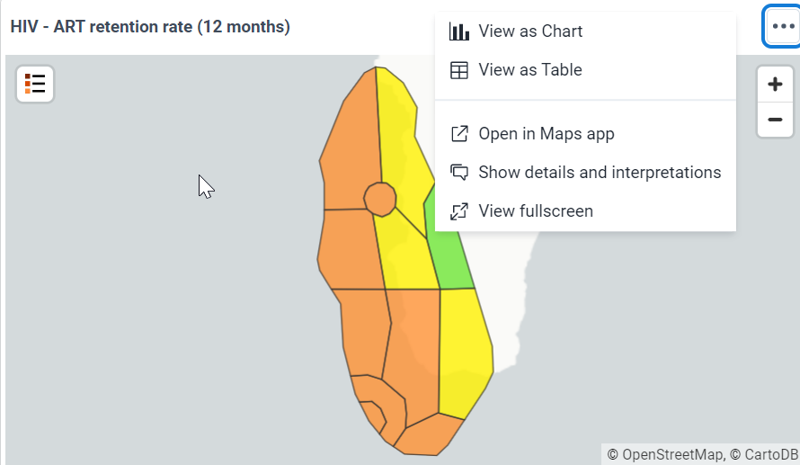


* Once opened in Maps application, it should look like below. Take a moment to understand the map. Focus on legend.

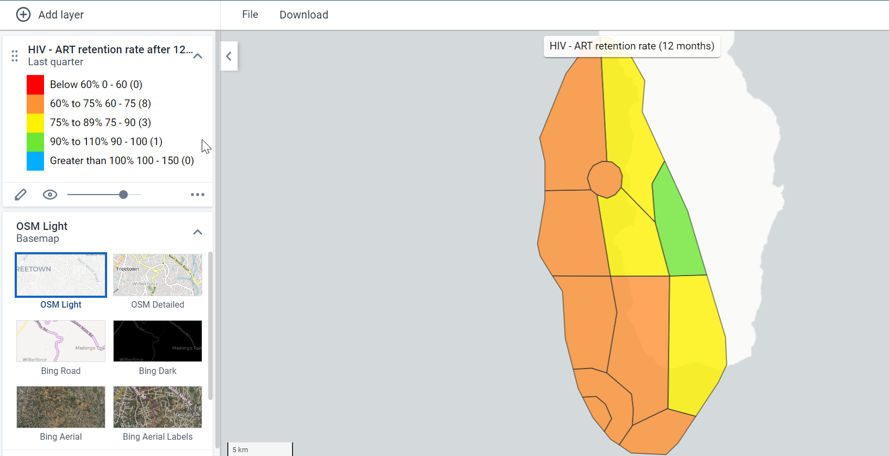

* Click on ‘Interpretations’ button on top right corner to write a description for the map

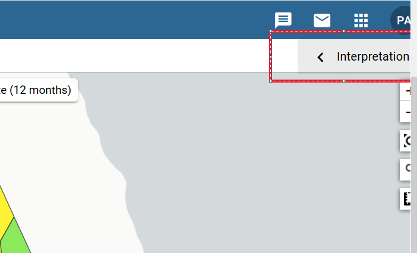

* You will see that currently no description is available

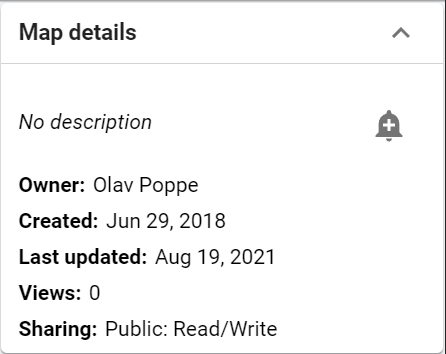


* Let’s formulate a description based on Data to Action framework
* Write the D2A framework. Explain that the Rich Text support for all apps in Details pane is not fully implemented yet. In order for words to render in bold and italics, we need to use html. Copy and paste the following text into the Details panel and replace the text in blue with relevant text according to the visualization. Make sure you skip a row between each line.

```
*Indicators* : Insert name of indicator here

*Objective* : Insert objective of having the indicator as well as the performance

target/benchmark

*Data source* : Insert data source here

*Action that follows* :

_If insert benchmark here is met_ :

Insert action for when target is met

_If insert benchmark here is not met_ :

Insert some of the questions that can guide the data user to establishing the action to take

(e.g. was there a stock out issue? Was there challenges with transportation?) and/or any

specific actions to take where applicable

Example of D2A framework you can copy and paste for the map **ART retention after 12 months**:

*Indicators* : ART retention rate after 12 months (%)

*Objective* : To track the % of patients retaining on ART after 12 months of initiation of treatment

*Data source* : HIV monthly reports from facilities

_Numerator_ : PLHIV retained on ART last 12 months 

_Denominator_ : PLHIV started ART 12 months ago  

*Action that follows*:

_If % of ART retention rate after 12 months >90 percent_ :

Sustain the efforts.

_If % of ART retention rate after 12 months &lt;90 percent_ :
```

Investigate whether there been shortage of ART at facilities

Check whether there has been under-reporting

Check whether facility staff has conducted awareness and education programmes on HIV

Check whether any side-effects of ART reported leading to lack of compliance

* Click on ‘Save As’ from Favorite menu and paste the above text under description.
* 
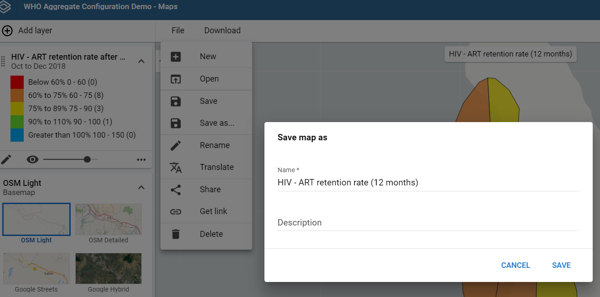

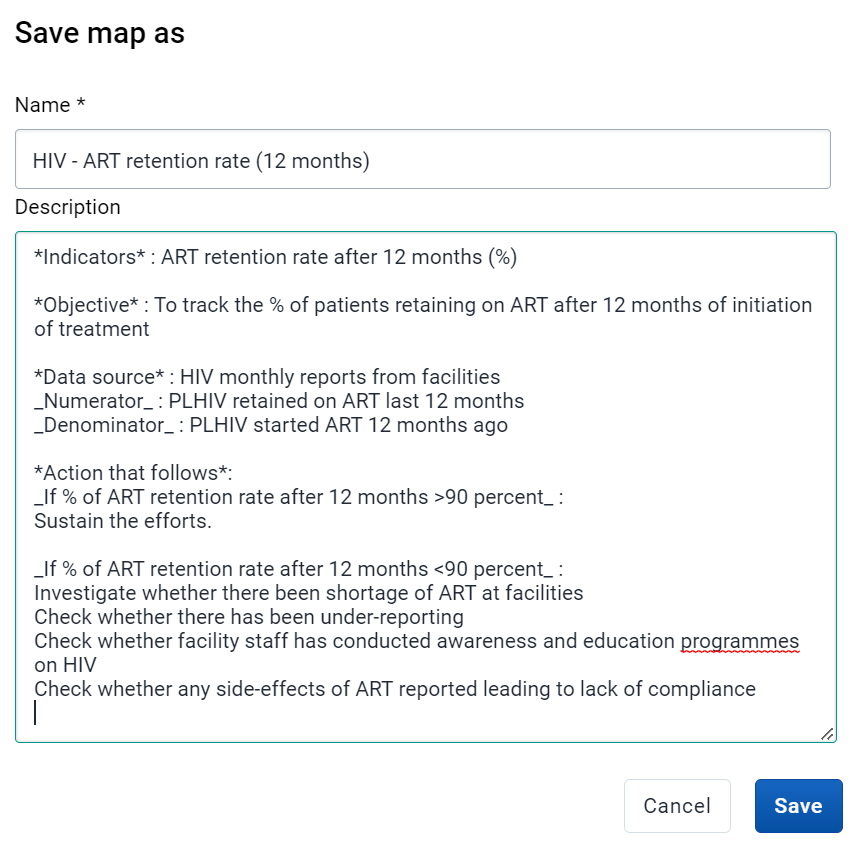

### Part 2 - How to retrieve a Data-to-Action framework from a dashboard


* Show participants how to retrieve a Data-to-Action framework from a dashboard. 

Go to HIV National Dashboard.

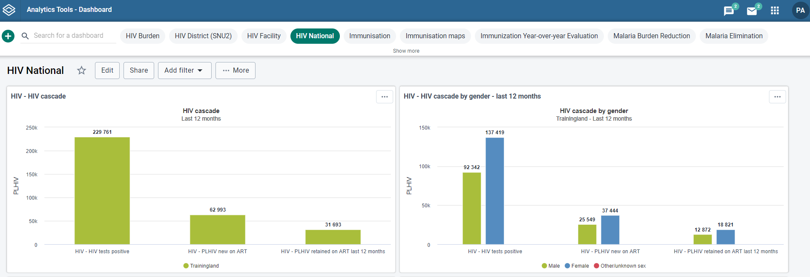

* Scroll down till you find HIV – ART Retention Rate (12 months). Find the show details and button within the item “ART Retention Rate (12 months)”. Click on it.

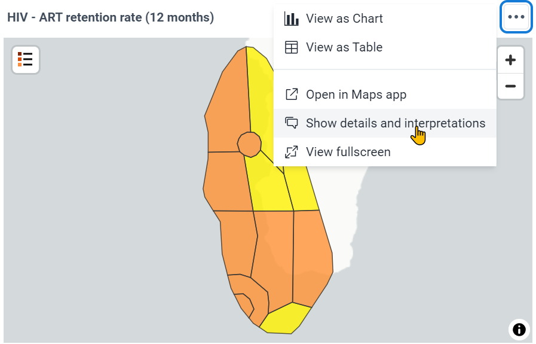

* Select “Show more” to show the full description

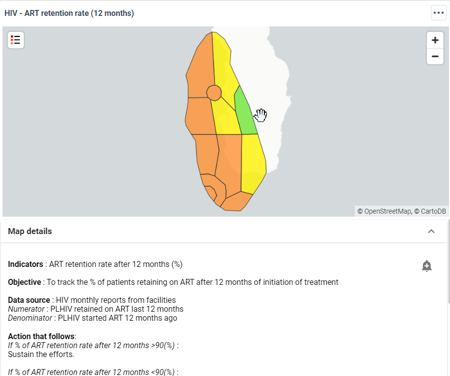


### Part 3 - Subscribing / Interpretations

* Let’s open the HIV Retention Rate (12 months) in Maps App.
* Click on “Interpretations” on top right corner

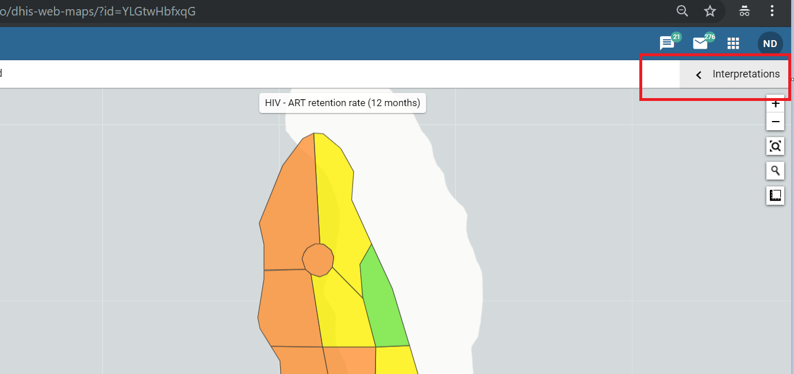


* Click on Bell Like ‘Subscribe’ icon. This will enable you to receive notifications every time someone comments on an interpretation. This is an effective way of tracking progress on feedbacks received on an indicator of interest.

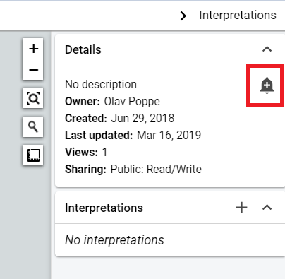    


#### Login as a different user and write an interpretation.

Add an interpretation


* In Maps App/Data Visualizer/Pivot Table within the interpretations pane
    * Click on the box where interpretations are present

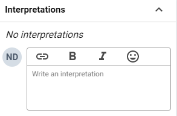


* You can save your comment. Once done you should be able to see the interpretation. This will provide you more options to interact with the comment including Like, Reply and Share. If you are the owner or having adequate permissions you can delete the comment as well.

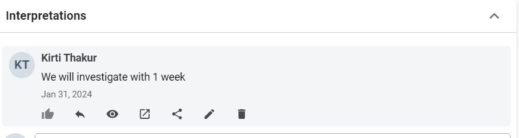


**NOTE: **Interpretations are tied to  how the output looked when the interpretation was written. We do this by selecting the “view” button on the interpretation. This is to ensure the interpretation will always properly align with what the user is seeing when they made the interpretation. There is a ‘view in maps app’ button which will open the interpretation in maps app as how it was at the time of making the interpretation. 

#### Interpreting through dashboard items

* Open HIV National dashboard and scroll down to “**HIV - ART retention rate (12 months)**” 
* Click on the ‘Show interpretation and details’ button


* Scroll down and observe that previous comment made in Maps Apps is present.


* We can also tag a user in the system responsible to attend to the interpretation in the comment itself. To do that start typing with ‘@’. This will list out the users/user groups in system who we can tag to the comment. 

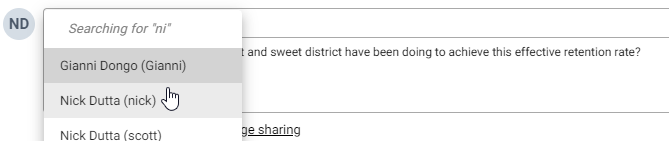  

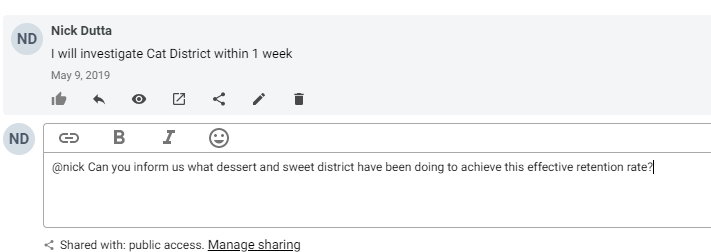  

#### Log back in as the original user who subscribed to the item.

* Scroll all the way to top of dashboard. You should be able to see the interpretations icon at the top as highlighted in red below

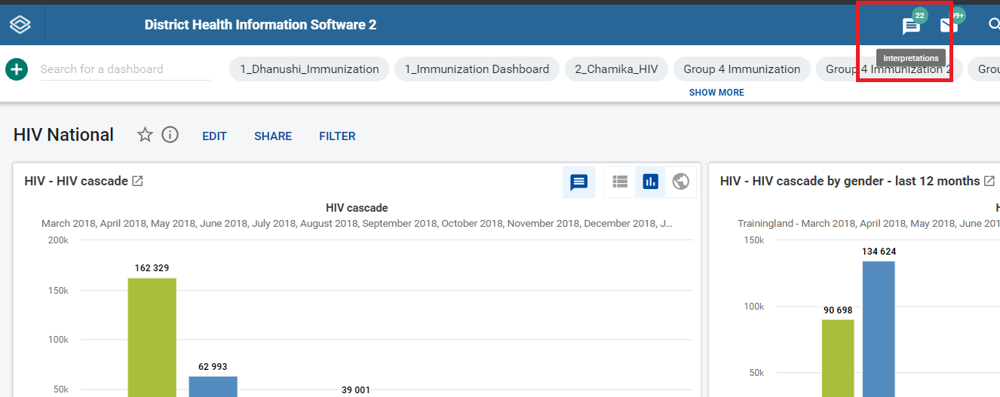

* Along with the icon it will also display how many pending interpretation notifications are awaiting you. This number is calculated from all interpretations that you have subscribed to or you have engaged (user tagging/commenting etc).
* Click on interpretations icon. This will open the interpretations app as shown above.

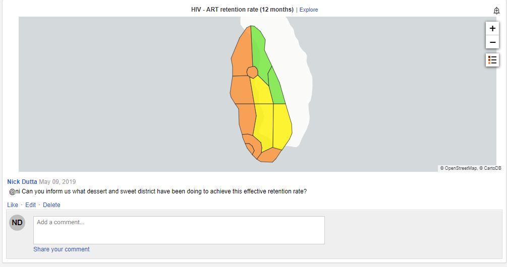

* This will provide you an overview and a quick access to all interpretations that you have subscribed to or engaged. You can easily comment on each of interpretation by scrolling down.’
* In addition, the left side pane will summarise top 5 interpretations, top 5 authors and top 5 commentators

## Hands-on Exercises

Please refer to “[Interpretations Exercise 2](https://docs.google.com/document/d/11bOMHQ8BZp_mUCue6a0c-ZIRpVMgGKiLMalwe1SlanQ/edit?usp=share_link)”
