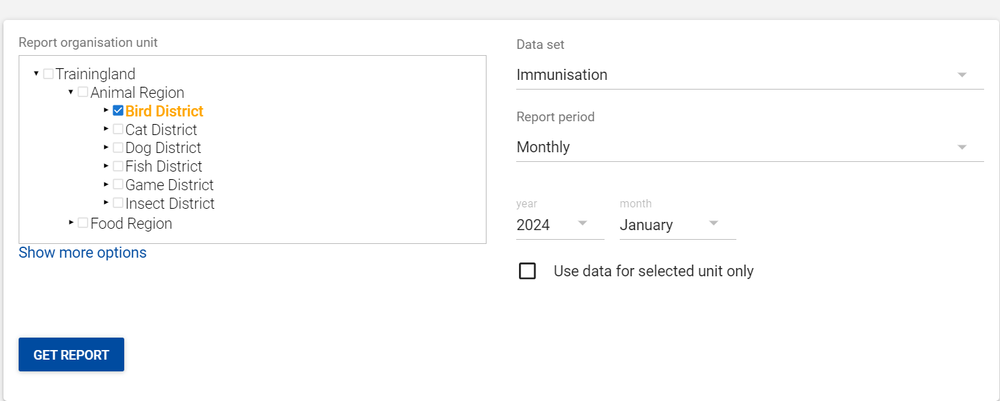
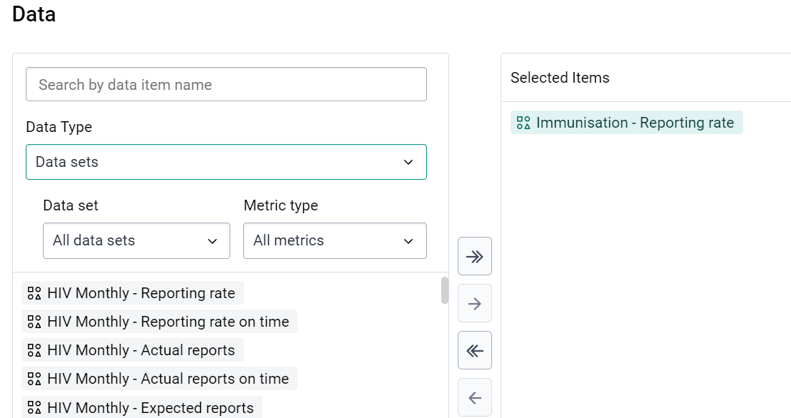

# Trainer’s Guide to Reports

## What is this guide?

This guide is a support document for the trainers of “Reports”. This session is divided into 2 parts. There is 45 minutes available overall for demoing and Q&A, and 45 mins devoted to exercises.

This guide will help the trainer prepare for the live demo session.The “Live Demo step by step with guidance” section has a detailed walkthrough of all the steps to demonstrate with explanations and screenshots that should be easy to follow. Use that when preparing for the live demo session. The guide follows the parts as identified on the agenda. Please review the agenda as well. You will get a better idea of the time you need when you work through the demo for each part on the agenda.

There is also a Quick Guide which lists the steps very briefly and this is meant as a lookup guide or “cheatsheet” WHILE doing the demo, to help the trainer remember all the steps and the flow of the demo.

## Learning objectives for this session

1. Understand how to create charts in the Data Visualizer app
2. Understand how to create data visualizer favourites and use these in Dashboards
3. Understand how to download visualizations offline
4. Discuss the appropriateness of various charts based on the data that you wish to display

## Time needed for this session

Live demo: 2 demos, ~ 20 mins each

Hands-on exercises: 2 exercises, ~ 20 mins each

## Preparations

Go through the Live demo step by step guide a few times before doing the actual demo for participants.

Make sure your user account is same or similar to the participants’ training accounts so that you don’t show more features, dimension options or data than what they can see when doing the exercises. Also if you are in different user groups you will be showing results from the participants since data access depends on one’s user group.

The session has been divided into 5 parts. Each part has a set of objectives associated with it. Start each part of this session by showing the objectives of the session located here:

https://docs.google.com/presentation/d/1LFkyCi3AJ5G6PwKUbtYOUFaAMnl7K59KOI70sgof8-s/edit?usp=sharing

## Table of Contents/Quick Guide

- [Trainer’s Guide to Reports](#trainers-guide-to-reports)
  - [What is this guide?](#what-is-this-guide)
  - [Learning objectives for this session](#learning-objectives-for-this-session)
  - [Time needed for this session](#time-needed-for-this-session)
  - [Preparations](#preparations)
  - [Table of Contents/Quick Guide](#table-of-contentsquick-guide)
  - [Live Demo Step-by-Step](#live-demo-step-by-step)
  - [Part 1 - Data Set Report](#part-1---data-set-report)
    - [Access the reports app](#access-the-reports-app)
    - [Review the reports app](#review-the-reports-app)
    - [Open the data set report module](#open-the-data-set-report-module)
    - [Run the data set report](#run-the-data-set-report)
    - [Review the data set report](#review-the-data-set-report)
    - [Review download options](#review-download-options)
  - [Part 2 - Run a data set report within an orgunit group](#part-2---run-a-data-set-report-within-an-orgunit-group)
    - [Select an orgunit group in addition to the other inputs for the report](#select-an-orgunit-group-in-addition-to-the-other-inputs-for-the-report)
    - [Review the data set report](#review-the-data-set-report-1)
    - [STOP  - Perform Exercise 1 and 2](#stop----perform-exercise-1-and-2)
  - [Part 3 - Reporting Rate Summary](#part-3---reporting-rate-summary)
    - [Select the Reporting Rate Summary module from within the reports app](#select-the-reporting-rate-summary-module-from-within-the-reports-app)
    - [Explain reporting rate summary](#explain-reporting-rate-summary)
    - [Run the reporting rate summary](#run-the-reporting-rate-summary)
    - [Review the reporting rate summary](#review-the-reporting-rate-summary)
    - [Review download options](#review-download-options-1)
    - [STOP  - Perform Exercise 3 (creating a reporting rate summary)](#stop----perform-exercise-3-creating-a-reporting-rate-summary)
  - [Part 4 - Reporting Rates in Other Tools](#part-4---reporting-rates-in-other-tools)
    - [Open the chart “EPI - Completeness - 2022 months” in Data Visualizer](#open-the-chart-epi---completeness---2022-months-in-data-visualizer)
    - [Edit the data selection](#edit-the-data-selection)
    - [STOP  - Perform Exercise 4 (view the reporting rate in data visualizer)](#stop----perform-exercise-4-view-the-reporting-rate-in-data-visualizer)
  - [Part 5 - Org Unit Distribution](#part-5---org-unit-distribution)
    - [Select the “Org Unit Distribution report” module from within the reports app](#select-the-org-unit-distribution-report-module-from-within-the-reports-app)
    - [Explain the org unit distribution report](#explain-the-org-unit-distribution-report)
    - [Run the org unit distribution report](#run-the-org-unit-distribution-report)
    - [Review the org unit distribution report](#review-the-org-unit-distribution-report)
    - [Review download options](#review-download-options-2)
    - [Run the report again by selecting “Get Chart”](#run-the-report-again-by-selecting-get-chart)
    - [STOP  - Perform Exercise 5 (creating an org unit distribution report)](#stop----perform-exercise-5-creating-an-org-unit-distribution-report)
  - [Part 6 - Resources](#part-6---resources)
  - [Session END](#session-end)

## Live Demo Step-by-Step

## Part 1 - Data Set Report

### Access the reports app

Apps -> Reports

### Review the reports app

The modules that are available here are described in this presentation: [https://docs.google.com/presentation/d/1LFkyCi3AJ5G6PwKUbtYOUFaAMnl7K59KOI70sgof8-s/edit?usp=sharing](https://docs.google.com/presentation/d/1LFkyCi3AJ5G6PwKUbtYOUFaAMnl7K59KOI70sgof8-s/edit?usp=sharing) 

### Open the data set report module

They should be familiar with the output of a data set report as well as what it represents from the presentation. If not, have another tab open with a data set report already available so you can discuss what it will look like in the final output.

This is an example from the Immunization data set.

### Run the data set report

Select a inputs for the Org unit, Data Set and Period. In this example, the data set report is being run using the following:

* Org Unit : Bird District
* Data Set : Immunization
* Report period : Monthly, Year: 2022, Month: October

After selecting your inputs, select “Get report”

### Review the data set report

Review the report with the group. Note that this is an output of the data set exactly as it appears in data entry. Depending on your outputs, it may have aggregated values from various org units and time periods and placed them into the data set for review.

### Review download options

You are able to download the data set report as either an excel or PDF file

## Part 2 - Run a data set report within an orgunit group

Create another data set report. This time select the “Show more options” button to show available org unit group sets.

After selecting “Show more options” you will see the available org unit group sets 

### Select an orgunit group in addition to the other inputs for the report

Select inputs for the Org unit, Data Set and Period. In this example, the data set report is being run using the following:

* Org Unit : Animal Region
* Data Set : Immunisation
* Report period : Monthly, Year: 2022, Month: October

In addition, the “Public” Org unit group has been selected from the “Ownership” group set. Select “Get report” in order to retrieve the report.

### Review the data set report

The data set report is the same as before, however now it has filtered out the aggregation. Only data from public facilities has been included in the data set report.

### STOP  - Perform Exercise 1 and 2

## Part 3 - Reporting Rate Summary

### Select the Reporting Rate Summary module from within the reports app

OR 

### Explain reporting rate summary

This is available within the accompanying slides if it has not been explained to the participants. It allows you to check the system-defined completeness and timeliness for one period of any aggregate data set in the system. There are several drawbacks to the reporting rates as calculated by DHIS2, but may often be used as a best estimate in a number of circumstances. To explain the summary in more detail if needed, have a report open in another tab

This is an example from the Immunization data set.

### Run the reporting rate summary

Select inputs for the Org unit, Data Set and Period. In this example, the reporting rate summary is being run using the following:

* Org Unit : Dog District
* Data Set : Immunization
* Report period : Yearly, Year: 2022

Note that, just like for data set reports you are also able to select “show more options” and select additional org unit group filters if you need to. In this example, none have been selected but the same principles as data set reports would apply. 

After selecting your inputs, select “Get report”

### Review the reporting rate summary

Review the report with the group and explain the outputs. 

### Review download options

You are able to download the data set report as either an excel or PDF file

### STOP  - Perform Exercise 3 (creating a reporting rate summary)

## Part 4 - Reporting Rates in Other Tools

The reporting rate summary is a very user-friendly tool; however one critical disadvantage of the reporting summary is that only one period can be viewed at a time. In addition, the report rate summary does not respect the organisation unit “closing date;” this may cause a problem if you have permanently closed a facility but the data set you are reviewing is still assigned to that facility. 

We can also review reporting rates in charts, tables or maps and even combine them with other data by using combination charts. When r

### Open the chart “EPI - Completeness - 2022 months” in Data Visualizer

Here we can see that we review completeness over many periods. 

### Edit the data selection

If we open the data tab and select “Data sets” you will be able to see the various metrics associated with data set reporting rates. 

Add in the reporting rate “HIV Monthly Reporting rate” as an example. 

Select Update to review the chart. Another advantage when using these apps is that you can view reporting rates not only across multiple periods, but also across multiple data sets at the same time.

### STOP  - Perform Exercise 4 (view the reporting rate in data visualizer)

## Part 5 - Org Unit Distribution

### Select the “Org Unit Distribution report” module from within the reports app

OR

### Explain the org unit distribution report

This is available within the accompanying slides if it has not been explained to the participants. It allows to review the number of organisation units that belong to an organisation unit group. It is a good tool to verify this count is correct and to determine if you can use these groups in indicator values and expect the correct result. 

This is an example from the Ownership group set.

### Run the org unit distribution report

Select inputs for the Org unit and Org unit Group Set. In this example, the org unit dist. report  is being run using the following:

* Org Unit : Food Region
* Group Set : Ownership

After selecting your inputs, select “Get report”

### Review the org unit distribution report

Review the report and explain the outputs.

### Review download options

You are able to download the data set report as either an excel or PDF file

### Run the report again by selecting “Get Chart”

You can also output org unit distribution via chart options; we can see that it is not nearly as detailed however as a breakdown by the child orgunits is not available in this view.

### STOP  - Perform Exercise 5 (creating an org unit distribution report)

## Part 6 - Resources

From the reports app, access the “Resource” module

OR

From here we can manage various resources. Add a new resource (make sure you have a file on hand to upload)

These resources can be accessed within this resources app, or you can place them directly on the dashboard for easy access.

## Session END
