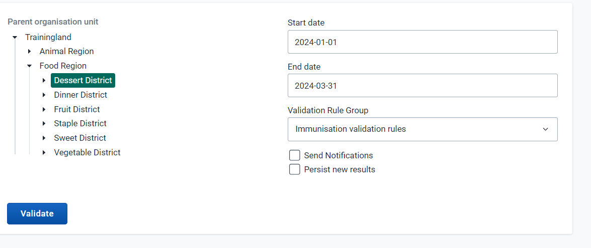

# Trainer’s Guide to Validation Rules (Use)

## What is this guide?

This guide is a support document for the trainers of “Reviewing Validation Rules”. This session should take ~ 3 hours between the presentation, demonstration and having the learners perform activities that copy the demo.

This guide will help the trainer prepare for the live demo session.The “Live Demo step by step with guidance” section has a detailed walkthrough of all the steps to demonstrate with explanations and screenshots that should be easy to follow. Use that when preparing for the live demo session. The guide follows the parts as identified on the agenda. Please review the agenda as well. You will get a better idea of the time you need when you work through the demo for each part on the agenda.

There is also a Quick Guide which lists the steps very briefly and this is meant as a lookup guide or “cheatsheet” WHILE doing the demo, to help the trainer remember all the steps and the flow of the demo.

## Learning objectives for this session

1. Understand some of the key principles associated with data quality
2. Define what a validation rules in DHIS2 is
3. Understand how validation rules can be used to measure consistency in DHIS2
4. Execute validation rule review in data entry
5. Execute validation rule review in bulk via validation analysis
6. Describe how validation rules can be compared against calculated thresholds
7. Execute validation rule analysis using validation rules with defined thresholds

## Time needed for this session

Live demo: 5 demos/presentation, ~ 20 mins each

Hands-on activities: 4 activities, ~ 15 mins each

## Background on this topic/module

Validation rules are an excellent tool that can be used to measure a number of consistency measures within a DHIS2 system. They can be used to manage internal consistency by comparing two or more data items collected during the same process (for example, 2 malaria data items collected at the same time) as well as measuring external consistency by measuring values collected using different mechanisms (for example, data collected via a DHIS2 dataset along with data imported into DHIS2 from a survey).

Thes rules can be run directly in data entry - recommended if measuring internal consistency - as well as through a batch operation called validation analysis. In this session, you will discuss how these rules can be viewed in DHIS2.

## Preparations

Go through the Live demo step by step guide a few times before doing the actual demo for participants. You will be moving back and forth between the demo and this presentation : 

[https://docs.google.com/presentation/d/1M_dqhCoqQuNRpv2YG7tsTVanA7iVeLlampNysCntBsI/edit?usp=sharing](https://docs.google.com/presentation/d/1M_dqhCoqQuNRpv2YG7tsTVanA7iVeLlampNysCntBsI/edit?usp=sharing) 

Please review the presentation along with the guide together in tandem.

Make sure your user account is the same or similar to the participants’ training accounts so that you don’t show more features, dimension options or data than what they can see when doing the exercises. Also if you are in different user groups you will be showing results from the participants since data access depends on one’s user group.

The second exercise involves sending notifications. Make sure all the participants are in a user group, and the user group is assigned as a recipient to the “Rotavirus 2 doses administered &lt;= Rotavirus 2 threshold” validation notification. By setting this up, the participants will also be able to receive the notification you are sending out.

## Table of Contents/Quick Guide

- [Trainer’s Guide to Validation Rules (Use)](#trainers-guide-to-validation-rules-use)
  - [What is this guide?](#what-is-this-guide)
  - [Learning objectives for this session](#learning-objectives-for-this-session)
  - [Time needed for this session](#time-needed-for-this-session)
  - [Background on this topic/module](#background-on-this-topicmodule)
  - [Preparations](#preparations)
  - [Table of Contents/Quick Guide](#table-of-contentsquick-guide)
  - [Live Demo Step-by-Step](#live-demo-step-by-step)
  - [Part 1 - Run a validation rule in data entry](#part-1---run-a-validation-rule-in-data-entry)
    - [Review the rules in data entry](#review-the-rules-in-data-entry)
  - [Part 2 - Run a validation rule in validation rule analysis](#part-2---run-a-validation-rule-in-validation-rule-analysis)
    - [Review the validation details](#review-the-validation-details)
  - [Part 3 - Additional Example with mathematical operators](#part-3---additional-example-with-mathematical-operators)
    - [Example 2: More Complicated with mathematical operations.](#example-2-more-complicated-with-mathematical-operations)
    - [Review the rules in data entry](#review-the-rules-in-data-entry-1)
    - [Run Validation Analysis](#run-validation-analysis)
    - [Review the validation details](#review-the-validation-details-1)
    - [Back to Slide 8 in presentation](#back-to-slide-8-in-presentation)
  - [Part 4 - Run the validation rule using a threshold in data entry](#part-4---run-the-validation-rule-using-a-threshold-in-data-entry)
    - [Back to Slide 15 in the presentation](#back-to-slide-15-in-the-presentation)
  - [Part 5 - Run the “Immunisation thresholds” validation rules in validation rule analysis](#part-5---run-the-immunisation-thresholds-validation-rules-in-validation-rule-analysis)
    - [Check the messages app](#check-the-messages-app)
    - [If e-mail is configured, also show the e-mail](#if-e-mail-is-configured-also-show-the-e-mail)
    - [End Session](#end-session)
   

## Live Demo Step-by-Step

## Part 1 - Run a validation rule in data entry

You can start this session after explaining the concepts up to slide 7 [here](https://docs.google.com/presentation/d/14RBj02GxjTGSWHPnMtE23za-kc5gcMsVG-dpPukhNXw/edit?usp=sharing).

We will run a validation rule in both data entry and data analysis. 

In the first example, we will run the validation rules for the [HIV Monthly] data set. 

Select the following in data entry:

First, review the data entry page briefly. We will start by running logical rules, which are checking the correctness of the data. These rules will essentially tell us if the data should be fixed based on the output it provides. 

There are several places you can check if your data entry page passes the configured validation rules.

At the top right corner:

At the bottom of the page:

To get the validation rules to trigger, make sure you update the values so that HIV tests positive > HIV tests performed. You will see an example of this in the above image.

**Note:** The validation will run everytime you click on complete. You can explain the complete button, in that it contributes to two of the factors of data quality previously discussed: the completeness and timeliness of the data. When selecting the complete button, the dataset registers as being complete (data is saved automatically as it is entered, complete does not save the data). The date in which the complete button is selected is used to compare against the defined timeliness of the dataset. So if my timeliness is defined as having the data submitted within 15 days of the next month, and I click complete on March 8 for February data, the dataset will be complete for February as well as timely!

After reviewing these concepts and altering the data within data entry, run the validation rule(s)

### Review the rules in data entry

After you run the rules, review them with the participants. This will help you to identify any issues with the data currently. The validation rules are pointing us to where there are problems in our data. Close the results page and review the data entry screen to verify what is being calculated.

The first and second values are being taken from the sex section HIV tests performed and HIV tests positive categorized by gender/sex (Female and Male).

Reviewing our data, this means that one of these values must be incorrect. We may need to verify with the facility, but let us assume this has already been done and we understand the HIV tests positive were counted incorrectly. 

We can update this to each cell respectively as shown in the image respectively and Run the validation again.  

It should now pass as the number of HIV tests positive is now less than the HIV tests performed in this period.

## Part 2 - Run a validation rule in validation rule analysis

In order to run validation rule analysis, go to the data quality app and select “Run validation”

Select Animal Region and run the HIV validation rules rules from January - April 2023

Once you have selected the inputs select “Validate”

### Review the validation details

There is only validation violation in Cardinal Hospital in March 2023. Select the details button of one of the violations so you can see in more detail what the issue is.

The validation details show all of the data elements that are part of the validation rule along with their values. In this example, the total number of HIV tests positive should be &lt;= the total HIV tests performed.

Therefore, HIV tests positive (1199) > Total HIV tests performed (296), not less than or equal to the number of tests performed, hence the identification of a violation. 

We can see how this view will be useful in reviewing the violations for multiple org units at once, as we can also see all the component parts of the violation. This can allow us to potentially identify exactly which value is incorrect. 

## Part 3 - Additional Example with mathematical operators

### Example 2: More Complicated with mathematical operations. 

Select the following in data entry:

First, review the data entry page briefly. We will start by running logical rules, which are checking the correctness of the data. These rules will essentially tell us if the data should be fixed based on the output it provides. 

Run the validation rules as you did before. 

### Review the rules in data entry

After you run the rules, review them with the participants. This will help you to identify any issues with the data currently. The validation rules are pointing us to where there are problems in our data. Close the results page and review the data entry screen to verify what is being calculated.

The first value is being taken from the total number of DPT doses that are administered. 

The second value is being taken from our stock section

Reviewing our data, this means that one of these values must be incorrect. We may need to verify with the facility, but let us assume this has already been done and we understand the received balance was counted incorrectly. 

### Run Validation Analysis

In order to run validation rule analysis, go to the data quality app and select “Run validation”

Run the validaiton analysis if Dessert District from January - March 2023 using the "Immunisation validation rules" group. 

Once you have selected the inputs select “Validate”

### Review the validation details

You should see a number of violations during this period. Select the details button of one of the violations so you can see in more detail what the issue is. This example is Cake Hospital Gateway PHC in February 2023.

The validation details show all of the data elements that are part of the validation rule along with their values. In this example, the total number of DPT doses given should be &lt;= the total used and wasted.

1. The total DPT doses = 177+1+154+3+138= 473
2. Total used and wasted = 2872-2406 = 466

Therefore, DPT doses (473) > Total used and wasted (466), not less than or equal to the number used and wasted, hence the identification of a violation. If we altered our starting balance to be higher basd on our assumption, then we could remove this violation.

We can see how this view will be useful in reviewing the violations for multiple org units at once, as we can also see all the component parts of the violation. This can allow us to potentially identify exactly which value is incorrect. 

### Back to Slide 8 in presentation

[Presentation](https://docs.google.com/presentation/d/14RBj02GxjTGSWHPnMtE23za-kc5gcMsVG-dpPukhNXw/edit?usp=sharing)

**STOP - Perform exercises 1, 2 and 3**

## Part 4 - Run the validation rule using a threshold in data entry

**_This should be done after presenting slide 14 in the presentation._**

Select the following in data entry

Run the validation rule and review the results

Note that it runs both the logical rules, which we have already reviewed, as well as the rules that check consistency using outliers that have been generated via the predictor function in this case. These rules can run using outliers that have been imported into the system as well if required.

### Back to Slide 15 in the presentation 

[Presentation](https://docs.google.com/presentation/d/14RBj02GxjTGSWHPnMtE23za-kc5gcMsVG-dpPukhNXw/edit?usp=sharing)

## Part 5 - Run the “Immunisation thresholds” validation rules in validation rule analysis

Perform this after finishing the presentation.

In Validation Rule Analysis, select:

* Org Unit: Animal Region
* Period: January 1 - March 31 2023
* Validation Rule Group : Immunisation thresholds
* Ensure the send notifications option is selected

We will run the rules and also send the notifications for any identified violations. Select validate to proceed.

As we sent the notification out, we will also receive this via the messages app and potentially e-mail as well if this has been configured. 

### Check the messages app

Navigate to the messages app and review the validation violations that have been sent. You will have a small notification that there are new validation rule messages in your messages inbox (the number within the circle in this image). 

[Note: to receive the notification, add users to the **Immunization Notification** user group]

This message will be sent to multiple users. Who receives this message is dependent on the configuration. 

### If e-mail is configured, also show the e-mail

You will need the e-mail server set-up and also be online in order to make this work correctly. The e-mail server is set up by default in the WHO aggregate demo backup.

In order to receive the e-mail, the user also has to ensure that they can receive them. You can configure this in the user settings. Check this prior to the demo!

### End Session

**STOP - Perform Exercises 4 and 5**
