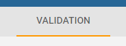
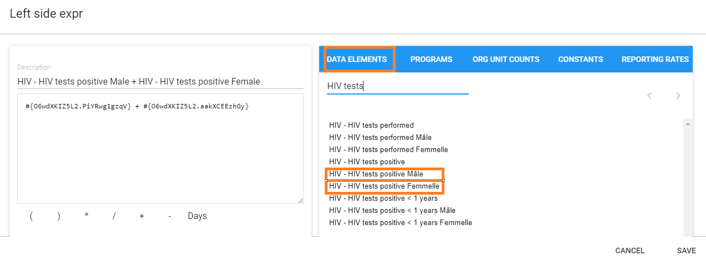
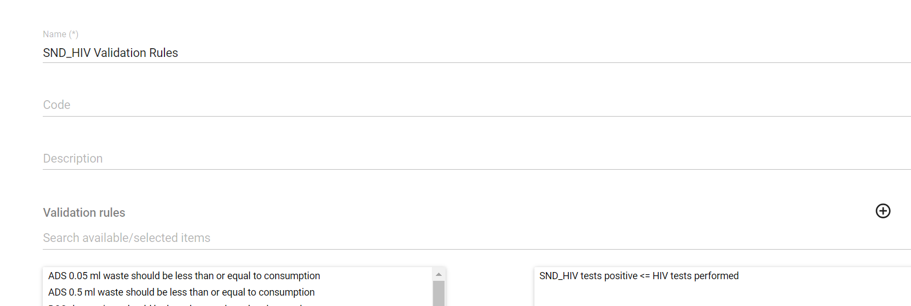
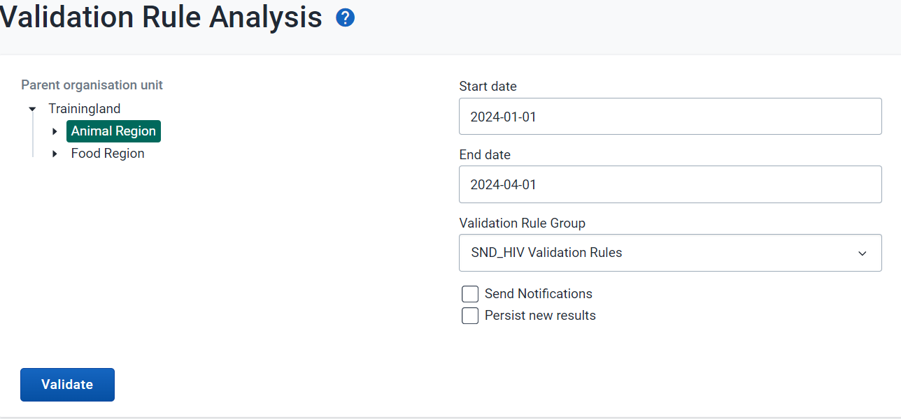
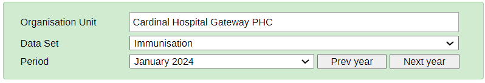
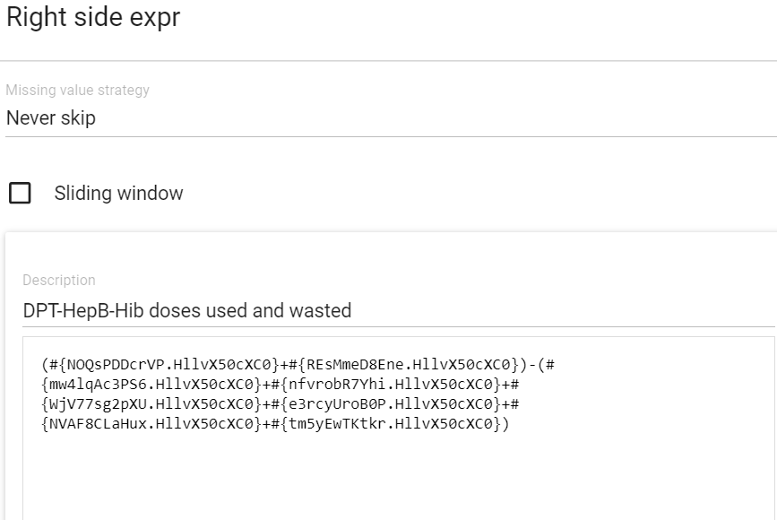
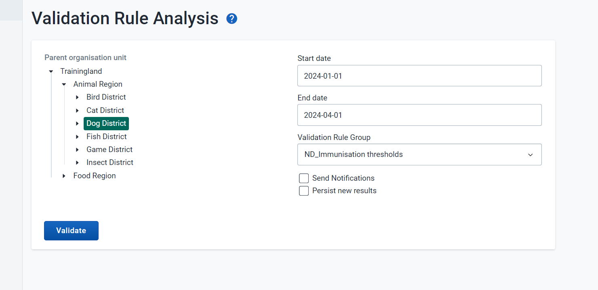
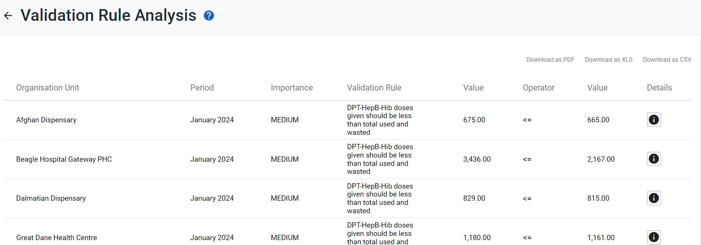
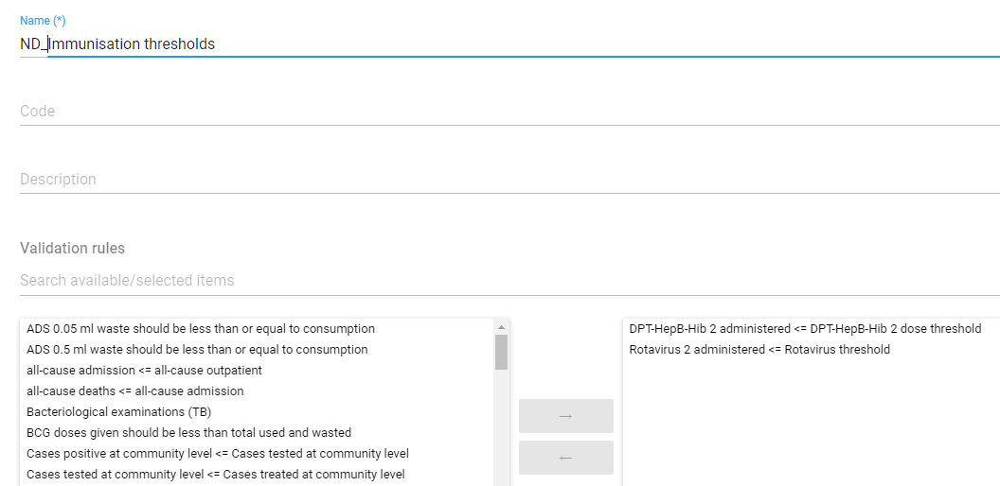

# Trainer’s Guide to Validation Rules (Config)

## What is this guide?

This guide is a support document for the trainers of “Configuring Validation Rules.” This session is divided into 3 parts.

* Part 1 - Create a logical rule [simple]
* Part 2 - Create a logical rule [using stock]
* [OPTIONAL] Part 3 - Create a rule using a threshold

Part 3 of this guide is an extra example that you will likely be unable to cover with the time frame of the session, and it is therefore marked as an optional session both in this guide as well as the learner's guide. 

This guide will help the trainer prepare for the live demo session.The “Live Demo step by step with guidance” section has a detailed walkthrough of all the steps to demonstrate with explanations and screenshots that should be easy to follow. Use that when preparing for the live demo session. The guide follows the parts as identified on the agenda. Please review the agenda as well. You will get a better idea of the time you need when you work through the demo for each part on the agenda.

There is also a Quick Guide which lists the steps very briefly and this is meant as a lookup guide or “cheatsheet” WHILE doing the demo, to help the trainer remember all the steps and the flow of the demo.

## Learning objectives for this session

1. Define a validation rule after reviewing a data set.
2. Create a validation rule to measure internal consistency.
3. Create a validation rule measuring against a generated threshold.

## Time needed for this session

Live demo: 2 demos, ~ 25 mins each

Hands-on exercises: 2 exercises, ~ 20 mins each

## Preparations

Go through the Live demo step by step guide a few times before doing the actual demo for participants.

Make sure your user account is same or similar to the participants’ training accounts so that you don’t show more features, dimension options or data than what they can see when doing the exercises. Also if you are in different user groups you will be showing results from the participants since data access depends on one’s user group.

Make sure the resolution on projector is OK for zooming in Data Visualizations with layout and options pop up boxes.

The second exercise involves sending notifications. Make sure all the participants are in a user group, and the user group is assigned as a recipient to the “Rotavirus 2 doses administered &lt;= Rotavirus 2 threshold” validation notification. 

## Table of Contents/Quick Guide

- [Trainer’s Guide to Validation Rules (Config)](#trainers-guide-to-validation-rules-config)
  - [What is this guide?](#what-is-this-guide)
  - [Learning objectives for this session](#learning-objectives-for-this-session)
  - [Time needed for this session](#time-needed-for-this-session)
  - [Preparations](#preparations)
  - [Table of Contents/Quick Guide](#table-of-contentsquick-guide)
  - [Live Demo Step-by-Step](#live-demo-step-by-step)
  - [Part 1 - Create a Validation Rule](#part-1---create-a-validation-rule)
    - [Review the data entry page and decide on a logical validation rule to create](#review-the-data-entry-page-and-decide-on-a-logical-validation-rule-to-create)
    - [Create the validation rule HIV tests positive \<= HIV tests performed](#create-the-validation-rule-hiv-tests-positive--hiv-tests-performed)
      - [Open and explain the Left Side Expression](#open-and-explain-the-left-side-expression)
      - [Select the Operator](#select-the-operator)
      - [Open the Right Side Expression](#open-the-right-side-expression)
    - [Create a Validation Rule Group](#create-a-validation-rule-group)
    - [Test the rule in validation rule analysis within the Data Quality App](#test-the-rule-in-validation-rule-analysis-within-the-data-quality-app)
    - [STOP Part 1 - Perform Exercise 1](#stop-part-1---perform-exercise-1)
  - [Part 2 - Create Validation Rule #2](#part-2---create-validation-rule-2)
    - [Review the data entry page and decide on a logical validation rule to create](#review-the-data-entry-page-and-decide-on-a-logical-validation-rule-to-create-1)
    - [Create the validation rule DPT-HepB-Hib doses given \<= Total Used DPT-HepB-Hip doses](#create-the-validation-rule-dpt-hepb-hib-doses-given--total-used-dpt-hepb-hip-doses)
      - [Open and explain the Left Side Expression](#open-and-explain-the-left-side-expression-1)
      - [Select the Operator](#select-the-operator-1)
      - [Open the Right Side Expression](#open-the-right-side-expression-1)
      - [Save the Rule when finished](#save-the-rule-when-finished)
    - [Create a Validation Rule Group](#create-a-validation-rule-group-1)
    - [Test the rule in validation rule analysis within the Data Quality App](#test-the-rule-in-validation-rule-analysis-within-the-data-quality-app-1)
    - [STOP Part 2 - Perform Exercise 2](#stop-part-2---perform-exercise-2)
  - [\[OPTIONAL\] Part 3 - Create a validation rule #3 using the DPT-HepB-Hib 2 threshold](#optional-part-3---create-a-validation-rule-3-using-the-dpt-hepb-hib-2-threshold)
      - [Note: A Predictor is used to calculate the threshold value](#note-a-predictor-is-used-to-calculate-the-threshold-value)
      - [Select the data element tab and create a data element](#select-the-data-element-tab-and-create-a-data-element)
      - [Click add button under predictor tab and create a predictor](#click-add-button-under-predictor-tab-and-create-a-predictor)
    - [After inserting the formula click submit and save. You must run the predictor to generate the threshold values for comparison before proceeding.](#after-inserting-the-formula-click-submit-and-save-you-must-run-the-predictor-to-generate-the-threshold-values-for-comparison-before-proceeding)
    - [Create the validation rule \[DPT-HepB-Hib 2 administered \<= DPT-HepB-Hib 2 dose threshold \]](#create-the-validation-rule-dpt-hepb-hib-2-administered--dpt-hepb-hib-2-dose-threshold-)
      - [Open the Left Side Expression](#open-the-left-side-expression)
      - [Select the Operator](#select-the-operator-2)
      - [Open the Right Side Expression](#open-the-right-side-expression-2)
      - [Save the Rule when finished](#save-the-rule-when-finished-1)
    - [Create a Validation Rule Group](#create-a-validation-rule-group-2)
    - [Test the validation rule in validation analysis within the Data Quality app](#test-the-validation-rule-in-validation-analysis-within-the-data-quality-app)
    - [STOP Part 3 - Perform Exercise 3](#stop-part-3---perform-exercise-3)

## Live Demo Step-by-Step

## Part 1 - Create a Validation Rule

**Example 1 from HIV Monthly Form**

### Review the data entry page and decide on a logical validation rule to create

We can use the following HIV dataset at the **Facility** level

Let’s create a rule in which HIV tests positive are less than or equal to HIV tests performed

### Create the validation rule HIV tests positive &lt;= HIV tests performed

Navigate to the maintenance application in DHIS2 and select the “Validation” tab 

Create a new rule by selecting the “+” icon underneath validation rule

Explain the fields that will be used to describe the rule. Use your initials to create the rule when showing it to participants.

Here is the description and instruction

HIV tests positive should be less than or the same as HIV tests performed, if not make follow ups to respective facility

Describe the importance and period type as it relates to the validation rule before proceeding.

#### Open and explain the Left Side Expression

Open the left side expression and explain what you are intending to do. The rule you are creating is total HIV tests positive between male and female hence for the left side, select the (HIV tests positive Male + HIV tests positive Female)

> ***Note:*** It is recommended to use the disaggregated data elements instead of the total data element as shown in the figure above e.g. HIV tests positive Male + HIV tests positive Female. This is because during validation rule analysis, when looking at the details, if the total data element was selected the details will be empty and you will not be able to drill down to identify where the problem originates from.

Select “Save” once the left side has been selected.

#### Select the Operator

It is “Less than or equal to” in this case. You can explain why to the participants.

#### Open the Right Side Expression

You will need to do the following for the right side expression:

HIV tests performed Male + HIV tests performed Female,

Create this expression, explaining what you are doing during each step of the way.

Click on “Save” when the expression is complete.

### Create a Validation Rule Group

Go to Maintenance> Validation> Validation Group

Click the add button and fill in the details of the validation group. Use your initials when creating the validation rule group

Place the validation rule you have created into the group and select “Save.” 

### Test the rule in validation rule analysis within the Data Quality App

Navigate to the Data Quality app

Select “Run validation”

Select the following inputs:

* **Date : January 1 2023 - April 1 , 2023**
* **Rule Group : The group you have just made**
* **Parent Organisation unit : Animal Region**

You should see the below violations

Did it work for you?

### STOP Part 1 - Perform Exercise 1

## Part 2 - Create Validation Rule #2

### Review the data entry page and decide on a logical validation rule to create

We can use the following dataset at the **Facility **level

Let’s create a rule in which DPT-HepB-Hib doses given are less than or equal to Total DPT-HepB-Hib doses used and wasted.

**Note:**
Total used= **(Starting balance + Received)**- **(VVM + Frozen + Expired + Broken + Missing + Ending balance)**

### Create the validation rule DPT-HepB-Hib doses given &lt;= Total Used DPT-HepB-Hip doses

Navigate to the maintenance application in DHIS2 and select the “Validation” tab 

Create a new rule by selecting the “+” icon underneath validation rule

Explain the fields that will be used to describe the rule. Use your initials to create the rule when showing it to participants.

Here is the description and instruction

DPT-HepB-Hib doses given should be less than or the same as total DPT-HepB-Hib doses used and

DPT-HepB-Hib doses given should be less than or the same as total DPT-HepB-Hib doses used if not make follow ups to respective facility

Describe the importance and period type as it relates to the validation rule before proceeding.

#### Open and explain the Left Side Expression

Open the left side expression and explain what you are intending to do. The rule you are creating is total DPT-HepB-Hib doses given which comprises of dose 1 to 3 hence for the left side, select the (DPT-HepB-HIB 1 doses given + DPT-HepB-HIB 2 doses given + DPT-HepB-HIB 3 doses given)

Add a description to the left side and explain the ID that is shown.

Select “Save” once the left side has been selected.

#### Select the Operator

It is “Less than or equal to” in this case. You can explain why to the participants.

#### Open the Right Side Expression

You will need to do the following for the right side expression:

DPT-HepB-HIB doses used = (DPT-HepB-HIB doses starting balance + DPT-HepB-HIB doses received) - (DPT-HepB-HIB doses VVM + DPT-HepB-HIB doses frozen + DPT-HepB-HIB doses expired + DPT-HepB-HIB doses broken + DPT-HepB-HIB doses missing + DPT-HepB-HIB doses ending balance)

Create this expression, explaining what you are doing during each step of the way

Click on “Save” when the expression is complete.

#### Save the Rule when finished

### Create a Validation Rule Group

Go to Maintenance> Validation> Validation Group

Click the add button and fill in the details of the validation group. Use your initials when giving the group a name.

Place the validation rule you have created into the group and select “Save”

### Test the rule in validation rule analysis within the Data Quality App

Navigate to the Data Quality app

Select “Run validation”

Select the following inputs:

* **Date : January 1 2023 - April 1 , 2023**
* **Rule Group : The group you have just made**
* **Parent Organisation unit : Dog District**

You should see the below violations

Did it work for you?

### STOP Part 2 - Perform Exercise 2

## [OPTIONAL] Part 3 - Create a validation rule #3 using the DPT-HepB-Hib 2 threshold

  **You can skip Part 3 if needed due to time contraints (the first 2 examples along with the participants following along will likely be enough for the 1.5 hours session). If you do end up skipping Part 3, you can note that this is avaialable as an example in the learner's guide.**

In this example, a rule will be created in which we compare an entered value to a calculated threshold. The steps to create the rule are very similar to the previous example.

#### Note: A Predictor is used to calculate the threshold value

**NB: This section is for the trainer to understand where the threshold value is coming from. The trainer should not show the learner how to make a predictor unless they feel there is enough time.**

First, we create the data element.

Navigate to the maintenance application in DHIS2. 

#### Select the data element tab and create a data element

Under the Maintenance app select Other tab

#### Click add button under predictor tab and create a predictor

Fill in the predictor name, short name and under output data element, assign the threshold data element you have previously created as shown on figure above. Assign period type and make sure it’s the same as that of the Immunisation data set.

Click Generate and insert a formula that will be used to calculate the threshold;

### After inserting the formula click submit and save. You must run the predictor to generate the threshold values for comparison before proceeding.

Go back to the validation tab under maintenance and;

### Create the validation rule [DPT-HepB-Hib 2 administered &lt;= DPT-HepB-Hib 2 dose threshold ]

**NB:This is where the actual demo starts.**

Explain the fields that will be used to describe the rule. Use your initials to create the rule when showing it to participants.

#### Open the Left Side Expression

Open the left side expression and explain what you are wanting to do. You are trying to create the rule comparing the amount of DPT-HepB-Hib 2 dose with a calculated threshold. Select the data element “EPI - DPT-HepB-Hib 2 doses given” for the left side.

Select “Save” once the left side has been selected.

#### Select the Operator

It is “less than or equal to” in this case. Explain why this is.

#### Open the Right Side Expression

Select the data element “EPI - DPT-HepB-Hib 2 doses given threshold” for the left side.

Click on “Save” when the expression is complete.

#### Save the Rule when finished

### Create a Validation Rule Group

Place the validation rule you have created into the group and select “Save.” Use your initials to create the group.

### Test the validation rule in validation analysis within the Data Quality app

Navigate to the data quality app

Select “Run validation”

Select the following inputs:

* **Date : January 1 2023 - April 1, 2023**
* **Rule Group : The group you have just made**
* **Parent Organisation unit : Dog District**

You should see the violations. Does it work for you?

### STOP Part 3 - Perform Exercise 3
