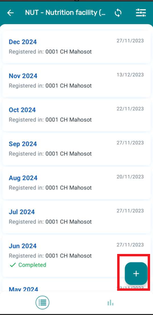
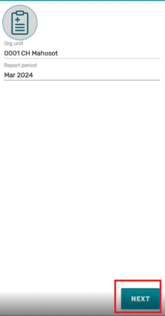
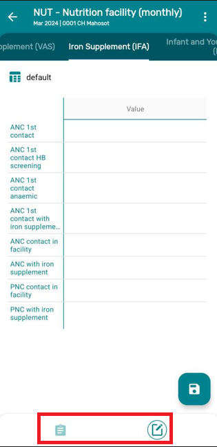
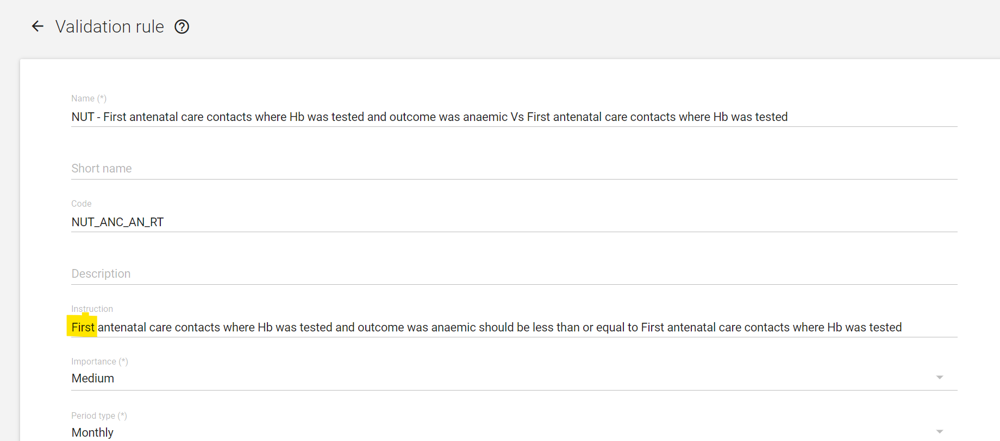
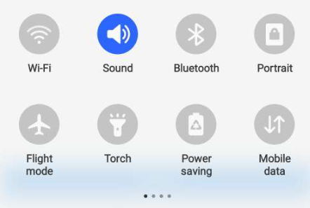
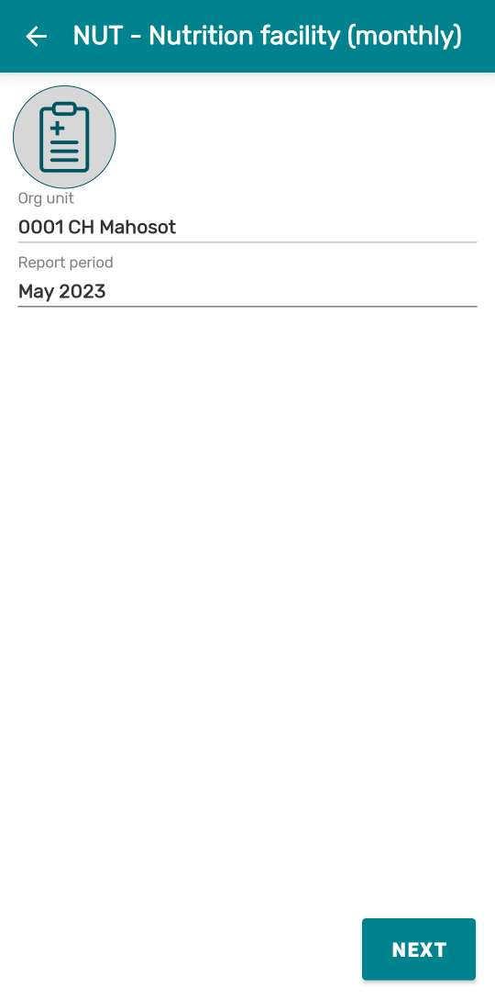
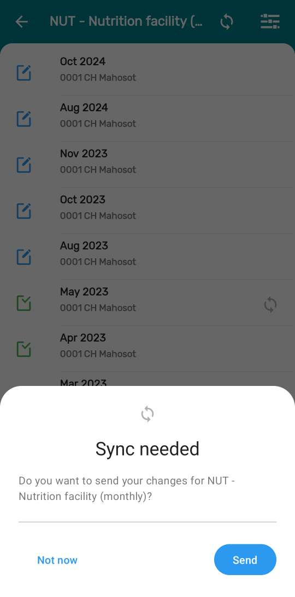
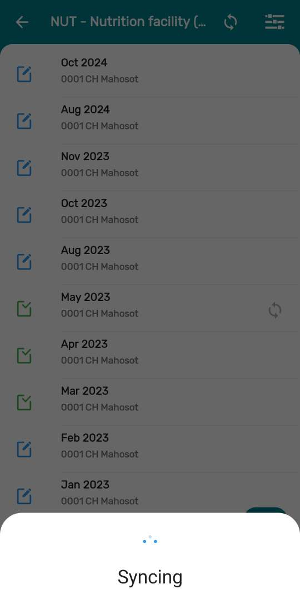
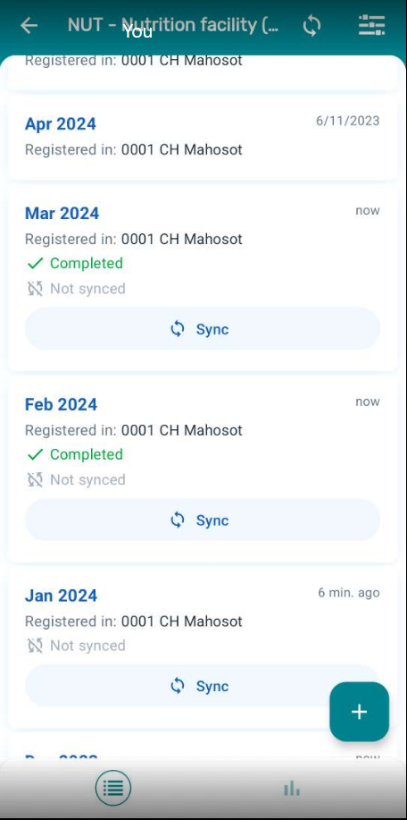
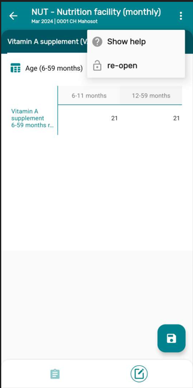

# Learner's Guide to the Aggregate Data Entry

## What is this guide?

This guide contains all exercises and detailed steps to perform them related to the review of ***Aggregate Data Entry*** for the Android Level 1 academy. Please perform each of the exercises when prompted to by your instructors

## Learning objectives for this session

The overall objective of this session is to demonstrate how to use 

1. Features in android devices for the aggregate data entry.

2. Validation rules and its importance

## Exercise 1 - Navigation and Saving a Data Set

### Home Page:

* Log in to the DHIS2 Android App
* Once you Log - in the Home Page can be seen.

* Now click on the “NUT - Nutrition facility monthly” 

  

* The first page that appears is the list of months where data has been entered. In this system, the last 10 months of data are downloaded at any one time. This is a system setting; it will be discussed how to conifigure this later on. 

   

The icons by the dataset refer to if its been completed or now. Green checkmarks indicate it has been completed, while blue pencil icons indicate it has not yet been completed.

### Data Entry

* To start entering data for a new period, Click on the + icon in the lower right side corner.

   

* This will show the below screen 

   

* Select an orgunit a d Report Period to enter data into.

   

* Once you select the period Click on NEXT button

   

* The form will open and all the sections of the forms will be rendered as tabs.

   _NOTE: While entering data the new text input dialog opens an input field above the keyboard which shows the Data Element name, and category options of the field being selected, ensuring the user does not lose context when navigating the tables._

   

### Navigation Bar:

The navigation bar can be used to switch between the data entry and the overview screen
    
   
The overview tab contains the following details:

* Data set name
* Last Update
* Open/Completed Status
* Period
* Org Unit
* Category option combo
* Refresh button (To trigger a granular synchronization)

              

### Saving a Data Set

Now to save the data you can click on the SAVE button in the lower right corner.

>Note: By default your data will not be synced, it will only be stored locally on the android device. This is indicated by the circular arrows that you see next to the dataset/period combo you just saved. In this configuration, the data is set to be synced every 24 hours. This is defined in the android settings web app. You can also manually sync the data. Sync will be discussed later on in this demonstration.

### STOP - End Exercise 1

## Exercise 2 - Validation rules 

**Validation rules and completion of data sets are integrated in the save button actions.**

Lets understand how we have designed a validation rule in the web application, and how a data set can be configured to save only if the validation rule passes. 

Let's take one example :

**“First Antenatal care contacts where Hb was tested and outcome was anemic should be less than or equal to First antenatal care contacts where Hb was tested.”**

Now to get the error on the above validation rule follow the below steps:

* Go to the Nutrition Data set you have created previously and Click on the tab “Iron Supplement (IFA)”
  
Add Values for 

* ANC 1st Contact HB Screening = 5
* ANC 1st Contact Anaemic = 9

Now try to save the dataset and run the validation rules on the device.

* An error dialog will appear once you try to save and the dataset will not be marked as complete. The description and instructions of the validation rule will be displayed to help the user identify the error.

**_NOTE: When completing a dataset, there is an option "Complete allowed only if validation passes". In this scenario, the validation rules will be run even if the user says "No" to the prompt "Do you want to check data quality." In this case, the validation rules must all pass in order to save the dataset._**

### STOP - End Exercise 2

## Part 3 - Offline and Data Sync

**Before performing this exercise you need to turn off the internet connection. After you turn off the internet, log out of your account.**

### Log back in to the DHIS2 Android App 

**NOTE : After a successful login the user should be able to perform an offline login only (only available for the last combination of URL/Username). Offline usage gives the possibility of using the application without any type of connectivity. All data will still be stored on the device and the user can perform a synchronization once the connection is established or available.**

* The Home Page can be seen.

   

* Now click on the “NUT - Nutrition facility monthly” 

  

* The first page that appears is the list of all month where data has been entered

   

### Data Entry

* To start entering data for a new period,Click on the + icon in the extreme right side corner.
* Click on the Report Period and Select the month and year for new data to be entered for a new period.

* Once you select the period Click on NEXT button
* The data form will open.
* Enter Values

* Click Save

Now once you go back to the list you will see a gray icon next to the dataset/period combo you just added.

This shows that data is stored locally on this device.

* Now switch on the internet and 
* then click on the Gray icon it will ask you - “Do you want to sync the data”
* Click on Send 

* Now once data is synced to the server you will see the below screen and the gray icon will not be visible.

### STOP - End Exercise 3

## Exercise 4 - Re-open a Completed Data Set

Once the data is saved you can re-open the data set, if the user has access.

Please follow the steps to re-open the data set.

* Click on the completed data set which you want to edit or re-open 
* In this case Select a dataset with a green check mark next to it (as that is a completed data set)

* Click on the three dots on the extreme upper right corner

* Click on re-open a dialog box will appear and Click on “Yes”

### STOP - End Exercise 4

## Part 5 - New Features in DHIS2 Android Version 2.8.2

### Resizing Column and Headers

Users are now allowed to resize the row headers and columns in datasets, making it easier to view and work with larger tables.

To resize any column, tap on its header and then drag and drop until the desired size. A maximum and minimum size limit is given for the columns that can be resized to ensure a good layout.

If the column have multiple headers, the resizing will be available only for the child header (lowest level). Users can also resize all collumns at once by clicking on the top left of the table.

### STOP End Exercise 5

