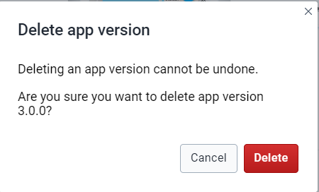

# Trainer’s Guide on APK Distribution Web App

## What is this guide?

This guide contains all exercises and detailed steps to perform them related to the APK Distribution App for the Android Level 1 academy. Please perform each of the exercises when prompted to by your instructors

## Learning objectives for this session

* Install the APK Distribution Web App
* Upgrade to the latest vesrion

## Time needed for this session

Live demo:
Hands-on exercises:

## Exercise 1: Installation of the APK Distribution Web App

To install the APK distribution web apo follow the steps:

* Go to Search Bar and Search for the App Management app
* Go to the App hub
* Click on APK Distribution App
* Install the App.

### STOP - Complete Exercise 2

## Exercise 2: Upgarde the DHIS2 Android App to the new version

### Upload version

Follow the steps below to upload an Android app version:

* Click on Upload new version button.
* Assign a version number.
* Choose the minimum and/or recommend Android OS version.
* Add a URL that contains the APK of the Android app.
* Click on the "Create app version" button.

So in this case we want to upgrade a new version 
2.9

So, for this we will follow the below steps:

* So in **Version** we will add latest vesrion i.e. 2.9
* You need to add a **Minimum Android version** that the app should support which is 5.0.2
* In the **Recommended Android vesrion** we will add 8.0
* In **Download URL** - you can go to the 
Github Link (https://github.com/dhis2/dhis2-android-capture-app/releases)
 
  * Select the apk file and copy the link 

* Go back to the DHIS2 web interface and paste the link.

* Create app version

### STOP - Complete Exercise 2

### Delete version

To remove an Android App version:

* Search for the Android app version to delete.
* Click on "Delete".
* Click on the "Delete" button.

