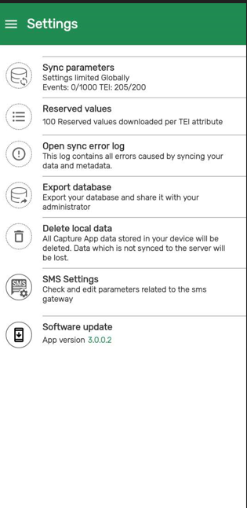

# Learner's Guide on APK Distribution Web App

## What is this guide?

This guide contains all exercises and detailed steps to perform them related to the APK Distribution App for the Android Level 1 academy. Please perform each of the exercises when prompted to by your instructors

## Learning objectives for this session

* Install the APK Distribution Web App
* Describe how the APK distribution web app can be used to update the DHIS2 android version

## Exercise 1: Installation of the APK Distribution Web App

***This exercise must be performed in groups. You can use the ADMIN account for the system to perform these exercises***

Username : android.admin

Password : District1#

To use the APK Distribution Web App you need to first install the app by going to DHIS2 web interface

* Go to Search Bar and Search for the App Management app
* Go to the App hub
* Click on APK Distribution App
* Install the App

_NOTE: The APK Distribution Web App is compatible with DHIS2 version 2.36 and above._

Refresh DHIS2 and access the APK distribution web app from the apps menu.

The first time you open it, it will ask you to apply the default settings to the app.

Select "Set defaults and save."

### STOP - End Exercise 1

## Exercise 2: Modifying the app version that is downloaded

***This exercise must be performed in groups. You can use the ADMIN account for the system to perform these exercises***

Username : android.admin

Password : District1#

### Upload version

Follow the steps below to upload an Android app version:

* Click on Upload new version button.
* Assign a version number. Be very careful that the version number matches exactly. If you want to use 2.8.2, enter the full numbers. For 2.9, enter 2.9 ONLY!
* Choose the minimum and/or recommend Android OS version.
* Add a URL that contains the APK of the Android app.
* Click on the "Create app version" button.

So in this case we want to upgrade a to new version -
2.9

So, for this we will follow the below steps:

* In the **Version** we will add latest version - 2.9
* You need to add a **Minimum Android version** that the app should support which is 5.0.2
* In the **Recommended Android vesrion** we will add 8.0
* In **Download URL** - you can go use 
the Github Link to retrieve the version you need (https://github.com/dhis2/dhis2-android-capture-app/releases)
 
  * Select the apk file you want and copy the link. In this scenario, use the training version of the APK file.

* Go back to the DHIS2 web interface and paste the link.

_NOTE: When uploading a new apk, make sure that the app version is higher than the current/latest version_

* When all the details are filled in, select Create app version

### Delete version

To remove an Android App version:

* Search for the Android app version to delete.
* Click on "Delete".
* Click on the "Delete" button.

### Installing the upgrade

Now that you have set a new version of the DHIS2 android app on your device, log back in to your android device. 

You will receive a notification that a software update is available.

If you select download now, it will download the apk file and you can install it on the device.

If you do not receive this notification, you can navigate to the settings page on the android app and select "Software update"

From here, you should receive a notice that the new version is available.

STOP - End Exercise 2