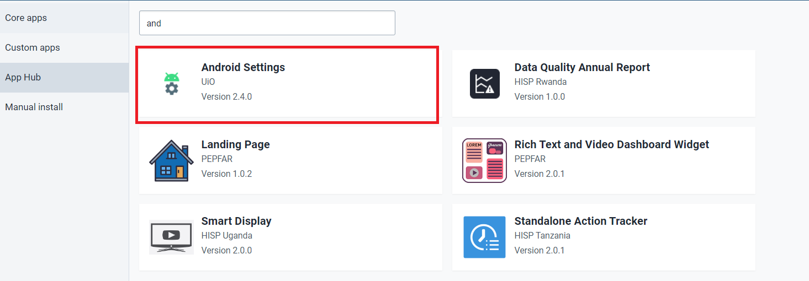
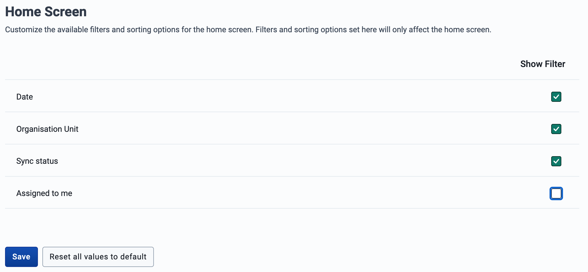
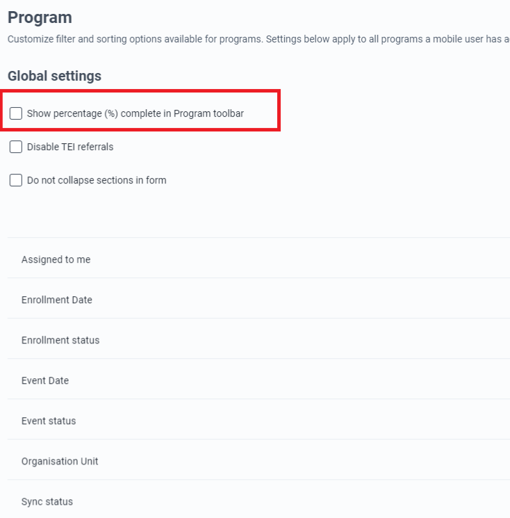
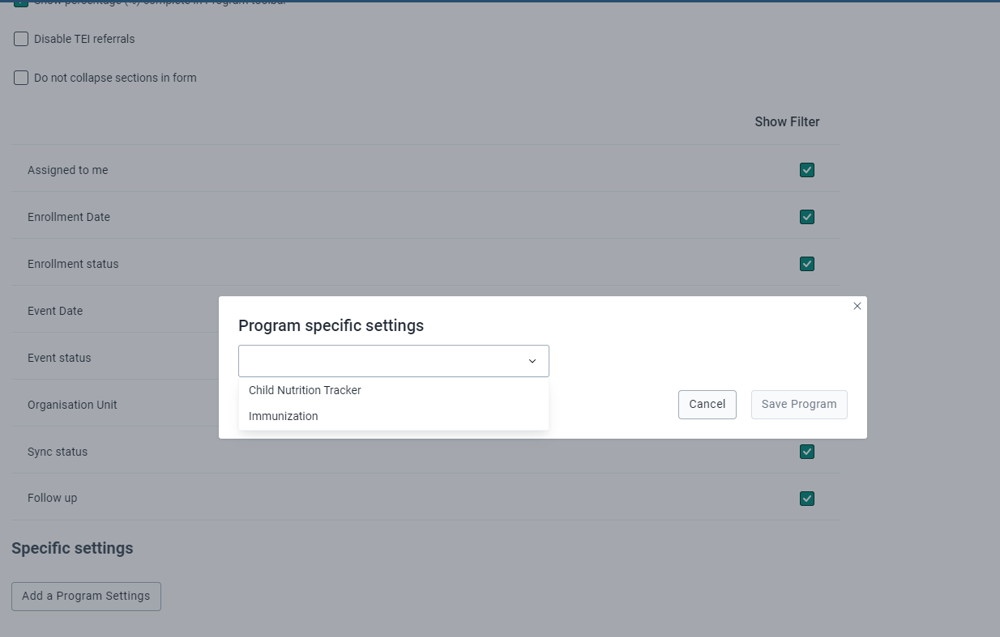
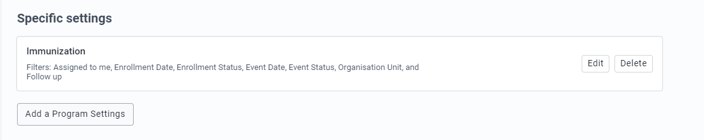
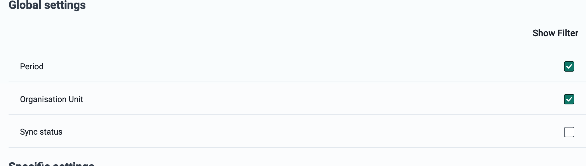
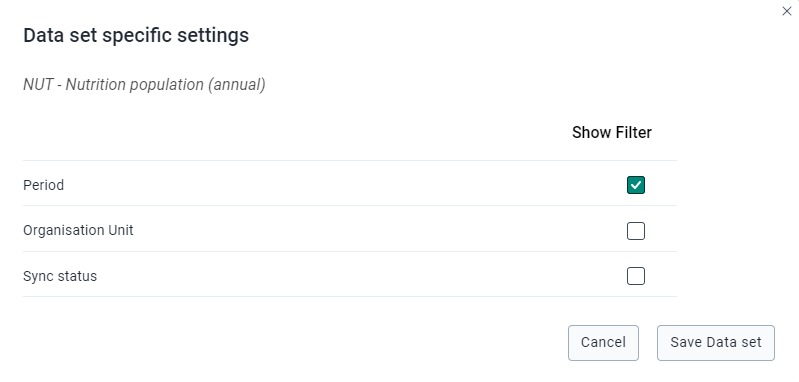

# Learner's Guide for the Android Settings Web App (ASWA)

## What is this guide?

This guide contains all exercises and detailed steps to perform them related to the review of ***The Android Settings Web App (ASWA)*** for the Android Level 1 academy. Please perform each of the exercises when prompted to by your instructors

## Learning objectives for this session

* Demonstrate how to Install the Android Settings Web App
* Describe how to navigate through the Android Settings Web App
* Demonstrate how to alter the appearance of the programs and data sets using the the Android Settings Web App

***This exercise must be performed in groups. You can use the ADMIN account for the system to perform these exercises***

Username : android.admin

Password : District1#

## Exercise 1: Installation of the Android Setting Web App

To use the Android Settings Web App you need to first install the app by going to DHIS2 web interface

* Go to Search Bar and Search for the App Management app
* Go to the app hub
* Click on Android Settings
* Install the Android Settings App

### STOP : End Exercise 1 

## Exercise 2: ASWA Home Screen Settings in the Appearance Section

This section allows the admin user to enable or disable the option to show the filters related to Date, Organisation Unit, Sync Status, and Assigned to me on the Home screen.

In the current setup you can see all of the options are enabled.

* Disable the filter Assigned to me and Save.

  
  
* Now Go to the Android App and sync your changes (make sure you go to Settings -> Sync Configuration now, to sync the changes that were done in the Android settings web app)
* Now go to the Home Screen.You will see the below screen with only the Date, Org Unit and Sync options in the filter.

  

### STOP : End Exercise 2 

## Exercise 3: Program Settings in Appearance Section

The Program appearance section allows you to hide/show features within the program according to the configuration needs. These changes can happen globally, applying to ALL the programs or can alternatively be applied to a SPECIFIC program.

### Global Settings

Percentage (%) complete in Program: Enable or disable the option to show the completion percentage of the data entry form.

TEI referrals: This allows you to switch off/on the TEI referral option.

Collapse sections in form: The Current behavior lets the sections collapse and expand in an accordion style. This option overrides the behavior by keeping all the sections of the form (registration and events) open and removing the "next" button in each section.

For this session you can

* Disable “Show percentage (%) complete in Program toolbar”
* Go to Android Device to check the changes. 
* Make sure you perform Synchronization by going to Settings &lt; Sync Configuration
* Show the enrollment Screen to see the changes.

    

### For Program specific settings

To add a program specific setting:

* Click on _Add a Program Settings_, and a dialog will appear.

  
 
* Click on the dropdown that will show a list of programs.
* Clicking on a program will show the different filters to configure.

  

TEI without searching: Offer online and offline search, as well as allowing the user to create a TEI without a prior search.

TEI Header (**New 2.3.1**): Assign a specific attribute or expression that will be displayed as a header in TEI cards.

**_Note:A notice box will be displayed if the selected program lacks expressions related to program indicators that are valid for Android._**

If any specific settings have been saved, a table will summarize the particular configuration per program, and the options to edit or delete these settings.

For this exercise you can,

* Go to the Immunization Program
* Enable “Allow the user to create a TEI without searching”

    

* Save the program

To test this you need to log back into your android device and Sync your configuration

* Go to the Immunization program and you should be able to to create a TEI without searching

### STOP : End Exercise 3

## Exercise 4: ASWA Data Set Settings in Appearance Section

The data set settings allow you to customize filter and sorting options available for data sets. 

* Settings can apply to all data sets a mobile user has access to. 
* Settings specific to individual data sets can also be applied.

### Global settings

The first part is for global settings that apply to all data sets an android user has access to.

In this section you can disable Sync Status filters from the Global Settings and Perform the same steps as above to see the changes in the Android device.

### Specific settings

To add a specific setting:

* Click on _Add a Data set Settings_. A dialog box will pop up with a dropdown with a list of data sets.
* Click on a data set, and a list of options to enable or disable filters will be displayed.

### STOP : End Exercise 4