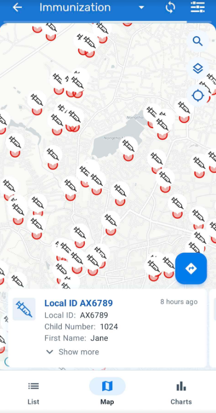
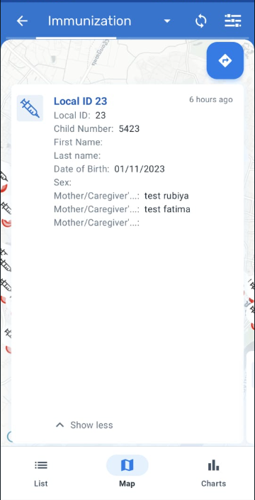
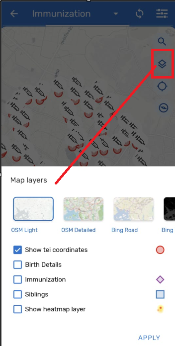
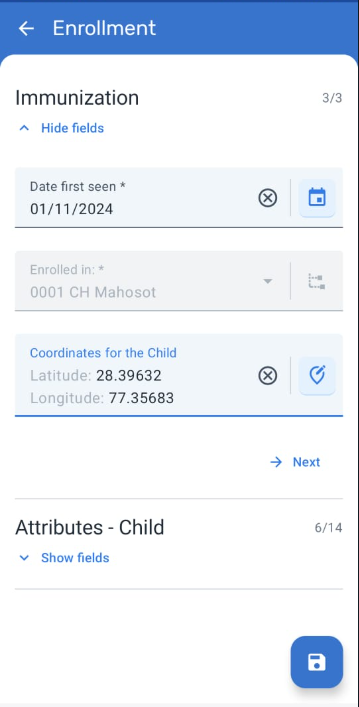
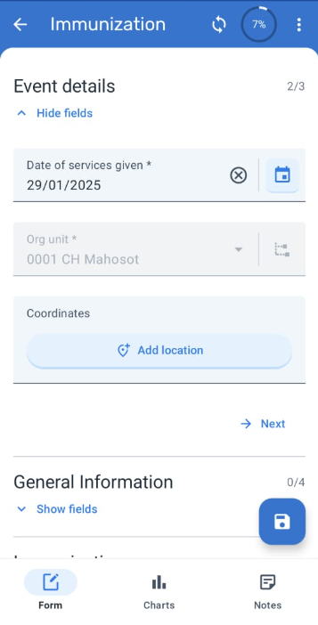
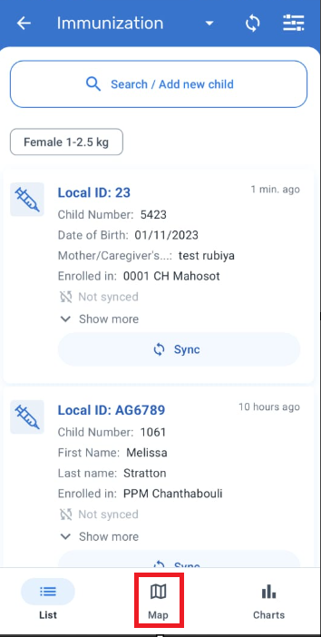

# Learner's Guide for Maps

## What is this guide?

This guide contains all exercises and detailed steps to perform them related to the review of ***Maps*** for the Android Level 1 academy. Please perform each of the exercises when prompted to by your instructors

## Learning objectives for this session

1. Describe how maps can be used in DHIS2 Android Device
2. Demonstrate how to collect and display tracked entity and program stage coordinates
3. Demonstrate how to toggle additional options within maps on an Android device

## Exercise 1 - Interface Review and Showing enrollments on a map

- Open the immunization program from the android home screen
- Select the map icon within the event line list page for this program

This will display all of the enrollments stored on device withi coordinates. In this case, we can see coordinates are spread out a bit. Let us zoom in on Lao

What we are seeing here is the location of children with a coordinate within the immunization program. Note it is only showing those TEIs that have been synced with the android device and have been enrolled in org units that this specific user has access to.

From this page, we can filter out various individuals and also select individuals so we can see their details.

If I select one of the TEIs on display, I can see their details. I can expand these details by selecting the arrow button beside their details.

By selecting the arrow button on this screen, you can open the location of this person within the mapping app of your choice. This could be useful if you want to perform some type of follow up with this individual

From this page, you can also modify some of the options in the map by selecting the menu button

From this menu you can change the map background layer and make other adjustments. These will be discussed more later on in this session.

Additionally, you can also search for specific TEIs on the map by using the search icon.

Let us search for the child with the Child Number : 8212. These will display their location along with their details which you can expand to review further.

#### STOP - End Exercise 1

## Exercise 2 - Enrollment Coordinates 

In this session our main objective is to understand how to add coordinates in the tracked Entity Instance using the Immunization program and the Program Stage coordinate.

### TEI coordinates

You can Capture the TEI coordinates in the registration form of the Immunization program. To get this feature we need to enable this feature in the tracked enity type (TET) feature type (for this demo it has already been configured for Immunization program).

Now let's start with the first TEI coordinate (that represents the child's home) “Coordinates of the Child”

Before understanding how its captured in the android device lets see how this is configured in the web interface.

#### Web Configuration

These coordinates are configured via the tracked entity type.

#### Switch back the to the Android device

* Open the Immunization program
* Either Search for an existing child and select "Open Child Details" or create a new child.

* Review the coordinates field for the child. This is where we can assign the childs home location.

To do this you have two options

1. The First option will select the exact latitude and longitude based on your current location.

2. The Second option will open the map where you can select the location of your choice and Save it.

#### STOP - End Exercise 2

## Exercise 3 - Program Stage Coordinates

### Capturing a Program Stage Coordinate

This is also configured while designing the program. In this case we have set an Immunization stage in the Immunization program and we have used Feature type as Point while configuring the program stage.

### Web Configuration:

* Connect to the web with the Administrator account and go to Maintenance > Program
* Immunization Program and Program Stages
* Select your Immunization Program based on the user assignment provided to you
* Select Feature type as point

### Capturing Program Stage coordinates in Android

* Open the Immunization program
* Either Search for an existing tracked entity or Create a New Registration.

* Open the Immunization Stage
* Click on Add New 

* Capture Coordinates for New Event for Immunization Stage (This will help in further analysis where we can track from where child is getting immunized)

* The First option will select the exact latitude and longitude of the device
* The Second option will open the map where you can select the location of your choice and Save it

#### STOP - End Exercise 3

## Exercise 4 - Mapping Relationships for a Program

### Relationships in Maps

A relationship is considered data in DHIS2 and is based on a Relationship Type, similar to how a Tracked Entity Instance is based on a Tracked Entity Type. Relationships always include two entities, and these entities can include Tracked Entity Instances, Enrollments and Events, and any combination of these.

In this case we have configured a Relationship type “Siblings” which is bidirectional.

### Online configuration:

* Connect to the web with the Administrator account and go to Maintenance > Program
* Relationship type
* You can observe the Siblings Relationship already created.

_Note : We will talk in detail about this in Relationship session_

### Relationships in Maps

In tracker programs, the user can see relationships on a map by tapping the map icon on the relationships tab.

Search for the person with the Child Number 1024 (Jane Thompson)

* An arrow is shown on the direction of the relationship.
* For bidirectional relationships, the arrow points both sides.
* Each relationship type displays a different color.
* If one or both TEIs have a polygon as coordinate, the line goes from (and to) the nearest point in the polygon of both TEIs.

To show this feature, select the map icon from the event page line list screen for the immunuzation program. 

This will show all of your TEIs on the screen.

To show the relationships, select the menu button from within the maps interface then select Siblings and Apply.

Once applied you will see bidirectional arrows from both TEI as the Relationship type is bidirectional.

#### STOP - End Exercise 4

## Exercise 5 - Changing the map layer options

### Map Layers

When displaying maps from the event line list or within a specific TEI, there are different layers that can be displayed by clicking on the settings button on the upper right corner. The user can select one or more layers to be displayed. Both coordinate and polygon types will be displayed. The layers are dependant on the type and configuration of program as explained below:

* Map layers: you can select the base layer used in your map
* Show events (For programs without registration)
* **TEI coordinates** (By default in programs with registration)
* Enrollment Coordinates (Only for programs with registration)
* **Program Stage coordinates** (Only for programs with registration)
* **Relationships** (Only for programs with registration)
* Heatmap (Only for programs with registration)
* Tracked Entity Attributes (Coordinates Value Type - Only for programs with registration)
* Data Elements (Coordinates Value Type)

You can toggle some of these layers to see the effect this has on the map.

#### STOP - End Exercise 5
