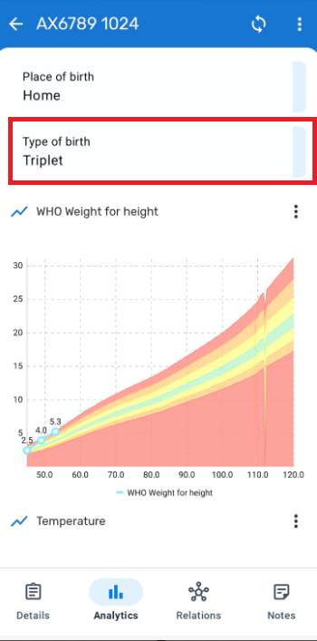

# Learner's Guide for Program Indicators

## What is this guide?

This guide contains all exercises and detailed steps to perform them related to the review of ***Program Indicators*** for the Android Level 1 academy. Please perform each of the exercises when prompted to by your instructors

## Learning objectives for this session

1. Demonstrate how to configure program indicators based on a single person
2. Demonstrate how to display messages from a program in the indicators panel based on a single record

## Exercise 1 - Configuration - Program Indicators - Change in weight

Let us create the program indicator to display the change in weight for the immunization program.

Navigate to maintenance -> Indicator -> Program Indicator and select the plus sign.

The program indicator tab is seperated into 3 tabs:
1. Details
2. Expression
3. Filter

We will follow the workflow in these tabs to edit our program indicator.

### Program Indicator Details

Lets have a look at the details section first. We need to select/enter:

- The program we are making the indicator for
- The name, short name, code
- Note that the color and icon have no effect on the program indicator!!
- The description
- The decimals

After these descriptive details, we have a number of additional details

- Aggregation type: Determines how the value is treated as a summary within the org unit hierarchy
- Analytics type : Event vs. Enrollment
- Organisation unit field. By default we will leave this as Enrollment organisation unit
- Analytics period boundaries: These are defined by default. There use is out of scope for this course. Note that custom boundaries do not work on Android currently.
- The "Display in form" checkbox. We need this selected if we want our indicator to appear in the indicators panel in the android or web app.

As you are explaining these fields, you can enter in relevant details to define the indicator. Note the following:

- Use your initials just for exercise purposes. This is not needed in a real implementation.
- Aggregation type is Average. This will allow us to calculate the average change in weight within the program for every child.
- The analytics type is enrollment. This is because we are taking inputs from more then one event/stage within the program.
- The period boundaries have not been changed. Do not change them if doing anything on android!
- Display in form is selected. This will allow the indicator to be displayed within the indicator widget both in tracker capture and on the android device

If you keep scrolling down, you will see they are additional fields; however you can leave these blank for now. 

### Program Indicator Expression

In the program indicator expression, we define what we want our program indicator to do.

In this case, we want to take the most recent weight value and minus the weight value at birth. This means we take the weight value from the immunization stage and - the weight value from the birth details stage.

This is where the enrollment type indicator becomes important, as you are taking values from multiple stages in the program. As the immunization stage is repeatable, note that the weight value will be taken from the most recent event.

### Filter

The filter is where we define what criteria needs to be met for the program indicator to run. 

In our case, we can make a condition that both weight values from the immunization and birth details stage need to have values before the expression runs.

### Check the config on Android

After you have saved your program indicator, sync your config. Ensure you enter relevant weight details in the birth details and immunization stages and check the indicator panel for your program. You should see the indicator displaying the change in weight.

#### STOP - End Exercise 1

## Exercise 2 - Configure feedback using program rules

In the demonstration, in addition to an indicator which uses data from the TEI, we also noted several feedback messages in the indicator panel, including the place of birth, mode of delivery etc.

This is actually configured using program rules.

TO configure this program rule we can follow this workflow:

1. Create the program rule variable based on what you are going to evaluate
2. Create the program rule
   1. Edit the details
   2. Add an expression
   3. Define the action

Let us try to show the Type of birth on the indicator panel.

### Create the Program Rule Variable

In order to do this, we need to start by creating a program rule variable for the type of birth as that is what we will be evaluating.

Navigate to maintenance -> Program -> Program Rule Variable. ***Select your program*** and create a new variable.

Note the source type being used in this variable. The birth type comes from the first stage in program. You could be navigating to different stages in the program, and this would not be evaluated if you selected "data element in current event" for example which is often a common source type. 

Also, see that "use code for option set" is NOT selected. This is because we want to display the same name for the birth type as is defined in our option set in the indicator panel.

### Create the Program Rule

After you have created your variable, Select program rule from the left side menu then create a new one.

#### Details

Give the program indicator a name and a description

#### Expression

For the expression, we want to have the birth type display on the indicator panel as soon as there is a value for birth type selected. We can use d2:hasValue as our condition to check this.

#### Action

Let us now define our action. 

- Our action will be display key/value pair.
  - In plain terms, this means we can pair static text with a value pulled from our program configuration
- Next, we can define our display widget. Here, we can select the program indicator widget. The feedback widget is also available in tracker capture on web.
- Our key label is our static text (ie. text that we define and does not change). Here we can put birth type as our label.
- Expression to evaluate and display as value. This is where we can select a variable to pair with our static text. In this case, we want to show the birth type so we can select the variable we created. As we are displaying this in the indicator panel as text, note that from before we did not use the option code to define our variable. This means we should see the name, not the code, when we display this value.

Save the program rule.

### Check on Android

Go back to your device and sync your config. Enter a value for the birth type in your immunization program and navigate to the analytics tab. You should see the birth type displayed within the panel.

#### STOP - End Exercise 2