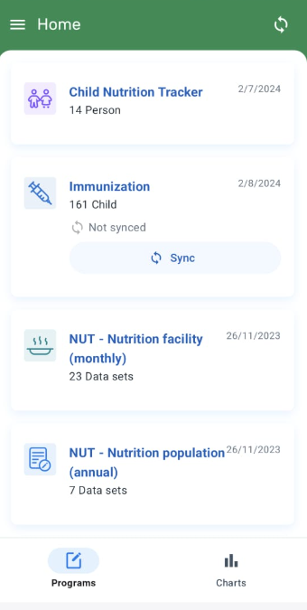

# Learner's Guide for Program Rules

## What is this guide?

This guide contains all exercises and detailed steps to perform them related to the review of ***Program Rules*** for the Android Level 1 academy. Please perform each of the exercises when prompted to by your instructors

## Learning objectives for this session

1. Explain the differences between Program Rules in the web and the Android version
2. Create a program rule in the DHIS2 web app
3. Demonstrate how to sync program rule changes in the Android app
4. Trigger a program rule that you have created
5. Describe how Program Rules operating in Android can improve data quality

## Exercise 1: Program Rule Configuration in Maintenance

In this session we will focus on how we have configured the above program rule in the DHIS2 web interface.

1. Connect to the DHIS2 web instance with your Administrator account and go to Maintenance -> Program

2. Explain the left menu and how this session focuses on
    1. Program rule

    2. Program rule variables

3. Open the program rule variable menu in order to create a new variable (by clicking on the (+) button on the bottom right corner). (Note: we are creating a program rule variable that is needed to create the program rule).
   1. Select the Immunization program. *Explain that every student should be performing this on their own program.* 
   2. Choose the name of the variable, in this case we will be using "temperature"
      1. We don't mark the "Use code for option set" as this variable is a numerical one and it does not apply on our case_
   3. Select "Data element in current event" on the _Source type(*)_field
   4. Select the data element "Temperature" from the dropdown list.
   5. Save the program rule variable when you are done.

4. Open the program rule menu and create a new program rule

    a. Select the Program defined for the training. ***You MUST use the program that you have been assigned.***

    b. In the program rule details tab

    1. Choose the name of the name of the program rule. To find it more easily, particpants can use their initials.
    2. Choose the decscription of the program rule.
    3. Leave the priority blank in this case. 
    
    c. Select the program rule expression tab

    4. Define the condition as temperature >37. 
    _Explain that the condition needs to be something which is true or false, that the box underneath can help and that there are some differences between web and Android that are listed in the documentation.[Click Here](https://docs.dhis2.org/en/full/use/dhis2-android-app.html#capture_app_pr)_

d. Enter the define program rule actions tab

1. Create a new program rule action by clicking on the (+) button. _Explain that a program rule can trigger multiple program rule actions_

2. Define the action as "Show error". _Explain that these actions are the list of possible actions but are not covered here and that students can go to the documentation. Also explain that some might be not supported in Android as listed in the documentation.[Click Here](https://docs.dhis2.org/en/full/use/dhis2-android-app.html#capture_app_pr)_

3. Choose the Temperature data element from the drop down "Data element to display error next to". _Explain that some actions (show warming, show error, etc) will require an element where the information should be displayed. In this case we select the data element which triggered the error but could also be an attribute or a widget (for some cases)._

4. Add **"Vaccination should not be given to the child until the fever subsides. The temperature is currently**" in the static text.

5. Add the variable Temperature to the "Expression to evaluate and display after static text." This will display the actual value of the program rule variable that you have selected after the static text message.

6. Click on commit to create the program rule action

### STOP - End Exercise 1

## Exercise 2: Program rule review in Andriod 

1. Log in into the Android device.
2. Perform a **metadata synchronisation** to retrieve the changes made on the web app by going to the Menu (upper left corner) > Settings > Sync configuration > Sync configuration now. 
_This retrieves the latest metadata updates from the server_

3. Go to the Immunization program and check if the rule is working by following the same steps as PART 1. You may need to enter a new TEI if there are none existing in your program.

### STOP - End Exercise 2