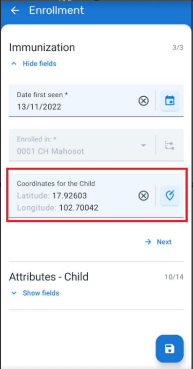
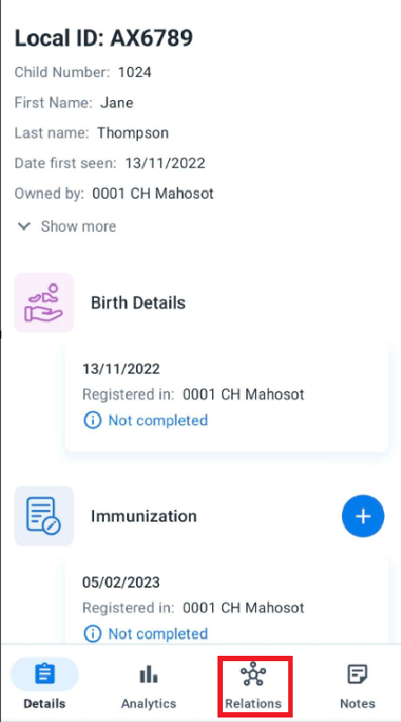
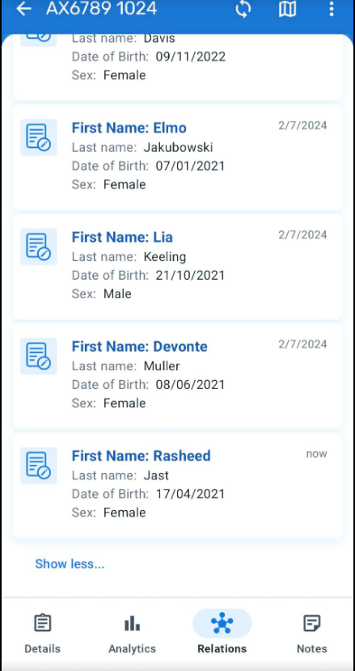
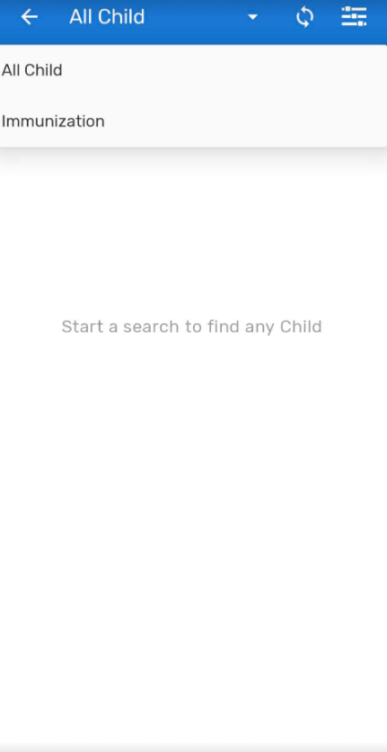
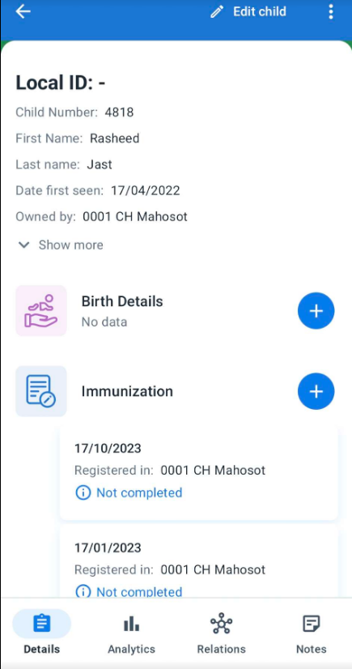
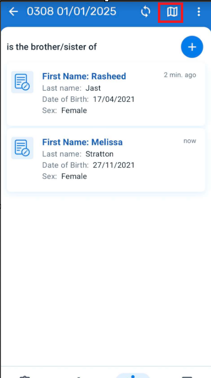
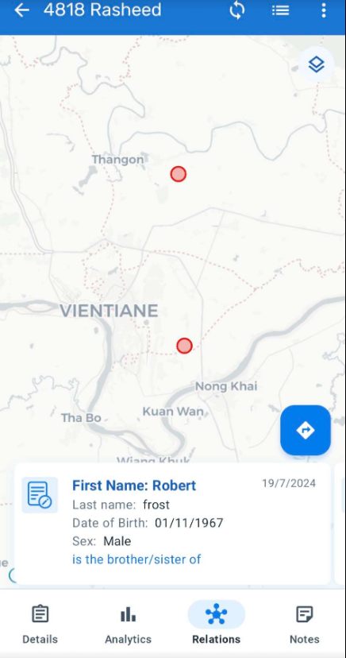
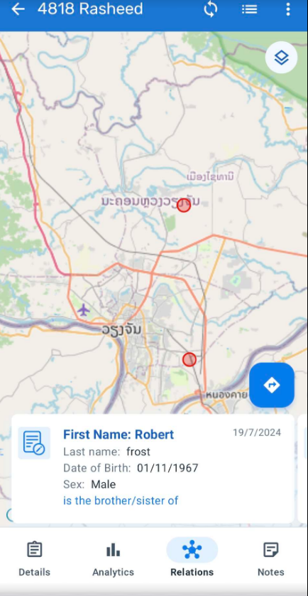
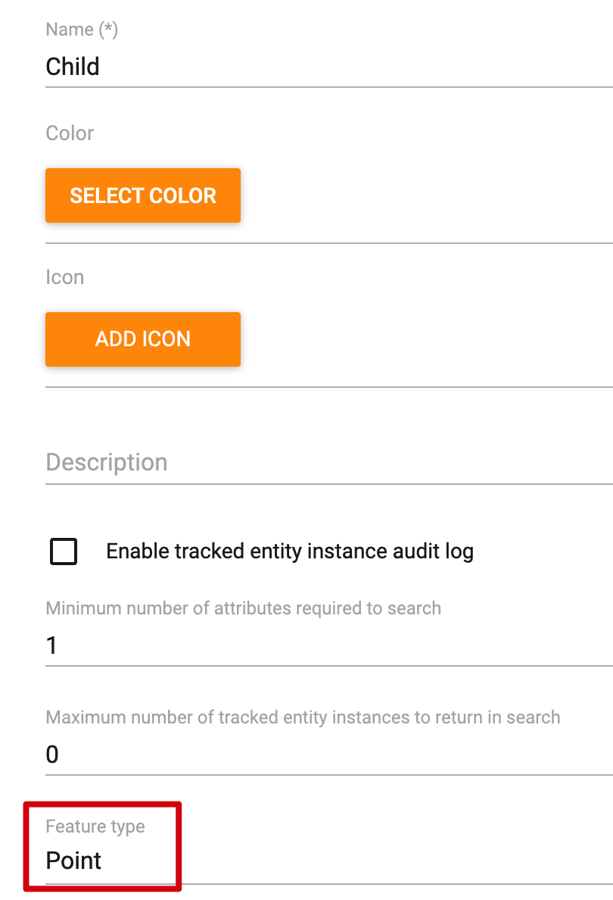
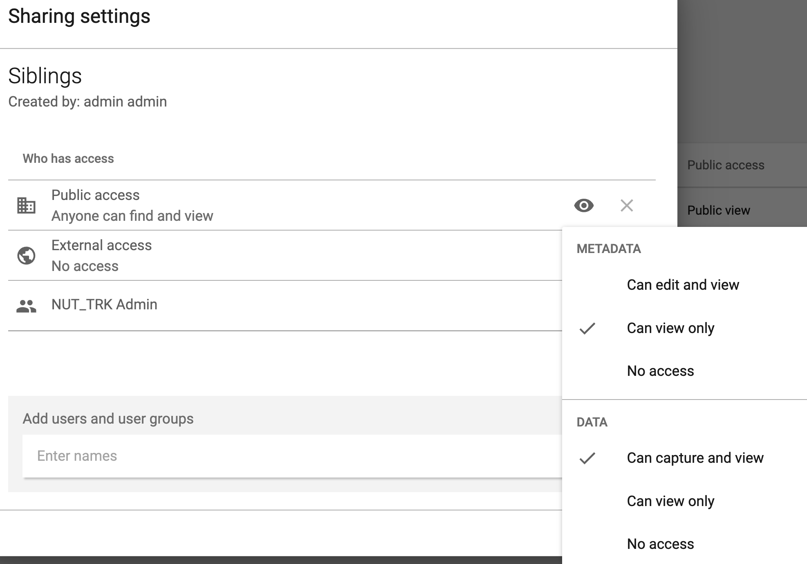

# Learner's Guide for Relationships

## What is this guide?

This guide contains all exercises and detailed steps to perform them related to the review of ***Relationships*** for the Android Level 1 academy. Please perform each of the exercises when prompted to by your instructors

## Learning objectives for this session

1. Create relation types to be rendered in android
2. Create relationships between people
3. Demonstrate how to render relationships as a list or in a map

## Exercise 1 - Adding and viewing relationships

### Adding relationships via search

***Perform this exercise using the DEMO program***

To start the relationships session, add a new person to the immunization program.

When you are enrolling the new person, make sure you select enrollment coordinates. These will be important later on when you map the relationships.

To make things easier, select a coordinate within Lao as thats where all of the other cases are located (by default it will pinpoint your current location so you may need to zoom out of the map)

Enter the remaining details of the child and save the child to proceed.

Select the relationships tab to be taken to the relationships page

From here, select the plus button and tap on siblings to add a new relationship

By default, it will allow you to search all TEIs that are the same TE type as you are currently using.

In this mode, you can use search criteria to find the child you want. 

Tap on the child after you have found it

This will take you back to the relationships list and you will see the child at the top of the list

### Add relationships via list

You can also add relationships by selecting a child from within a program. 

Navigate back to the relationships page and add a new Sibling relationship.

Instead of tapping on search, select the dropdown where the TE Type is listed.

From here, you can select a program instead of using all TE of the same type as your search criteria.

After you select the program you will see the list of TEIs within that program. The search box is still available at the top, so now you have the option to either search for the TEI or select the TEI from the available list.

If you select a TEI from the list you will be taken back to the relationships page and will see they have been added.

#### STOP - Exercise 1

## Exercise 2 - Interacting with relationships

***Perform this exercise using the DEMO program***

From the relationships page, you are able to interact with these TEIs. If you select one of the TEIs

It will show you the programs that the TEI is enrolled in.

If you select a program, it will take you to that TEIs enrollment in that program. 

### Mapping relationships

Go back to the original TEIs relationship page by selecting the back button.

In addition to displaying these relationships as a list, we can also display them in a map view. We do this by selecting the map icon on the relationships page.

This will then display a map showing the TEI we are working with along with the locations of any other children they have a relationship with.

We can tap on the lines on the map or use the carousel at the bottom of the screen to select from the different TEIs available here.

On this page, we are able to change the base map if needed. We do this by selecting the map settings icon.

From here, we can select a different basemap then tap apply to apply our changes.

In order to go back to list view from the map, select the list view icon from the top. 

#### STOP - Complete Exercise 2

## Exercise 3 - Configuring Relationships

***Perform this exercise using the account made for YOUR PROGRAM***

### Tracked Entity Type

Before we get into managing and creating a new relationship, it is useful to understand how a TE types configuration affects how relationships will function on android.

***Log in via the administrator android account that has been assigned to you***

Navigate to maintenance -> program -> tracked entity type to get to the tracked entity types page and select the "Child" TE type.

There are two main items we want to discuss here

1. How collection of coordinates allows you to create a mapping of relationships
2. How selecting and managing tracked entity attributes for a TE type affects your search paramaters

#### Coordinates

Within the child TE type, scroll down to Feature type. This is set to point in our example. 

Notice some other parameters that we didn't use but could be useful in the future: color and icon. 

From the sessions on visual configuration and visual data entry we have some understanding of how this might affect the android app, as we can assign a specific color and icon for these TE types and it will alter the visual appearance accordingly.

#### TE Attributes

Next scroll down to the tracked entity attributes section. Here, we are assigning tracked entity attributes to the TE type, not a specific program. This means any program using TEs of this type will have at least these TE attributes.

Scroll down a bit more where you will see the attributes along with a matrix of checkboxes.

Here, you decide which attributes appear in various lists as well as which ones are searchable. Recall that when we were adding a relationship using the CHILD TE type, we were able to enter some search criteria. That is defined within this page. Those attributes in which "Searchable" is selected can be used to search for any Child, in both the web and android app. 

### Relationships

We define relationships via the "Relationship type" section in maintenance. It is no different then any other tracker program, whether using web or android.

To see them, they need to be properly shared. On android, when we add a relationship, we have to select the relationship type. These are all defined here. 

You can set up constraints to control the program in which relationships can be made, or leave it open so the TEI can make relationships with any other TEI. For practice, you can create a new relationship type if you need to.

1. Navigate to Maintenance
2. Select Program
3. Select Relationship type
4. Click on the blue plus sign to add a new relationship type
   1. Give the relationship type a name
   2. Decide whether or not the relationship is bidirectional (does the relationship work in both directins or not)
   3. Decide what will be seen when the relationship is being created in the user interface
   4. Add to and from constraints if needed
5. Save the relationship
6. Change the public sharings settings
   1. Metadata : can view only
   2. Data : Can capture and view

As long as the relationship is shared correctly, it should be available from within the android app. You will need to sync your metadata after creating the relationship type in order to see it on the device.

#### STOP - Complete Exercise 3