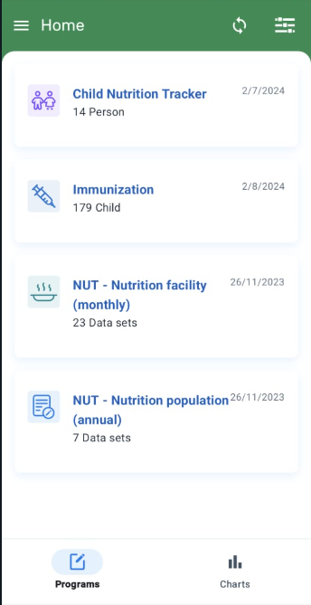
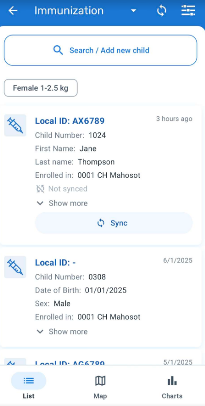
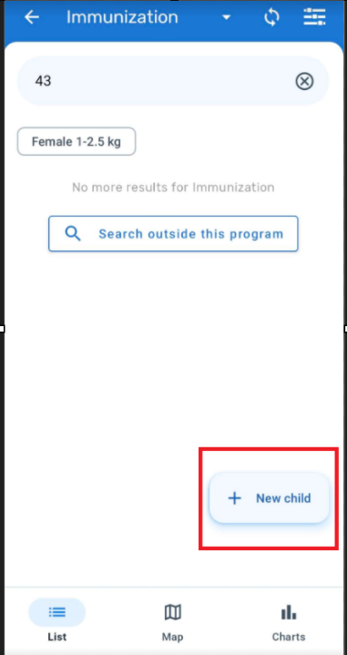
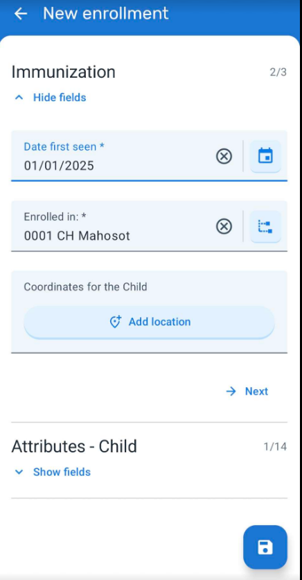
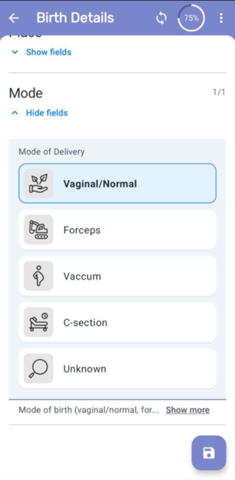
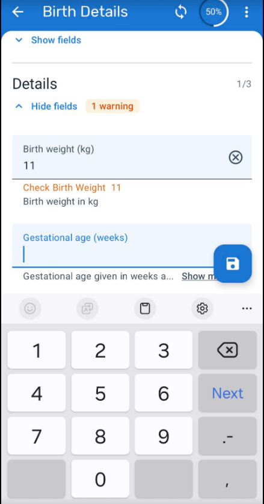
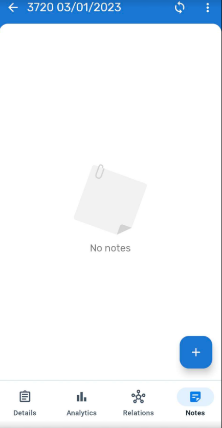

# Learner's Guide for Intro to Tracker Data Entry

## What is this guide?

This guide contains all exercises and detailed steps to perform them related to the review of ***Tracker Data Entry*** for the Android Level 1 academy. Please perform each of the exercises when prompted to by your instructors

## Learning objectives for this session

1. Demonstrate how access tracker programs on Android
2. Demonstrate how to navigate the tracker interface on Android
3. Demonstrate how to create a new TEI/person on Android
4. Demonstrate how to add and edit program stage/event data on Android
5. Describe additional features that are available from within the TEI dashboard and Android homescreen

## Exercise 1: Navigation of the program

### Log-in, Home Page and Event Listing

1. Log-in to the android application
2. Review the organization unit and program assigneds to you
3. Briefly describe the functionalities of the home screen

   

4. Select the Immunization Program
5. You will see the list of all entities/child who are enrolled in the specific program that you have selected (This is called as Event listing for event and tracker programs)

  

- Review the ”Bottom Navigation Bar” (The bottom navigation bar allows switching the visualization mode of the program if the event or tracker program have been defined with coordinates). We will discuss this in detail in another session.

         

**Registration**

The first step is to SEARCH the TEI based on the searchable attributes to make sure that the child does not exist in the system prior to registering a brand new child. 

    

1. To Register a New Child , Click on Create New
 
   

2. In the Android app you need to select the organisation unit and the reporting date or the registration date (in this case Date first seen)

3. Next demo the enrolment data page that has been configured: followed by the attributes - child section.(Briefly describe the sections)

4. Explain that you can capture child coordinates(In android app it will automatically capture the coordinates based on the location of the device when selecting the coordinate icon) But this will be talked in detail in future session.
  
   

5. Select the disk icon (save icon) to register the person and be taken to the first stage

   

#### STOP - Complete Exercise 1

## Exercise 2 - Data Entry

### Entering Data in the Stages

STAGE 1: Birth Details

* To create a new event, the user needs to tap on the plus + icon beside the stage card follwed by "Add New" 

> Note: This icon is always visible unless the stage is non-repeatable and already created. When the user taps on the button, that program stage will unfold showing to the user all the already existing events of that particular program stage.

* Click on Event Date and Select Next

    

* You will see the Birth Details Stage: Here you can show how data entry fields are grouped in different sections: Details,Type,Place,Mode. This is based on the configuation for your program stage data entry form. Enter data for the stage to proceed.

_NOTE : Trainers should make sure they get well versed with the program rules in order for them to understand program errors if any._

### Saving the Data

After tapping on the 'save' button, if the form does not contain any errors, warnings or empty mandatory fields, the app will ask if the user wants to complete the form.

Two options are given to the user:

* 'Not now': The app saves the form and goes back to the event listing screen (or TEI dashboard for tracker programs). The status of the event will remain open.
* 'Complete': The app saves the form and goes back to the event listing. The status of the event changes to complete.

> Note: For further practice, you can also add events to the immunization stage and enter data within those events.

### STOP - Complete Exercise 2

## Other Features in the event form:

Trainers can briefly demo the below features and their functionalities:

### Field completion percentage

The percentage of data completed in each event is shown in the top right corner of an event when it is opened after first registration.

### Sections Navigations

The sections can be collapsed for a simpler user experience. Sections in enrollment forms are also supported and are aligned with the design of the event sections.

### Error messages

The app will list the name of the mandatory fields missing or the field which is outside normal range when the user tries to complete an event or enrollment. The sections containing the missing fields will be highlighted to help the user find the missing fields.

### Event Notes

It is possible to add notes to events in single event programs and program stage events. Notes are available in a new tab at the data entry form.

### Map Carousel

On the map view of the program (you have to select this map view from the event line listing of the program), a carousel of cards is displayed, one for each enrolled TEI (Tracker programs) or Event (Event programs). Chances are dots will appear all over the place in case people have added events based on their own location. If you zoom in on Lao however, you will see many TEIs that can be viewed.

* TEI cards on the carousel follow the same design as the TEI list view.
* When scrolling horizontally the carousel, the map zooms into the selected coordinates. If the coordinate field is empty a message is shown instead.

**TEI Card Design** will display as much information as possible considering the constraints of screen size.

* Last update date
* The first 2 attributes with display in List option
* If there are more, there will be an arrow to display the full list
* Enrollment org unit
* Enrollment status label if completed or canceled
* Overdue icon if an overdue event exists with the most recent overdue event date
* Follow-up icon if the TEI is marked
* Card image (one of the following options):
* Profile picture when available or
* First letter of the first attribute or
* Tracked Entity Type icon

### TEI DASHBOARD:

Navigation panel in TEI Dashboard:

To simplify and personalize the user experience, the user interface actions offered to the user at the TEI dashboard will be tailored to the specific configuration of each program.

### Relationships

The relationships tab will be visible if the program relationships are not configured (In this case it has been configured to add a relationship of a sibling)

### Additional features

In the TEI Dashboard click on the three dots in the upper right corner and explain the following functionalities

Share a TEI : The "Share" button has been removed from the TEI dashboard and the functionality to share a TEI through QR code has been relocated on the three vertical dot menu, at the top right corner of the screen.

Complete/Deactivate Enrollment : To complete or deactivate an enrollment, click on three dot menu in the upper right corner and select "Complete" or "Deactivate"

TEI enrollment history and new enrollment (Program Enrollment) : Users can see the complete historical records of the TEI. Clicking on the upper right corner menu, select "Program Enrollments". A list of "Active enrollments" will be displayed, followed by a list of "Past enrollments" (completed or canceled), followed by the programs in which the TEI could be enrolled. Users can also return to the "TEI Dashboard" without any program' by selecting "All enrollments".

Delete TEI's & Enrollments : To delete a TEI or an enrollment, select the desired option in the three dots menu of TEI dashboard. Local TEI or Enrollments will be deleted from the database. Records that has been previously synced with the server will be marked for deletion if the user has the following authorities:

* F_ENROLLMENT_CASCADE_DELETE
* F_TEI_CASCADE_DELETE

Group view of Program stages in TEI Dashboard : The TEI Dashboard offers the possibility to change the list of events from the chronological view to a stage grouping view. The stage grouping view will group and collapse the events per program stage. Each program stage group can be expanded by the user and the events will be displayed chronologically.