# Learner's Guide for Relationships

## What is this guide?

This guide contains all exercises and detailed steps to perform them related to the review of ***Relationships*** for the Android Level 1 academy. Please perform each of the exercises when prompted to by your instructors

## Learning objectives for this session

1. Configure the flag and colour for a DHIS2 instance
2. Demonstrate how to apply colours and icons to data sets and programs
3. Demonstrate how to configure metadata to read QR codes
4. Demonstrate how to configure option sets to display using different rendering types
5. Demonstrate how to configure images

## Exercise 1

### Icons in the Android app

When you first log in, you will see that there are icons and styling applied to android app

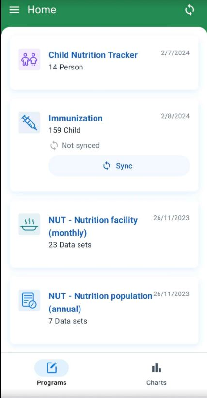

### System Settings

The color and flag of the app can be set by accessing the system settings

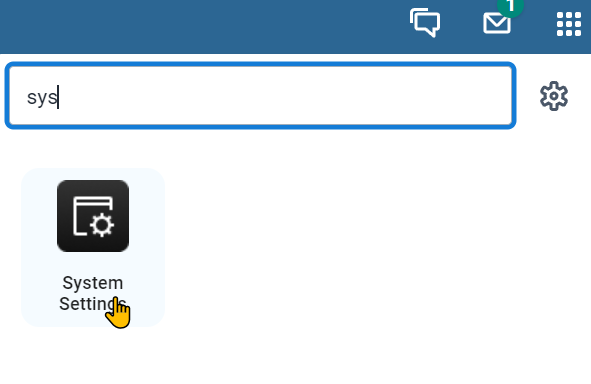

From here, navigate to the appearance tab where you can modify the style and flag of your system.

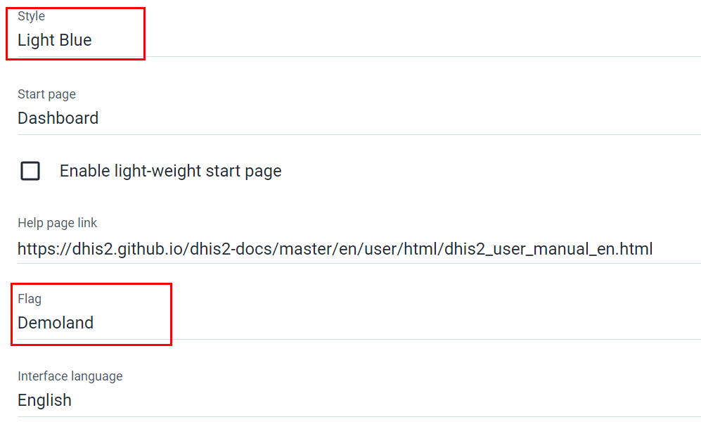

If you modify these settings they will be reflected in the android application.

### Android Rendering Options

#### Program Colours

In order to display various options for program colours, we will edit an existing child in the immunization program.

Select the immunization program.

Note that the colour of this program changes to blue, because the program specific color has been set to blue.

You could further demo this by changing over to another dataset or program.

Blue colour for Immunization

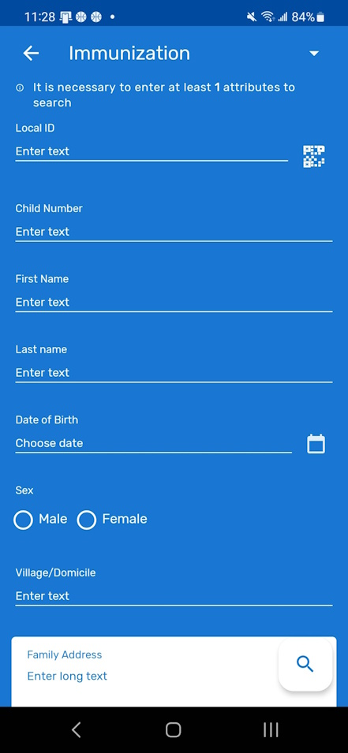

Purple colour for Child Nutrition Tracker

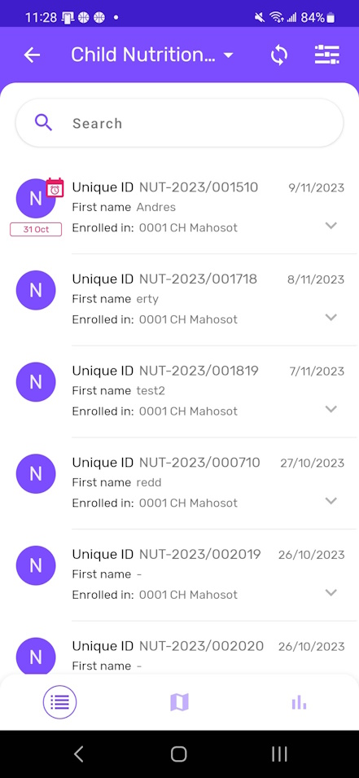

#### QR Reader

We can review the QR code reader functionality by trying to search for a child in the immunization program.

The Local ID is set to scan QR codes

Select the QR code button next to the local ID

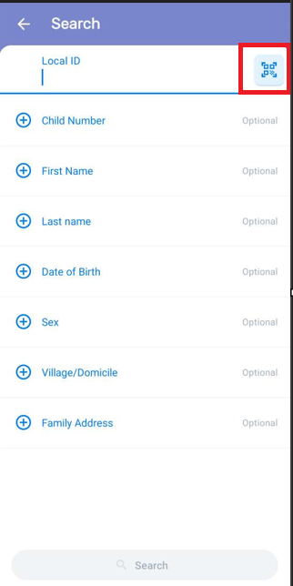

You can scan the following QR code to find an existing record (Jane Thompson)

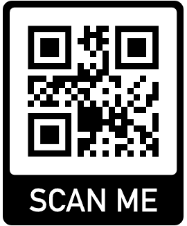

Scan the code, it will populate the LOCAL ID field. You can then search for the person

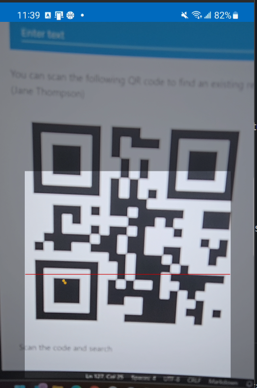

The results will show their record because you are using a unique ID

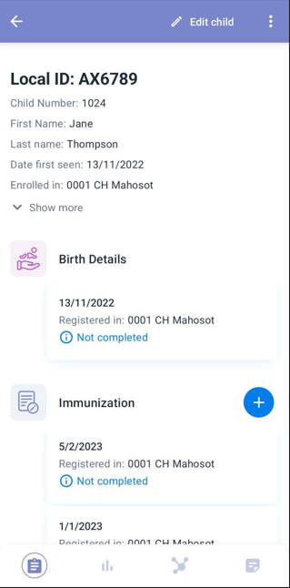

#### Date Picker

Open the record and edit their details by selecting "Open Child Details"

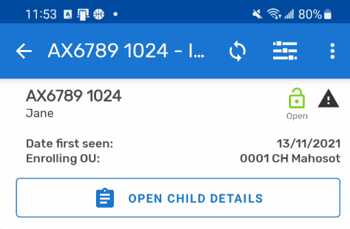

Select the field "date first seen"

Here you can demo the different date pickers by selecting "change calendar view"

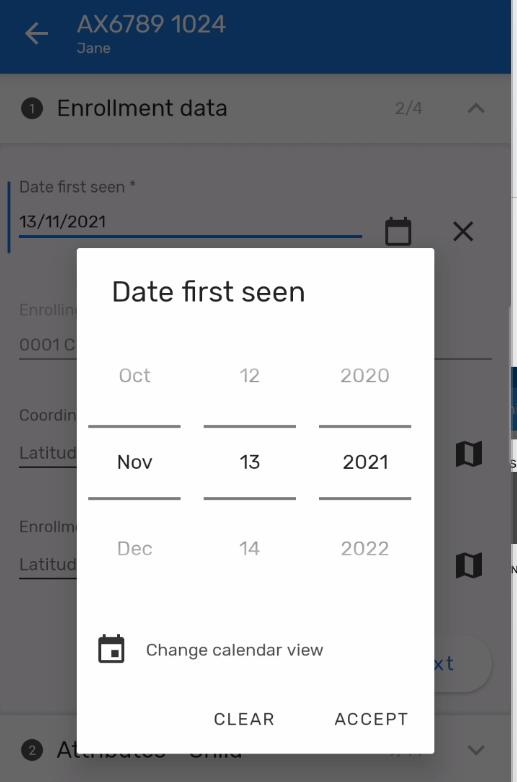

#### Option set rendering

If you select the "Attributes - Child" section you will be able to demonstrate examples of different option set rendering types. In addition to the default setting, you will be able to see examples of both

horizontal radio buttons

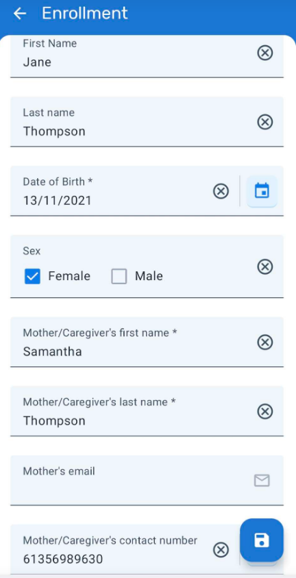

and vertical radio buttons

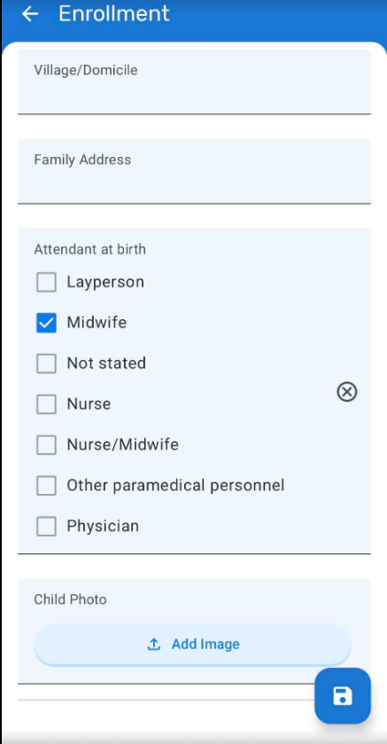

#### Images

If you can continue scrolling, you will see a placeholder in which you can add an image.

You can proceed to add an image (a good idea is to download some type of randomized icon or image to use rather then show your own photos from your phone) and display the signature fields.

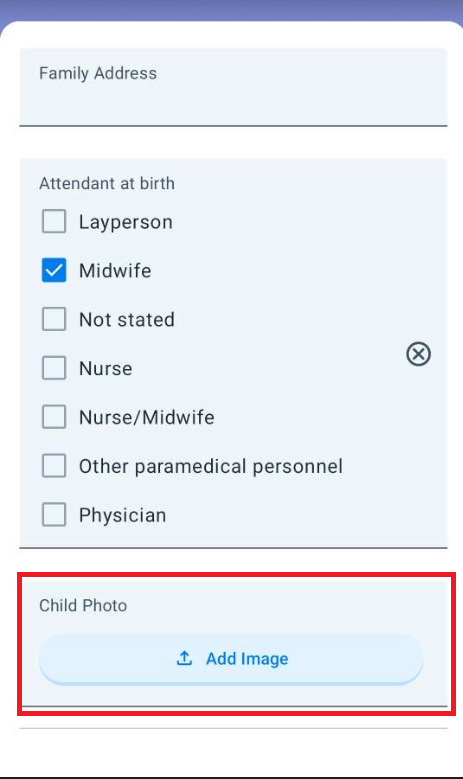

#### STOP - End Exercise 1

## Configuration Guidance

### Data Sets and Programs Icons and Colours

You are able to configure the icons and colours of data sets and programs within the maintenance app. 

For datasets you can do this in dataset maintenance.

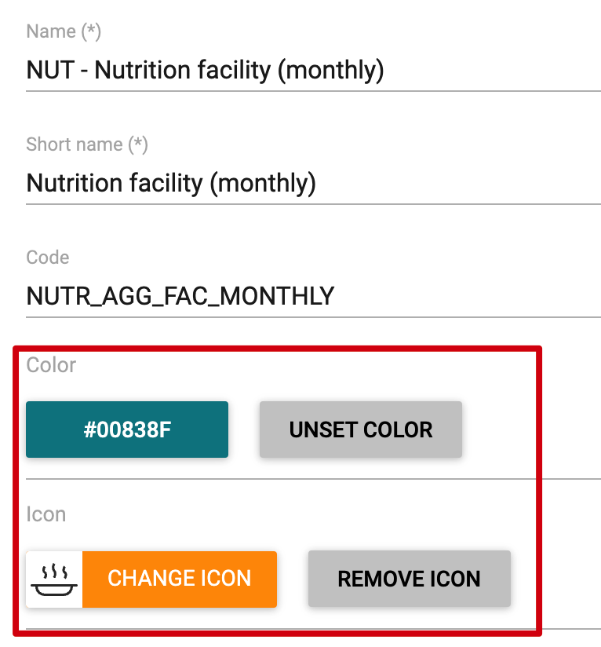

For programs you can do this within the "Program details" tab of program maintenance

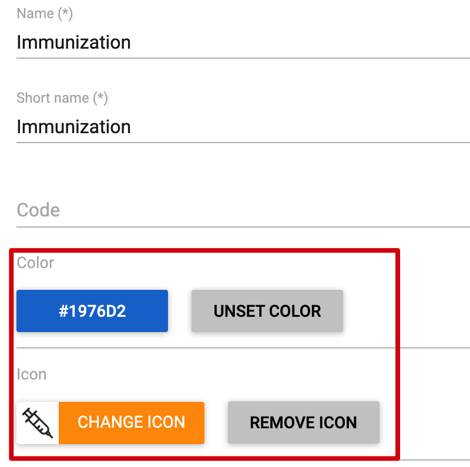

### QR Codes

In order to configure fields to read QR or bar codes, we have to start with the value type assigned to our TEA or DE.

TEAs or DEs must be set the the value type of "TEXT" or you will not be able to assign them a render type of QR or Bar code in your program

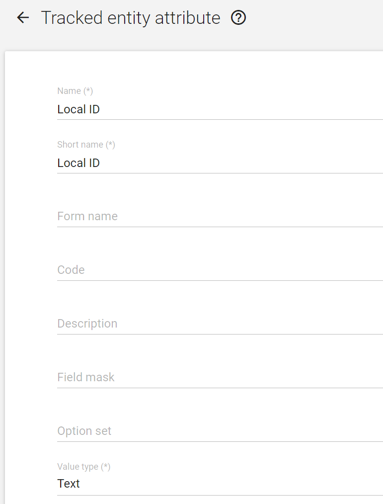

If you check the Local ID TEA value type it will be set to text.

Next, we have to navigate to our tracker program in maintenance. The example we are using is a TEA, so select the Immunization program and navigate to the "Attributes" section of the program. Here we can see the list of attributes assigned to the along with the render type for both mobile and desktop. 

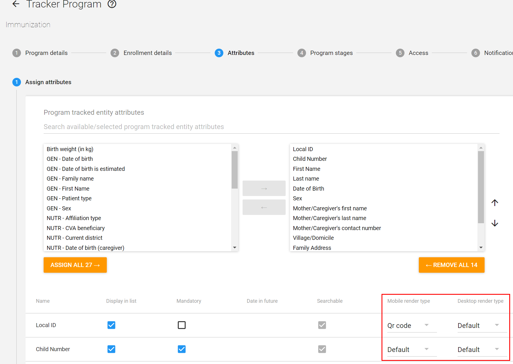

Local ID is the first field and you can see the rendering type is set to Qr code. You can select the dropdown to see other options that are available here. These options apply to any data value that is text.

If you wanted to do this for a data element, you can do this within the "Assign data elements" section within a program stage.

### Option Sets

There are two tracked entity attributes that also have option sets, Sex and Attendant at birth.

These two TEAs with option sets have been set to render within this screen as well. 

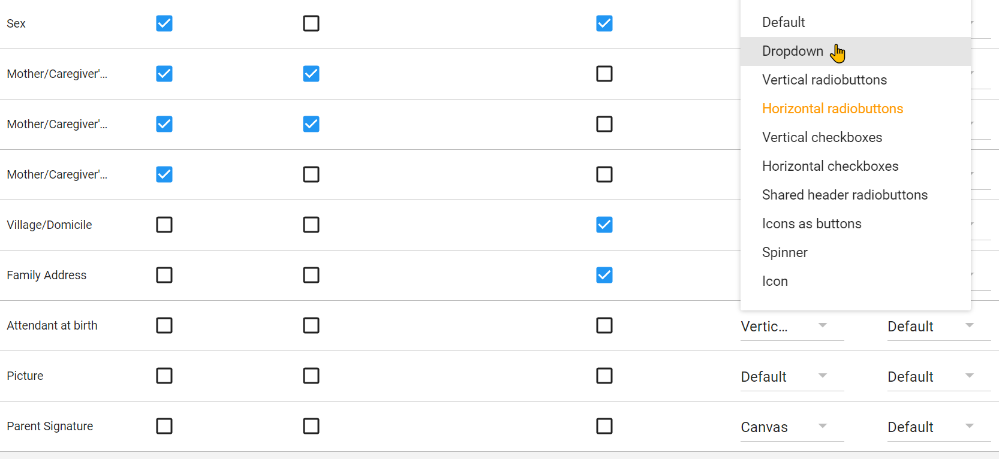

There are a number of options here. When selected from this screen, or for a data element within a program stage, they will render accordingly on the android device.

The default setting for an option set is a dropdown list.

### Images

You can set pictures via the TEA or DE value type.

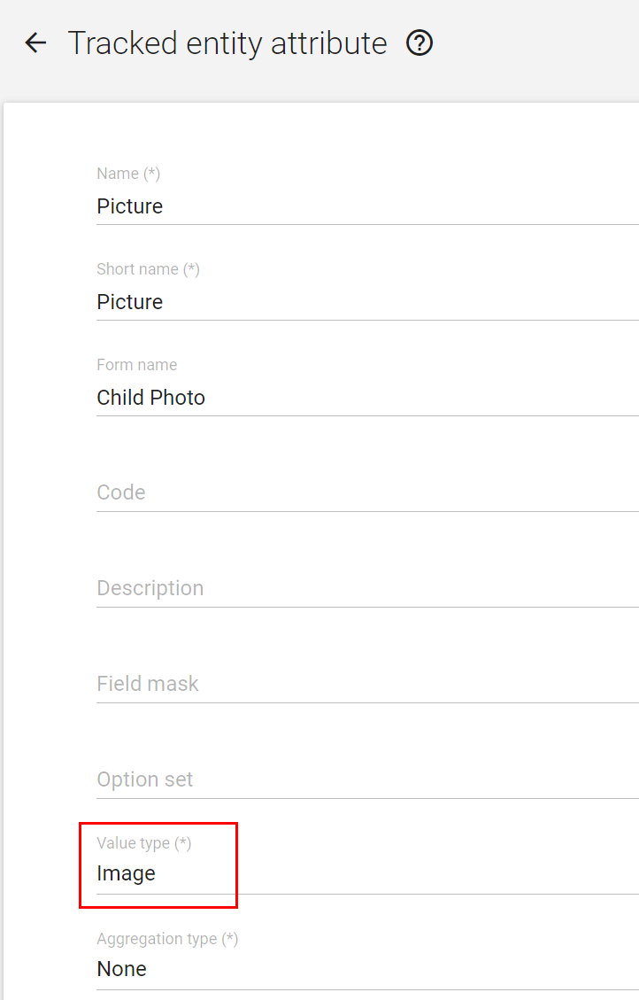

This will allow you to upload images via either android or web.