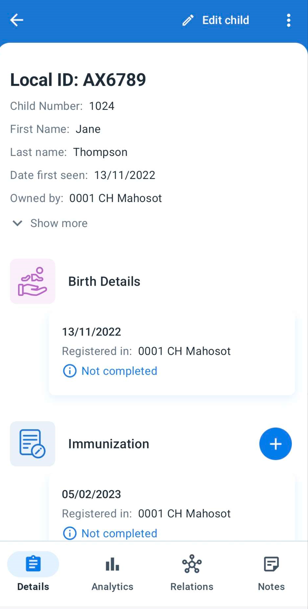
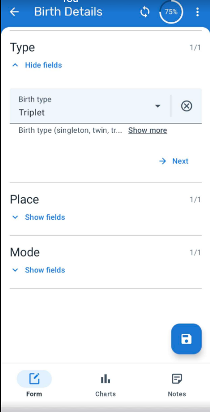
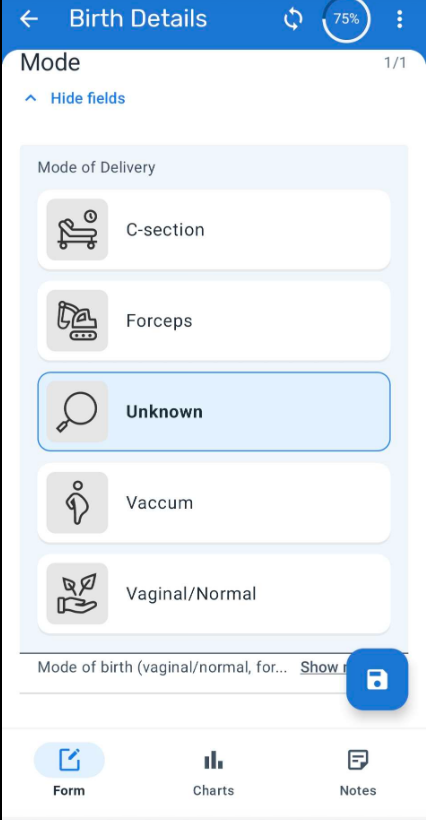
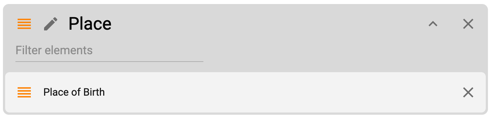
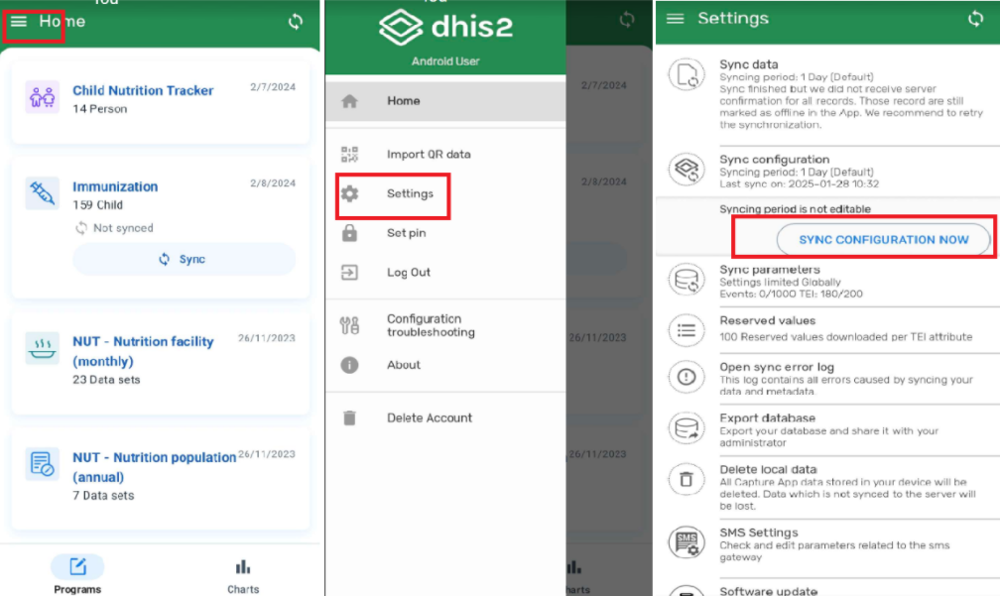

# Learner's Guide for Visual Data Entry

## What is this guide?

This guide contains all exercises and detailed steps to perform them related to the review of ***Relationships*** for the Android Level 1 academy. Please perform each of the exercises when prompted to by your instructors

## Learning objectives for this session

1. Describe how visual configuration can be used to display icons and colours for data elements and option sets
2. Demonstrate how to configure Option Sets for visual data entry
3. Demonstrate how to configure Program Stages for visual data entry

## Exercise 1 - Review visual data entry in Android

In order to review visual data entry, you can search for an existing case or register a new record. 

After you have accessed an existing or new child, add or edit the event for the birth details stage. The date of the event can be the same as their date of birth.

There are 4 sections within this program stage.

1. Details: Basic info on the birth and the mother
2. Type: Data element with an option set. Uses the default dropdown layout for an option set
3. Place: Uses the matrix layout and has a visual configuration for a data element
4. Mode: Use the sequential layout and has a visual configuration for a data element

You can expand each of the 4 sections in order to review how these different layout types appear on the android device.

### STOP - End Exercise 1

## Configuration Guidance

In order to visually configure data elements with option sets, we can follow this procedure:

1. Add icons and colours to each option within an option set
2. Add the data elements using these option sets to sections within a program stage
3. Configure the program stages to use either the matrix or sequential layout rendering type

### Editing option sets

Lets start by editing our option sets.

Navigate to Option set within the maintenance app and find the option set "Place of Birth"

Open the option set and navigate to options.

This is where we can edit each option to use an icon and/or colour if we want to.

Select the option then select edit

From here, we can select an icon or colour

In this case, we can see an icon has already been applied. Select "Change icon" this will bring up the icon selector.

You can select a different icon in order to show the effect this has.

There is no color currently selected for this icon. We could also select a color so it changes from the default.

When this is done, Save the changes made to the option.

You can then Save the option set.

### Review the program stage setup

Navigate to program maintenance and open the immunization program. From here, select the "Birth Details" stage from the Program stages tab

Navigate down to the "Create data entry form" section of the program stage

Find the "Place of birth" section for this form. 

We can see it has one data element for place of birth. This data element is using the place of birth option set that we have just edited. 

Select the pencil icon in order to edit this section

We can see that the mobile render type is set to "Matrix." This will render this options in quadrants as per our table within the presentation for this session. 

### Sync and review changes on the device

To see this update reflected on the device, we need to sync our configuration

Exit out of the program and navigate back to the home screen. From here select the settings menu, select settings and finally sync configuration

After select sync configuration you can select "sync configuration now"

Give the device a moment to sync. You will see a sync status icon in your device notification pane. You can expand your pane to see the sync status.

Once this is finished, navigate back to the program to view the change you have made.

If we re-examine the birth detailsstage and open the "Place" section, we will see the home icon has been updated with a new icon and colour scheme.

