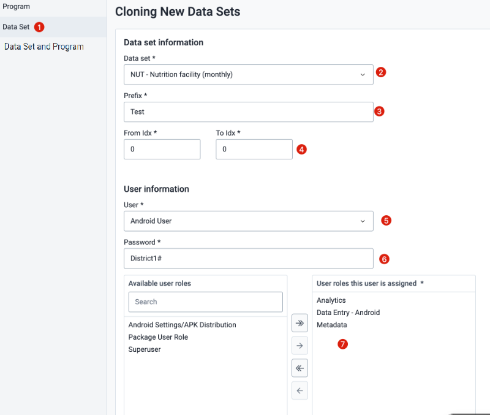

# Trainer's Guide to Setting up the Android Database and Instances for use in the Android Academy

The Android academy requires some considerations to make when deciding what is needed regarding the infrastructure for the academy. The sessions and exercises are complicated by the fact that 

1. Some sessions require you to make instance-wide changes (anything to do with the Android Settings Web App and APK distribution web app)
2. The participants themselves need copies of their own metadata (programs, datasets, related metadata) and users that have access to these program and datasets in orer to make various configuration changes and view their effect on the android device

In order to mitigate some of the challenges associated with these tasks, the team conducting this academy needs to:

1. Consider how many instances you will have based on the number of participants attending
2. Have them work in groups for parts of the academy
3. Use a specialized cloning metadata tool in order to create the duplicated metadata within the instances you have deployed

A listing of each session, along with special considerations that are needed for each, is listed in the table below.

| Session                                     | Considerations                                                                                                                                                                                                                                                                                                                                                       |
|---------------------------------------------|----------------------------------------------------------------------------------------------------------------------------------------------------------------------------------------------------------------------------------------------------------------------------------------------------------------------------------------------------------------------|
| DHIS2 Android App                           | This is meant as a demo for you to show them features. There are no exercises for the participant in this session.|
| Aggregated Data                             | The participants can use the demo account to follow along with this session. Username: android Password: Android123!|
| Individual Data                             | The participants can use the demo account to follow along with this session. Username: android Password: Android123!   |
| Maps - Geospatial considerations            | The participants will have to switch between using the demo account and accessing an account that can edit data in maintenance. The trainer/learner’s guide prompts when different accounts are needed.|
| DHIS2 Relationships & Android               | The participants can use the demo account for parts Exercise 1 and Exercise 2. For Exercise 3, they will have to use THEIR copy of the program metadata. They will need access to an account that can edit program metadata. |
| Program Rules Demo                          | They will have to use THEIR copy of the program metadata. They will need access to an account that can edit program metadata, as well as an android account with access to their program. They are prompted several times in the learner’s guide.|
| Visual Configurations                       | They will have to use THEIR copy of the program AND dataset metadata.  They will have to use 2 separate accounts to review the program and dataset respectively. They will need access to an account that can edit program metadata, as well as an android account with access to their program and dataset. They are prompted several times in the learner’s guide. |
| Visual Data Entry                           | They will have to use THEIR copy of the program AND dataset metadata.  They will have to use 2 separate accounts to review the program and dataset respectively. They will need access to an account that can edit program metadata, as well as an android account with access to their program and dataset. They are prompted several times in the learner’s guide. |
| Android Settings Webapp Part 1              | The Android settings web app makes instance wide changes to the system. They will need to be placed in groups, with each group modifying the app on their own instance together. They will need an administrator account with the “ALL” authority in order to make changes in this app.                                                                              |
| Program Indicators in Android               | They will have to use THEIR copy of the program metadata. They will need access to an account that can edit program metadata, as well as an android account with access to their program. They are prompted several times in the learner’s guide.|
| Offline Analytics- How to configure and use | In Exercise 1, they will use the shared demo account. |
| Going Mobile (Global Fund Extended)   | This is just a presentation.  |
| Android APK Distribution Web App            | The APK distribution web app makes instance wide changes to the system. They will need to be placed in groups, with each group using the app on their own instance together. They will need an administrator account with the “ALL” authority in order to use this app.
| Android Settings Webapp Part 2              | The Android settings web app makes instance wide changes to the system. They will need to be placed in groups, with each group modifying the app on their own instance together. They will need an administrator account with the “ALL” authority in order to make changes in this app.  |
Android Release Cycles and Roadmap          | This is just a presentation. |
| Community: Contribute and engage            | This is just a presentation. 
| Troubleshooting the android app             | Presentation and demo.|                            

## Setting up the instances

### DHIS2 and Android Version

The DHIS2 version is 2.40 latest patch

The Android version is 3.0 latest patch

The materials and tools have been tested against these versions, so use other versions at your own risk :smirk:

### Login details

The admin account for this instance is

- Username : android.admin
- Password : District1#

### Instance for the trainer

For this academy, we recommend having 1 dedicated instance for the training team. This is because the demo account/programs between the trainer and the participants is the same, and when performing exercises the participants will have the opportunity to add data and modify the configuration. This could result in challenges when trying to perform the demonstrations if they change items the trainers are working with and presenting.

### Instances for the participants

There are several exercises where the participants will need to make system wide changes to the instance using the android settings web app and APK web distribution app. In addition to this, each participant will need a copy of their own metadata (programs/datasets) in order to work through a number of the exercises and assignments. As a result, we recommend that you create instances at a ratio of 5:1 (5 participants to 1 instance). So if you have 30 participants in your academy, then you should create 6 participant instances. This way, groups of 5 can work on together on any exercise using the android settings web app/apk distribution app. You will also have the cloned metadata distributed across several instances, rather then being all in one instance (however this part is optional -- you could have them perform any type of configuration changes etc. all in the same instance if you prefer.)

### App installation

Make sure that you install both the Android settings web app and the APK web distribution app to your instance. 

## Cloning the metadata and accounts

Before reviewing this section, please read the instructions on using the cloning metadata tool.

https://docs.google.com/document/d/1hTdHL1NxP4ZznhvseXZHnp5uO3m5FWSARZcFhBot-ns/edit?usp=sharing

For this academy, you will need to create 2 accounts and sets of metadata for each participant.

1. For the datasets
2. For the programs

We are working on improving the tool in a next release so 1 account will have access to both the programs and datasets, but this is a limitation for now. 

We suggest the following workflow for cloning your datasets and programs.

1. Have your master database ready and configured
2. Clone 1 test account for your dataset
   1. Check that everything works for this user that you have made
   2. If it works, create the actual number of accounts/duplicated metadata you need
3. Clone 1 test account for your program
   1. Check that everything works for this user that you have made
   2. If it works, create the actual number of accounts/duplicated metadata you need
4. After you have made all of your cloned accounts and metadata take a backup of this database.
5. Deploy this database as many times as you need depending on the number of groups you have made for your academy.
6. Share the log in details of these accounts with each member of the group. They will have duplicated account names in the different groups, but because they are accessing them on different instances it will not matter!

### Creating a test acount - Datasets

- Have your master instance ready
- Access the cloning metadata tool app

1. Access data set from the left side menu
2. Select the NUT - Nutrition facility (monthly) dataset
3. Add in a prefix
4. Leave the idx at 0-0 (this will just make one account for testing)
5. Select "Android User" as the user template
6. Give the user a password
7. Assign the following roles:
   1. Analytics (allows access to analytics apps)
   2. Data Entry - Android (allows them to enter data)
   3. Metadata (allows them to edit metadata in the maintenance app)

1. The data set dependencies section denotes what is being cloned. The data set and the data elements will be cloned.
2. The sharing settings shows you what sharing settings will be applied to the new users. This is so the users can edit the new metadata that is created.
3. Select clone when you are ready to create the account.
4. When it is finished cloining, all your previous selections will be removed.

Now, check your user, dataset and data elements.

User check:

Dataset check

Data element check

### Creating a test acount - Programs

- Have your master instance ready
- Access the cloning metadata tool app

1. Access program from the left side menu
2. Select the [COPY] Immunization program
3. Add in a prefix
4. Leave the idx at 0-0 (this will just make one account for testing)
5. Select "Android User" as the user template
6. Give the user a password
7. Assign the following roles:
   1. Analytics (allows access to analytics apps)
   2. Data Entry - Android (allows them to enter data)
   3. Metadata (allows them to edit metadata in the maintenance app)

1. The program dependencies section denotes what is being cloned. Make sure you also clone the data elements and option sets.
2. The sharing settings shows you what sharing settings will be applied to the new users. This is so the users can edit the new metadata that is created.
3. Select clone when you are ready to create the account.
4. When it is finished cloining, all your previous selections will be removed.

Now, check your user, program, etc.

User check:

Program check

Data element check

## Instructing on which accounts to use