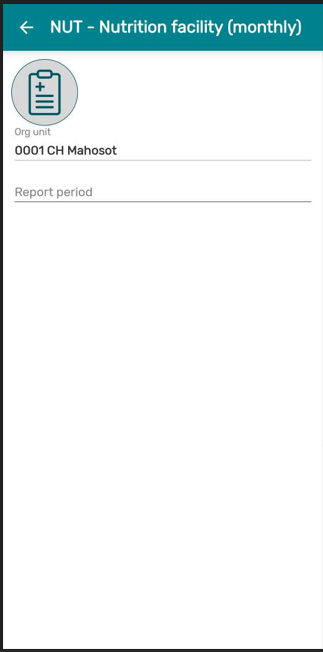
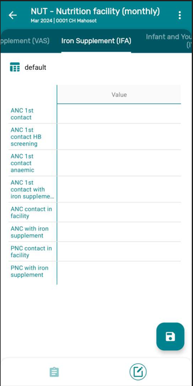
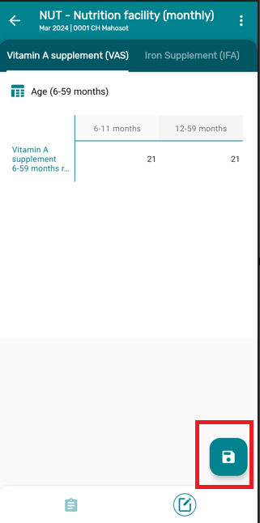
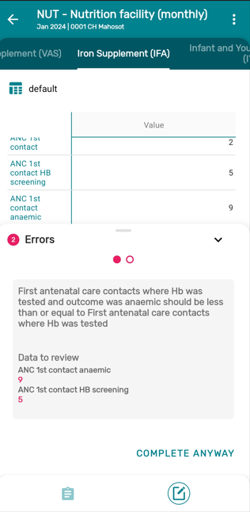
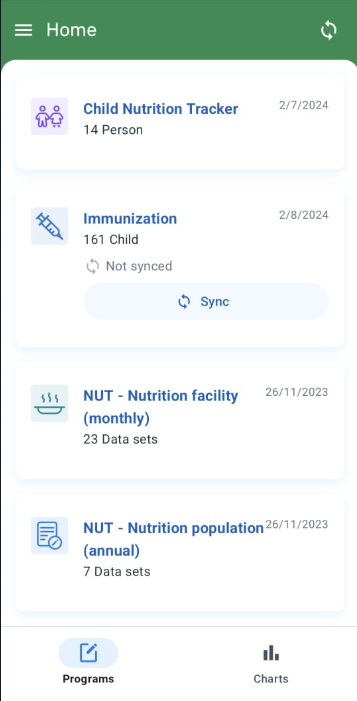
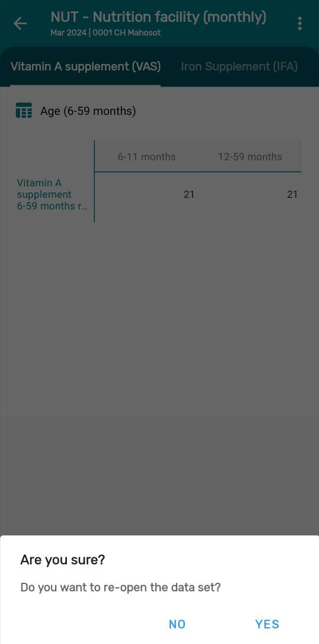

# Trainer's Guide on Data Sets and Validation Rule

## What is this guide?

This guide is a support document for DHIS2 Academy trainers for the session “Data Sets and Validation Rule.” This session follows the standard Academy training approach with

1. a live demo session where the trainer demonstrate and explain Data sets and Validation rule

This guide will help the trainer​ prepare​​ for the live demo session. The “Live Demo step by step” section has a detailed walkthrough of all the steps to demonstrate with explanations and screenshots that should be easy to follow. Use that when preparing for the live demo session.

There is also a Quick Guide which lists the steps very briefly and this is meant as a lookup guide or “cheat sheet” WHILE doing the demo, to help the trainer remember all the steps and the flow of the demo.

## Learning objectives for this session

The overall objective of this session is to demonstrate how to use 

1. Features in android devices for the aggregate data entry.

2. Validation rules and its importance

## Time Requirements

## Preparations

Go through the Live demo step by step guide a few times before doing the actual demo for participants so you understand the full process of the session.Make sure your two user accounts (server administration and Android users) are the same or similar to the participants’ accounts so that you don’t show more features, dimension options or forms than what they can see when doing the exercises.In terms of logistics make sure the resolution on the projector is OK for zooming.

Create an account with the same level of access as the users you are demonstrating to (ie. if they can only search and enter within one facility, have your user have the same authority). If it is the procedure to enter this data from a paper form, it will be useful to have a copy of the form they would normally use as reference filled in. This can just be a form that you have filled in yourself for example. If they are entering data in real-time, then this is not required but you should prepare the details of an example case that you can follow in your examples.

For the exercises and small activities during the demo, fill out a couple extra forms that the participants can use to register their own cases. Your training DB should have some existing cases filled in to help support the working list filter, relationships and searching functionality. If demonstrating the working lists functionality, you will need to have a subset of the events you have created and assigned to a user where you can show this functionality.

## Android Application (APK) File

Make sure that you have the app made for training purposes otherwise you will not be able to cast your screen:

[https://github.com/dhis2/dhis2-android-capture-app/releases](https://github.com/dhis2/dhis2-android-capture-app/releases)

# Projecting your Android Device

The instructor will have to decide on which method they would like to use to mirror the android app on their computer screen. They will also have to set up a user account (if it doesn’t exist already) that is assigned to the same org unit as the program they are demonstrating.

Please review this CoP post for details on options you may use to mirror your android device:

[https://community.dhis2.org/t/how-to-clone-your-android-screen-useful-for-presentations-debugging-etc/38077](https://community.dhis2.org/t/how-to-clone-your-android-screen-useful-for-presentations-debugging-etc/38077)

Scrcpy is another tool that can also be used and is platform agnostic: [https://github.com/Genymobile/scrcpy](https://github.com/Genymobile/scrcpy)

Make sure that your device has developer options enabled before attempting to use scrcpy

After developer options is enabled, enable usb debugging from within the developer options menu

More information on enabling this is available. [Click Here](https://developer.android.com/studio/debug/dev-options)

## User Account

Ensure that there is a user account assigned to a lower level set of org units at the facility level within Lao PDR that you can use prior to performing this session. If the participants are following along, ensure that there are user accounts for them to use as well assigned to lower level organization units. The demo user account is:

Username: android
Password: Android123!

## Participants

Send the instructions to the participants on how to install the Android app prior to the session if they have not yet done so. The instructions can be found [Click Here](https://docs.google.com/document/d/1SUUUdmPSDycFtdB9yUMq8ZWiWf8gNOu5xvtNj4_V63U/edit#heading=h.lswxgahoi1m2).

Some participants may not have been able to install the app by themselves. In that scenario, you may need to walk them through how to do this via google play.

## Quick Guide

1. Log in to the Android device
2. Explain the Home page access rights and how the sharing settings are being used to show what programs and datasets are available
3. Demo the steps for Data Entry for the Nutrition program 
4. Explain the Navigation Bar
5. Save the data
6. Go to Validation rules configured in web instance
7. Show how the validation works in android device and how to 

## Part 1 - Navigation and Saving a Data Set

### Home Page:

* Log in the DHIS2 Android App as per the instructions given in previous session
* Once you Log - in Home Page can be seen.
* Briefly explain to the participants about the user access rights and visibility of the program and data sets on the home page (this has already been discussed in previous session).

* Now click on the “NUT - Nutrition facility monthly” 

  

* The first page that appears is the list of all month where data has been entered

   

### Data Entry

* To start entering data for a new period,Click on the + icon in the extreme down right side corner.

   

* This will show a below screen 

   

* Click on the Report Period and Select the month and year for new data to be entered for a new period.

   

* Once you select the period Click on NEXT button

   

* The data form will open and all the sections of the forms will be rendered as tabs.

   _NOTE: While entering data the new text input dialog opens an input field above the keyboard which shows the Data Element name, and category options of the field being selected, ensuring the user does not lose context when navigating the tables._

   

### Navigation Bar:

The navigation bar can be used to switch between the data entry and the overview screen
    
   
The overview tab contains the following details:

* Data set name
* Last Update
* Open/Close Status
* Period
* Org Unit
* Category option combo
* Refresh button (To trigger a granular synchronization)

              

### Saving a Data Set

Now to save the data you can click on the SAVE button and the trainer can tell participants that if everything looks good the app will let you SAVE the data.

### STOP Perform Eercise 1

## Part 2 - Validation rules 

**Validation rules and completion of data sets are integrated in the save button actions.**

NOTE: To explain validation rules the trainers need to add some data values which will give some validation errors.

Before this lets understand how we have designed a validation rule in the web application.So only if the validation rule passes it will let you save the data set.

Let's take one example :

**“First Antenatal care contacts where Hb was tested and outcome was anemic should be less than or equal to First antenatal care contacts where Hb was tested.”**

Now to get the error on the above validation rule follow the below steps:

* Go to Nutrition Data set and Click on tab “Iron Supplement (IFA)”
Add Values for 

* ANC 1st Contact HB Screening = 5
* ANC 1st Contact Anaemic = 9

* An error dialog will appear once you try to save and the dataset will not be marked as complete. The description and instructions of the validation rule will be displayed to help the user identify the error.

**_NOTE: On a dataset that does not have a setup "Complete allowed only if validation passes". When clicking on the save button; if the data set has validation rules associated with it, then the app will ask the user to run the validation rules._**

For this Exercise ask Participants to use a different validation error.

"NUT - ANC contact during which pregnant women received any breastfeeding counselling Vs ANC contacts"

VALIDATION: ANC contact during which pregnant women received any breastfeeding counselling should be less than or equal to ANC Contacts

### STOP Perform Eercise 2

## Part 3 - Offline and Data Sync

**Before performing this demo trainers need to turn off the internet connection.**

**Follow the instructions for Data Entry similar to Part 1.**

### Log in the DHIS2 Android App 

**NOTE : After a successful login the user should be able to perform an offline login only (only available for the last combination of URL/Username). Offline usage gives the possibility of using the application without any type of connectivity. All data will still be stored and the user can perform a synchronization once the connection is established or available.**

* Home Page can be seen.

   

* Now click on the “NUT - Nutrition facility monthly” 

  

* The first page that appears is the list of all month where data has been entered

   

### Data Entry

* To start entering data for a new period,Click on the + icon in the extreme right side corner.
* Click on the Report Period and Select the month and year for new data to be entered for a new period.

* Once you select the period Click on NEXT button
* The data form will open.
* Enter Values

* Click Save

Now once you go back to the list you will see a gray icon next to May 2023.

This shows that data is stored locally on this device.

* Now switch on the internet and 
* then click on the Gray icon it will ask you - “Do you want to sync the data”
* Click on Send 

* Now once data is synced to the server you will see the below screen and the gray icon will not be visible.

### STOP Perform Exercise 3

## Part 4 - Re- open Data Set

Once the data is saved you can re-open the data set, only if the user has access.

Please follow the steps to re-open the data set.

* Click on the completed form which you want to edit or re-open 
* In this case Select - Nov 2023 Data Set

* Click on the three dots on the extreme upper right corner

* Click on re-open a dialog box will appear and Click on “Yes”

## Pert 5 - New Features in DHIS2 Android Version 2.8.2

### Resizing Column and Headers

Users are now allowed to resize the row headers and columns in datasets, making it easier to view and work with larger tables.

To resize any column, tap on its header and then drag and drop until the desired size. A maximum and minimum size limit is given for the columns that can be resized to ensure a good layout.

If the column have multiple headers, the resizing will be available only for the child header (lowest level). Users can also resize all collumns at once by clicking on the top left of the table.

### STOP Perform Exercise 4

