# Trainer’s Guide on Android Settings Web App Part-1

## What is this guide?

This guide is a support document for DHIS2 Android Academy trainers for the session "Android Settings Web App". The session follows the standard Academy training approach with

* A live demo session where the trainer demonstrates and explains the features of the topic
* A hands-on session with exercises where participants get to practice the explained features.

## Learning objectives for this session

* How to Install the Android Settings Web App
* How to navigate through the Android Settings Web App
* Understand different features for the web App

## Time needed for this session

Live demo: 45 min
Hands-on exercises: 15 min

## Background

The Android Settings Web App

1. Allows admins to configure synchronization parameters for the DHIS2 Android App, 
2. Can encrypt the local database of an Android device
3. Can customize the appearance of Programs, Data sets, the Home screen, and add TEI Analytics items. 

The configuration parameters defined within this web app will overwrite the settings of all Android devices using the DHIS2 Android Capture App.

## Part 1: Installation of the Android Setting Web App

To use the Android Settings Web App you need to first install the app by going to DHIS2 web interface

* Go to Search Bar and Search for the App Management app
* Go to the app hub
* Click on Android Settings
* Install the Android Settings App

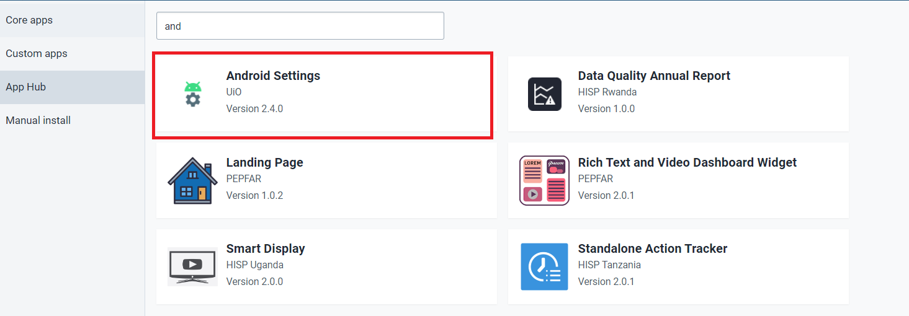

### Users roles to use the App

Trainers can briefly discuss the user roles. For more information about user roles. ([Click Here](https://docs.dhis2.org/en/use/user-guides/dhis-core-version-240/configuring-the-system/users-roles-and-groups.html?h=user+2.40#mgt_userrole))

There is a specific authority for the android settings web app that can be found in "Other Authorities." This gives a person access to both view the app and edit settings within the app.

So to make sure your users have this role, you can go to Users > User Roles, find the app in the "Other authority" section and assign the authority to the user role.

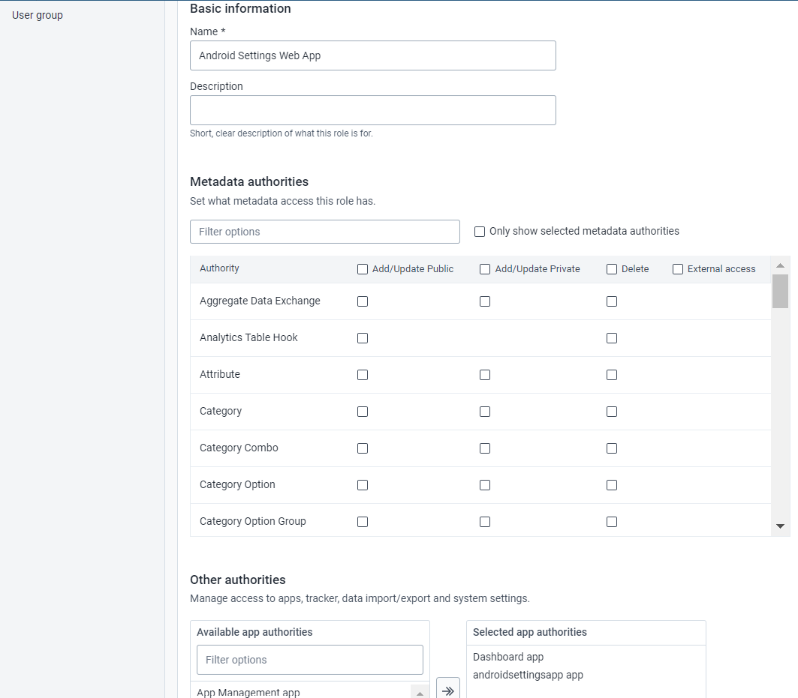

### STOP : Perform Exercise 1 - Install the Android Settings Web App

## Part 2: Android Settings App Overview

_Note: In this session trainers will give an overview of each section and will do a detailed session on Appearance._

* Open the DHIS2 web interface
* In the apps menu, search for Android Settings.
* Select the App and you will see the Home Screen for Android Settings Web App as shown below:

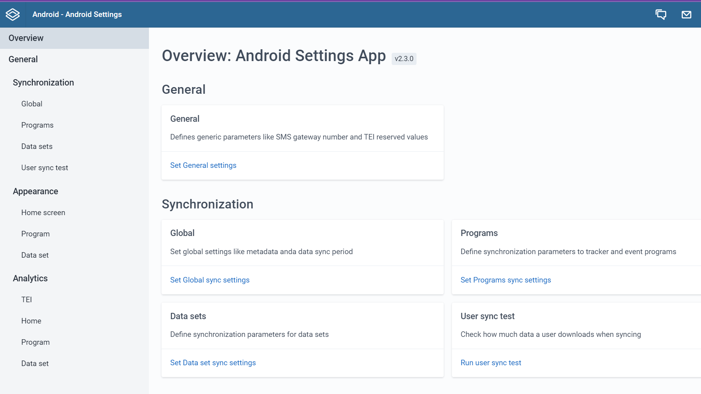

### General Settings:

* General: Defines generic parameters like SMS gateway number and TEI reserved values

### Synchronization:

* Global: It offers additional parameters to control metadata/data synchronization.
* Programs:This section controls the program data synchronization parameters. It has a section to define global or default parameters to be used in the synchronization of all programs.
* Datasets: Define synchronization parameters for data sets
* User sync test: Check how much data a user downloads when syncing

### Analytics:

* TEI: Manage TEI analytics for tracker programs
* Home: Manage visualizations to be shown in home screen
* Program: Manage visualizations for programs
* Data set: Manage visualizations for data sets

### Appearance:

These settings give control over the appearance of the data entry and list forms.

* Homescreen
* Programs
* Data sets

## Part 3: Home Screen Settings in Appearance Section

This section allows the admin user to enable or disable the option to show the filters related to Date, Organisation Unit, Sync Status, and Assigned to me on the Home screen.

In the current setup you can see all of the options are enabled.

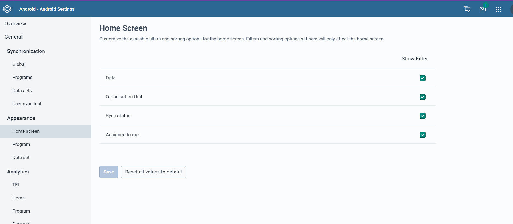

* Disable the filter Assigned to me and Save.

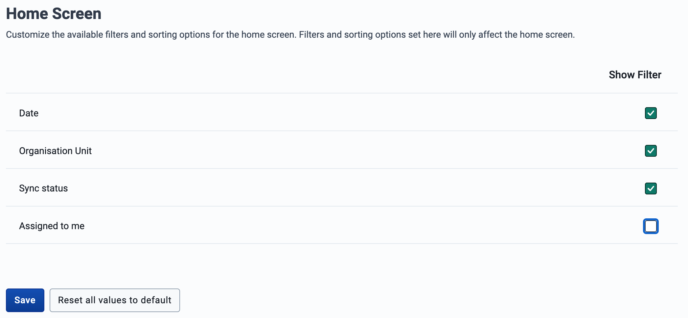
  
* Now Go to the Android App and sync your changes (make sure you go to Settings -> Sync Configuration now, to sync the changes that were done in the Android settings web app)
* Now go to the Home Screen.You will see the below screen with only the Date, Org Unit and Sync options in the filter.

  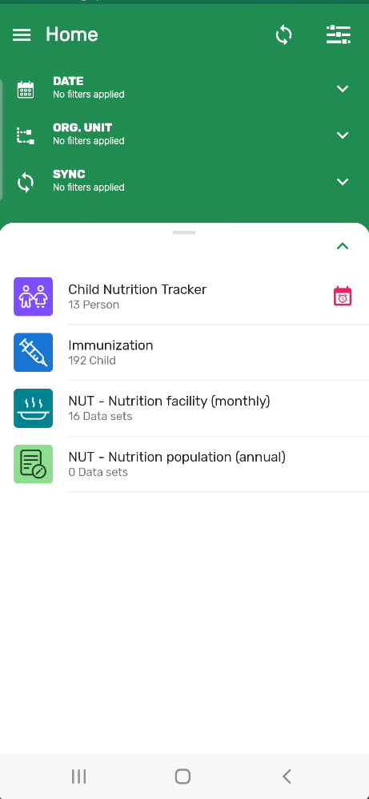

### STOP : Perform Exercise 2 

## PART 4: Program Settings in Appearance Section

The Program appearance section allows you to hide/show features within the program according to the configuration needs. These changes can happen globally, applying to ALL the programs or can alternatively be applied to a SPECIFIC program.

### Global Settings

Percentage (%) complete in Program: Enable or disable the option to show the completion percentage of the data entry form.

TEI referrals: This allows you to switch off/on the TEI referral option.

Collapse sections in form: The Current behavior lets the sections collapse and expand in an accordion style. This option overrides the behavior by keeping all the sections of the form (registration and events) open and removing the "next" button in each section.

For this session Trainers can

* Disable “Show percentage (%) complete in Program toolbar”
* Go to Android Device to check the changes. 
* Make sure you perform Synchronization by going to Settings &lt; Sync Configuration
* Show the enrollment Screen to see the changes.

    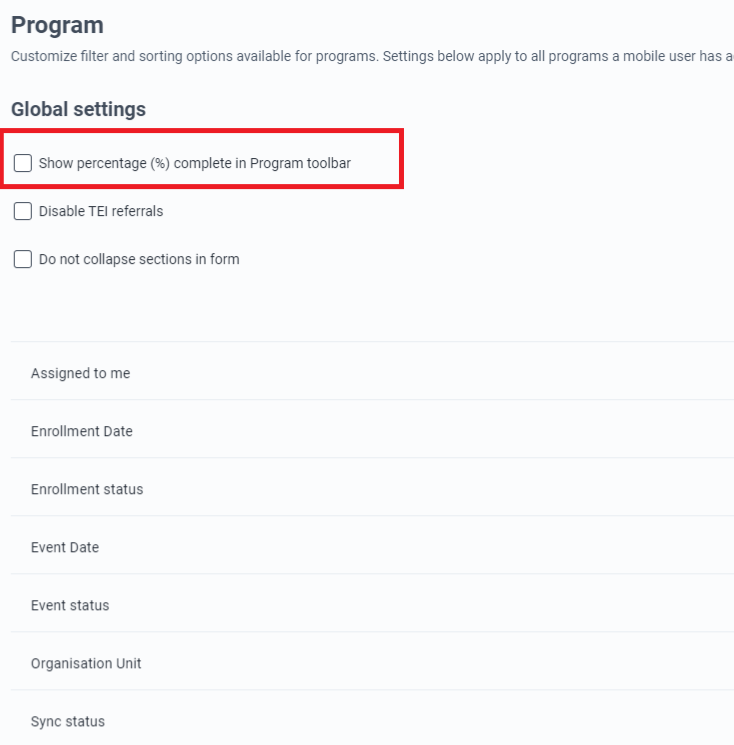

### For Program specific settings

Trainers can explain that this section allows the admin user to customize features such as filters, completion percentage, mandatory search, referrals, TEI headers and referral options. Each section is explained below.

To add a program specific setting:

* Click on _Add a Program Settings_, and a dialog will appear.

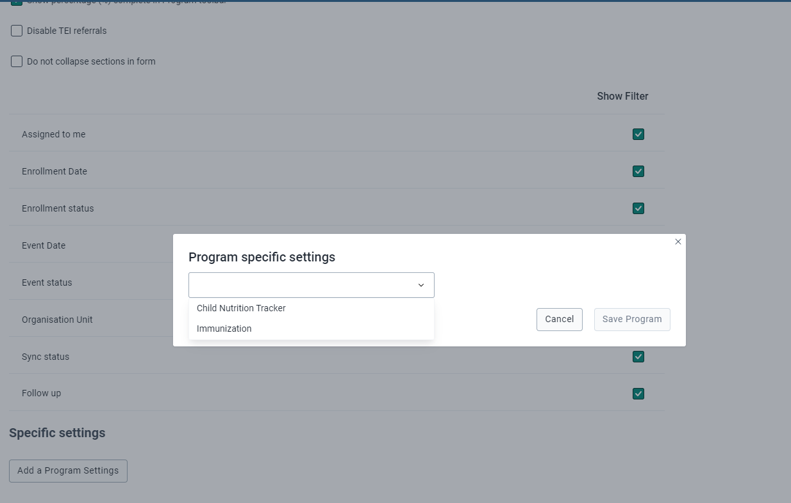
 
* Click on the dropdown that will show a list of programs.
* Clicking on a program will show the different filters to configure.

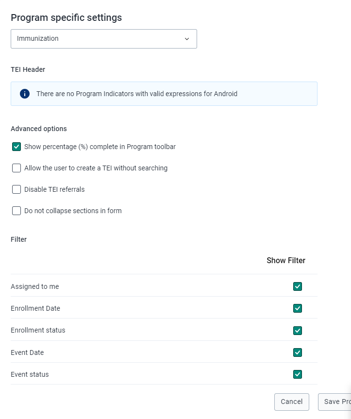

TEI without searching: Offer online and offline search, as well as allowing the user to create a TEI without a prior search.

TEI Header (**New 2.3.1**): Assign a specific attribute or expression that will be displayed as a header in TEI cards.

To add a TEI Header:

* Select a Program Indicator
* An expression related to the program indicator will be displayed

    **_Note:A notice box will be displayed if the selected program lacks expressions related to program indicators that are valid for Android._**

If any specific settings have been saved, a table will summarize the particular configuration per program, and the options to edit or delete these settings.

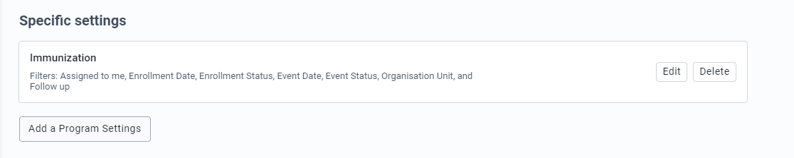

For this exercise the trainers can,

* Go to the Immunization Program
* Enable “Allow the user to create a TEI without searching”

    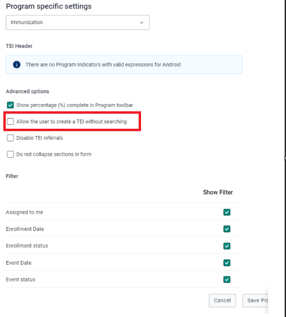

* Save the program

To test this you need to log back into your android device and Sync your configuration

* Go to the Immunization program and you should be able to to create a TEI without searching

### STOP : Perform Exercise 3

## PART 4: Data Set Settings in Appearance Section

Customize filter and sorting options available for data sets. 
* Settings can apply to all data sets a mobile user has access to. 
* Settings specific to individual data sets can also be applied.

### Global settings

The first part is for global settings that apply to all data sets an android user has access to.

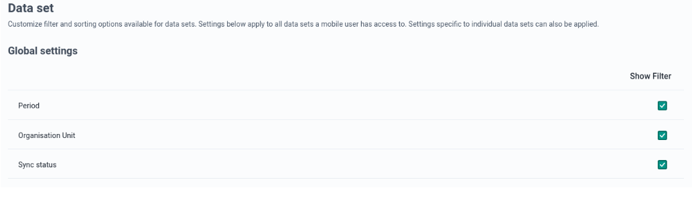

In this section you can disable Sync Status filters from the Global Settings and Perform the same steps as above to see the changes in the Android device.

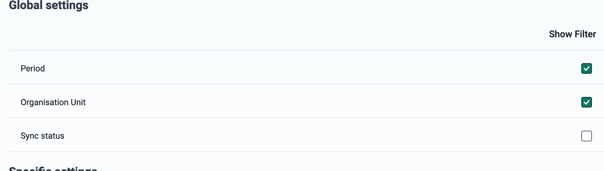

### Specific settings

To add a specific setting:

* Click on _Add a Data set Settings_. A dialog box will pop up with a dropdown with a list of data sets.
* Click on a data set, and a list of options to enable or disable filters will be displayed.

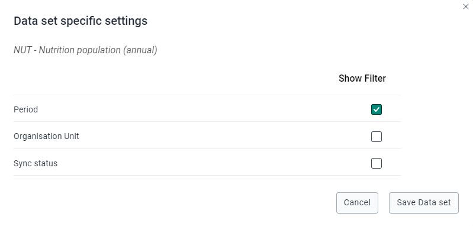

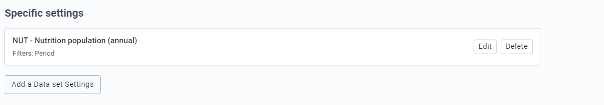

### STOP : Perform Exercise 4