# Trainer’s Guide on Android Settings Web App Part-2

## What is this guide?

This guide is a support document for DHIS2 Android Academy trainers for the session "Android Settings Web App". The session follows the standard Academy training approach with

* A live demo session where the trainer demonstrates and explains the features of the topic
* A hands-on session with exercises where participants get to practice the explained features.

## Learning objectives for this session

The overall objective of this session is to demonstrate how to use 

1. Describe how analytics work in the Android app.
2. Demonstrate how to configure and display analytics in the Android app.

## Time needed for this session

Live demo: 45 min

## Background

The Android Settings Web App

1. Allows admins to configure synchronization parameters for the DHIS2 Android App, 
2. Can encrypt the local database of an Android device
3. Can customize the appearance of Programs, Data sets, the Home screen, and add TEI Analytics items. 

The configuration parameters defined within this web app will overwrite the settings of all Android devices using the DHIS2 Android Capture App.

In our first session we have already talked about how to  install the app for "Android settings web app".

Lets understand how we can configure and display analytics in android app.

## Part 1: Explore the automatically generated TEI analytics

In this section you will know how the automatically generated TEI analytics work and the information they display.

1. Open the Android app using your android user and go to your program (called "[User XX] Immunization").

2. Try to search an existing Child whose Child Number is 9859. If the Child does not exist, open another existing Child and create 2 Immunization events with values for, at least, weight, height and temperature.

4. Then, open the Analytics tab for this Child.

   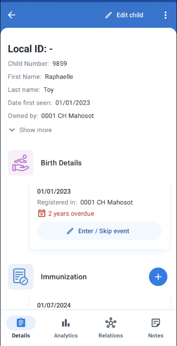

5. Explore the automatically generated visualizations.

   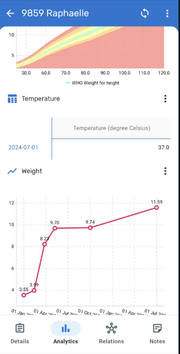

### STOP : Perform Exercise 1

## Part 2: TEI Analytics configuration

create a custom TEI analytic table to show the evaluation of the particular data element. This exercise requires using the Android Settings Web App, please remember to take turns to modify it.

1. Open the Android Settings Web App.
   
2. Navigate to Analytics > TEI and click on "Add TEI Analytics".

   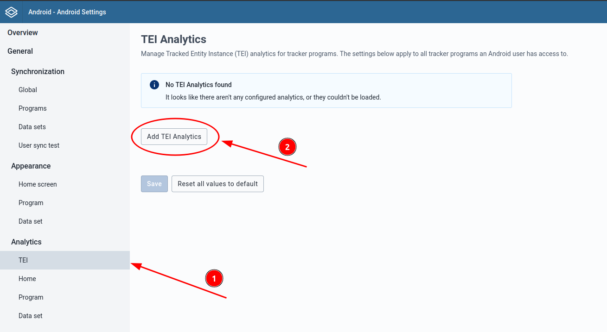

3. Fill out the form with the information for the TEI analytics:
    - Program: the program assigned to your user.
    - Program stage: the "Immunization" program stage (the only one in the list as it only shows repeatable stages).
    - Analytics chart title: choose a title for your table.
    - Visualization Type: Line chart.
    - Period type: daily.
    - Element type: data element.
    - Element: Weight (in kg).

4. Click on "Add TEI analytics".

   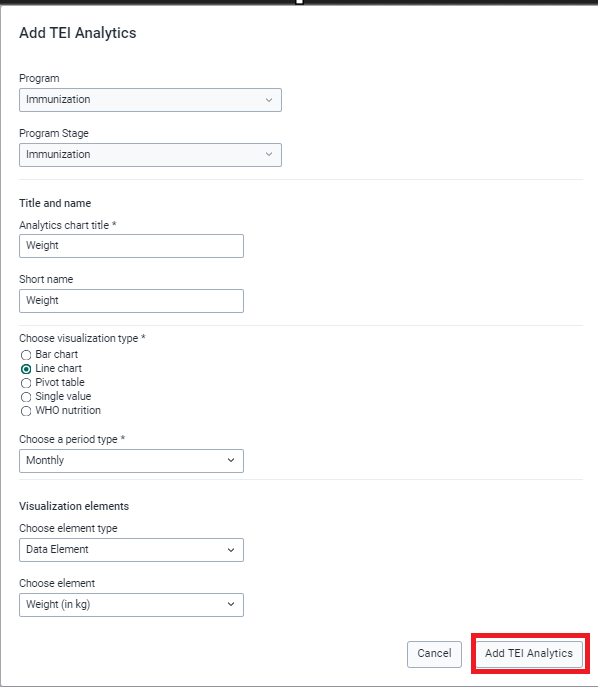

5. Click on "Save" (**it is important to Save your work**).

6. In your Android app, go to Settings and Sync configuration.

   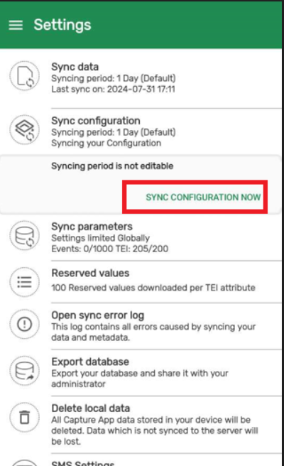

7. Once it is finished, go to an existing TEI in your program ("[User XX] Immunization") and explore the TEI analytics. Notice that automatic analytics are gone.

   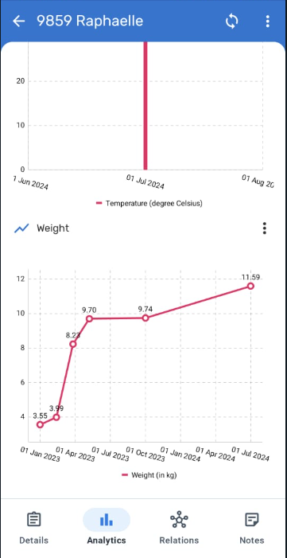

### STOP : Perform Exercise 2

## Part 3: Configure a WHO nutrition chart in TEI Analytics

In this section you will create a chart with the WHO nutrition background. This chart requires some configuration to make the relation between your existing data elements and the information expected by the WHO nutrition chart. Remember to take turns to use the Android Settings Web App.

1. Open the Android Settings Web App.

2. Navigate to Analytics > TEI and click on "Add TEI Analytics".

3. Fill out the form with the information for the TEI analytics:
    - Program: the program assigned to your user.
    - Program stage: the "Immunization" program stage (the only one in the list as it only shows repeatable stages).
    - Analytics chart title: choose a title for your table.
    - Visualization Type: WHO nutrition
    - WHO visualization type: Weight for Height
    - **Important:** there is a bug that makes the chart title to be erased after clicking on "WHO nutrition". Make sure the title is not left blank. 
    - Gender attribute: Sex
    - Female title: F
    - Male title: M
    - Horizontal (x) axis: DataElement - NUTR - Height/Length (cm) 
    - Horizontal (y) axis: DataElement - Weight (in kg)

4. Click on "Add TEI analytics".

5. Click on "Save" (**it is important to Save your work**).

6. In your Android app, go to Settings and Sync configuration.

7. Once it is finished, go to an existing TEI in your program ("[User XX] Immunization") and explore the TEI analytics.

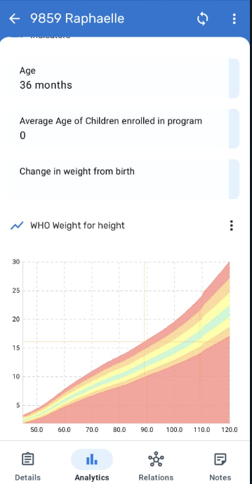

### STOP : Perform Exercise 3

## Part 4: Explore Dataset Analytics

Explore the visualizations assigned to the datasets and the information they display.

1. Open the Android app using your android user and go to the Data Set "NUT - Nutrition facility (monthly)".

2. Click on the analytics tab at the bottom menu.

   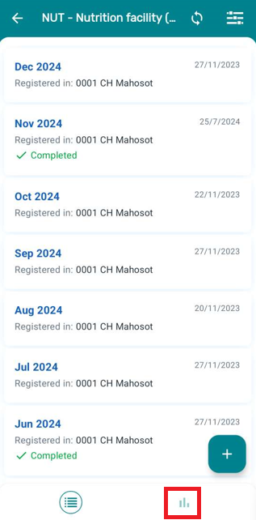

3. Explore the analytics charts displayed. 

4. Change the chart type by clicking on the three dots in the top-right corner. For example, change the chart type to table.

   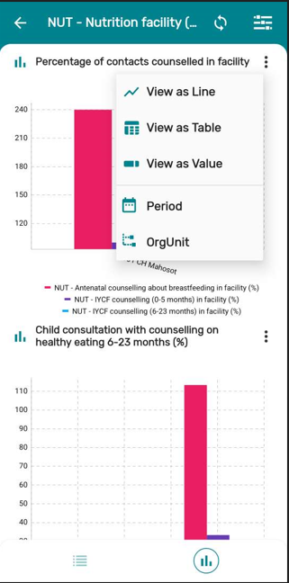

5. Modify the period to filter the data of the last 3 months. Check how the chart changes the values

   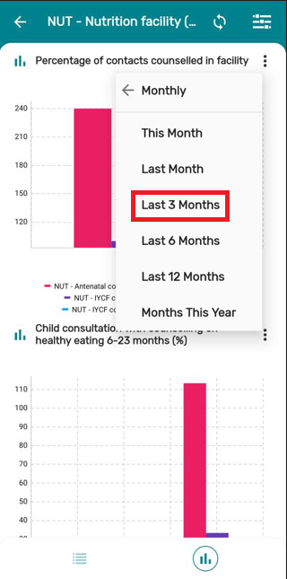
   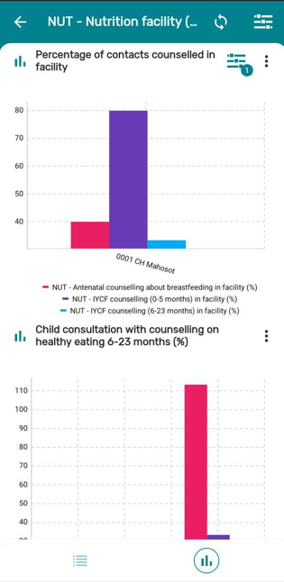

### STOP : Perform Exercise 4

## Part 5 : Dataset Analytics configuration

In this section you will assign an existing visualization to the DataSet analytics. 

1. Open the Android Settings Web App.

2. Navigate to Analytics > Data set and click on "Add Data set visualization".

   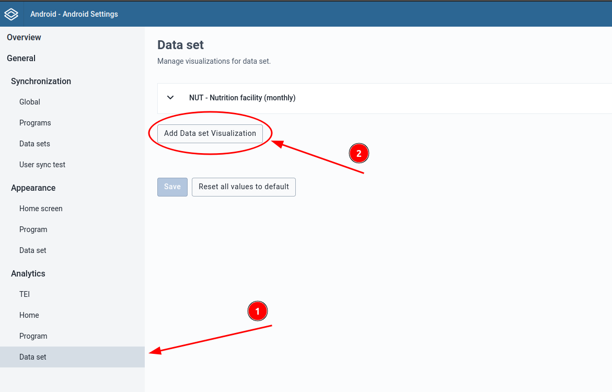

3. Fill out the form with the information for the new data set visualization:
    - Dataset: NUT - Nutrition facility (monthly)
    - Visualization item: ANC Contact in facility
    - Use a visualization group
    - Create a new visualization group: ANC Contact

   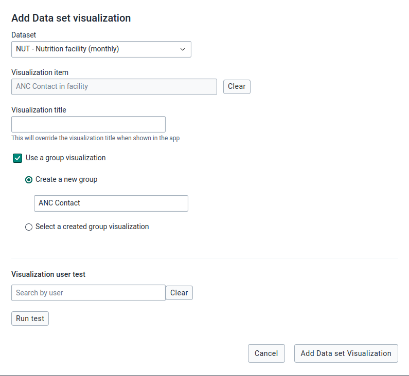

4. Click on "Add Data set visualization".

5. Click on "Save" (**it is important to Save your work**).

6. In your Android app, go to Settings and Sync configuration.

7. Once it is finished, go to "NUT - Nutrition facility (monthly)" and check the newly added chart.

   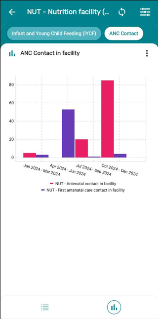

### STOP : Perform Exercise 5

## Part 6 : Create a visualization and assign it to Home

Create a new visualization and assign it to your offline analytics.

1. Go to Data Visualizer app and create a new Visualization will the following parameters:

    - Data Element: NUT - Antenatal contact in facility
    - Organisation Unit: User organisation unit
    - Period: last 12 months

2. Save the visualization including your user name so it can be easily identified, something such as "ANC Contacts in facility".

   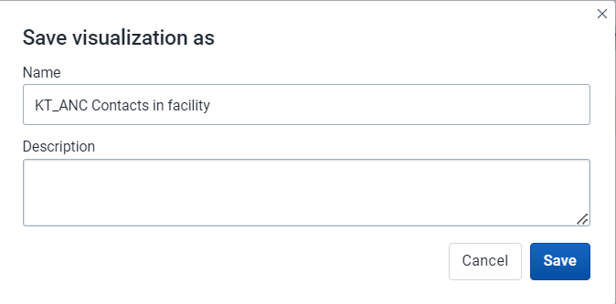

3. Change the sharing settings of the visualization to Public.

   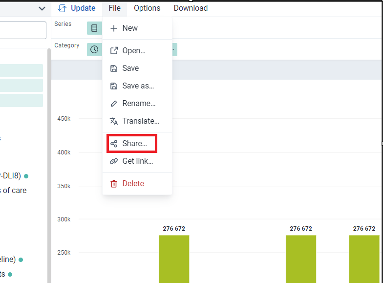

   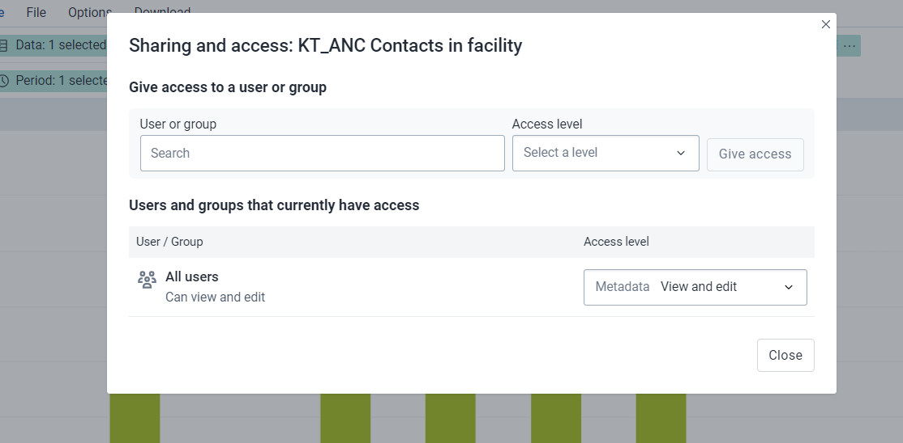

4. Go the Android Settings Web App and click on Analytics > Home. Then, click on "Add Home Visualization".

   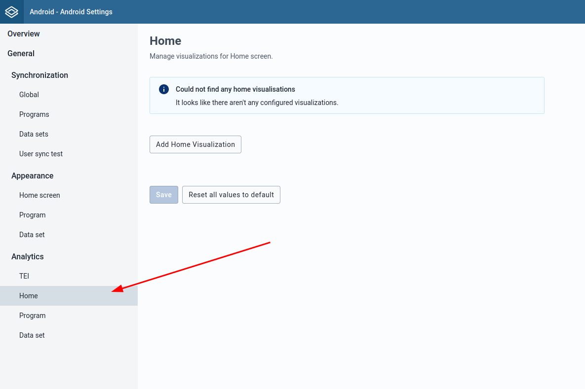

5. From here, the process is very similar to adding a DataSet analytics. Select your recently created visualization and add it to the home. **Important:** take turns to do these changes in the Android Settings Web app.

6. Go to your Android App and synchronize your configuration.

7. In the home screen, verify that the Analytics tab is displayed. If you cannot see the Analytics tab after sync, try closing the app and opening it again. It might happen that the home screen doesn't refresh immediately.

   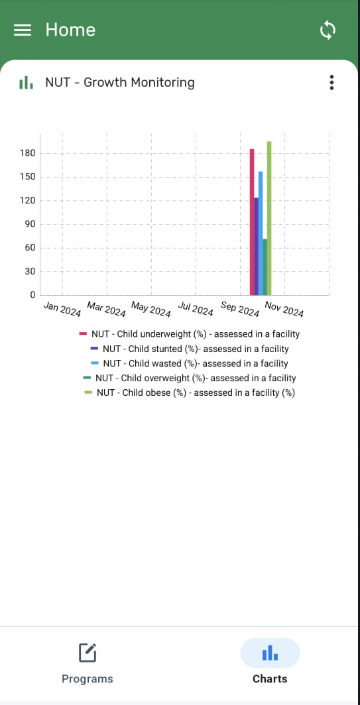

### STOP - End Exercise 6
