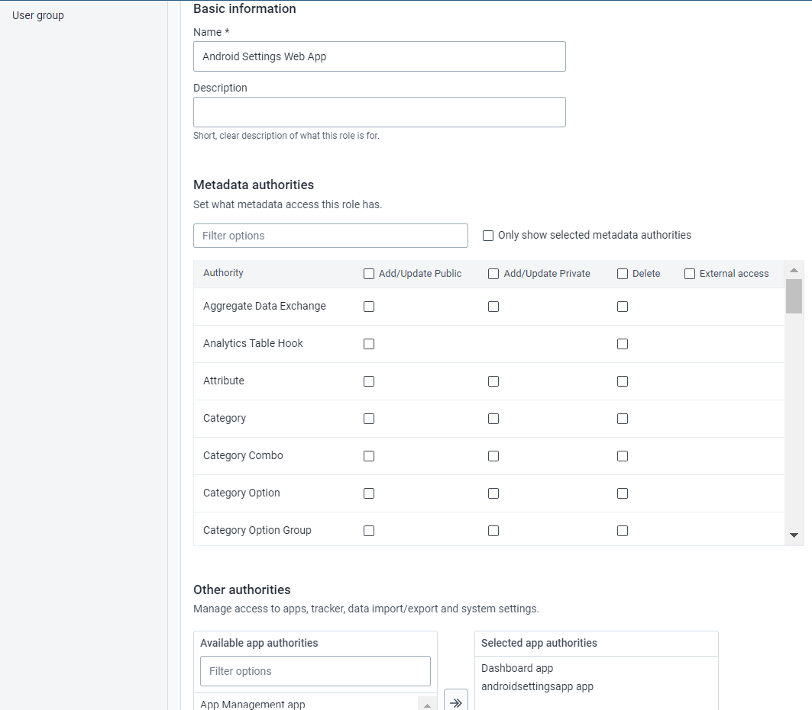
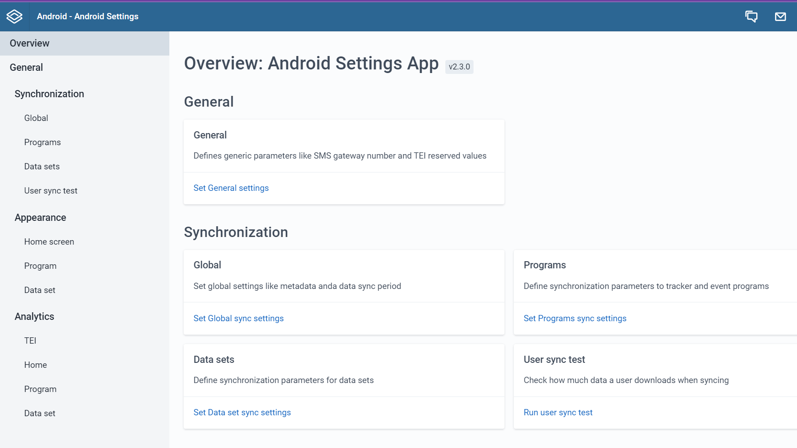

# Trainer’s Guide on Android Settings Web App Part-2

## What is this guide?

This guide is a support document for DHIS2 Android Academy trainers for the session "Android Settings Web App". The session follows the standard Academy training approach with

* A live demo session where the trainer demonstrates and explains the features of the topic
* A hands-on session with exercises where participants get to practice the explained features.

## Learning objectives for this session

* How to Install the Android Settings Web App
* How to navigate through the Android Settings Web App
* Understand different features for the web App

## Time needed for this session

Live demo: 45 min

## Background

The Android Settings Web App

1. Allows admins to configure synchronization parameters for the DHIS2 Android App, 
2. Can encrypt the local database of an Android device
3. Can customize the appearance of Programs, Data sets, the Home screen, and add TEI Analytics items. 

The configuration parameters defined within this web app will overwrite the settings of all Android devices using the DHIS2 Android Capture App.

## Part 1: Installation of the Android Setting Web App

To use the Android Settings Web App you need to first install the app by going to DHIS2 web interface

* Go to Search Bar and Search for the App Management app
* Go to the app hub
* Click on Android Settings
* Install the Android Settings App

### Users roles to use the App

Trainers can briefly discuss the user roles. For more information about user roles. ([Click Here](https://docs.dhis2.org/en/use/user-guides/dhis-core-version-240/configuring-the-system/users-roles-and-groups.html?h=user+2.40#mgt_userrole))

Please note that in this version of the web app, only users with the authority to manage the android settings web app, found under "Other authorities" can edit and access the app.

So to make sure your users have this role, you can go to Users > User role and in this you can select the app authorities as android settings app.

### STOP : Perform Exercise 1

## Part 2: Android Settings App Overview

_Note: In this session trainers will give an overview of each section and will do a detailed session on Appearance._

* Open the DHIS2 web interface
* In the apps menu , find the android settings app
* Select the App and you will see the Home Screen for Android Settings Web App as shown below:

### General Settings:

* General: Defines generic parameters like SMS gateway number and TEI reserved values. 
* An important paramater here is whether or not you allow the user to take screenshots. This may significantly help with troubleshooting in the field. 
* Another important option is the "reserved values." This is used for generating your unique IDs. This option allows you to download pre-generated IDs for the device to use offline. When you come back online, it will refresh your IDs when you sync. Based on the connectivity etc. you should be careful in defining this so people do not run out of IDs when they are working offline. 

### Synchronization:

* Global: It offers additional parameters to control metadata/data synchronization.
  * Sync options that are included here include both the defaults for metadata and data. 
  * You may also want to include a maximum size of a file download if you are on a capped data plan. 
* Programs: This section controls the program data synchronization parameters. It has a section to define global or default parameters to be used in the synchronization of all programs.
  * Note that you can define how many TEIs are downloaded to the device upon syncing.
  * You also have options for defining how many events are downloaded in total
  * It priortizes these downloads based on the date the TEI or event was created
  * These downloads are spread depending on the settings level
* Datasets: Define synchronization parameters for data sets
  * This number determines how many past data sets PER org unit that you are assigned gets downloaded. So a value of 10 could download many more data sets depending on how many org units a person is assigned.
* User sync test: Check how much data a user downloads when syncing and determine if the user can sync everything correctly based on your defined settings

## Part 3: TEI Analytics configuration

TEI Analytics manage Tracked Entity Instance (TEI) analytics for tracker program.

To add analytics (Bar chart, line chart, pivot tableor single value type) for TEI 

* Click on Add TEI Analytics

  

A window will pop-up,now you need to select,

* Select Program , in this case we will select Immunization program.

* Select program stage - Immunization

* Give name and short name to the analytics chart title: Weight

* Select Visualization type : Line chart

* Select period type : Quarterly

* Select visualization element type : Data Element

* Select Data Element : Weight in (kg)

* Click on Add Analytics

  

This will be listed under TEI Analytics section

* Now Go to the Android App and sync your changes (make sure you go to Settings -> Sync Configuration now, to sync the changes that were done in the Android settings web app)

* Now go to the Immunization program.

* Select any child,click on the Analytics tab,you will see the below screen with all the analysis you have added for TEI.

  

### STOP : Perform Exercise 2

## PART 4: Home Analytics configuration

Manage visualization for Home Screen in Android App.

* Select Home under Analytics tab

* Click on "Add Home Visualization"

* Select the visualization type from the list

_Note: From 2.40 version you can now select two different types of visualization_

  1. Event visualization
  2. Data visualization

   

* Select Visualization type : Data visualization

* Select Visualization item : NUT - Growth Monitoring

  

* Add an alternative title, otherwise, the app will display the name of the visualization.By default, the app will enable the group visualization setting.

* Create a new group: A free text box will pop-up to type the name or

* Select a created group visualization: Choose an option from the list to add the visualization or
Disable the group visualization by clicking on the checkbox.

* Click on the "Add Home Visualization" button.

* Click on "Save"

  

* Now Go to the Android App and sync your changes (make sure you go to Settings -> Sync Configuration now, to sync the changes that were done in the Android settings web app)

* In the Home Screen, select the analytics tab

  

* You will see the below screen with all the analysis you have added for Home.

  

    NOTE: For each visualization object, the user will be able to filter in the app by:

    1. Period: Daily, Weekly, Monthly, Yearly, This Quarter, Last Quarter, Last 4 Quarters and Quarter this year.

    2. OrgUnit: Select "All" to display all the org units available to the user or "Selection" to specify one or multiple org units.

    Check the sharing settings of the visualization. The android users must have read access in order to download it. Use the “Visualization user test” functionality to test it.

### STOP : Perform Exercise 3

You can also perform the similar steps to add visulaization in Program and Datasets in Android settings web app.

