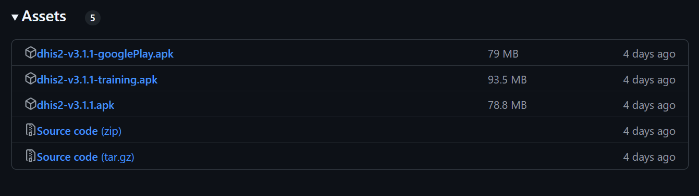
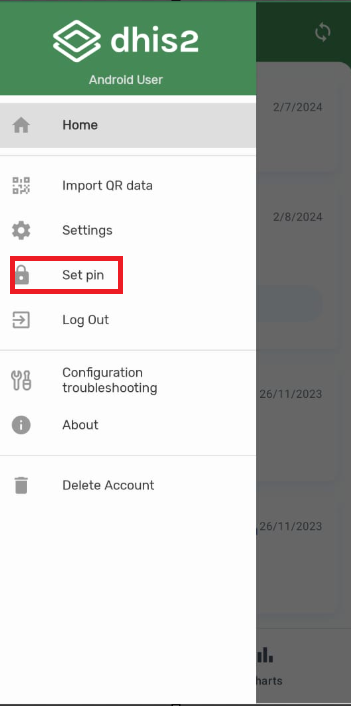
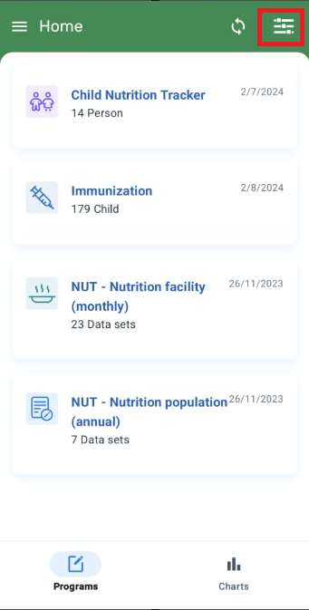
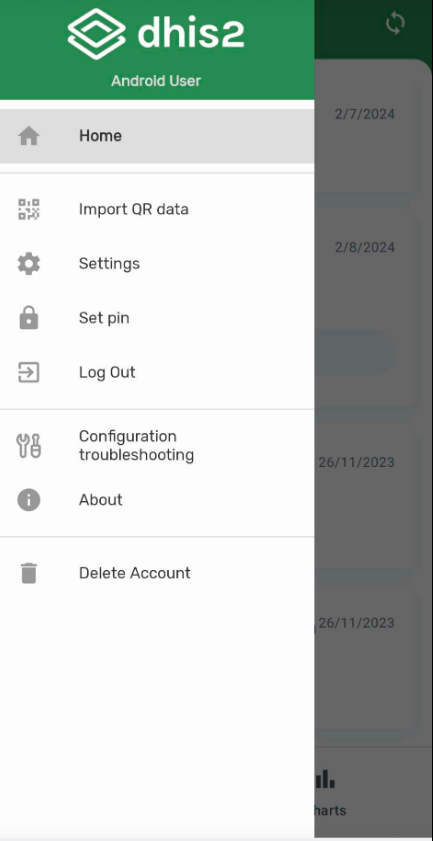
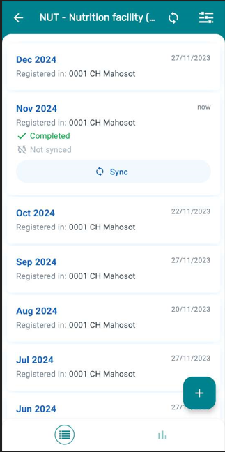
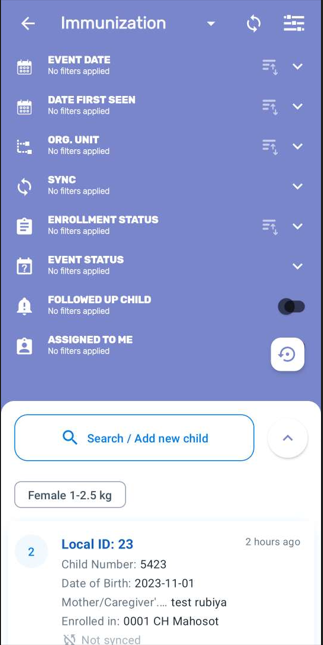
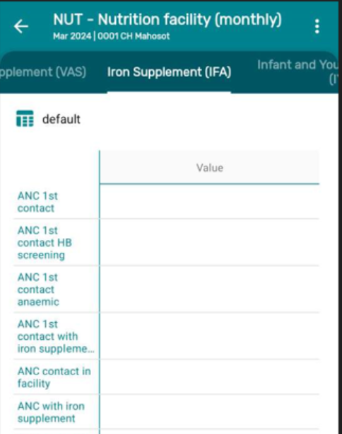
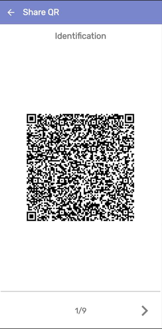
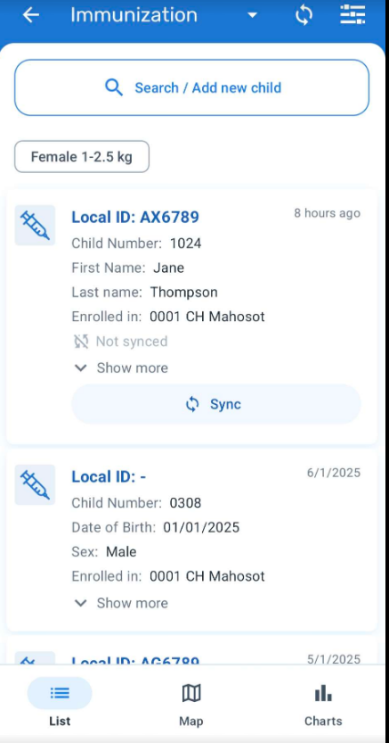

# **Trainers Guide : Explore the Android App**

## What is this guide?

This guide is a support document for DHIS2 Academy trainers for the session “Explore the Android App.” This session follows the standard Academy training approach with

1. a live demo session where the trainer demonstrate and explain how to explore the feature of the android application

This guide will help the trainer​ prepare​​ for the live demo session. The “Live Demo step by step” section has a detailed walkthrough of all the steps to demonstrate with explanations and screenshots that should be easy to follow. Use that when preparing for the live demo session.

There is also a Quick Guide which lists the steps very briefly and this is meant as a lookup guide or “cheat sheet” WHILE doing the demo, to help the trainer remember all the steps and the flow of the demo.

NOTE : THIS GUIDE IS FOR TRAINERS TO GET AN OVER ALL VIEW OF THE ANDROID FEATURES AND FUNCTIONALITIES.DURING THE DEMO TRAINERS DON'T HAVE TO GO IN SO MUCH DETAILS AS DESCRIBED.

## Learning objectives for this session

* To get an overview of the Android App features.

## Time Requirements

## Preparations

Go through the Live demo step by step guide a few times before doing the actual demo for participants so you understand the full process of the session.Make sure your two user accounts (server administration and Android users) are the same or similar to the participants’ accounts so that you don’t show more features, dimension options or forms than what they can see when doing the exercises.In terms of logistics make sure the resolution on the projector is OK for zooming.

Create an account with the same level of access as the users you are demonstrating to (ie. if they can only search and enter within one facility, have your user have the same authority). If it is the procedure to enter this data from a paper form, it will be useful to have a copy of the form they would normally use as reference filled in. This can just be a form that you have filled in yourself for example. If they are entering data in real-time, then this is not required but you should prepare the details of an example case that you can follow in your examples.

For the exercises and small activities during the demo, fill out a couple extra forms that the participants can use to register their own cases. Your training DB should have some existing cases filled in to help support the working list filter, relationships and searching functionality. If demonstrating the working lists functionality, you will need to have a subset of the events you have created and assigned to a user where you can show this functionality.

## Android Application (APK) File

Make sure that you have the app made for training purposes otherwise you will not be able to cast your screen:

[https://github.com/dhis2/dhis2-android-capture-app/releases](https://github.com/dhis2/dhis2-android-capture-app/releases)

# Projecting your Android Device

The instructor will have to decide on which method they would like to use to mirror the android app on their computer screen. They will also have to set up a user account (if it doesn’t exist already) that is assigned to the same org unit as the program they are demonstrating.

Please review this CoP post for details on options you may use to mirror your android device:

[https://community.dhis2.org/t/how-to-clone-your-android-screen-useful-for-presentations-debugging-etc/38077](https://community.dhis2.org/t/how-to-clone-your-android-screen-useful-for-presentations-debugging-etc/38077)

Scrcpy is another tool that can also be used and is platform agnostic: [https://github.com/Genymobile/scrcpy](https://github.com/Genymobile/scrcpy)

Make sure that your device has developer options enabled before attempting to use scrcpy

After developer options is enabled, enable usb debugging from within the developer options menu

More information on enabling this is available. [Click Here](https://developer.android.com/studio/debug/dev-options)

## User Account

Ensure that there is a user account assigned to a lower level set of org units at the facility level within Lao PDR that you can use prior to performing this session. If the participants are following along, ensure that there are user accounts for them to use as well assigned to lower level organization units. The demo user account is:

Username: android1

Password: District1#

## Participants

Send the instructions to the participants on how to install the Android app prior to the session if they have not yet done so. The instructions can be found [Click Here](https://docs.google.com/document/d/1SUUUdmPSDycFtdB9yUMq8ZWiWf8gNOu5xvtNj4_V63U/edit#heading=h.lswxgahoi1m2).

Some participants may not have been able to install the app by themselves. In that scenario, you may need to walk them through how to do this via google play.

## Quick Guide

1. Log in the Android device
2. Show them how you can create multiple users accounts by clicking on the Manage user account.
3. Show them how to move to other apps in your phone without deleting the local data by using Blocking session feature
4. 

## Part 1

### Log - in

There are two ways to access the application:

1. Manual: The user must have a corresponding URL of the server and enter username and password.
2. QR: The user can use a QR code instead of typing the URL but username and password must be entered manually.

### Multi-user Account

Users can create multi-user accounts in the Android device.The Android app has removed the limitation on the number of offline accounts that users can create, allowing them to work with as many offline accounts as needed.

**NOTE: The users will need to have access to the internet for the first login of each account and will be able to switch accounts after without requiring access to the Internet.**

Create a new user by clicking on the Manage user account and Add account as needed.

If there are already existing accounts the screen will show as below image

### Blocking Session:

User is able to lock the session using a 4 digit PIN. This allows you to move to other apps in your phone without deleting the local data. If the user forgets the PIN number, log in by entering the credentials is also available.

For this go to Home and Select &lt; Set PIN

### Home Screen:

All programs assigned to the user (which user has data access rights) will be displayed in the home screen.

In the below screen you will see all the programs which users have access to.

STOP 

## DEMO PART 2 - DEMONSTRATE

### Settings

1. To Go to Settings and Click

2. Select Settings

**Sync data** : Users are able to choose from a drop-down list if the data entered in the app is uploaded to the server manually or scheduled every 15 min, 1 hour or 1 Day. By default the app will sync every 24h. This kind of Syncing includes new and updated events and TEI’s.

**Sync configuration** :  (also known as sync metadata) Users are able to choose from a drop-down list if the data entered in the app is uploaded to the server manually or scheduled every day or week. By default the app will sync every 24h. This sync will update changes in programs or configurations on the web.

**Sync parameters** : These parameters allow the user to specify the maximum number of TEI’s and events that can be stored in the local device. The user can also specify if limits apply per organisation unit or in total. Values can be set to default by clicking on “Reset to default”.

**Reserved values** : This will specify the number of reserved Id's available in your device and will allow you to refill them.

**Open sync errors log** : The sync error log gives details about the error and is prepared to be shared with admins.

**Delete local data** : This action will delete local data without having to log out.

**SMS Settings** : This section allows you to check or edit the parameters related to the sms gateway.

     NOTE: This feature enables implementation administrators to manage and control the version of the Android app from the DHIS2 user web interface, making it easier to manage app updates and ensure compatibility with the DHIS2 system. Managers will be able to upload the desired version and users will get a prompt message to update when they are not in the last updated version. The management of versions is made through a new Web App.

STOP 

## DEMO PART 3 - DEMONSTRATE

### Sync Information

**Login Sync** :

During the metadata download, the app will remain in the splash screen and will open the home screen once the metadata is in the device.

In the home screen, the app will inform with a loading spinner on each program when the data is downloading. After the sync process finishes, the app will display one of the two possible icons:

* A green checkmark if the program downloads data successfully and without errors (the icon will disappear after three seconds) or,
* A gray arrow if there is an error during the sync process and the total or partial data isn't downloaded

The user will be able to see how many programs are downloading data, or completed, making the waiting process more transparent and informative about its progress.

**Sync Status**

In the application you can see that “Next to each program or data set” an icon will be displayed which allows the user to check sync information. 

See the details for more information:

* Synced records will not display any icon. 
* Unsynced (gray arrows), 
* Error (red arrows), 
* Warning (orange) or 
* SMS (blue and including the SMS word inside) icons are displayed according to the status.

Below are the different sync icons:

**Granular Sync** :Users can click on the grey arrows (which means record(s) stored online in the device) to perform a sync. These options are available at top level (programs/dataset) or individually (TEI, events, datavalues).

**SMS Sync:**

When there is no Internet connection (either via WiFi or Mobile Data) but there is still mobile connectivity, users can synchronize via SMS if the gateway has been previously established in the app and properly configured at server level.

_NOTE: Trainers can mention this feature as NO SMS gateway has been set-up._

STOP

## DEMO PART 4 - DEMONSTRATE

### Filter:

A filter can be applied in all listing screens (Home, Event listing, TEI search and DataSets) which narrows down the data displayed. The filters available are: period, org. unit, sync state, event status, category option combination and "assigned to me".

Click on the Filter Icon at Home Page

Filters can adapt based on the program and data sets:

1. For DataSet : Select NUT - Nutrition facility monthly dataset and then click on the filter icon.You will see filters: 

* Period
* Org Unit
* Sync State

2. Program with registration: Immunization Program

* Event Date: Filter the Events, TEIs(based on their events) and data sets, the following periods of time are availables: - Today - This week - This month - Yesterday - Last week - Last month - Tomorrow - Next week - Next month - From-to - Other (Opens a date picker) - Anytime 
* Date of enrollment : The 'Date of Enrollment' will apply to the Enrollment date of the TEI in the program. If there is more than one enrollment date, it should sort the results by the most recent one. The label of this filter will display when available
* Org. Unit: Allows the user to type the search or select an organisation unit from the tree. The filter will not be visible if the user has only one Organisation Unit configured.
* Sync :Filer by: - Synced (events, TEIs, Data Sets) - Not Synced - Sync Error - SMS Synced
* Enrollment Status : The filter 'Enrollment status' offers three options: Active, Completed, Canceled. Only one option can be selected at time. If you filter by "completed" and the TEI has more than one enrollment, the app will open the "active" enrollment. To see the completed one, select the three dot menu at the top right corner of the dashboard and select "program enrollments".
* Event Status : Filter the events by: - Open - Schedule - Overdue - Completed - Skipped

   _NOTE: Multiple status selection is permitted. Once you open a TEI, the filter will be kept in the dashboard and show only the events with the selected status.
Events shown are up to 5 years old._

* Assigned to me: It is possible to filter events based on its assignment to the current user. The “Assigned to me” filter has been added to the single event program list, the TEI list and the TEI Dashboard and the map views. It will only be displayed when the active program is configured to assign events to users.
* Follow up: The 'Follow Up' filter allows the user to filter out the TEIs that have been marked as 'Follow-up'. TEIs can be marked to be followed up in the TEI Dashboard.

The filter icon will show only if a list of events is available (Display front page list feature or search)

To show Filters for Tracker Capture Program : Trainers can click on Immunization program and show the Filter options

### Filtering added in TEI Dashboard:

Filters have been added to the TEI dashboard. It is possible to filter the events of a Tracked Entity Instance enrollment per period, organisation unit, sync status, event status, and user assignment.

### SORTING

Sorting has been integrated in the filter menu.The sorting button will be on the filter bars with the following behavior:

* Only one sorting applies at a time. If the user clicks a different one, the previous one is disabled.
* The icon for applied sorting shows it is active, the others are inactive.
* Repeated clicks keep changing the order to the reverse.

_NOTE: CONFIGURATIONS CAN BE CHANGED USING ANDROID SETTINGS WEB APP._

**_NOTE FOR TRAINERS: Trainers may just tell participants about the Android App now and Android Settings Web App configuration will be discussed in the future sessions._**

### Refresh data

Users can now retrieve the latest data from the server before entering new data. A refresh button is now located to trigger a granular synchronization in the following screens:

* Home
* Search
* TEI dashboard
* Event program listing
* Event details
* Data set listing
* Data set details

STOP

## DEMO PART 5 - DEMONSTRATE

### Differentiating Data Sets, Tracker and Event programs

An easy way to differentiate between Data sets , Tracker and Event programs is by looking at the word at the bottom left corner. 

* The word 'Event' will always be in event programs. 

* In the tracker will appear the name of the tracked entity type (person, patient, building, etc.). 

* For data sets, the word 'DataSets' will be shown next to the number of records.

### Data Sets and Tracker Capture

The users can now enter aggregate data for an organisation Unit, a period and a set of data elements and send it to the server.

For Aggregate data trainers can show: **Nutrition Monthly Data Set**

* Select the org unit you are capturing the data (in this case the user has access to one org unit then he/she will only see that org unit and won't be able select the list)
* Select the reporting period for which data needs to be entered.
* Enter data and save

For Tracker Capture:

Trainers can show how - Immunization program and briefly demo the steps involved in data capture.

* Open Immunization Program
* Search for the Child 
* Click on "+" icon 
* Register the Child
* Open Birth Details
* Enter Data
* Save Data

### Sharing Data:

Users can share TEI via QR codes. This allows transferring/sharing information between devices without the need of transferring via the server (useful when connectivity might be missing). To do this users should open any TEI and click on the _SHARE_ button.

### Capture coordinates

Trainers can show how to capture Enrollment coordinates in the Immunization program

Coordinates can be configured as point and polygon coordinates

### Images:

ValueType image can be used in Android to capture data and also, depending on the program configuration to be displayed in the TEI dashboard.

For this trainers can show the Immunization Program and Open any record and then show Child Details and there you can show the attribute “Photo of the Child”.

STOP

## DEMO PART 5 - DEMONSTRATE NEW FEATURES 2.8

### Error Navigation

The Android App has improved the navigation of sync errors on the user interface. The app will display the sync errors in a simple and clean manner allowing the user to navigate from the home screen to the exact field that is causing the error inside the event or data set.

### Long Texts Management 

The Android App enables users to view long text in fields that are limited in size, such as a stage names or datasets headers.

### Rendering Options

In 2.8 version the rendering options have been expanded to include horizontal and vertical radio buttons, checkboxes and toggles for any value type.

### Working List

Working lists are available in Event and Tracker Programs, once a list is selected the filters will be blocked and not allowed to change until the user resets the search.

From 2.8, the Android App supports the new tracker working lists, allowing users to filter by data elements. The working lists need to be configured on the web using the web Capture App. The Android app will download the working lists that are configured and saved on the server side.

### Maps

Trainers can show Maps and  there are different layers that can be displayed by clicking on the specific button on the upper right corner. The user can select one or more layers to be displayed. Both coordinate and polygon types will be displayed. The layers are dependant on the type of program as explained below:

* Show events (For programs without registration)
* Satellite view
* TEI coordinates (By default in programs with registration)
* Enrollment Coordinates (Only for programs with registration)
* Program Stage coordinates (Only for programs with registration)
* Relationships (Only for programs with registration)
* Heatmap (Only for programs with registration)
* Tracked Entity Attributes (Coordinates Value Type - Only for programs with registration)
* Data Elements (Coordinates Value Type)

