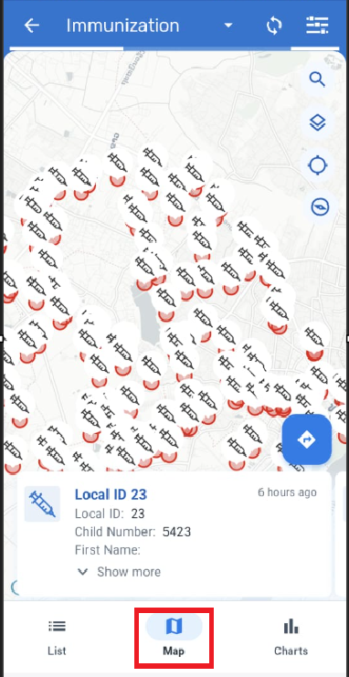
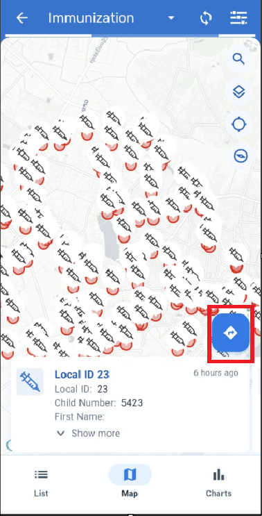
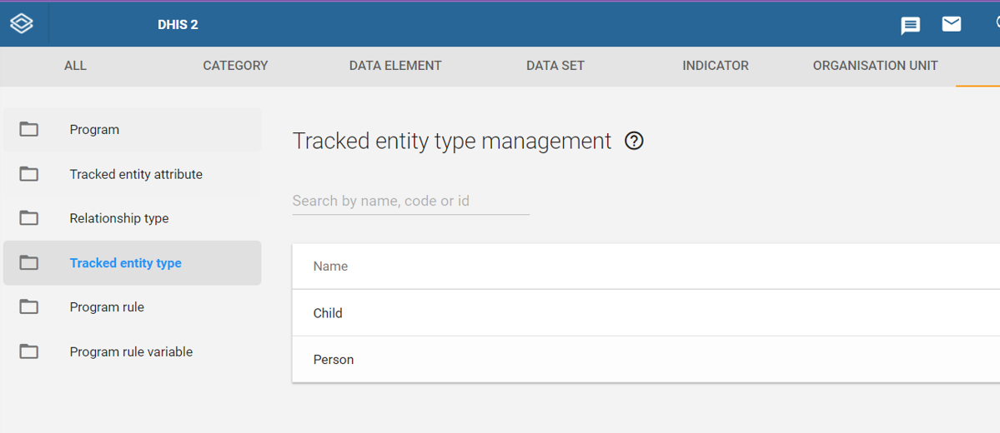
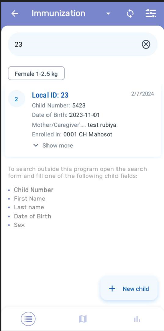
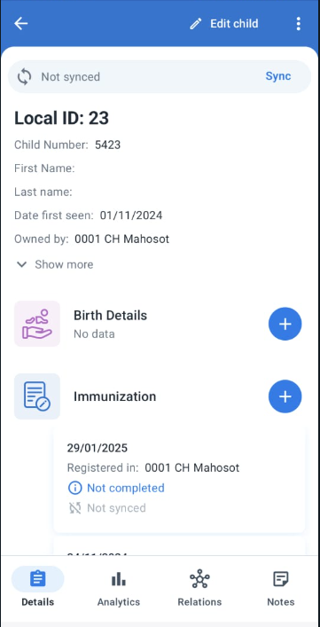
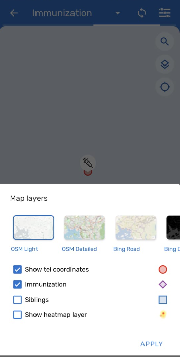
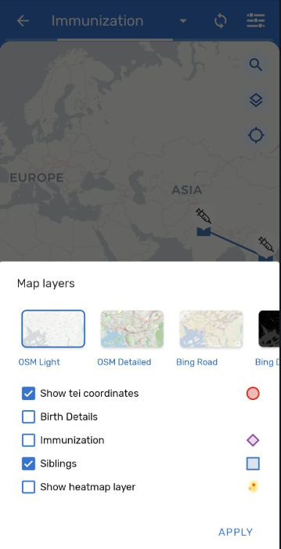
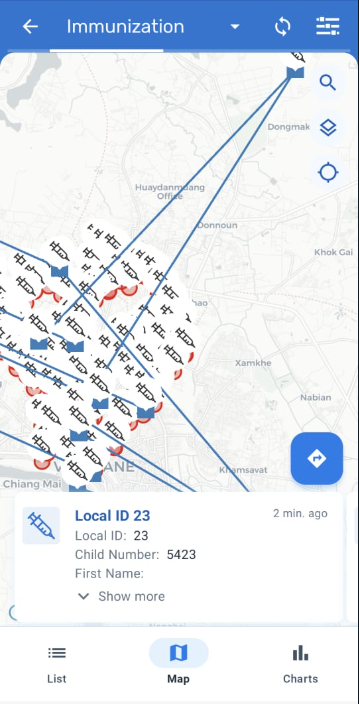
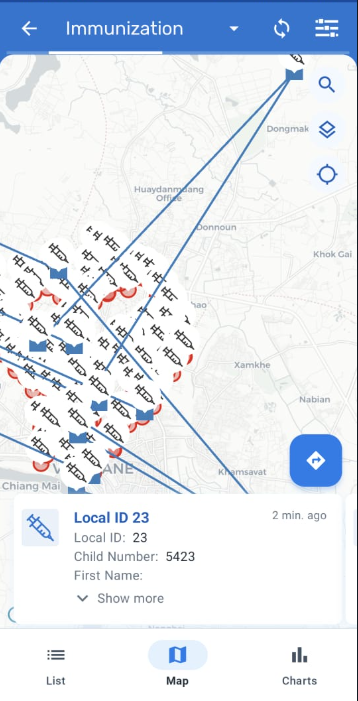
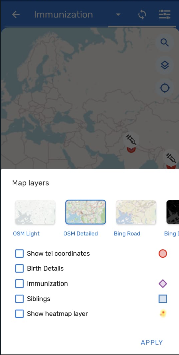

# Trainer’s Guide for Maps in Android

## What is this guide?

This guide is a support document for DHIS2 Android Academy trainers for the session "Maps in Android." The session follows the standard Academy training approach with

1. A live demo session where the trainer demonstrates and explains the features of the topic
2. A hands-on session with exercises where participants get to practice the explained features.

## Learning objectives for this session

1. Describe how maps can be used in DHIS2 Android Device
2. Demonstrate how to collect and display tracked entity and program stage coordinates
3. Demonstrate how to toggle additional options within maps on an Android device

## Preparations

Go through the Live demo step by step guide a few times before doing the actual demo for participants so you understand the full process of the session.Make sure your two user accounts (server administration and Android users) are the same or similar to the participants’ accounts so that you don’t show more features, dimension options or forms than what they can see when doing the exercises.In terms of logistics make sure the resolution on the projector is OK for zooming.

Create an account with the same level of access as the users you are demonstrating to (ie. if they can only search and enter within one facility, have your user have the same authority). If it is the procedure to enter this data from a paper form, it will be useful to have a copy of the form they would normally use as reference filled in. This can just be a form that you have filled in yourself for example. If they are entering data in real-time, then this is not required but you should prepare the details of an example case that you can follow in your examples.

For the exercises and small activities during the demo, fill out a couple extra forms that the participants can use to register their own cases. Your training DB should have some existing cases filled in to help support the working list filter, relationships and searching functionality. If demonstrating the working lists functionality, you will need to have a subset of the events you have created and assigned to a user where you can show this functionality.

## Android Application (APK) File

Make sure that you have the app made for training purposes otherwise you will not be able to cast your screen:

[https://github.com/dhis2/dhis2-android-capture-app/releases](https://github.com/dhis2/dhis2-android-capture-app/releases)

## Projecting your Android Device

The instructor will have to decide on which method they would like to use to mirror the android app on their computer screen. They will also have to set up a user account (if it doesn’t exist already) that is assigned to the same org unit as the program they are demonstrating.

Please review this CoP post for details on options you may use to mirror your android device:

[https://community.dhis2.org/t/how-to-clone-your-android-screen-useful-for-presentations-debugging-etc/38077](https://community.dhis2.org/t/how-to-clone-your-android-screen-useful-for-presentations-debugging-etc/38077)

Scrcpy is another tool that can also be used and is platform agnostic: [https://github.com/Genymobile/scrcpy](https://github.com/Genymobile/scrcpy)

Make sure that your device has developer options enabled before attempting to use scrcpy

After developer options is enabled, enable usb debugging from within the developer options menu

More information on enabling this is available. [Click Here](https://developer.android.com/studio/debug/dev-options)

## User Account

Ensure that there is a user account assigned to a lower level set of org units at the facility level within Trainingland that you can use prior to performing this session. If the participants are following along, ensure that there are user accounts for them to use as well assigned to lower level organization units. The demo user account is:

Username: android1

Password: District1#

## Participants

Send the instructions to the participants on how to install the Android app prior to the session if they have not yet done so. The instructions can be found [Click Here](https://docs.google.com/document/d/1SUUUdmPSDycFtdB9yUMq8ZWiWf8gNOu5xvtNj4_V63U/edit#heading=h.lswxgahoi1m2).

Some participants may not have been able to install the app by themselves. In that scenario, you may need to walk them through how to do this via google play.

**IMPORTANT NOTE : Make sure location services are enabled in both yours and the participants mobile device while performing the demo.**

## Background:

You can capture coordinates in DHIS2 Android App for 

* TEI, 
* Enrollment, 
* Events, 
* Data Elements / Attributes.

There are two types of coordinates:

* Polygons : Representation of an area defined by several coordinates (lat, long). Only: TETs, Enrollments and events
* Points: representation of a geographic location as a single coordinate (lat, long).

Also if TEI has a profile image,the map will display it.

## Quick Guide

1. Review the enrollment coordinate within a single TEI during registration
2. Review the program stage coordinates within the immunization stage
3. Show how to map relationships from the program event line list page
4. Review the different map layer options that are available via the maps settings on the android device

## Part 1 - Interface Review and Showing enrollments on a map

- Open the immunization program from the android home screen
- Select the map icon within the event line list page for this program

This will display all of the enrollments stored on device withi coordinates. In this case, we can see coordinates are spread out a bit. Let us zoom in on Lao

What we are seeing here is the location of children with a coordinate within the immunization program. Note it is only showing those TEIs that have been synced with the android device and have been enrolled in org units that this specific user has access to.

From this page, we can filter out various individuals and also select individuals so we can see their details.

If I select one of the TEIs on display, I can see their details. I can expand these details by selecting the arrow button beside their details.

By selecting the arrow button on this screen, you can open the location of this person within the mapping app of your choice. This could be useful if you want to perform some type of follow up with this individual

From this page, you can also modify some of the options in the map by selecting the menu button

From this menu you can change the map background layer and make other adjustments. These will be discussed more later on in this session.

Additionally, you can also search for specific TEIs on the map by using the search icon.

Let us search for the child with the Child Number : 8212. This will display their location along with their details which you can expand to review further.

#### STOP - Exercise 1

## Part 2 - Setting Up Enrollment Coordinates 

In this session our main objective is to understand how to add coordinates in the tracked Entity Instance using the Immunization program and the Program Stage coordinate.

### TEI coordinates

You can Capture the TEI coordinates in the registration form of the Immunization program. To get this feature we need to enable this feature in the tracked enity type (TET) feature type (for this demo it has already been configured for the Immunization program).

Now let's start with the first TEI coordinate (that represents the child's home) “Coordinates of the Child”

Before understanding how its captured in the android device lets see how this is configured in the web interface.

#### Web Configuration

* Connect to the instance with the Administrator account and go to Maintenance > Program
* Go to Tracked entity type and select Child 
* Review the feature type. It is **Point** in this case. Polygons are used in cases in which you need a boundary of some kind, for example when defining a malaria focus area.

#### Switch back the to the Android device

* Open the Immunization program
* Either Search for an existing child and select "Open Child Details" or create a new child.

* Review the coordinates field for the child. This is where we can assign the childs home location.

To do this you have two options

1. The First option will select the exact latitude and longitude based on your current location.

2. The Second option will open the map where you can select the location of your choice and Save it.

#### STOP - Perform Exercise 2

## Part 3 - Program Stage Coordinates

### Capturing a Program Stage Coordinate

This is also configured while designing the program. In this case we have set a Immunization stage in the Immunization program and we have used Feature type as Point while configuring the program stage.

### Web Configuration:

* Connect to the web with the Administrator account and go to Maintenance > Program
* Immunization Program and Program Stages
* Select Immunization Program
* Select Feature type as point

### Capturing Program Stage coordinates in Android

* Open the Immunization program
* Either Search for a tracked entity or Create a New Registration.

* Open the Immunization Stage
* Click on Add New 

* Capture Coordinates for New Event for Immunization Stage (This will help in further analysis where we can track from where child is getting immunized)

* The First option will select the exact latitude and longitude of the device
* The Second option will open the map where you can select the location of your choice and Save it

These coordinates can be displayed by selecting the program option within the map on Android.

#### STOP - Perform Exercise 3

## Part 4 - Mapping Relationships for a Program

### Relationships in Maps

A relationship is considered data in DHIS2 and is based on a Relationship Type, similar to how a Tracked Entity Instance is based on a Tracked Entity Type. Relationships always include two entities, and these entities can include Tracked Entity Instances, Enrollments and Events, and any combination of these.

In this case we have configured a Relationship type “Siblings” which is bidirectional.

### Online configuration:

* Connect to the web with the Administrator account and go to Maintenance > Program
* Relationship type
* You can observe the Siblings Relationship already created.

_Note : We will talk in detail about this in Relationship session_

### Relationships in Maps

In tracker programs, the user can see relationships on a map by tapping the map icon on the relationships tab.

Search for the person with the Child Number 1024 (Jane Thompson)

* An arrow is shown on the direction of the relationship.
* For bidirectional relationships, the arrow points both sides.
* Each relationship type displays a different color.
* If one or both TEIs have a polygon as coordinate, the line goes from (and to) the nearest point in the polygon of both TEIs.

To show this feature, select the map icon from the event page line list screen for the immunuzation program. 

This will show all of your TEIs on the screen.

To show the relationships, select the menu button from within the maps interface then select Siblings and Apply.

Once applied you will see bidirectional arrows from both TEI as the Relationship type is bidirectional.

#### STOP - Perform Exercise 4

## Part 5 - Changing the map layer options

### Map Layers

When displaying maps from the event line list or within a specific TEI, there are different layers that can be displayed by clicking on the settings button on the upper right corner. The user can select one or more layers to be displayed. Both coordinate and polygon types will be displayed. The layers are dependant on the type and configuration of program as explained below:

* Map layers: you can select the base layer used in your map
* Show events (For programs without registration)
* **TEI coordinates** (By default in programs with registration)
* Enrollment Coordinates (Only for programs with registration)
* **Program Stage coordinates** (Only for programs with registration)
* **Relationships** (Only for programs with registration)
* Heatmap (Only for programs with registration)
* Tracked Entity Attributes (Coordinates Value Type - Only for programs with registration)
* Data Elements (Coordinates Value Type)

You can toggle some of these layers to see the effect this has on the map.

#### STOP - Perform Exercise 5

## Assignment

After they have completed all of the exercises, have them perform the assignment in moodle.
