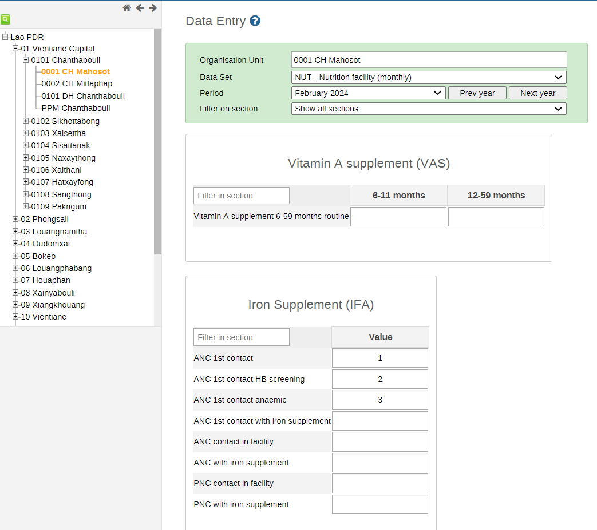
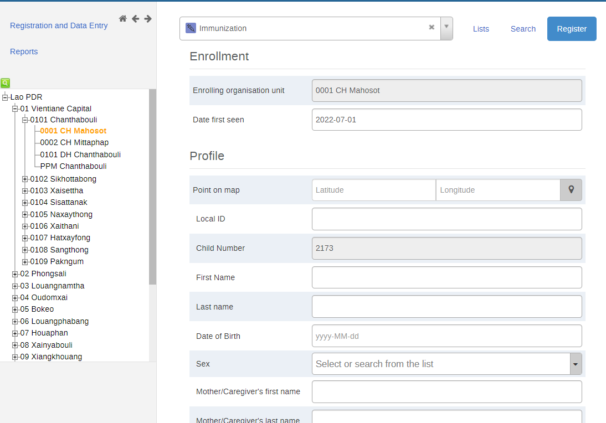
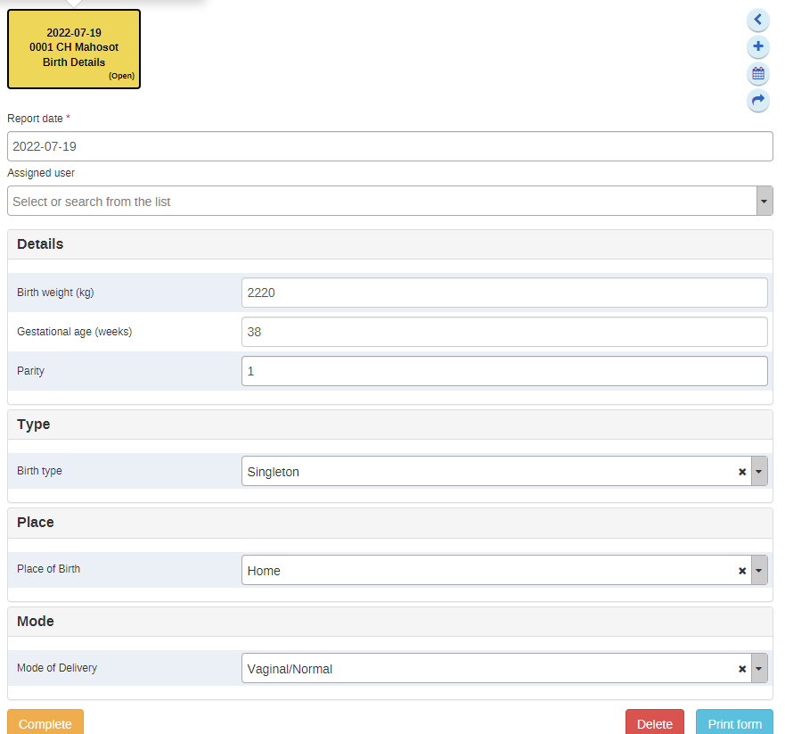
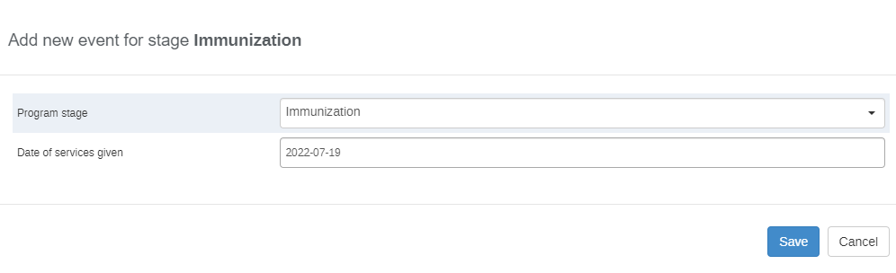
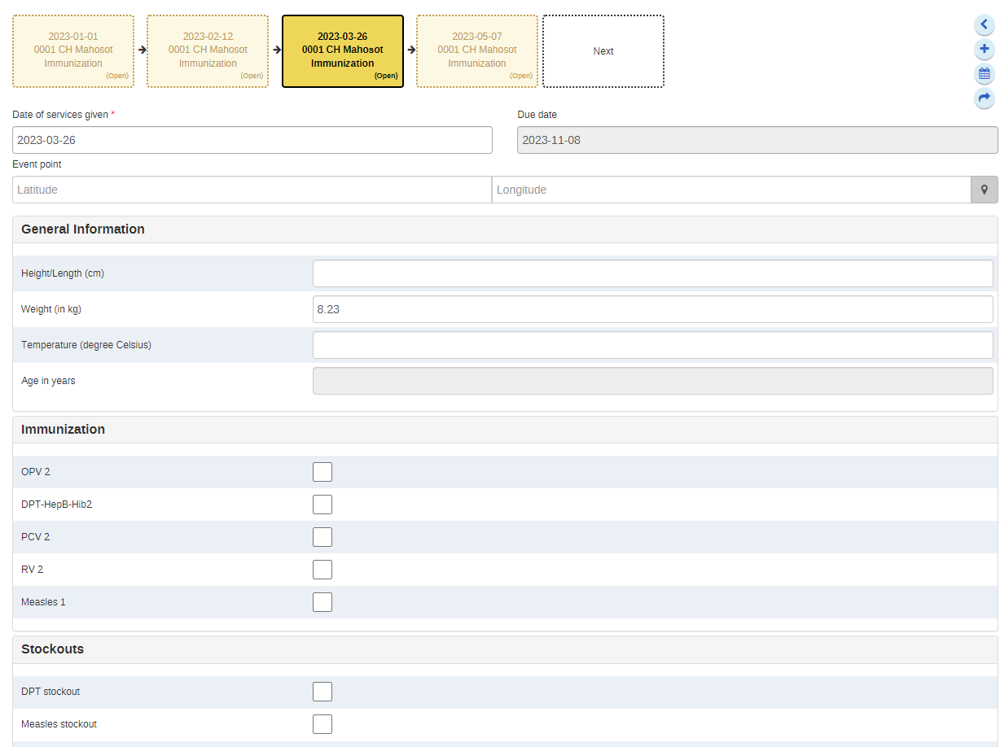

# Trainer’s Guide to Android Metadata

## What is this guide?

This guide is a support document for DHIS2 Academy trainers for the session "Metadata Overview.” This session consists of a short demo showing the layout of the metadata that will be used in the academy. The demo will review how the metadata/use-case looks like in the web, and then users will see how this translates to android later on.  

## Learning objectives for this session

- Describe the aggregate nutrition dataset
- Decribe the immunization tracker programs
- Identify where to find further information on both of these items

## Time Requirements

20 minutes

## Preparations

Go through the Live demo step by step guide a few times before doing the actual demo for participants.

Make sure your user account is same or similar to the participants’ training accounts so that you don’t show more features, dimension options or forms than what they can see when doing the exercises.

Make sure the resolution on projector is OK for zooming

Create an account with the same level of access as the users you are demonstrating to (ie. if they can only search and enter within one facility, have your user have the same authority). If it is the procedure to enter this data from a paper form, it will be useful to have a copy of the form they would normally use as reference filled in. This can just be a form that you have filled in yourself for example. If they are entering data in real-time, then this is not required but you should prepare the details of an example case that you can follow in your examples.

For the exercises and small activities during the demo, fill out a couple extra forms that the participants can use to register their own cases. Your training DB should have some existing cases filled in to help support the working list filter, relationships and searching functionality. If demonstrating the working lists functionality, you will need to have a subset of the events you have created and assigned to a user where you can show this functionality.

### User Account

Users can use the following account to access the metadata via the web:

Username: 

Password:

## Quick Guide

1. Review the nutrition data set in the data entry app
2. Review the immunization tracker program in tracker capture

## Live Demo step by step

### Review the Nutrition Facility Dataset

- Navigate to data entry
  - Select a facility
  - Select the "Nutrition facility (monthly)" data set
  - Select a month

From here you can review the nutrition data set

Discuss that it is a simple section-based form, and that no additional configuration is needed to make it work on Android.

That being said, some small changes or additions can be made to make it more visually appealing for android. This will be discussed as we go through the sessions.

### Review the immunization program

- Navigate to tracker capture
  - Select a facility
  - Select the "Immunization" program
  - Register a new person

> NB: When you are registering a person, select the date they are first seen as ~ 2 years back. Their date of birth and the date of the first event can all be the same as the date they are first seen. This will allow you to demonstrate the various program rules associated with the vaccination sechedule. 

Note that there are 2 fields, Child Photo and Parent Signature, that are not really meant for use on the web. These will be explained further when showing the program on an android device.

Enter the details of a person and register them. Ensure their DOB is the same as the date they are first seen (~ 2 years back) 

#### Add a new event (birth details)

Add this new event, the event date can be the same as the date of birth.

Review the details of this program stage quickly. This is a non-repeatable stage where the information only needs to be captured once. You can review the variables and option sets within this stage.

Complete this event then add a new one

#### Add a new immunization event

Ensure the date for this event is the same as the date of birth (~ 2 years back) to allow triggering the program rules based on the vaccination schedule

Note that you only see the vaccinations that are related to the person's age. At birth, they are given BCG and OPV 0 and that is all you can select from here.

Complete this event.

You can continue adding several new events to view the immunization schedule. You can use the outline for the program to determine when the next event date should be. 

Recall that this is the immunization schedule.

So you can schedule events at 6 weeks, 10 weeks, 14 weeks etc. from the date of birth in order to see the vaccinations a person should be given.

Here is what it looks like at ***6 weeks after birth*** as an example

After about 10 weeks, the general sense of how the program is configured should set in.

Ask the participants if they understand or want any clarifications regarding how the program works as you are going through this demo. They need a general understanding as they will be making interacting with and making alterations to this program over the next several days.

