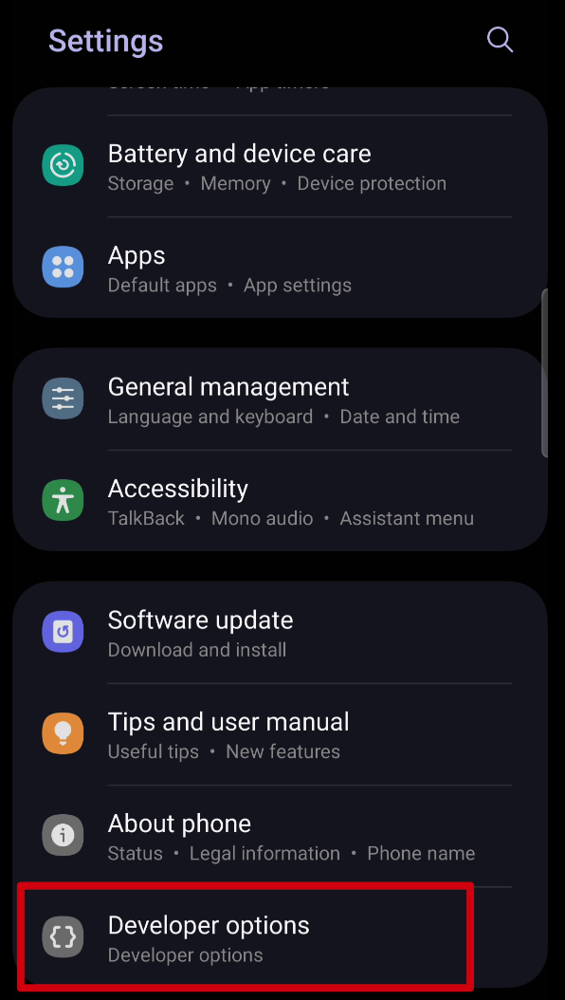
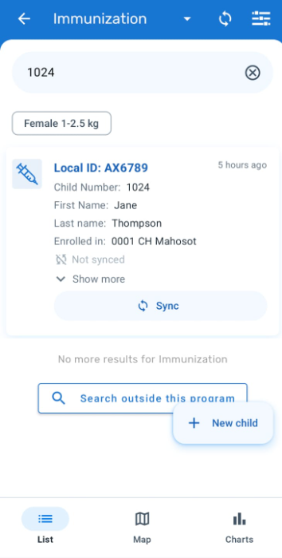
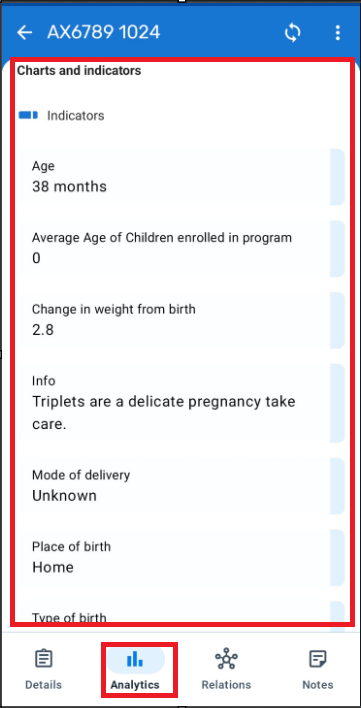
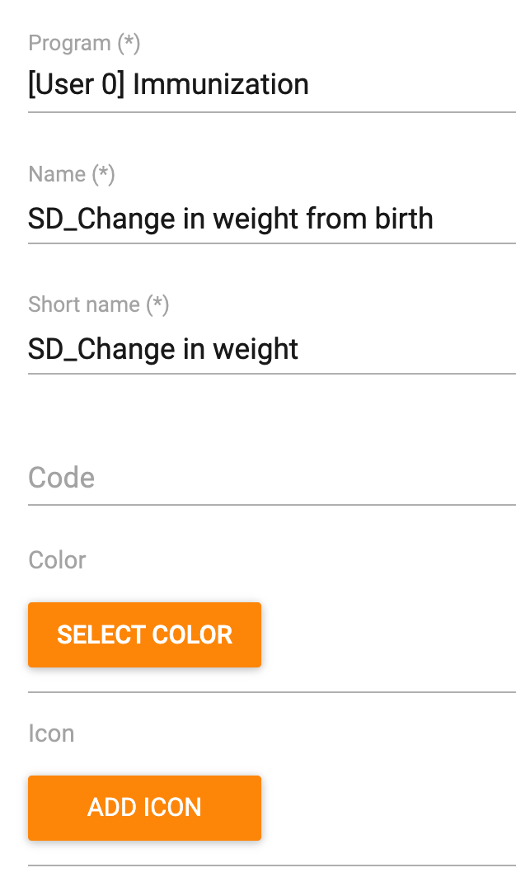
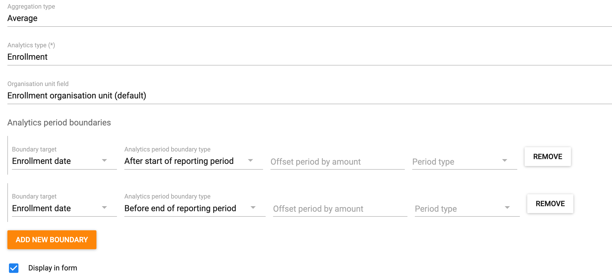
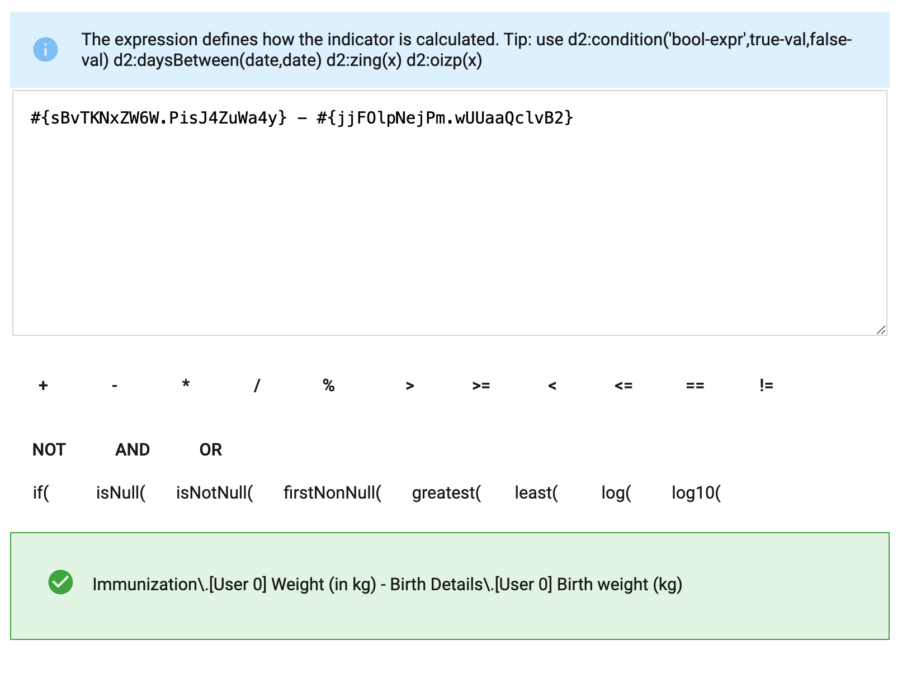
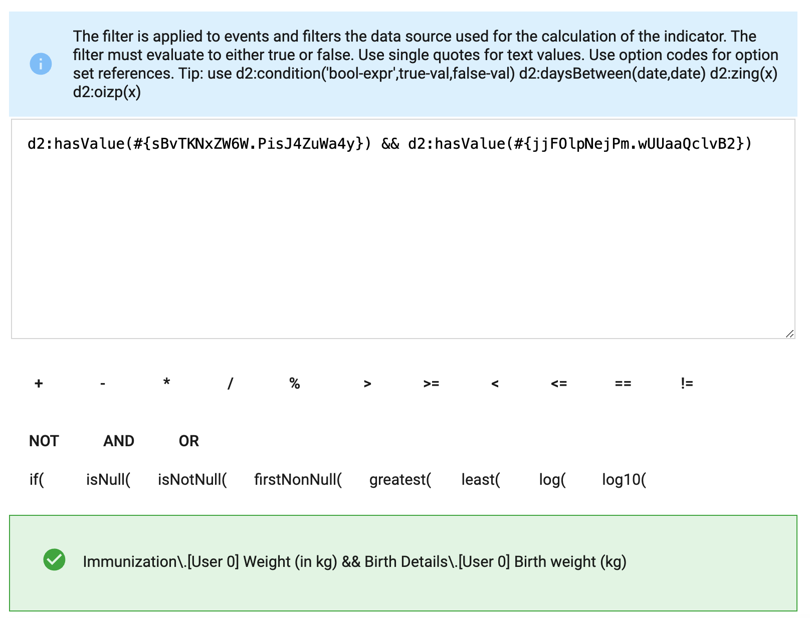
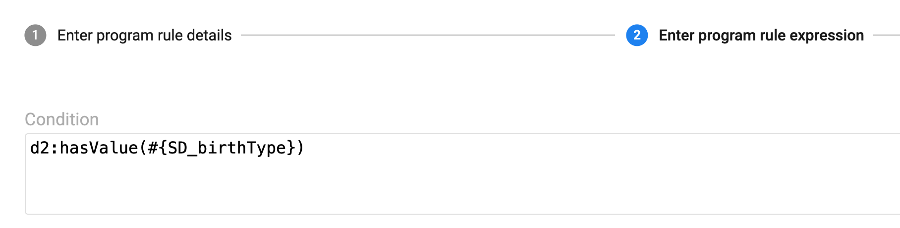

# Trainer’s Guide for Program Inidicators for Android

## What is this guide?

This guide is a support document for DHIS2 Android Academy trainers for the session "Program Indicators for Android." The session follows the standard Academy training approach with

1. A live demo session where the trainer demonstrates and explains the features of the topic
2. A hands-on session with exercises where participants get to practice the explained features.

There are two thematic areas for the demos in this sesssion and the guide is divided into these sections accordingly:

1. Demonstration : A demo of the features discussed in the presentation
2. Configuration : A walk through of how these features are configured

There is also a Quick Guide which lists the steps very briefly and this is meant as a lookup
guide or “cheatsheet” WHILE doing the demo, to help the trainer remember all the steps
and the flow of the demo.

## Learning objectives for this session

1. Demonstrate how to configure program indicators based on a single person
2. Demonstrate how to display messages from a program in the indicators panel based on a single record

## Preparations

Go through the Live demo step by step guide a few times before doing the actual demo for participants so you understand the full process of the session.Make sure your two user accounts (server administration and Android users) are the same or similar to the participants’ accounts so that you don’t show more features, dimension options or forms than what they can see when doing the exercises.In terms of logistics make sure the resolution on the projector is OK for zooming.

Create an account with the same level of access as the users you are demonstrating to (ie. if they can only search and enter within one facility, have your user have the same authority). If it is the procedure to enter this data from a paper form, it will be useful to have a copy of the form they would normally use as reference filled in. This can just be a form that you have filled in yourself for example. If they are entering data in real-time, then this is not required but you should prepare the details of an example case that you can follow in your examples.

For the exercises and small activities during the demo, fill out a couple extra forms that the participants can use to register their own cases. Your training DB should have some existing cases filled in to help support the working list filter, relationships and searching functionality. If demonstrating the working lists functionality, you will need to have a subset of the events you have created and assigned to a user where you can show this functionality.

## Android Application (APK) File

Make sure that you have the app made for training purposes otherwise you will not be able to cast your screen:

[https://github.com/dhis2/dhis2-android-capture-app/releases](https://github.com/dhis2/dhis2-android-capture-app/releases)

## Projecting your Android Device

The instructor will have to decide on which method they would like to use to mirror the android app on their computer screen. They will also have to set up a user account (if it doesn’t exist already) that is assigned to the same org unit as the program they are demonstrating.

Please review this CoP post for details on options you may use to mirror your android device:

[https://community.dhis2.org/t/how-to-clone-your-android-screen-useful-for-presentations-debugging-etc/38077](https://community.dhis2.org/t/how-to-clone-your-android-screen-useful-for-presentations-debugging-etc/38077)

Scrcpy is another tool that can also be used and is platform agnostic: [https://github.com/Genymobile/scrcpy](https://github.com/Genymobile/scrcpy)

Make sure that your device has developer options enabled before attempting to use scrcpy

After developer options is enabled, enable usb debugging from within the developer options menu

More information on enabling this is available. [Click Here](https://developer.android.com/studio/debug/dev-options)

## User Account

Ensure that there is a user account assigned to a lower level set of org units at the facility level within Trainingland that you can use prior to performing this session. If the participants are following along, ensure that there are user accounts for them to use as well assigned to lower level organization units. The demo user account is:

Username: android1

Password: District1#

## Participants

Send the instructions to the participants on how to install the Android app prior to the session if they have not yet done so. The instructions can be found [Click Here](https://docs.google.com/document/d/1SUUUdmPSDycFtdB9yUMq8ZWiWf8gNOu5xvtNj4_V63U/edit#heading=h.lswxgahoi1m2).

Some participants may not have been able to install the app by themselves. In that scenario, you may need to walk them through how to do this via google play.

## Background:

## Quick Guide

## Part 1 - Demonstrate

Let's first have a look at how program indicators are displayed in the android app. Access the main Immunization program (the one without the prefix) and search for Jane Thompson, Child # 1024.

In order to access the local analytics select the icon from the bottom of the page. We will only focus on the "Indicators" panel for this session.

In this panel, we can see there are a couple of indicators. As this is a single record, calculations and information is all based on the single record that you have accessed. 

As an example, the change in weight from birth is based on the person's current weight (based on whats recorded) - their weight at birth. It is not showing an overall average for everyone in the program (though that can be calculated as well). 

## Part 2 - Configuration - Program Indicators - Change in weight

> Note: You may want to alter this session and create a simple program rule with them using event analytics first. While the assumption for this session is that they have previous experience making indicators, this may not be neccessarily true. You could make a simple count indicator that counts the number of bcg doses given for example.

Let us create the program indicator to display the change in weight for the immunization program.

Navigate to maintenance -> Indicator -> Program Indicator and select the plus sign.

The program indicator tab is seperated into 3 tabs:
1. Details
2. Expression
3. Filter

We will follow the workflow in these tabs to edit our program indicator.

### Program Indicator Details

Lets have a look at the details section first. We need to select/enter:

- The program we are making the indicator for
- The name, short name, code
- Note that the color and icon have no effect on the program indicator!!
- The description
- The decimals

After these descriptive details, we have a number of additional details

- Aggregation type: Determines how the value is treated as a summary within the org unit hierarchy
- Analytics type : Event vs. Enrollment
- Organisation unit field. By default we will leave this as Enrollment organisation unit
- Analytics period boundaries: These are defined by default. There use is out of scope for this course. Note that custom boundaries do not work on Android currently.
- The "Display in form" checkbox. We need this selected if we want our indicator to appear in the indicators panel in the android or web app.

As you are explaining these fields, you can enter in relevant details to define the indicator. Note the following:

- Use your initials just for exercise purposes. This is not needed in a real implementation.
- Aggregation type is Average. This will allow us to calculate the average change in weight within the program for every child.
- The analytics type is enrollment. This is because we are taking inputs from more then one event/stage within the program.
- The period boundaries have not been changed. Do not change them if doing anything on android!
- Display in form is selected. This will allow the indicator to be displayed within the indicator widget both in tracker capture and on the android device

If you keep scrolling down, you will see they are additional fields; however you can leave these blank for now. 

### Program Indicator Expression

In the program indicator expression, we define what we want our program indicator to do.

In this case, we want to take the most recent weight value and minus the weight value at birth. This means we take the weight value from the immunization stage and - the weight value from the birth details stage.

This is where the enrollment type indicator becomes important, as you are taking values from multiple stages in the program. As the immunization stage is repeatable, note that the weight value will be taken from the most recent event.

### Filter

The filter is where we define what criteria needs to be met for the program indicator to run. 

In our case, we can make a condition that both weight values from the immunization and birth details stage need to have values before the expression runs.

### Check the config on Android

After you have saved your program indicator, sync your config. Ensure you enter relevant weight details in the birth details and immunization stages and check the indicator panel for your program. You should see the indicator displaying the change in weight.

#### STOP - Perform Exercise 1

## Part 3 - Configure feedback using program rules

In the demonstration, in addition to an indicator which uses data from the TEI, we also noted several feedback messages in the indicator panel, including the place of birth, mode of delivery etc.

This is actually configured using program rules.

TO configure this program rule we can follow this workflow:

1. Create the program rule variable based on what you are going to evaluate
2. Create the program rule
   1. Edit the details
   2. Add an expression
   3. Define the action

Let us try to show the Type of birth on the indicator panel.

### Create the Program Rule Variable

In order to do this, we need to start by creating a program rule variable for the type of birth as that is what we will be evaluating.

Navigate to maintenance -> Program -> Program Rule Variable. ***Select your program*** and create a new variable.

Note the source type being used in this variable. The birth type comes from the first stage in program. You could be navigating to different stages in the program, and this would not be evaluated if you selected "data element in current event" for example which is often a common source type. 

Also, see that "use code for option set" is NOT selected. This is because we want to display the same name for the birth type as is defined in our option set in the indicator panel.

### Create the Program Rule

After you have created your variable, Select program rule from the left side menu then create a new one.

#### Details

Give the program indicator a name and a description

#### Expression

For the expression, we want to have the birth type display on the indicator panel as soon as there is a value for birth type selected. We can use d2:hasValue as our condition to check this.

#### Action

Let us now define our action. 

- Our action will be display key/value pair.
  - In plain terms, this means we can pair static text with a value pulled from our program configuration
- Next, we can define our display widget. Here, we can select the program indicator widget. The feedback widget is also available in tracker capture on web.
- Our key label is our static text (ie. text that we define and does not change). Here we can put birth type as our label.
- Expression to evaluate and display as value. This is where we can select a variable to pair with our static text. In this case, we want to show the birth type so we can select the variable we created. As we are displaying this in the indicator panel as text, note that from before we did not use the option code to define our variable. This means we should see the name, not the code, when we display this value.

Save the program rule.

### Check on Android

Go back to your device and sync your config. Enter a value for the birth type in your immunization program and navigate to the analytics tab. You should see the birth type displayed within the panel.

#### STOP - Perform Exercise 2