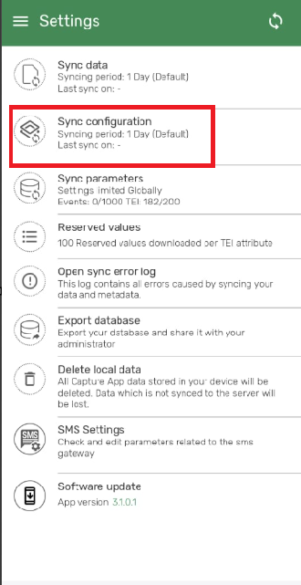

# Trainers Guide on Program Rules 

## What is this guide?

This guide is a support document for DHIS2 Android Academy trainers for the session "Program Rules". The session follows the standard Academy training approach with

1. A live demo session where the trainer demonstrates and explains the features of the topic
2. A hands-on session with exercises where participants get to practise the explained features.

## Learning objectives for this session

1. Refresh briefly what Program Rules are (the general knowledge about Program Rules should be acquired in other trainings i.e. Tracker Academy)
2. Explain the differences between Program Rules in the web and the Android version
3. Demonstrate how Program Rules operate in Android:
    1. Creating a Program Rule in the backend to improve the quality of the data collected in a tracker program
        1. Defining a data quality rule (expression)
        2. Defining an error message (program rule action)
    2. Synchronising the Android App
    3. Triggering the Program Rule
    4. Seeing how Program Rule operating in Android can improve the data quality

## Time needed for this session

Live demo: 
Hands-on exercises: 

## Background

Program rules allows you to create and control dynamic behaviour of the user interface in the Tracker Capture and Event Capture apps. During data entry, the program rules expressions are evaluated each time the user interface is displayed, and each time a data element is changed. While using the web version to enter data most types of actions will take effect immediately when the user enters values in the Tracker Capture and Event Capture apps however, in Android, due to the nature of its internal components the user might need to escape the field where they are putting data for the effects to be triggered.

The main program rule components are:

* **Program rule action**: Each program rule contains one or multiple actions. These are the behaviours that are triggered in the user interface when the expression is true. Actions will be applied at once if the expression is true, and will be reverted if the expression is no longer true. There are several types of actions and you can have several actions in one program rule.
* **Program rule expression**: Each program rule has a single expression that determines whether the program rule actions should be triggered, if the expression evaluates to true. If the expression is true the program rule is in effect and the actions will be executed. If the expression is false, the program rule is no longer in effect and the actions will no longer be applied.

    You create the expression with standard mathematical operators, custom functions, user-defined static values and program rule variables. The program rule variables represent attribute and data element values which will be evaluated as part of the expression.

* **Program rule variable** Program rule variables lets you include data values and attribute values in program rule expressions. Typically, you'll have to create one or several program rule variables before creating a program rule. This is because program rules expressions usually contain at least one data element or attribute value to be meaningful.

    The program rule variables are shared between all rules in your program. When you create multiple program rules for the same program, these rules will share the same library of program rule variables

More information about Program Rules can be found in the [documentation](https://docs.dhis2.org/en/full/use/user-guides/dhis-core-version-master/dhis2-user-manual.html#configure_program_rule).

## Preparations

Go through the Live demo step by step guide a few times before doing the actual demo for participants so you understand the full process of the session.Make sure your two user accounts (server administration and Android users) are the same or similar to the participants’ accounts so that you don’t show more features, dimension options or forms than what they can see when doing the exercises.In terms of logistics make sure the resolution on the projector is OK for zooming.

Create an account with the same level of access as the users you are demonstrating to (ie. if they can only search and enter within one facility, have your user have the same authority). If it is the procedure to enter this data from a paper form, it will be useful to have a copy of the form they would normally use as reference filled in. This can just be a form that you have filled in yourself for example. If they are entering data in real-time, then this is not required but you should prepare the details of an example case that you can follow in your examples.

For the exercises and small activities during the demo, fill out a couple extra forms that the participants can use to register their own cases. Your training DB should have some existing cases filled in to help support the working list filter, relationships and searching functionality. If demonstrating the working lists functionality, you will need to have a subset of the events you have created and assigned to a user where you can show this functionality.

## Android Application (APK) File

Make sure that you have the app made for training purposes otherwise you will not be able to cast your screen:

[https://github.com/dhis2/dhis2-android-capture-app/releases](https://github.com/dhis2/dhis2-android-capture-app/releases)

# Projecting your Android Device

The instructor will have to decide on which method they would like to use to mirror the android app on their computer screen. They will also have to set up a user account (if it doesn’t exist already) that is assigned to the same org unit as the program they are demonstrating.

Please review this CoP post for details on options you may use to mirror your android device:

[https://community.dhis2.org/t/how-to-clone-your-android-screen-useful-for-presentations-debugging-etc/38077](https://community.dhis2.org/t/how-to-clone-your-android-screen-useful-for-presentations-debugging-etc/38077)

Scrcpy is another tool that can also be used and is platform agnostic: [https://github.com/Genymobile/scrcpy](https://github.com/Genymobile/scrcpy)

Make sure that your device has developer options enabled before attempting to use scrcpy

After developer options is enabled, enable usb debugging from within the developer options menu

More information on enabling this is available. [Click Here](https://developer.android.com/studio/debug/dev-options)

## User Account

Ensure that there is a user account assigned to a lower level set of org units at the facility level within Trainingland that you can use prior to performing this session. If the participants are following along, ensure that there are user accounts for them to use as well assigned to lower level organization units. The demo user account is:

Username: android1

Password: District1#

## Participants

Send the instructions to the participants on how to install the Android app prior to the session if they have not yet done so. The instructions can be found [Click Here](https://docs.google.com/document/d/1SUUUdmPSDycFtdB9yUMq8ZWiWf8gNOu5xvtNj4_V63U/edit#heading=h.lswxgahoi1m2).

Some participants may not have been able to install the app by themselves. In that scenario, you may need to walk them through how to do this via google play.

## Quick Guide

## Part 0 : Program Rule review

(Here a brief explanation of what program rules are, an analogy can be used)

(Explain how PR can be used to improve the quality of the data or to help data collectors while doing their job, etc)

List a couple of examples

Explain that we will break the explanation into two steps, first creating a program rule in the server and then seeing how the Android application uses this program rule to improve the data collection.

## Part 1: Program Rules on Android

## Part 2: Program Rule Configuration in Maintenance

1. Connect to the server with the Administrator account and go to Maintenance > Program
2. Explain the left menu and how this session focuses on
    1. Program rule
    2. Program rule variables
3. Open the program rule variable menu in order to create a new variable (by clicking on the (+) button on the bottom right corner). _Explain that we are creating a program rule variable that will be used in the program rule defined in the next step._
    1. Select the Immunization program. _Explain that every student should be performing this on their own program and that in case that the program has several stages a new item will appear underneath_
    2. Select the Immunization. _Explain how this is a limitation on the scope as explained in the program rule review process._
    3. Choose the name of the variable, in this case we will be using "Temperature"
    4. _Explain that we don't mark the "Use code for option set" as this variable is a numerical one and it does not apply on our case_
    5. Select "Data element in current event" on the _Source type(*) _field
4. Open the program rule menu in order to create a new program rule

    a. Select the Program defined for the training. _Explain that every student should be performing this on their own program_

    b. Enter the program rule details form

    1. Choose the name of the name of the program rule. _Explain that every student should use their own and that it is important to define names that are explicit enough to facilitate the maintenance of the server._
    2. Choose the name of the program rule. _Explain that in this training they could leave it blank if they want but that it is important to define descriptions that are explicit enough to facilitate the maintenance of the server at later stages._
    3. Leave the priority blank in this case. _Explain how this is important in case that several program rules are run and that the priority remain as 1 > 2  > … > 9 > (empty)_
    
    c. Enter the program rule expression form

    1. Define the condition as temperature > 37. _Explain that the condition needs to be something which is true or false, that the box underneath can help and that there are some differences between web and Android that are listed in the documentation.[Click Here](https://docs.dhis2.org/en/full/use/dhis2-android-app.html#capture_app_pr)_

d. Enter the program rule actions form

1. Create a new program rule action by clicking on the (+) button. _Explain that a program rule can trigger any number of program rule actions_

2. Define the action as "Show error". _Explain that these actions are the list of possible actions but are not covered here and that students can go to the documentation. Also explain that some might be not supported in Android as listed in the documentation.[Click Here](https://docs.dhis2.org/en/full/use/dhis2-android-app.html#capture_app_pr)_

3. Choose the Temperature data element from the drop down "Data element to display error next to". _Explain that some actions (show warming, show error, etc) will require an element where the information should be displayed. In this case we select the data element which triggered the error but could also be an attribute or a widget (for some cases)._

4. Add **"Vaccination should not be given to the child till fever subsides**" in the static text._ Explain that this is a text that is displayed static and usually comes with other text defined below._

5. Add the variable Temperature to the "Expression to evaluate and display after static text". _Explain that in difference with the program rule expression defined before where a true or false was needed here other values are supported. And that web and Android have differences as listed in the documentation (insert link)_

6. Click on commit to create the program rule action

e. Review quickly the three forms filled so participants are aware of the steps performed once more.

f. Save the program rule

g. Show the participants how the program rule has been created. _Explain that with this program rule we could edit (by just clicking on it) or perform other actions with the three dots. And how the clone action might be useful when creating several program rules._

h. Optional: show the participants how this program rule is triggered on the web interface.

Go to Tracker capture and select the facility and select Immunization Program 

Open the any record
Open any event for Immunization program.
Enter the value in temperature greater than 37.

You will see the following error 

STOP : Perform Exercise

## Part 2: Android data entry

1. Log in with the Android user on the device.
2. If the user is not connecting for the first time, perform a metadata synchronisation to retrieve the changes made on the server by going to the menu (up left) > Settings > Sync configuration > Sync configuration now. 
_Explain how this retrieves the latest metadata updates from the server_

3. Go to the program and perform the steps

STOP : Perform Exercise

## Assignment

After you have completed all demos and they have finished the exercises, have them complete the graded assignment for this session.

