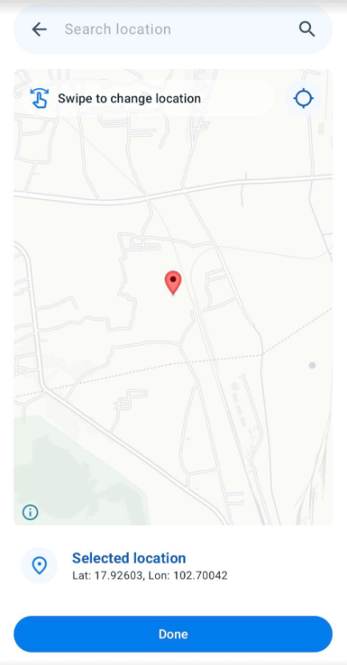
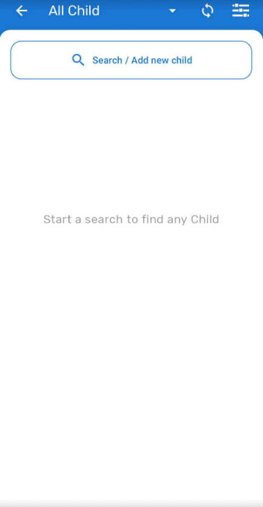
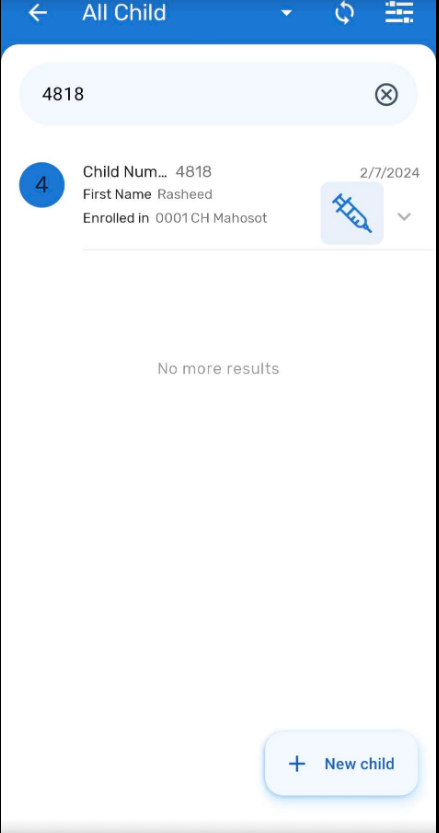
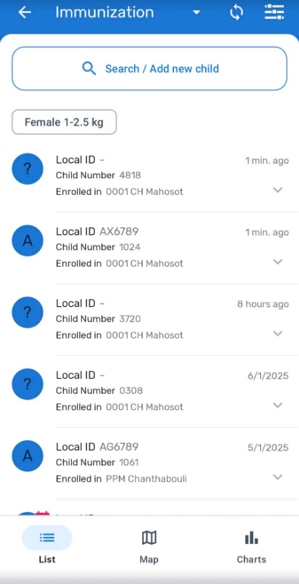
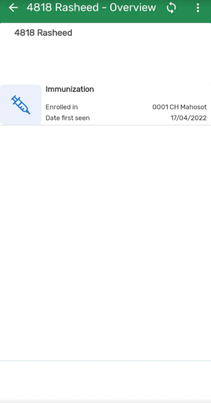
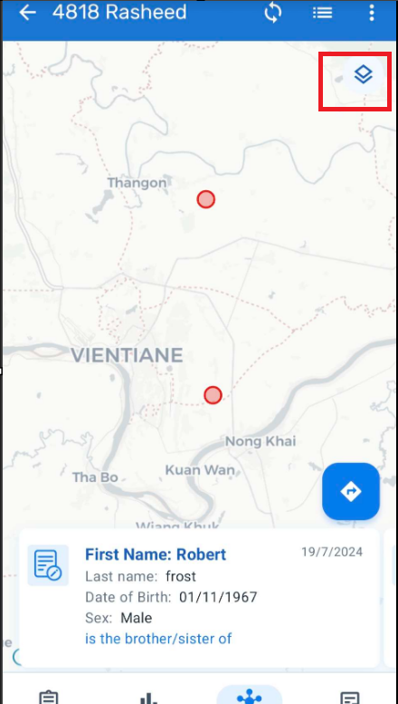
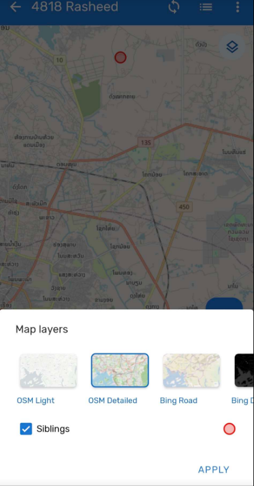

# Trainer’s Guide to Relationships

## What is this guide?

This guide is a support document for DHIS2 Academy trainers for the session "Relationships.” This session follows the standard Academy training approach with

1. a live demo session where the trainer demonstrate and explain the features, and 
   
2. a hands-­on session with exercises where participants get to practice the same features.

There are two thematic areas for the demos in this sesssion and the guide is divided into these sections accordingly:

1. Demonstration : A demo of the features discussed in the presentation
2. Configuration : A walk through of how these features are configured

There is also a Quick Guide which lists the steps very briefly and this is meant as a lookup guide or “cheatsheet” WHILE doing the demo, to help the trainer remember all the steps and the flow of the demo.

## Learning objectives for this session

1. Create relation types to be rendered in android
2. Create relationships between people
3. Demonstrate how to render relationships as a list or in a map

## Time Requirements

1.5 hours

## Background

## Preparations

Go through the Live demo step by step guide a few times before doing the actual demo for participants.
Make sure your user account is same or similar to the participants’ training accounts so that you don’t show more features, dimension options or forms than what they can see when doing the exercises.
Make sure the resolution on projector is OK for zooming

Create an account with the same level of access as the users you are demonstrating to (ie. if they can only search and enter within one facility, have your user have the same authority). If it is the procedure to enter this data from a paper form, it will be useful to have a copy of the form they would normally use as reference filled in. This can just be a form that you have filled in yourself for example. If they are entering data in real-time, then this is not required but you should prepare the details of an example case that you can follow in your examples.

For the exercises and small activities during the demo, fill out a couple extra forms that the participants can use to register their own cases. Your training DB should have some existing cases filled in to help support the working list filter, relationships and searching functionality. If demonstrating the working lists functionality, you will need to have a subset of the events you have created and assigned to a user where you can show this functionality.

### APK File

Make sure that you have the app made for training purposes otherwise you will not be able to cast your screen:

https://github.com/dhis2/dhis2-android-capture-app/releases

This will be denoted by “training” at the end of the APK file.

### Projecting your Android Device

The instructor will have to decide on which method they would like to use to mirror the android app on their computer screen. They will also have to set up a user account (if it doesn’t exist already) that is assigned to the same org unit as the program they are demonstrating.

Please review this CoP post for details on options you may use to mirror your android device:

https://community.dhis2.org/t/how-to-clone-your-android-screen-useful-for-presentations-debugging-etc/38077

Scrcpy is another tool that can also be used and is platform agnostic:
https://github.com/Genymobile/scrcpy

Make sure that your device has developer options enabled before attempting to use scrcpy

After developer options is enabled, enable usb debugging from within the developer options menu.

More information on enabling this is available [here](https://developer.android.com/studio/debug/dev-options)

### User Account

Ensure that there is a user account assigned to a lower level set of org units at the facility level within the database that you can use prior to performing this session. If the participants are following along, ensure that there are user accounts for them to use as well assigned to lower level organization units. The demo user account is in the academy database is:

Username: android1

Password: District1#

### Participants

Send the instructions to the participants on how to install the Android app prior to the session if they have not yet done so. The instructions can be found [here](https://docs.google.com/document/d/1SUUUdmPSDycFtdB9yUMq8ZWiWf8gNOu5xvtNj4_V63U/edit?usp=sharing).

Some participant's may not have been able to install the app by themselves. In that scenario, you may need to walk them through how to do this via google play.

## Quick Guide

1. Create a new relationship by searching via the TET
2. Create a new relationship by using the event line list within a single program
3. Review how to interact with existing relationships
4. Show how to map relationships for a single TEI
5. Review the map settings
6. Review how the TET is configured to capture coordinates
7. Review how the TET is configured to allow for different search parameters
8. Create a relationship type in DHIS2 and sync with android

## Demo Part 1 - Demonstrate

### Adding relationships via search

To start the relationships session, add a new person to the immunization program.

When you are enrolling the new person, make sure you select enrollment coordinates. These will be important later on when you map the relationships.

To make things easier, select a coordinate within Lao as thats where all of the other cases are located (by default it will pinpoint your current location so you may need to zoom out of the map)

Enter the remaining details of the child and save the child to proceed.

Select the relationships tab to be taken to the relationships page

From here, select the plus button and tap on siblings to add a new relationship

By default, it will allow you to search all TEIs that are the same TE type as you are currently using.

In this mode, you can use search criteria to find the child you want. 

Tap on the child after you have found it

This will take you back to the relationships list and you will see the child at the top of the list

### Add relationships via list

You can also add relationships by selecting a child from within a program. 

Navigate back to the relationships page and add a new Sibling relationship.

Instead of tapping on search, select the dropdown where the TE Type is listed.

From here, you can select a program instead of using all TE of the same type as your search criteria.

After you select the program you will see the list of TEIs within that program. The search box is still available at the top, so now you have the option to either search for the TEI or select the TEI from the available list.

If you select a TEI from the list you will be taken back to the relationships page and will see they have been added.

#### STOP - Exercise 1

### Interacting with relationships

From the relationships page, you are able to interact with these TEIs. If you select one of the TEIs

It will show you the programs that the TEI is enrolled in.

If you select a program, it will take you to that TEIs enrollment in that program. 

### Mapping relationships

Go back to the original TEIs relationship page by selecting the back button.

In addition to displaying these relationships as a list, we can also display them in a map view. We do this by selecting the map icon on the relationships page.

This will then display a map showing the TEI we are working with along with the locations of any other children they have a relationship with.

We can tap on the lines on the map or use the carousel at the bottom of the screen to select from the different TEIs available here.

On this page, we are able to change the base map if needed. We do this by selecting the map settings icon.

From here, we can select a different basemap then tap apply to apply our changes.

In order to go back to list view from the map, select the list view icon from the top. 

#### STOP - Exercise 2

## Demo Part 2 - Configure

### Tracked Entity Type

Before we get into managing and creating a new relationship, it is useful to understand how a TE types configuration affects how relationships will function on android.

Navigate to maintenance -> program -> tracked entity type to get to the tracked entity types page and select the "Child" TE type.

There are two main items we want to discuss here

1. How collection of coordinates allows you to create a mapping of relationships
2. How selecting and managing tracked entity attributes for a TE type affects your search paramaters

#### Coordinates

Within the child TE type, scroll down to Feature type. This is set to point in our example. 

Notice some other parameters that we didn't use but could be useful in the future: color and icon. 

From the sessions on visual configuration and visual data entry we have some understanding of how this might affect the android app, as we can assign a specific color and icon for these TE types and it will alter the visual appearance accordingly.

#### TE Attributes

Next scroll down to the tracked entity attributes section. Here, we are assigning tracked entity attributes to the TE type, not a specific program. This means any program using TEs of this type will have at least these TE attributes.

Scroll down a bit more where you will see the attributes along with a matrix of checkboxes.

Here, you decide which attributes appear in various lists as well as which ones are searchable. Recall that when we were adding a relationship using the CHILD TE type, we were able to enter some search criteria. That is defined within this page. Those attributes in which "Searchable" is selected can be used to search for any Child, in both the web and android app. 

### Relationships

We define relationships via the "Relationship type" section in maintenance. It is no different then any other tracker program, whether using web or android.

To see them, they need to be properly shared. On android, when we add a relationship, we have to select the relationship type. These are all defined here. 

You can set up constraints to control the program in which relationships can be made, or leave it open so the TEI can make relationships with any other TEI. You can briefly review the relationship type in maintenance if you feel this is needed.

1. Navigate to Maintenance
2. Select Program
3. Select Relationship type
4. Click on the blue plus sign to add a new relationship type
   1. Give the relationship type a name
   2. Decide whether or not the relationship is bidirectional (does the relationship work in both directins or not)
   3. Decide what will be seen when the relationship is being created in the user interface
   4. Add to and from constraints if needed
5. Save the relationship
6. Change the public sharings settings
   1. Metadata : can view only
   2. Data : Can capture and view

As long as the relationship is shared correctly, it should be available from within the android app. You will need to sync your metadata after creating the relationship type in order to see it on the device.

#### STOP - Exercise 3

