# Trainer’s Guide for Intro to Tracker Data Entry

## What is this guide?

This guide is a support document for DHIS2 Android Academy trainers for the session "Intro to Tracker Data Entry". The session follows the standard Academy training approach with

1. A live demo session where the trainer demonstrates and explains the features of the topic
2. A hands-on session with exercises where participants get to practice the explained features.

## Learning objectives for this session

1. Demonstrate how access tracker programs on Android
2. Demonstrate how to navigate the tracker interface on Android
3. Demonstrate how to create a new TEI/person on Android
4. Demonstrate how to add and edit program stage/event data on Android
5. Describe additional features that are available from within the TEI dashboard and Android homescreen

## Preparations

Go through the Live demo step by step guide a few times before doing the actual demo for participants so you understand the full process of the session.Make sure your two user accounts (server administration and Android users) are the same or similar to the participants’ accounts so that you don’t show more features, dimension options or forms than what they can see when doing the exercises.In terms of logistics make sure the resolution on the projector is OK for zooming.

Create an account with the same level of access as the users you are demonstrating to (ie. if they can only search and enter within one facility, have your user have the same authority). If it is the procedure to enter this data from a paper form, it will be useful to have a copy of the form they would normally use as reference filled in. This can just be a form that you have filled in yourself for example. If they are entering data in real-time, then this is not required but you should prepare the details of an example case that you can follow in your examples.

For the exercises and small activities during the demo, fill out a couple extra forms that the participants can use to register their own cases. Your training DB should have some existing cases filled in to help support the working list filter, relationships and searching functionality. If demonstrating the working lists functionality, you will need to have a subset of the events you have created and assigned to a user where you can show this functionality.

## Android Application (APK) File

Make sure that you have the app made for training purposes otherwise you will not be able to cast your screen:

[https://github.com/dhis2/dhis2-android-capture-app/releases](https://github.com/dhis2/dhis2-android-capture-app/releases)

## Projecting your Android Device

The instructor will have to decide on which method they would like to use to mirror the android app on their computer screen. They will also have to set up a user account (if it doesn’t exist already) that is assigned to the same org unit as the program they are demonstrating.

Please review this CoP post for details on options you may use to mirror your android device:

[https://community.dhis2.org/t/how-to-clone-your-android-screen-useful-for-presentations-debugging-etc/38077](https://community.dhis2.org/t/how-to-clone-your-android-screen-useful-for-presentations-debugging-etc/38077)

Scrcpy is another tool that can also be used and is platform agnostic: [https://github.com/Genymobile/scrcpy](https://github.com/Genymobile/scrcpy)

Make sure that your device has developer options enabled before attempting to use scrcpy

After developer options is enabled, enable usb debugging from within the developer options menu

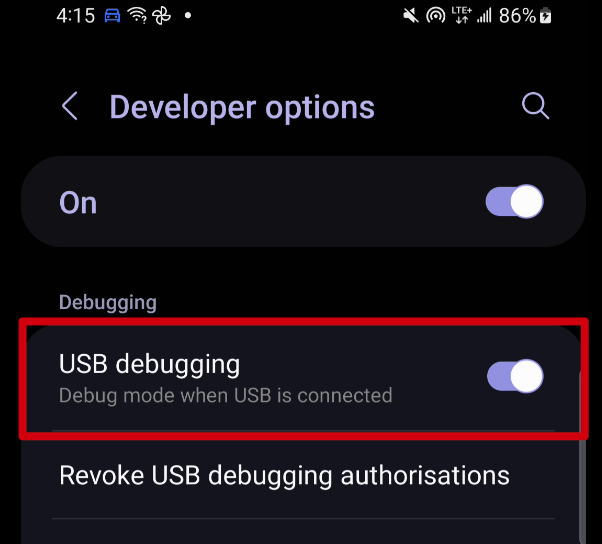

More information on enabling this is available. [Click Here](https://developer.android.com/studio/debug/dev-options)

## User Account

Ensure that there is a user account assigned to a lower level set of org units at the facility level within Trainingland that you can use prior to performing this session. If the participants are following along, ensure that there are user accounts for them to use as well assigned to lower level organization units. The demo user account is:

Username: android1

Password: District1#

## Participants

Send the instructions to the participants on how to install the Android app prior to the session if they have not yet done so. The instructions can be found [Click Here](https://docs.google.com/document/d/1SUUUdmPSDycFtdB9yUMq8ZWiWf8gNOu5xvtNj4_V63U/edit#heading=h.lswxgahoi1m2).

Some participants may not have been able to install the app by themselves. In that scenario, you may need to walk them through how to do this via google play.

## Time needed for this session

Live demo: 45 min
Hands-on exercises: 45 min

## Quick Guide

1. Log in and explain the home page
2. Register a New TEI by searching and creating a new one
3. Enter in the additional attribute information for the person you are registering

STOP - Perform Exercise 1

4. Add a new stage for birth details - review the interface and enter data into this stage. Save the data
5. (Optional) Add new stages for immunization - review the interface and enter data into this stage. Save the data.

STOP - Perform Exercise 2

6. Review the field completion %
7. Review the section navigation
8. Review error messages for mandatory fields or via a program rule
9. Review the notes page
10. Review the map carousel
11. Review the relationships widget
12. Share a TEI
13. Complete an Enrolment
14. View the program enrolment widget
15. Delete a TEI and its enrolments
16. Switch between the events timeline grouping events by stage

STOP - See if there are any questions

## PART 1: Navigation of the program

### Log-in, Home Page and Event Listing

1. Log-in to the android application
2. Review the organization unit and program assigneds to you
3. Briefly describe the functionalities of the home screen

   

4. Select the Immunization Program
5. You will see the list of all entities/child who are enrolled in the specific program that you have selected (This is called as Event listing for event and tracker programs)

   

- Explain the ”Bottom Navigation Bar” (The bottom navigation bar allows switching the visualization mode of the program if the event or tracker program have been defined with coordinates). We will discuss this in detail in another session.

         

## PART 2: Registration

The first step is to SEARCH the TEI based on the searchable attributes to make sure that the child does not exist in the system prior to registering a brand new child. 

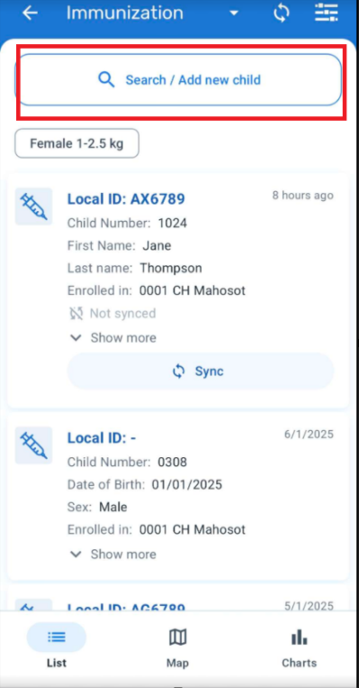
    
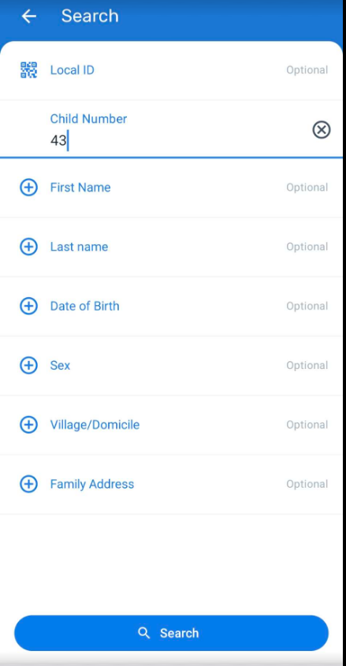

To Register a New Child :

1. Click on New Child
 
   

2. In the Android app you need to select the organisation unit and the reporting date or the registration date (in this case Date first seen)

   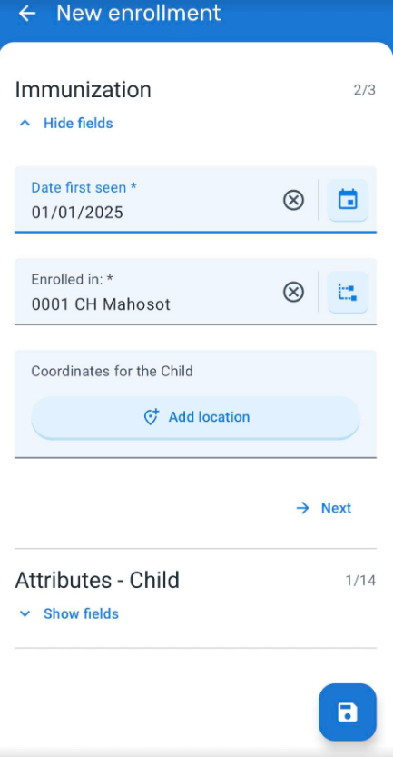

3. Next demo the enrolment data page that has been configured: followed by the attributes - child section.(Briefly describe the sections)

4. Explain that you can capture child coordinates(In android app it will automatically capture the coordinates based on the location of the device when selecting the coordinate icon) But this will be talked in detail in future session.
  
   

5. Select the disk icon (save icon) to register the person and be taken to the first stage

   

#### STOP - Perform Exercise 1

## Part 3 - Data Entry

### Entering Data in the Stages

STAGE 1: Birth Details

* To create a new event, the user needs to tap on the plus + icon beside the stage card follwed by "Add New" 

> Note: This icon is always visible unless the stage is non-repeatable and already created. When the user taps on the button, that program stage will unfold showing to the user all the already existing events of that particular program stage.

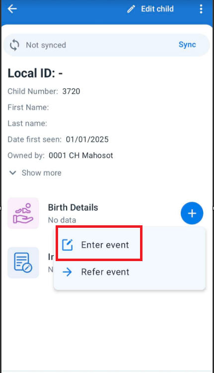

* Enter Event Date

    

* You will see the Birth Details Stage: Here you can show how data entry fields are grouped in different sections: Details,Type,Place,Mode. This is based on the configuation for your program stage data entry form. Enter data for the stage to proceed.

  

_NOTE : Trainers should make sure they get well versed with the program rules in order for them to understand program errors if any._

### Saving the Data

After tapping on the 'save' button, if the form does not contain any errors, warnings or empty mandatory fields, the app will ask if the user wants to complete the form.

Two options are given to the user:

* 'Not now': The app saves the form and goes back to the event listing screen (or TEI dashboard for tracker programs). The status of the event will remain open.
* 'Complete': The app saves the form and goes back to the event listing. The status of the event changes to complete.

  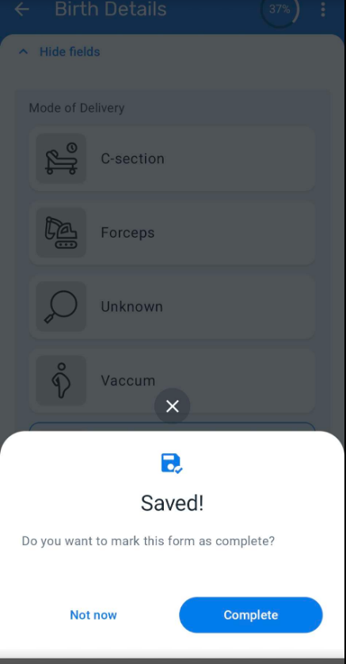

  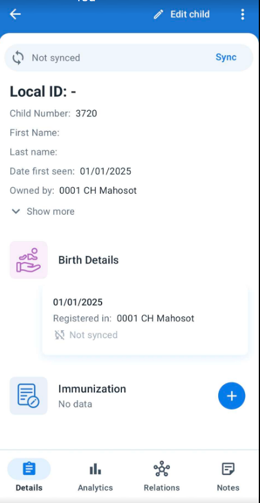

> Note: For further demonstration, you can also add events to the immunization stage and enter data within those events.

### STOP - Perform Exercise 2

## Other Features in the event form:

Trainers can briefly demo the below features and their functionalities:

### Field completion percentage

The percentage of data completed in each event is shown in the top right corner of an event when it is opened after first registration.

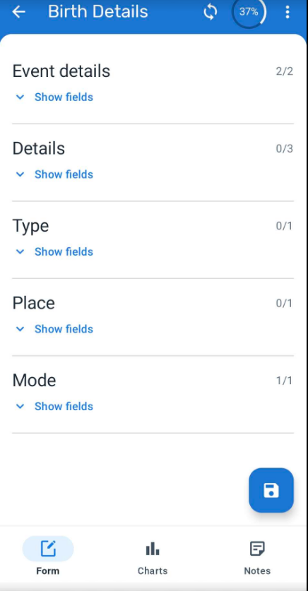

### Sections Navigations

The sections can be collapsed for a simpler user experience. Sections in enrollment forms are also supported and are aligned with the design of the event sections.

### Error messages

The app will list the name of the mandatory fields missing or the field which is outside normal range when the user tries to complete an event or enrollment. The sections containing the missing fields will be highlighted to help the user find the missing fields.

### Event Notes

It is possible to add notes to events in single event programs and program stage events. Notes are available in a new tab at the data entry form.

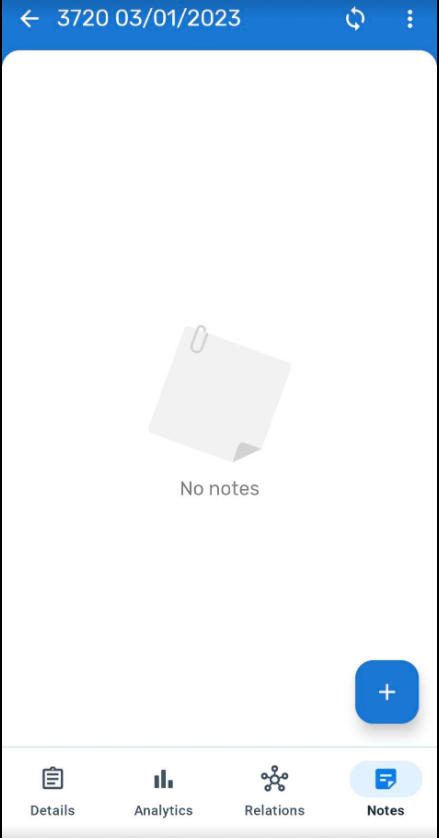

### Map Carousel

On the map view of the program (you have to select this map view from the event line listing of the program), a carousel of cards is displayed, one for each enrolled TEI (Tracker programs) or Event (Event programs). Chances are dots will appear all over the place in case people have added events based on their own location. If you zoom in on Lao however, you will see many TEIs that can be viewed.

* TEI cards on the carousel follow the same design as the TEI list view.
* When scrolling horizontally the carousel, the map zooms into the selected coordinates. If the coordinate field is empty a message is shown instead.

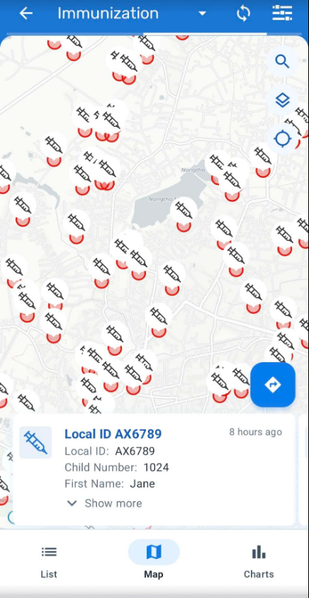

**TEI Card Design** will display as much information as possible considering the constraints of screen size.

* Last update date
* The first 2 attributes with display in List option
* If there are more, there will be an arrow to display the full list
* Enrollment org unit
* Enrollment status label if completed or canceled
* Overdue icon if an overdue event exists with the most recent overdue event date
* Follow-up icon if the TEI is marked
* Card image (one of the following options):
* Profile picture when available or
* First letter of the first attribute or
* Tracked Entity Type icon

### TEI DASHBOARD:

Navigation panel in TEI Dashboard:

To simplify and personalize the user experience, the user interface actions offered to the user at the TEI dashboard will be tailored to the specific configuration of each program.

### Relationships

THe relationships tab will be visible if the program relationships are not configured (In this case it has been configured to add a relationship of a sibling)

### Additional features

In the TEI Dashboard click on the three dots in the upper right corner and explain the following functionalities

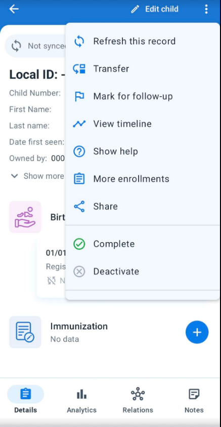

Share a TEI : The "Share" button has been removed from the TEI dashboard and the functionality to share a TEI through QR code has been relocated on the three vertical dot menu, at the top right corner of the screen.

Complete/Deactivate Enrollment : To complete or deactivate an enrollment, click on three dot menu in the upper right corner and select "Complete" or "Deactivate"

Mark for follow-up : This is to mark the TEI for a follow-up session.

(Program Enrollment) TEI enrollment history and new enrollment  : Users can see the complete historical records of the TEI. Clicking on the upper right corner menu, select "Program Enrollments". A list of "Active enrollments" will be displayed, followed by a list of "Past enrollments" (completed or canceled), followed by the programs in which the TEI could be enrolled. Users can also return to the "TEI Dashboard" without any program' by selecting "All enrollments".

Delete TEI's & Enrollments : To delete a TEI or an enrollment, select the desired option in the three dots menu of TEI dashboard. Local TEI or Enrollments will be deleted from the database. Records that has been previously synced with the server will be marked for deletion if the user has the following authorities:

* F_ENROLLMENT_CASCADE_DELETE
* F_TEI_CASCADE_DELETE

Group view of Program stages in TEI Dashboard or Show Events Timeline : The TEI Dashboard offers the possibility to change the list of events from the chronological view to a stage grouping view. The stage grouping view will group and collapse the events per program stage. Each program stage group can be expanded by the user and the events will be displayed chronologically and if you select Show Events timeline it will show all the events as per the events date the data has been entered in each stage or multiple events in one program stage.

#### STOP : Ask the participants if they have any questions