# Trainer’s Guide to Android Visual Configuration

## What is this guide?

This guide is a support document for DHIS2 Academy trainers for the session "Visual Configuration.” This session follows the standard Academy training approach with

1. a live demo session where the trainer demonstrate and explain the features, and 
   
2. a hands-­on session with exercises where participants get to practice the same features.

There are two thematic areas for the demos in this sesssion and the guide is divided into these sections accordingly:

1. Demonstration : A demo of the features discussed in the presentation
2. Configuration : A walk through of how these features are configured

There is also a Quick Guide which lists the steps very briefly and this is meant as a lookup
guide or “cheatsheet” WHILE doing the demo, to help the trainer remember all the steps
and the flow of the demo.

## Learning objectives for this session

## Time Requirements

## Background

## Preparations

Go through the Live demo step by step guide a few times before doing the actual demo for participants.
Make sure your user account is same or similar to the participants’ training accounts so that you don’t show more features, dimension options or forms than what they can see when doing the exercises.
Make sure the resolution on projector is OK for zooming

Create an account with the same level of access as the users you are demonstrating to (ie. if they can only search and enter within one facility, have your user have the same authority). If it is the procedure to enter this data from a paper form, it will be useful to have a copy of the form they would normally use as reference filled in. This can just be a form that you have filled in yourself for example. If they are entering data in real-time, then this is not required but you should prepare the details of an example case that you can follow in your examples.

For the exercises and small activities during the demo, fill out a couple extra forms that the participants can use to register their own cases. Your training DB should have some existing cases filled in to help support the working list filter, relationships and searching functionality. If demonstrating the working lists functionality, you will need to have a subset of the events you have created and assigned to a user where you can show this functionality.

### APK File

Make sure that you have the app made for training purposes otherwise you will not be able to cast your screen:

https://github.com/dhis2/dhis2-android-capture-app/releases

This will be denoted by “training” at the end of the APK file.

### Projecting your Android Device

The instructor will have to decide on which method they would like to use to mirror the android app on their computer screen. They will also have to set up a user account (if it doesn’t exist already) that is assigned to the same org unit as the program they are demonstrating.

Please review this CoP post for details on options you may use to mirror your android device:

https://community.dhis2.org/t/how-to-clone-your-android-screen-useful-for-presentations-debugging-etc/38077

Scrcpy is another tool that can also be used and is platform agnostic:
https://github.com/Genymobile/scrcpy

### User Account

Ensure that there is a user account assigned to a lower level set of org units at the facility level within the database that you can use prior to performing this session. If the participants are following along, ensure that there are user accounts for them to use as well assigned to lower level organization units. The demo user account is in the academy database is:

Username: android1

Password: District1#

### Participants

Send the instructions to the participants on how to install the Android app prior to the session if they have not yet done so. The instructions can be found [here](https://docs.google.com/document/d/1SUUUdmPSDycFtdB9yUMq8ZWiWf8gNOu5xvtNj4_V63U/edit?usp=sharing).

Some participant's may not have been able to install the app by themselves. In that scenario, you may need to walk them through how to do this via google play.

## Quick Guide

## Demo Part 1 - Demonstrate

### System Settings

The color and flag of the app can be set by accessing the system settings

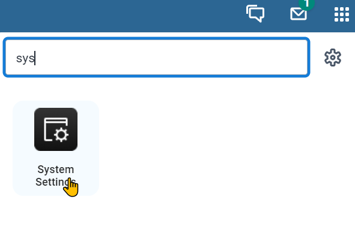

From here, navigate to the appearance tab where you can modify the style and flag of your system.

If you modify these settings they will be reflected in the android application.

### Icons in the Android app

When you first log in, you will see that there are icons and styling applied to android app

### Displaying Rendering Types

In order to display various options for rendering types, we will edit an existing child in the immunization program.

Select the immunization program.

Note that the colour of this program changes to blue, becasue the program specific color has been set to blue.

You could further demo this by changing over to another dataset or program.

Blue colour for Immunization

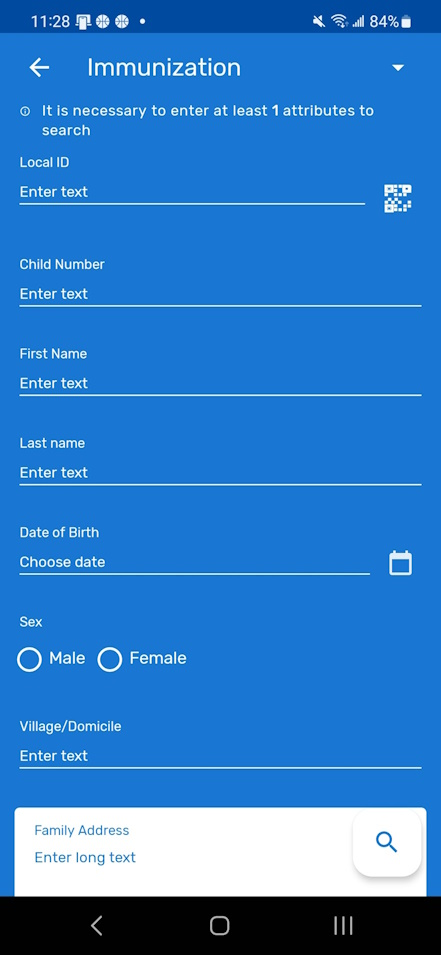

Purple colour for Child Nutrition Tracker

#### QR Reader

We can first start with the QR code reader.

The Local ID is set to scan QR codes

Select the QR code button next to the local ID

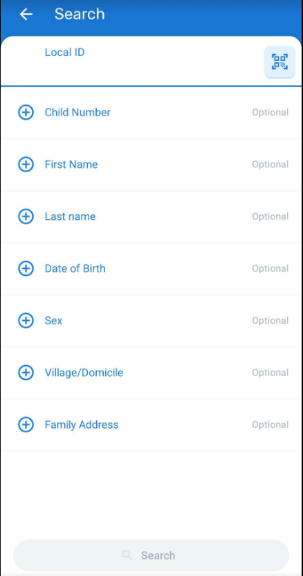

You can scan the following QR code to find an existing record (Jane Thompson)

Scan the code, it will populate the LOCAL ID field. You can then search for the person

The results will show their record because you are using a unique ID

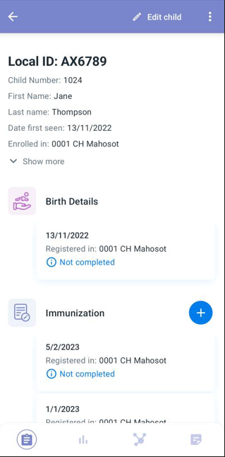

#### Date Picker

Open the record and edit their details

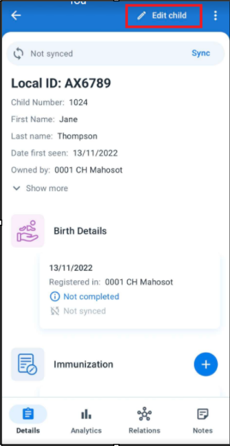

Select the field "date first seen"

Here you can demo the different date pickers by selecting "change calendar view"

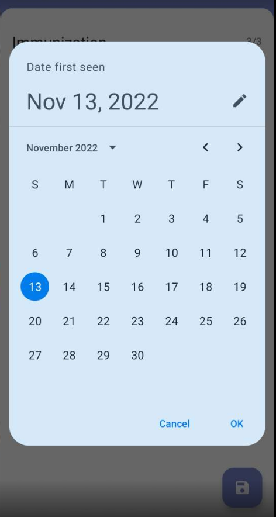

#### Option set rendering

If you select the "Attributes - Child" section you will be able to demonstrate examples of different option set rendering types. In addition to the default setting, you will be able to see examples of both

horizontal radio buttons

and vertical radio buttons

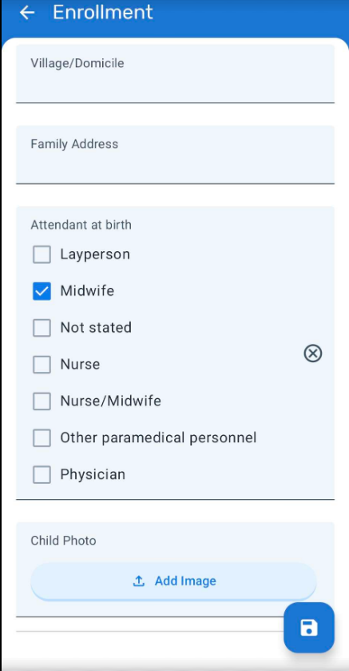

#### Images

If you can continue scrolling, you will see placeholders in which you can add an image.

You can proceed to add an image (a good idea is to download some type of randomized icon or image to use rather then show your own photos from your phone) and display the signature fields.

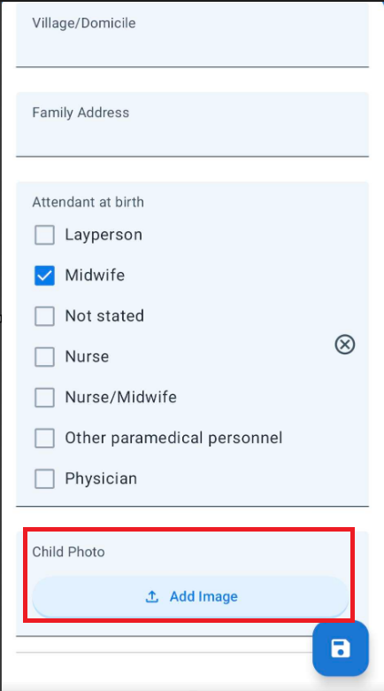

## Demo part 2 - Configuration

### Program Icon and Colour

### QR Codes

In order to configure fields to read QR or bar codes, we have to start with the value type assigned to our TEA or DE.

TEAs or DEs must be set the the value type of "TEXT" or you will not be able to assign them a render type of QR or Bar code in your program

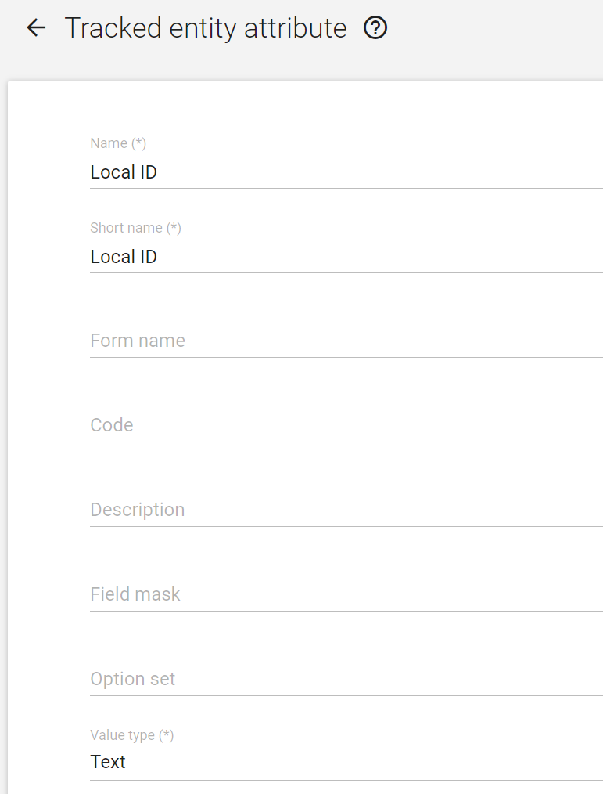

If you check the Local ID TEA value type it will be set to text.

Next, we have to navigate to our tracker program in maintenance. The example we are using is a TEA, so select the Immunization program and navigate to the "Attributes" section of the program. Here we can see the list of attributes assigned to the along with the render type for both mobile and desktop. 

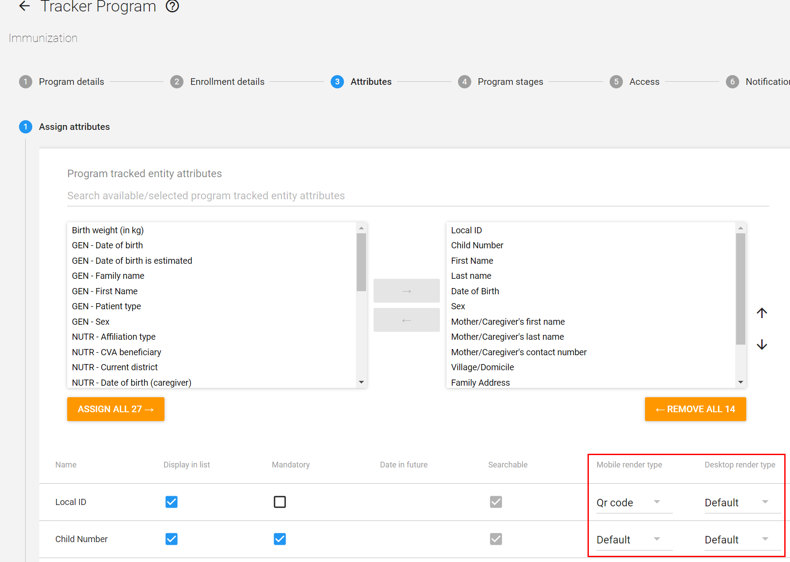

Local ID is the first field and you can see the rendering type is set to Qr code. You can select the dropdown to see other options that are available here. These options apply to any data value that is text.

### Option Sets

There are two tracked entity attributes that also have option sets, Sex and Attendant at birth.

These two TEAs with option sets have been set to render within this screen as well. 

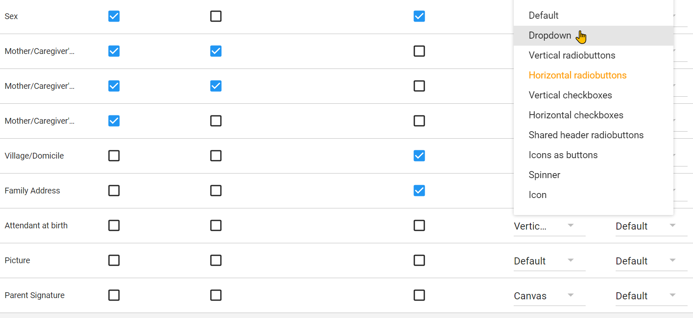

There are a number of options here. When selected from this screen, or for a data element within a program stage, they will render accordingly on the android device.

The default setting for an option set is a dropdown list.

### Images

You can set pictures via the TEA or DE value type.

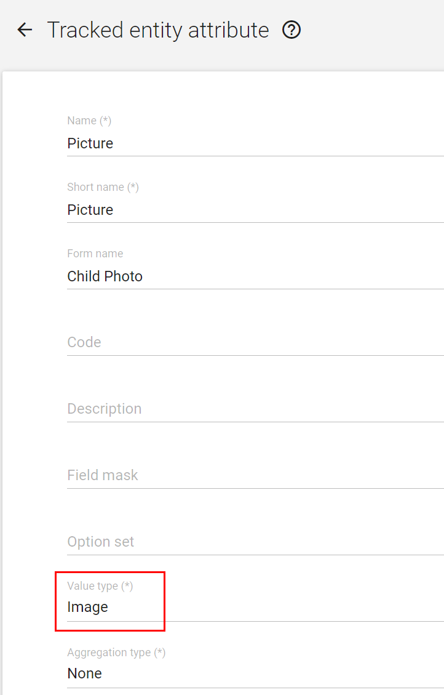

This will allow you to upload images via either android or web.

