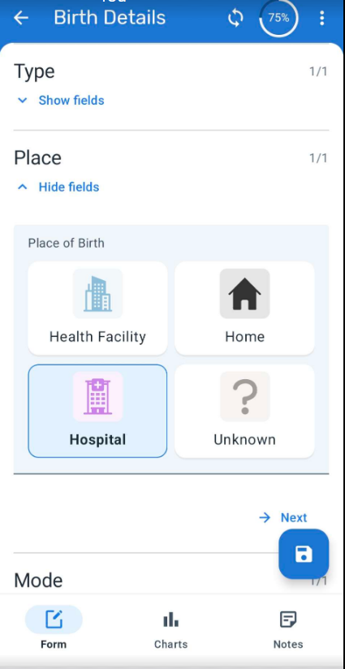
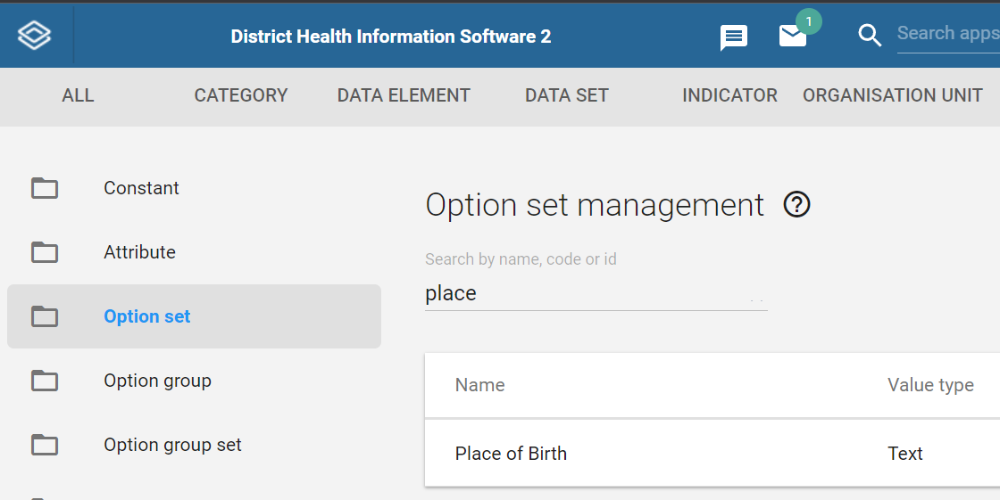
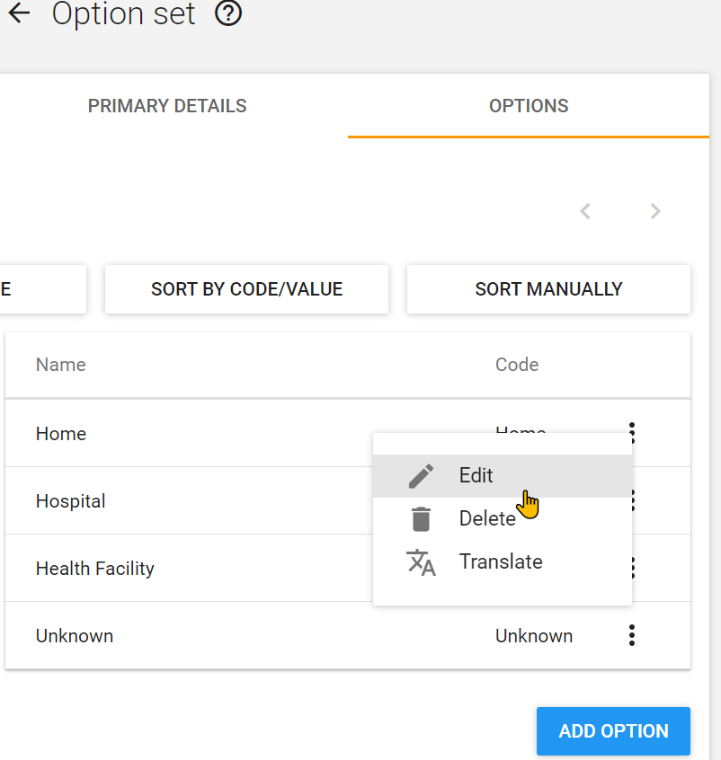
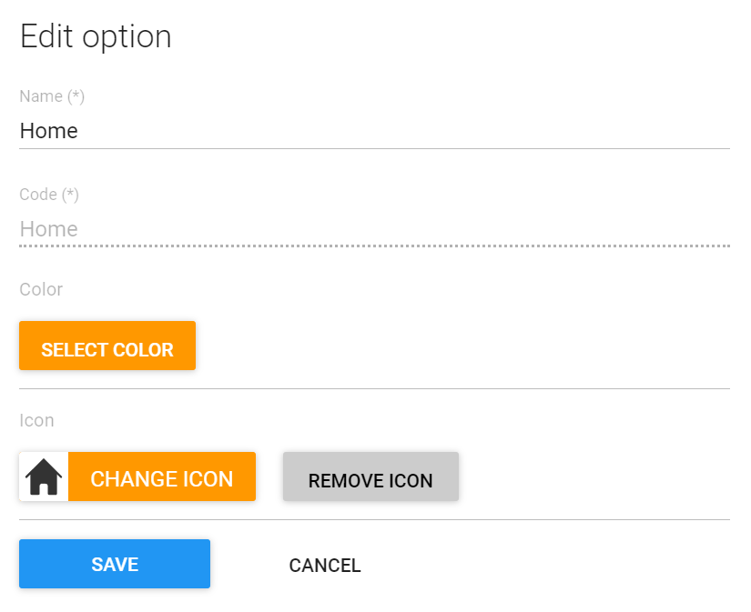
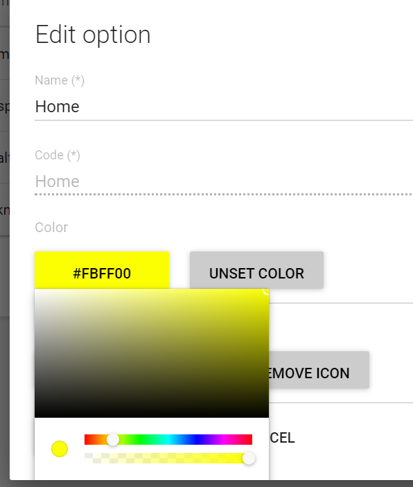
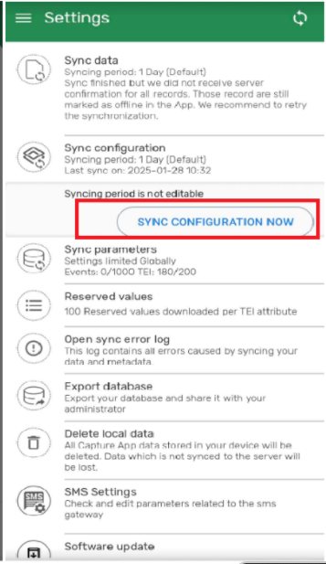
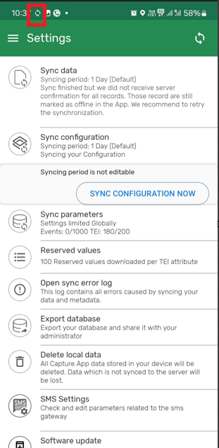
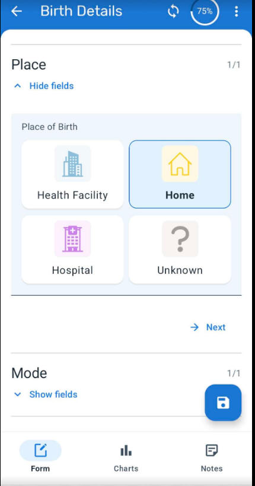

# Trainer’s Guide to Android Visual Configuration

## What is this guide?

This guide is a support document for DHIS2 Academy trainers for the session "Visual Configuration.” This session follows the standard Academy training approach with

1. a live demo session where the trainer demonstrate and explain the features, and 
   
2. a hands-­on session with exercises where participants get to practice the same features.

There are two thematic areas for the demos in this sesssion and the guide is divided into these sections accordingly:

1. Demonstration : A demo of the features discussed in the presentation
2. Configuration : A walk through of how these features are configured

There is also a Quick Guide which lists the steps very briefly and this is meant as a lookup
guide or “cheatsheet” WHILE doing the demo, to help the trainer remember all the steps
and the flow of the demo.

## Learning objectives for this session

1. Describe how visual configuration can be used to display icons and colours for data elements and option sets
2. Demonstrate how to configure Option Sets for visual data entry
3. Demonstrate how to configure Program Stages for visual data entry

## Time Requirements

Demo: 45 mins
Ungraded Exercises: 45 mins

## Background

## Preparations

Go through the Live demo step by step guide a few times before doing the actual demo for participants.
Make sure your user account is same or similar to the participants’ training accounts so that you don’t show more features, dimension options or forms than what they can see when doing the exercises.
Make sure the resolution on projector is OK for zooming

Create an account with the same level of access as the users you are demonstrating to (ie. if they can only search and enter within one facility, have your user have the same authority). If it is the procedure to enter this data from a paper form, it will be useful to have a copy of the form they would normally use as reference filled in. This can just be a form that you have filled in yourself for example. If they are entering data in real-time, then this is not required but you should prepare the details of an example case that you can follow in your examples.

For the exercises and small activities during the demo, fill out a couple extra forms that the participants can use to register their own cases. Your training DB should have some existing cases filled in to help support the working list filter, relationships and searching functionality. If demonstrating the working lists functionality, you will need to have a subset of the events you have created and assigned to a user where you can show this functionality.

### APK File

Make sure that you have the app made for training purposes otherwise you will not be able to cast your screen:

https://github.com/dhis2/dhis2-android-capture-app/releases

This will be denoted by “training” at the end of the APK file.

### Projecting your Android Device

The instructor will have to decide on which method they would like to use to mirror the android app on their computer screen. They will also have to set up a user account (if it doesn’t exist already) that is assigned to the same org unit as the program they are demonstrating.

Please review this CoP post for details on options you may use to mirror your android device:

https://community.dhis2.org/t/how-to-clone-your-android-screen-useful-for-presentations-debugging-etc/38077

Scrcpy is another tool that can also be used and is platform agnostic:
https://github.com/Genymobile/scrcpy

Make sure that your device has developer options enabled before attempting to use scrcpy

After developer options is enabled, enable usb debugging from within the developer options menu.

More information on enabling this is available [here](https://developer.android.com/studio/debug/dev-options)

### User Account

Ensure that there is a user account assigned to a lower level set of org units at the facility level within the database that you can use prior to performing this session. If the participants are following along, ensure that there are user accounts for them to use as well assigned to lower level organization units. The demo user account is in the academy database is:

Username: android1

Password: District1#

### Participants

Send the instructions to the participants on how to install the Android app prior to the session if they have not yet done so. The instructions can be found [here](https://docs.google.com/document/d/1SUUUdmPSDycFtdB9yUMq8ZWiWf8gNOu5xvtNj4_V63U/edit?usp=sharing).

Some participant's may not have been able to install the app by themselves. In that scenario, you may need to walk them through how to do this via google play.

## Quick Guide

1. Demonstrate visual data entry on an android device

STOP - Exercise 1

2. Configure the visual data entry by:
   1. Reviewing the option set color and icons
   2. Changing the program stage section rendering
   3. Sync these changes to the device

STOP - Ungraded Exercise 2

## Demo Part 1 - Demonstrate

In order to demonstrate visual data entry, you can search for the case Jane Thompson (Child # 1024), or register a new record. 

After you have accessed an existing or new child, add or edit the event for the birth details stage. The date of the event can be the same as their date of birth.

There are 4 sections within this program stage.

1. Details: Basic info on the birth and the mother
2. Type: Data element with an option set. Uses the default dropdown layout for an option set
3. Place: Uses the matrix layout and has a visual configuration for a data element
4. Mode: Use the sequential layout and has a visual configuration for a data element

You can expand each of the 4 sections in order to demonstrate how these different layout types appear on the android device.

#### STOP - Perform Exercise 1

## Demo Part 2 - Configure

In order to visually configure data elements with option sets, we can follow this procedure:

1. Add icons and colours to each option within an option set
2. Add the data elements using these option sets to sections within a program stage
3. Configure the program stages to use either the matrix or sequential layout rendering type

### Editing option sets

Lets start by editing our option sets.

Navigate to Option set within the maintenance app and find the option set "Place of Birth"

Open the option set and navigate to options.

This is where we can edit each option to use an icon and/or colour if we want to.

Select the option then select edit

From here, we can select an icon or colour

In this case, we can see an icon has already been applied. Select "Change icon" this will bring up the icon selector.

You can select a different icon in order to show the effect this has.

There is no color currently selected for this icon. We could also select a color so it changes from the default.

When this is done, Save the changes made to the option.

You can then Save the option set.

### Review the program stage setup

Navigate to program maintenance and open the immunization program. From here, select the "Birth Details" stage from the Program stages tab

Navigate down to the "Create data entry form" section of the program stage

Find the "Place of birth" section for this form. 

We can see it has one data element for place of birth. This data element is using the place of birth option set that we have just edited. 

Select the pencil icon in order to edit this section

We can see that the mobile render type is set to "Matrix." This will render this options in quadrants as per our table within the presentation for this session. 

### Sync and review changes on the device

To see this update reflected on the device, we need to sync our configuration

Exit out of the program and navigate back to the home screen. From here select the settings menu, select settings and finally sync configuration

After select sync configuration you can select "sync configuration now"

Give the device a moment to sync. You will see a sync status icon in your device notification pane. You can expand your pane to see the sync status.

Once this is finished, navigate back to the program to view the change you have made.

If we re-examine the birth detailsstage and open the "Place" section, we will see the home icon has been updated with a new icon and colour scheme.

### STOP - Perform the [ungraded exercise](https://docs.google.com/presentation/d/1Y8cUD6W4OEF3JerVYxiuPMQNFXMPfk52KIOLOjveQTU/edit?usp=drive_link)