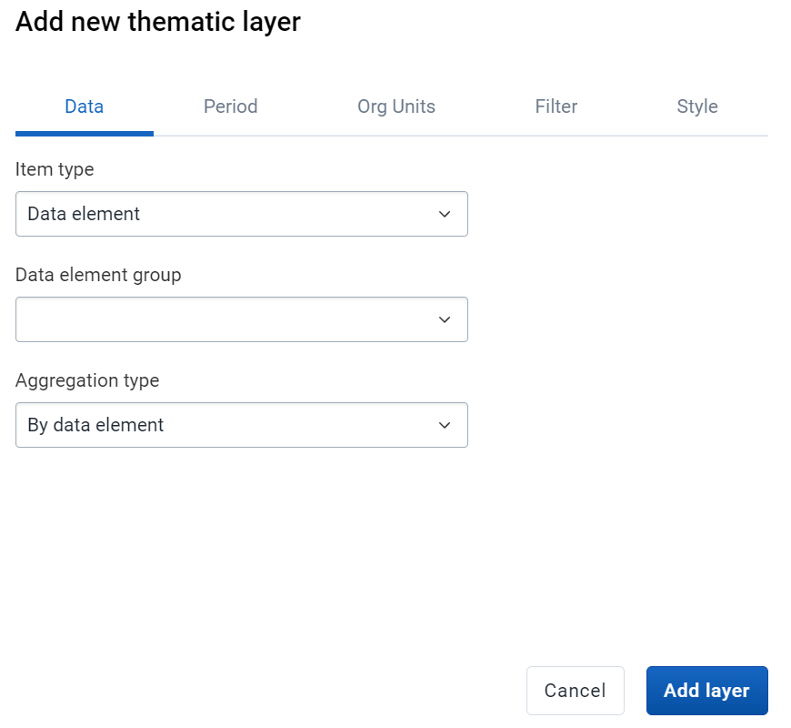
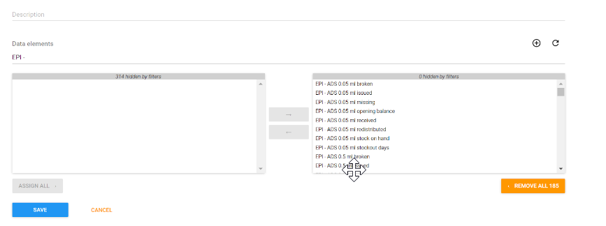

# Learner's Guide to Data Element Groups

## What is this guide?

This guide contains all exercises and detailed steps to perform them related to the review of ***data element groups*** for the Design for Data Use Level 1 academy. Please perform each of the exercises when prompted to by your instructors

## Learning objectives for this session

1. Describe why metadata is grouped in DHIS2
2. Identify when it is appropriate to group different items together
3. Define the terms in DHIS2 used to group items
4. See how data element groups are used in analysis
5. Create a data element group

## Exercise 1

***Perform this exercise in the DEMONSTRATION system.***

Create a thematic map in the maps app.

The maps is is unique in that it does not allow you to select a data item unless it is within a group. 

This is due to the nature of maps app and not wanting it to be overwhelmed with a large request for all data items so it will continue to work in low bandwitdth settings.

In such a scenario, the only way to access your data elements and indicators is to place them within groups that allow you to more easily search for them.

While you can search for data elements and indicators that are not in any group in data visualizer, it is often not recommended. In fact, all of your data elements and indicators should be in groups.

Select data element as the data type along with the following inputs

- Data element group : Primary Termly Tool
- Data element : TT_B_Learner enrollment 6 years
- Aggregation type : by data element

This group is a bit large, with many data items located within it. As a suggestion, we could break this up into smaller groups so we could make it easier to find related data elements.

Discuss amongst the participants what some possible additonal groupings would be. 

For example:
- Learner enrolment
- Learner difficulty
- Reasons for leaving school
- Infrastructure (including water, lighting)

Etc.

Before updating the map modify these inputs

**Period**
- This year

**Org units**
- The Gambia Districts

**Filter**
- School Term = Term 1

We can see in this case, while data element groups helps, and is even necessary in the maps map, there is some room for improvement that would help us refine our search parameters.

## Exercise 2

## Manage DE Groups and DE Group Sets in Maintenance

***Perform this exercise in the CUSTOMIZATION system***

Let us create a data element group for learner enrolment. 

Navigate to Maintenance -> Data Element

From here, we can add a data element group.

Creating a data element group is quite easy. Enter in the details for name, short name and code. Make sure you use your initials so it remains unique.

We also want to add our data elements to the group. Search for the data elements (in this case using learner enrolment) and assign all the data elements for learner enrolment to this particular group. 

After you do this, you can save the group. Note that, because you are not modifying any underlying data, these groups can be added and removed at any time.