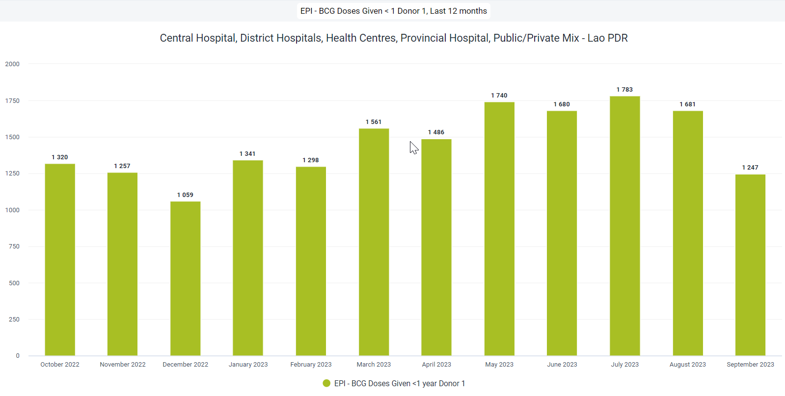
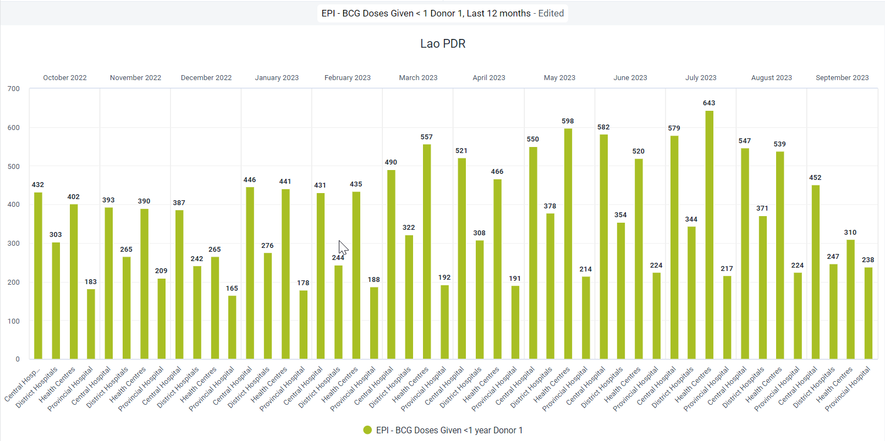
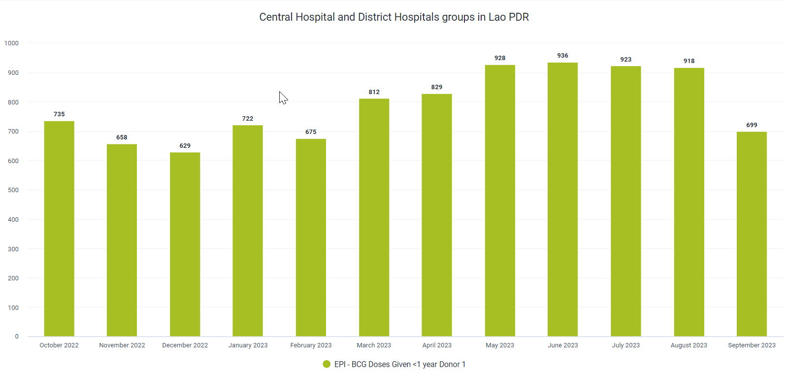
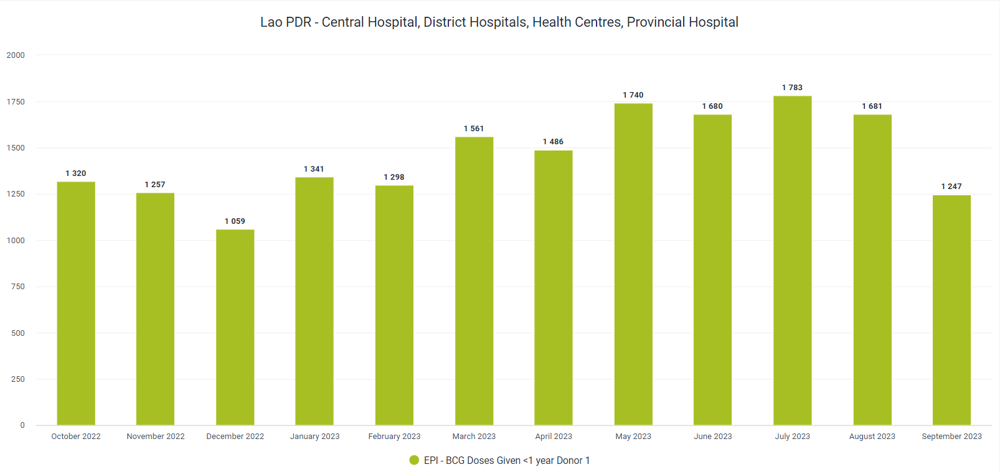
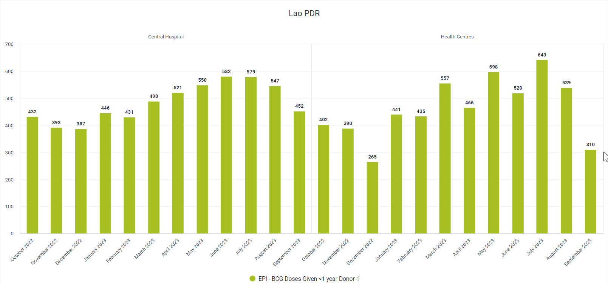
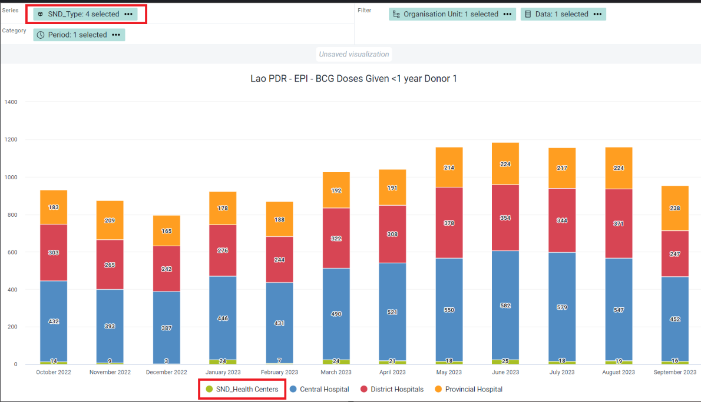

x   # Learner's Guide to Organisation Unit Groups and Group Sets

## What is this guide?

This guide contains all exercises and detailed steps to perform them related to the review of ***organisation unit groups and group sets*** for the Design for Data Use Level 1 academy. Please perform each of the exercises when prompted to by your instructors

## Learning objectives for this session

1. Review the concept of organisation units
2. Describe what organisation unit groups are
3. Describe what organisation unit group sets are   
4. Use organisation unit groups in analysis apps
5. Use organisation unit group sets in analysis apps
6. Describe the limitations of creating organisation unit groups in maintenance
8. Add organisation units to organisation unit groups via import/export
9. Configure organisation unit group sets in maintenance

## Exercise 1 - Review how organisation unit groups and group sets can be used to visualize data

***Perform this exercise in the DEMONSTRATION system.***

#### Review and create the chart "EPI - BCG Doses Given < 1 Donor 1, Last 12 months"

You will start the session by recreating the following chart.

You can open this chart by navigating to data visualizer and opening the chart "EPI - BCG Doses Given < 1 Donor 1, Last 12 months"

This chart has two organisation unit group sets that are being applied to it, located in the filter of the chart. In analysis, we can apply as many combination of data dimensions as required to create our intended input and organisation unit groups/group sets can help with this. 

They can also support the disaggregation of our data. 

Move the org unit group set "Type" from the filter to the category and update the chart.

We can now see the chart is disaggregated by the org unit groups within the group set "Type"

#### Create a new chart

To create a new chart select File - > New

Here are the inputs for the chart:

**Chart Type**
- Column

**Data**
- Data Type : Indicator 
- Indicator group: Immunization
- Indicator name: EPI - BCG Doses Given < 1 Donor 1

**Period**
- Last 12 months

**Organisation unit**

When opening the org unit pane, explain that org unit groups can also be used to select relevant organisation units to include in your analysis. Using this option, we can not use the compound filtering options we observed in the first chart we were shown; however if you just want to quickly select a group of organisation units to use in analysis, this can be done. This is another reason why it is very useful to group your organisation units. Note that you can select multiple org unit groups in this selector.

As an example, you can select Central Hospital and District Hospitals as the org unit groups and update the chart.

Have a close look at the chart. ***The org unit groups are not added as data dimensions in this scenario*** so we can't disaggregate the data any further; however a filter is being applied to only show data from the org unit groups being shown. 

Clear the selection of any org unit groups selected here and just ensure Lao is selected as the org unit

Add in the org unit groups Central Hospital, District Hospitals, Health Centres and Provincial Hospital options from the type org unit group set data dimension

Alter the chart layout to look like the following

Then update the chart

Using the org unit group sets we have added, we can filter the chart further. As an example, we can remove some of the org unit types from the filter.

Update the chart and you will see the data is refined further

We can also use these dimensions to disaggregate our date in visualizations. Update the layout to the following

And update the visualization

From these examples, we can see there is a lot of flexibility introduced by using org unit groups and group sets in data analysis; and having them configured correctly will prove very useful.

## Exercise 2 - Manage OU Groups and OU Group Sets in Maintenance

***Perform this exercise in the CUSTOMIZATION system***

In order to create org unit groups and group sets in DHIS2, we can use the maintenance app. This should be a review for most participants.

Navigate to maintenance -> organisation unit and create a new organisation unit group. 

Try to create a group for all health centres using your initials as a prefix.

When you go to filter organisation units by name type in "HC."

## Exercise 3 - Create org unit groups via maintenance

***Perform this exercise in the CUSTOMIZATION system***

Lets create our org unit group. We are going to do this because, while we can import the org unit group seperately, it is a bit easier to have created the org unit group already before importing org units to it. Sometimes, a combination of using the maintenace app plus advanced operations can be helpful, as is the case here. 

Navigate to maintenance -> organisation unit and create a new organisation unit group. 

This time, create a group for all health centres using your initials as a prefix; however do not select any org units for the group yet. Save this group when you are done.

### Review the format of the orgunit group import file

Adding org units to an org unit group via a csv file is very simple. We just need a csv file with two columns:

- Column 1 : The ID of the org unit group you are importing to
- Column 2 : The ID of the org unit you are adding to the org unit group

Thats it! It will look something like this (you can retrieve examples files via the google drive for this academy)

See how the ID in the first column is repeated? That is because all the org units in column 2 are being imported to the same org unit group.

Open up Excel/Libreoffice/etc. to start creating the import file. It can look like this to start

Go to the csv file of the HC org units you downloaded and copy all of the IDs you have retrieved into the second column. Paste this into the csv file you have created for importing the org unit groups.

Retrieve the ID of the org unit group by selecting the org unit group you made in maintenance and selecting show details.

 

A small box will appear where you can see the ID of the org unit group you have selected.

Copy this ID and place it into the first column of your spreadsheet and fill in the remaining cells within the column.

Make sure you save the file as a csv using the UTF-8 format.

## Exercise 4 - Import the org unit groups into DHIS2 via the Import/Export app

***Perform this exercise in the CUSTOMIZATION system***

We can now import this file into DHIS2. Navigate to the import-export app then select metadata import from the side menu

Upload the file you have made by selecting "Upload file" and finding the file you have made. Then make the following changes

Make sure to provide a brief explanation as you select these options.

Perform a dry run and make sure everything looks ok.

If it does, import the file by selecting "start import." It should look like this if its all ok

Navigate to your org unit group set in maintenance and open it up. You should see that the org units have been assigned to the group

## Exercise 5 - Create the OU group sets via maintenance

***Perform this exercise in the CUSTOMIZATION system***

To finalize this process, you would normally have to create at least one more org unit group; however the steps you follow are the same as what we have shown now. Instead, we will use the org unit group you just made plus existing groups in order to create an ***org unit group set***. Within the group set, exclusivity is a key principle. This means an org unit should not belong to more then one org unit group within an org unit group set. Also, each of the org units in the entire system should be within one of the org unit groups belonging to the group set as well. This is so when we perform analysis with these org unit groups and group sets, we are not excluding org units from our totals.

Navigate to org unit group set and create a new one within maintenance (maintenance -> organisation unit -> add new org unit group set).

Add in the following groups, using the health centre group you created rather then the existing one.

Explain the fields as you create this org unit group. Save it when you are finished. 

## Exercise 6 - Use the created groups in visualizer

**Chart type**
- Stacked column

**Data**
- Data Type : Indicator 
- Indicator group: Immunization
- Indicator name: EPI - BCG Doses Given < 1 Results

**Period**
- Last 12 months

**Organisation unit**
- Lao PDR

**Organistion unit group set**
- the one you just made

You can now use your groups for selecting org units and your group sets as dimensions to disaggregate your data!

