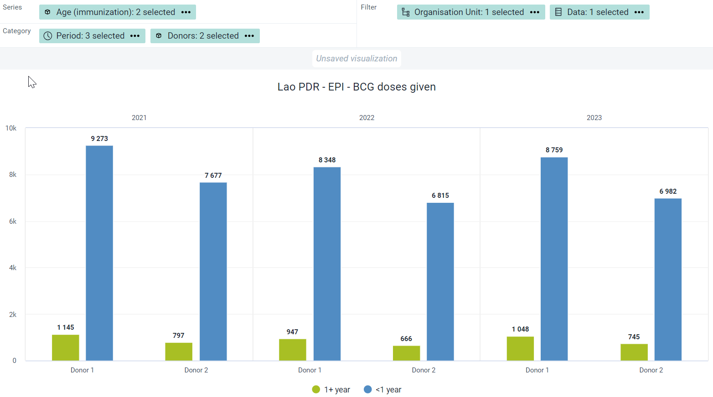
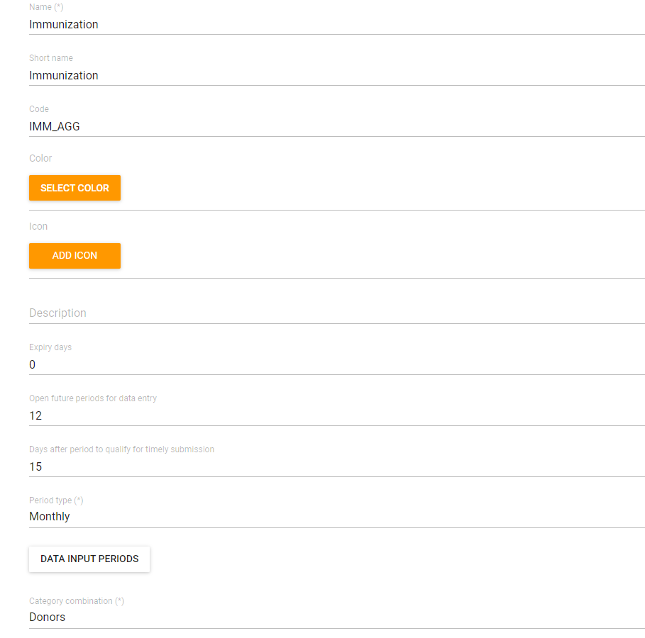

# Learner's Guide to the Attribute Model

## What is this guide?

This guide contains all exercises and detailed steps to perform them related to the review of ***attributes*** for the Design for Data Use Level 1 academy. Please perform each of the exercises when prompted to by your instructors

## Learning objectives for this session

1. Describe what dataset attributes are
2. Use attributes in analysis apps
3. Configure attribute options, attribute categories, attribute category combos in maintenance
4. Verify the creation of attribute category option combos via the API

## Exercise 1 - Use attributes to create visualizations

***Perform this exercise in the DEMONSTRATION system***

### Review a dataset in data entry that uses the attribute model

There are two datasets one can view : Immunization and the Primary termly tool. Immunization is located at the facility level in the Lao hierarchy, while the termly tool is located at the school level in the Gambia hierarchy. 


Select either one (or both) to review in data entry focusing on the use of attribute categories to disaggregate the data set.

### Review how attribute categories can be used to visualize data

Open the chart "Enrolment by term this and last 3 years" from the EMIS - Primary school dashboard


This chart has two categories being used to disaggregate the data. The first is our disaggregate category : sex. The second one is our attribute category : school term! We can see term 1, term 2 and term 3. 

We can add in additional dimensions as items or filters to our chart. 

As an example, we can select the disaggregate category "Class" and select some classes to filter our data further


Place the class dimension in the filter and update the data. 



You will see this effects the output of the data we are now showing.

Note you can do this for any type of data set disaggregated using attribute categories.

If you open the chart "EPI - BCG Doses Given, last 12 months" you will be able to see this applied to other data types as well.


## Create a new chart

To create a new chart select File - > New

Here are the inputs for the chart:

**Chart Type**
- Column

**Data**
- Data Type : Indicators 
- Indicator group: Primary Termly Tool
- Indicator Name: PTT_Total Enrolment


**Period**
- 2020, 2021, 2022


**Organisation unit**
- The Gambia

We now want to add in the sex and school term data dimensions to the chart. We can note now that the attribute category "School term" is not treated differently from any other available data dimension when we look at the side panel. There is no distinction to seperate it from other categories or org unit group sets either as the attribute category dimension can be used the same as the other ones that are available. As long as the data we are reviewing is disaggregated according to said dimension, it can be used to disaggregate and filter our data.

Add in the categories for school term


and sex


Modify the layout and update the chart


You will see the disaggregations (categories) have now been applied.

## Exercise 2 - Review how to manage category options in maintenance

***Perform this exercise in the CUSTOMIZATION system***

In our example, let us create the category options that we had used to disaggregate our Immuniuzation data set. This consists only of Targets and Results. 

Navigate to maintenance -> Category -> Category Option

From this screen, the first thing you want to do is search for the category option you are creating. 


If I type in "Results" as a category option, I will see that this already exists. Under normal circumstances, you would stop here. Never create a duplicate category option when it already exists. 

In this scenario, we want to go through the process of the attribute category model from start to finish; so we will create this category option for demonstration purposes only.

Create a new category option by selecting the plus icon.

Use your initals as a prefix and create the category option Results


You can discuss the fields as you fill them in. Save the category option when you are finished.

Repeat this process to create the category options for Targets.

So far, nothing is actually different then when we create disaggregate category options.

## Exercise 3 - Review how to manage categories in maintenance

***Perform this exercise in the CUSTOMIZATION system***

We want to create one category

- Targets/Results

Navigate to maintenance -> Category -> Category

From this screen, the first thing you want to do is search for the category you are creating.


We will see Results/Targets listed already. Under normal circumstances, you would stop here. Never create a duplicate categories when they already exist. 

In this scenario, we want to go through the process of the attribute category model from start to finish; so we will create these attribute categories for demonstration purposes only.

Create a new category by selecting the plus icon.

Use your initals as a prefix and create the category for Targets/Results. Make sure you use the category options that you have created (intials_results, initials_target) 


You can discuss the fields as you fill them in. In particular, make sure to review the data dimension type. This time, we will be using attribute. This is because this category is being applied to a data set, not a data element.

Also, explain that the data dimension tick box allows the category to show up on the left side menu in analysis apps. 


Ensure you use the category options that you made with your initials to create this new attribute category.

## Exercise 4 - Review how to manage attribute category combinations in maintenance

***Perform this exercise in the CUSTOMIZATION system***

We want to create one attribute category combination

- Targets/Results

Navigate to maintenance -> Category -> Category combination

From this screen, the first thing you want to do is search for the category you are creating.

The category combination already exists


In this scenario, we want to go through the process of the attribute category model from start to finish; so we will create this category combination for demonstration purposes only.

Create a new category combination by selecting the plus icon.

Use your initals as a prefix and create the category combination for for Targets/Results. Make sure you use the categories that you have created (initials_targets/results)


You can discuss the fields as you fill them in. In particular, make sure to review the data dimension type. We will use attribute once again. Interestingly, when you select attribute as the data dimension type, you will only be able to select from attribute categories to create your attribute category combination.

## Exercise 5 - Check the category option combinations via the API

***Perform this exercise in the CUSTOMIZATION system***

We have succesfully created our category combination. It is now time to check if the category option combinations have been created. Based on what we made, we should have a total of 4 category option combinations

- Targets
- Results

To check this, first, get the UID of the category combination that you made

Navigate to maintenance -> Category -> Category combination

Search for your category combination, hit the action button followed by show details


You should now be able to obtain the UID


Use the following API call in order to check your category option combinations: 

```
api/categoryCombos/CZdqpXRkg8Y.csv?fields=categoryOptionCombos[id,name]
```

where "CZdqpXRkg8Y" is the UID of the category option combo; this will allow you to get a CSV file of the category combo with all of the category option combinations.


Now that you have verified it has been created correctly, you can use the attribute category combination to disaggregate the data sets that you need.

> Note : the process to check if this has been generated correctly is the EXACT SAME as what was done for disaggregate category option combinations. This is because the underlying data model is also identical. The only difference is the classification (attribute) and that is now used to disaggregate a data set instead of a data element. 

### Exercise 6 - Review where you apply these attribute category combos when creating a dataset

***Perform this exercise in the CUSTOMIZATION system***

Navigate to Maintenance -> Data Set and list the data sets. Search for either the EMIS primary termly tool or the immunization data set. 




After opening these datasets, navigate to the category combination field. It is usually marked as "None" when there is no attribute category combination applied. In these cases however, you will see the attribute category combination that is required has been applied to the data sets in question.


