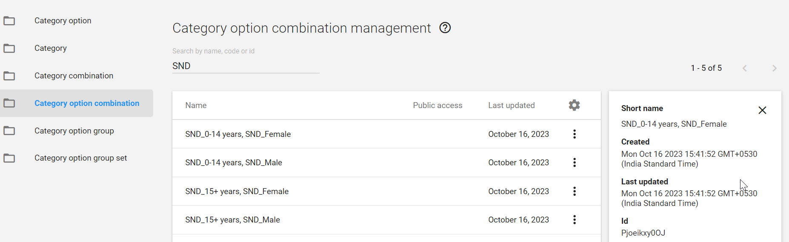

# Learner's Guide to the Category Model

## What is this guide?


## Learning objectives for this session

1. Define the DHIS2 category model
2. Use categories to disaggregate data in analysis apps
3. Create category options, categories and category combinations following a standard operating procedure
4. Verify the creation of category option combinations using the API
5. Describe the relationship between categories, data dimensions and anlaytics
6. Apply category combinations to data elements

### Exercise 1 - Review how categories can be used to visualize data

***Perform this exercise in the DEMONSTRATION system***

Open the chart "HIV - HIV cascade by sex - last 12 months" from the HIV national dashboard.


This chart has one category with three category options being used to disaggregate several data elements (Sex) located in the series of the chart. In analysis, we can apply as many combination of data dimensions as required to create our intended input and organisation unit groups/group sets can help with this. 

They can also support the disaggregation of our data. 

Add the disaggregation "Age (HIV)" to the to the category of the chart and update the chart. 


We can see we can add more then one category to disaggregate our data, as long as the data itself is disaggregated and collected this way.

#### Create a new chart

To create a new chart select File - > New

Here are the inputs for the chart:

**Chart Type**
- Column

**Data**
- Data Type : Data Elements 
- Data Element group: HIV
- Data Element names: HIV - HIV tests positive, HIV - PLHIV new on ART, HIV - PLHIV retained on ART last 12 months


**Period**
- Last 12 months

**Organisation unit**
- Lao

We now want to add in our categories for our data. In this case, we need to know how the data elements we selected are disaggregated. 

If your are not completely familiar with this, one way to perform a quick check is to review the form in data entry or in the reports app if you have access to. 


Here we can see the data elements that we are working with are disaggregated by age and sex; we can therefore also use these to disaggregate our data in visualizer.

Add in the categories for Age (HIV)


and sex


Modify the layout and update the chart


You will see the disaggregations (categories) have now been applied.

## Exercise 2 - Review how to manage category options in maintenance

***Perform this exercise in the CUSTOMIZATION system***

In our example, let us create the category options that we had used to disaggregate our HIV data. In this example, we had:

- Sex (male, female)
- Age (0-14, 15+)

Let us just start with these examples. 

Navigate to maintenance -> Category -> Category Option

From this screen, the first thing you want to do is search for the category option you are creating. 


If I type in "Male" as a category option, I will see that this already exists. Under normal circumstances, you would stop here. Never create a duplicate category option when it already exists. 

In this scenario, we want to go through the process of the category model from start to finish; so we will create this category option for demonstration purposes only.

Create a new category option by selecting the plus icon.

Use your initals as a prefix and create the category option Male


You can discuss the fields as you fill them in. Save the category option when you are finished.

Repeat this process to create the category options for female, 0-15 and 15+. 

## Exercise 3 - Review how to manage categories in maintenance

***Perform this exercise in the CUSTOMIZATION system***

We want to create two categories:

- Sex (male, female)
- Age (0-14, 15+)

Navigate to maintenance -> Category -> Category

From this screen, the first thing you want to do is search for the category you are creating.


We will see there are a couple sexes listed already. Under normal circumstances, you would stop here. Never create a duplicate categories when they already exist. 

In this scenario, we want to go through the process of the category model from start to finish; so we will create these categories for demonstration purposes only.

Create a new category by selecting the plus icon.

Use your initals as a prefix and create the category for sex, Make sure you use the category options that you have created (intials_male, initials_female) 


You can discuss the fields as you fill them in. In particular, make sure to review the data dimension type. Leave it as disaggregation but we will come back to attributes in a later session.

Also, explain that the data dimension tick box allows the category to show up on the left side menu in analysis apps. 


Repeat this process to create the category for Age (0-14/15+). Ensure you use the category options that you made with your initials to create this new category.

## Exercise 4 - Review how to manage category combinations in maintenance

***Perform this exercise in the CUSTOMIZATION system***

We want to create one category combination

- Age (0-14, 15+) + Sex

Navigate to maintenance -> Category -> Category combination

From this screen, the first thing you want to do is search for the category you are creating.

If we were to investigate a bit, we would see Age and sex (HIV) category combination is actually the same as what we are about to create. This is becase the category Age (HIV) actually contains the same age groups we have made.


It is important to consider that sometimes the duplicate item you are looking for might not be readily apparent based on its name alone. Keep this is mind when searching for duplicates in your own system and only create items when you are absolutely sure they are not located anywhere else.

In this scenario, we want to go through the process of the category model from start to finish; so we will create this category combination for demonstration purposes only.

Create a new category combination by selecting the plus icon.

Use your initals as a prefix and create the category combination for for Age (0-14, 15+) + Sex. Make sure you use the categories that you have created (intials_sex, initials_age (0-14/15+)) 


You can discuss the fields as you fill them in. In particular, make sure to review the data dimension type. Leave it as disaggregation but we will come back to attributes in a later session.

## Exercise 5 - Check the category option combinations via the API

***Perform this exercise in the CUSTOMIZATION system***

We have succesfully created our category combination. It is now time to check if the category option combinations have been created. Based on what we made, we should have a total of 4 category option combinations

- 0-14, Male
- 0-14, Female
- 15+, Male
- 15+, Female

To check this, first, get the UID of the category combination that you made

Navigate to maintenance -> Category -> Category combination

Search for your category combination, hit the action button followed by show details


You should now be able to obtain the UID




Use the following API call in order to check your category option combinations: 

```
api/categoryCombos/CZdqpXRkg8Y.csv?fields=categoryOptionCombos[id,name]
```

where "CZdqpXRkg8Y" is the UID of the category option combo; this will allow you to get a CSV file of the category combo with all of the category option combinations. So make sure you replace the example ID here with the ID you find in mainteance.


Now that you have verified it has been created correctly, you can use the category combination to disaggregate the data elements, indicators, validation rules, etc. you need to as required!

