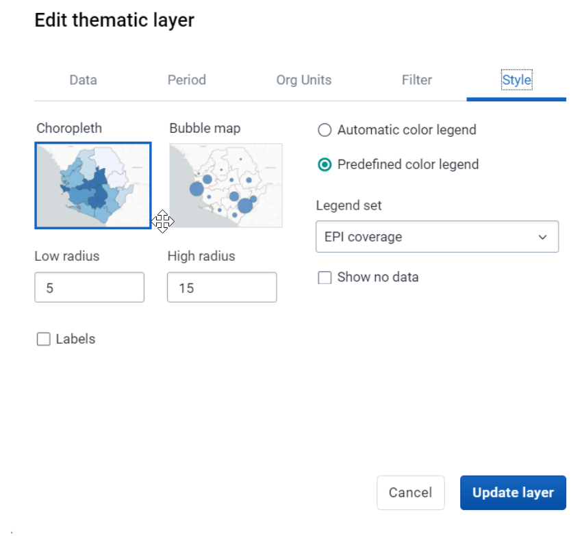

# Trainer’s Guide to Legends

## What is this guide?

This guide contains all exercises and detailed steps to perform them related to the review of ***legends*** for the Design for Data Use Level 1 academy. Please perform each of the exercises when prompted to by your instructors. 

## Learning objectives for this session

1. Describe what legends are
2. Use legends in analysis apps
3. Configure legends in maintenance
4. Associate legends with indicators and data elements

## Time Requirements

- Live Demo: 
- Hands-on Exercises: 
- Assignment: 

## Exercise 1 - Review how to use legends in data visualizer

***Perform this exercise in the DEMONSTRATION system***

Navigate to data visualizer and open the chart "HIV - Test positivity and PLHIV virologically suppressed"

This chart has a couple interesting properties. We can see there are two data items selected, and that each of these data items has a legend applied to it. This is actually possible only when the data items themselves are associated with a legend directly. We will discuss how to configure this shortly. 

We also see that there is a legend panel to the right of the chart. This allows us to more quickly interpret what the colours on the chart are identifying.

Navigate to optionss -> legend in order to review the legends panel

Here we can see the options for the legends that are being applied. While we can select legends to apply to the chart, the chart right now is using legends that are automatically applied to the two indicators that have been selected.

We can change this so we actually select the legend we apply to the chart, but note this will restrict us to applying a single legend to the entire chart.

If we update the chart, we will see the following

Now both data items are using the same legend; it not nearly as distinct as the other version of the chart was but may be preferable depending on the situation.

The nice thing about these legends is that they can be used in both charts, as well as pivot table.

We could alter the chart to a pivot table and update the visualization.

The properties of the legends that we have applied carry over and colour the background cells of our 
table. 

Navigate to options -> legend in order to review the legends with the table open

We will notice that there is a couple of extra options here located under the heading "Legend style." In tables, we can use legends to colour either the background or the text/values themselves. 

We can modify some of the legend options

- Change style to text color
- Change type to pre-defined

If we update some of the options then update our table; we can see this doesn't exactly have the intended affect as the values become quite difficult to read against the white background of the table.

When using this feature, we do need to be a bit careful how we present our values or else it will become difficult to read.

Modify the options again and update the table (change the style to background color)

We can see this is a lot more clear and seperates our data more easily.

Note that there are some limitations to using legends in data visualizer, as not all output types support them. 

Visualizations that CAN use legends include:
- pivot table
- column
- gauge
- single value

Visualizations that CAN NOT use legends include:

- stacked column
- stacked bar
- line
- area
- stacked area
- pie
- radar
- year-over-year (line and column)
- scatter

Your best option to modify the colouring of these items is to use the color set tab in the options panel of data visualizer

## Exercise 2 - Review to to use legends in maps

***Perform this exercise in the DEMONSTRATION system***

From the EMIS - Primary school dashboard, open the map "Gross Enrolment in LBS, this year"

While all thematic maps have a legend applied to it, in this case a custom legend has been used to display the indicator data on this map.

Edit the thematic layer and navigate to the style panel

Here we can see the option for "pre-defined color legend" has been selected, along with the legend "EMIS - Gross Enrolment."

In maps, we can also use automatic colour legends if we want to, which will produce a legend based on the parameters we set. Select this option to review it. 

In this case, we can define the number of legend classifications (classes) that we want and select a colour scheme that will be automatically applied to our data.

Select a color scheme and update the map to see the effect this has on the map display.

The new legend works to represent our data, but is perhaps not as meaningful as a purpose-built legend that was being used to previously represent our data. 

You could update the legend again to review the original map and compare this with the automatic legend and discuss which one is more meaningful based on the data you are seeing.

## Exercise 3 - Review how to create legends

***Perform this exercise in the CUSTOMIZATION system***

In order to create a legend navigate to maintenance - > other -> legend

This will display the list of all of the available legends in the system that are shared with your user. Let us recreate the legend for EMIS - Gross Enrolment. As a reminder, this is the legend

Explain the fields that are available in the Legend configuration screen. Note that continuous legends are supposed to end and start on the same value, for example 0-50 and 50-80. The GIS/Maps app automatically takes care of this. Do not try to do this yourself by setting legends to for example 0-50 and 51-80. This will cause a usually unwanted gap in your legend set.

This is the screen to create a new legend

Give the legend a name and code

The start and end value is theoretically 0 - 100; but we already saw that this data has some values over 100% 

We have 4 categories divided our legend as follows

- 0-40
- 40-80
- 80-120
- 120-1000

We can see that our legends are overlapping. This must be the case. It is not very intuitive, but DHIS2 will interpret these overlaps as such

- 0-39.9
- 40-70.9
- 80-119.9
- 120-999.9

You can either use the pre-defined color schemes available to generate your legend, select your own colors, or modify a pre-defined color scheme as is necessary. 

Let us generate the items to see its effect then alter the legend to our liking. 

Enter a start value, end value and number of legend items

If we search the color palette, we won't see the exact same colour scheme that was there in the other legend; but let us just select one for now.

After those inputs are completed, select "create legend items" to generate the legend.

It will generate a legend, but this won't be quite what we want

We can edit each legend item by selection the action button followed by edit

Edit the 1st item to follow the cateorisation we defined

Click on the colour in order to edit the colour. The colour uses what is called a hex code. There are many resources to look up hex colours and their complements (ie. http://www.color-hex.com/ ; https://colorbrewer2.org/) which can be helpful when constructing your own legends. 

We can either select the color red or enter the hex code #FA0000 to get the red colour.

When done hit OK. You may see a message "Gaps in the legends are not allowed!" This is just a warning that you should not have gaps in the numbers within the legend you create. This should resolve itself once we complete the legend.

Repeat these steps for the items

- 40-80 (color : yellow or #FAC027)
- 80-120 (color : green or #058304)
- 120-1000 (color : gray or #D1CBC1)

Once you have finished it should like like this

Select save to save your legend.

#### Review how to have pre-defined legends associated with data elements and indicators

Now that we have created a legend, we are able to associate it with data elements and indicators as well as using it analysis. Navigate to maintenance -> indicator and find the indicator "EMIS - Gross Enrolment in primary." If you open it up you will see a legends box where you can add your legend to the indicator. In this case, a legend is already associated with the indicator so no need to add another one. If you do this, the indicator will maintain an association with that legend and that legend will automatically be used in analysis when legends are enabled unless other options are selected for it. This process is identical for both data elements and indicators.

#### Use your legend in analysis

You should now be able to apply this legend in maps or visualizer. Select the app of your choice, and apply the legend you have made using the inputs via either data visualizer options or the style tab on a thematic map.

- Visualization : Bar Chart/pivot table/thematic map
- Data Type : Indicator
- Indicator group : EMIS - Enrolment
- Indicator : EMIS - Enrolment in primary
- Period : This Year
- Org unit : The Gambia Districts
- Legend : Predefined legend - yourinitials_Gross Enrolment

