# Learner's Guide to User Roles

## What is this guide?

This guide contains all exercises and detailed steps to perform them related to the review of ***user roles*** for the Design for Data Use Level 1 academy. Please perform each of the exercises when prompted to by your instructors.

## Learning objectives for this session

1. Describe the individual concepts that make up a user
2. Configure these concepts in DHIS2
3. Create a user in DHIS2

## Exercise 1 - Review user roles and authorities

### Review the user roles management page

In order to start the process of creating a user role, navigate to the users app

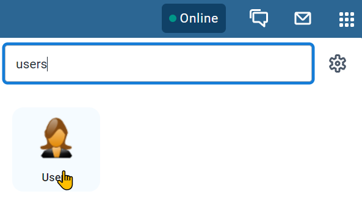

From here, you can either list or add a new user role. Start by listing the available user roles

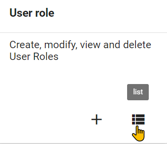

In this system, you will only see a couple of user roles. In a live system, you are likely to see many more user roles. 

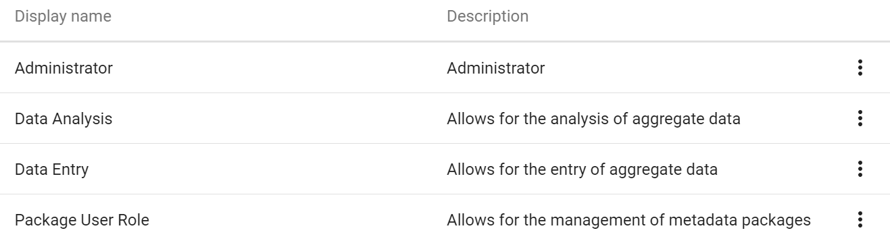

Select the data entry role in order to review it. You will see the user role management page is divided into 6 sections.

- Basic information (Name, Description)
- Metadata authorities
- App authorities
- Tracker authorities
- Import/export authorities
- System authorities

1. Basic information : Includes the name and description of the user role
2. Metadata : the metadata section allows you to assign different permissions to a user role that allow for adding or deleting either public or private metadata objects. For example, you could provide someone access to create and delete public data elements. You will also see an option for external access. This is only available for report type objects, and allows this user role to give access to these reports via outside access (for example, through a web portal). 
3. Apps : the apps section allows you to give access to the various DHIS2 apps that are within your instance. This includes all of the core DHIS2 apps, as well as any custom apps you may have on your own system. Note that this section only gives you access to the app, it does not specify what you can do within the app necessarily.
4. Tracker : tracker authorities have their own specific section as they are unique to the tracker data model. This does include events to some extent as well. This is because items like adding tracked entities or modifying events is unique to this model.
5.  Import - Export : these authorities are given to a user role that will be dealing with the import/export of metadata, data or both. This is usually only given to a specialized role.
6. System : the system authorities allow a user to run various system level operations within DHIS2. This includes operations like validation rule analysis, predictor, and data approval for example. 

> **Note**: at the moment there is no comprehensive list of what each of the user authorities available here allows the user to do. While some are straightforward, many are not. As a result it can be slightly confusing to determine which authorities to assign a user role. We will try to provide some examples of template user roles that can be used for common aggregate operations. When you are unsure about how to define a user role, the community of practice will be a better resource until the documentation is updated.

### Review the authorities assigned to the data entry user role

We can review the authorities assigned to this user role by ticking "Selected authorities only"

We will see that the user only has a limited number of authorities. This is because this user role is meant for entering data only. 

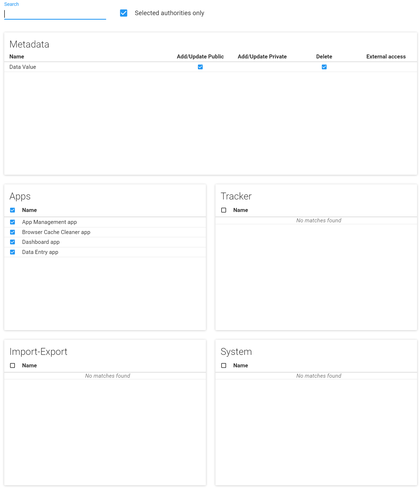

For this user role, we are only using authorities from the apps and metadata sections. When we create user roles, we should be thinking about creating roles that cover a specific function. We can then combine various user roles together to give our user the access they need. This may differ from a common approach of creating a user role for a specific job type (data entry clerk, reproductive health staff) or geographical level (national staff, provincial staff) for example; however such an approach is not recommended. Approaches by function or level does not allow for any variation within those functions as it is not as flexible as creating generic, reusable roles that can be applied to a wide range of user types.

Let us review the authorities assigned to this role.

**Metadata**

- Add/update public and Delete data value : this allows the user to enter and delete data values into an aggregate data set

**Apps**
- App management app : gives them access to the app management app
- Browser cache cleaner app : gives them access to the browser cache cleaner app
- Dashboard app : gives them access to the dashboard app
- Data entry app : gives them access to the data entry app

There are only assigned 4 apps as part of this role. This means, if they only have this user role, they will only see these 4 apps in the apps menu (along with menu management, which every user sees). 

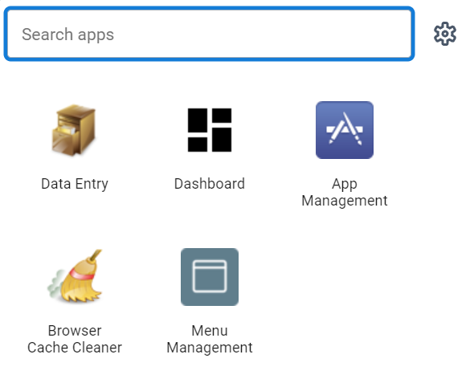

A combination of these authorities from metadata, along with authorities from the apps category, is usually what will be needed for the majority of user roles that are assigned to end-users in the system not responsible for any type of system maintenance. 

### Log in to the user with this role

In the DDU demo instance, log into the user that has this role assigned to them. Note that there are other components that make up this user role as we have discussed, including user groups, sharing and organisation units; but we will focus on the implications of the user role for now.

Username : malaria_data_entry

Password : District1#

When we log in, we will see they can access the malaria dashboards.

Next, go to data entry. We can see they are only assigned one province in the hiearchy in which to perform data entry. Select any facility along with a data set and period.

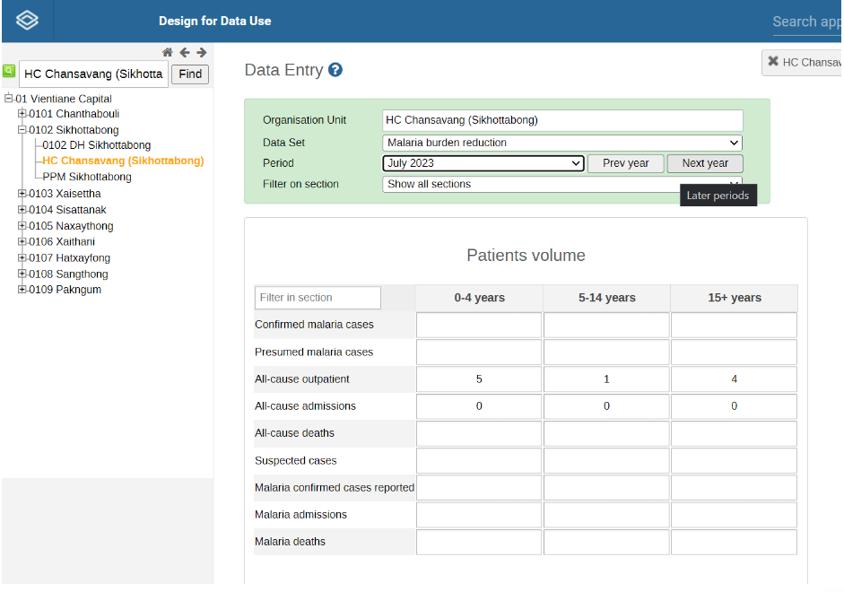

The user is fairly limited, with the ability to access data entry and add data for the malaria program as well as view the malaria dashboards. The user role gives access to these apps; but not necessarily the malaria program datasets. We will cover this more in the sharing session.

## Exercise 2 - Create a new user

### Create a new user and assign it to the aggregate data capture user role

Let’s go through the process of creating a new user and assign it the data entry role.

Navigate back to the user page and select the plus icon to add a new user

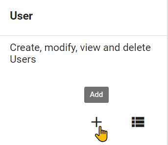

When you create a new user you can use 1 of 2 methods

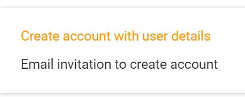

You can create the account directly with all of the user details
You can send an email invitation to create their account

Option 2 is often better in practice, as it allows for the user to create their own password directly, rather than you having to figure out how to share a password you have made for them, which may or may not get updated by the user.

For this first example however, let us create the account with user details.

The user creation screen is then split into the following sections:

1. Basic information
2. Contact details
3. User roles
4. Organisation unit access. This is divided into 3 subsections
   1. Data capture and maintenance 
   2. Data output and analysis 
   3. Search
5. User groups
6. Analytics dimension restrictions

We can then go through and review the sections and fields, starting with the basic information. This includes general details on the user itself

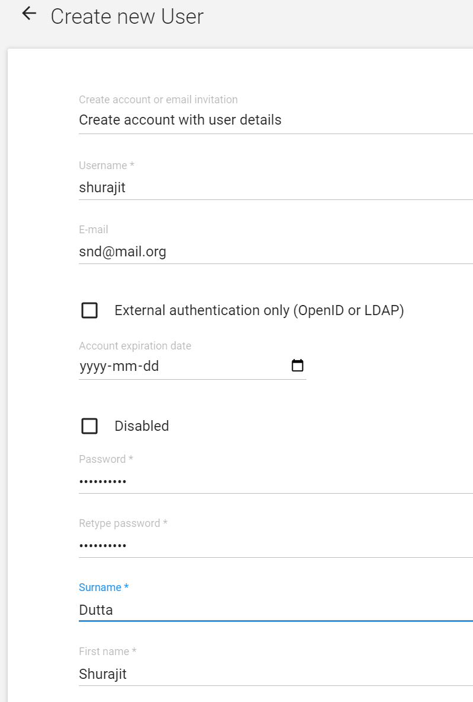

We can see why this method is slightly problematic, as you need to create a passsword for the user rather then having them create it themselves. You then need to find a secure way to share this password with the user you have made.

Next, we have the contact details. This can be useful to record if you have alternative contact details for the user being created.

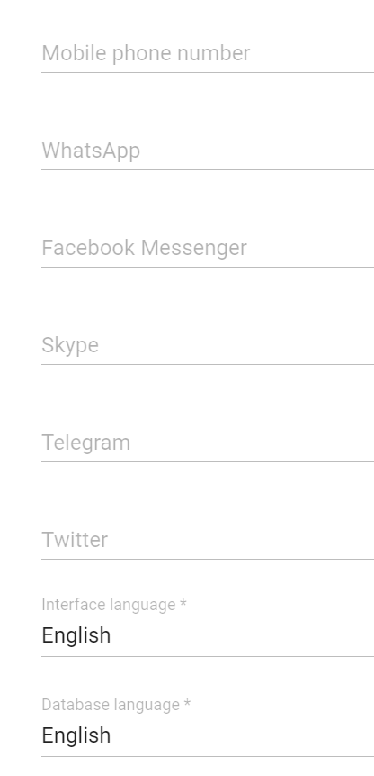

After this we can assign a user role to our user. Assign the user the role of "Data Entry"

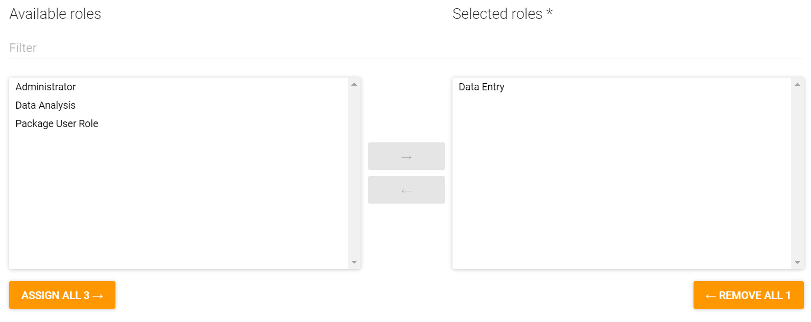

After the user role details, we have the Organisation unit access with 3 sections as follows
- Data capture OUs: Where the user can enter data (we can use Bird District)
- Data output OUs : Where the user can view data (we can use Bird District)
- Search OUs : Which orgunits the user can search for TEIs (this is superseded by the search across all OUs authority) -- this is only used for tracker and we will leave it for now

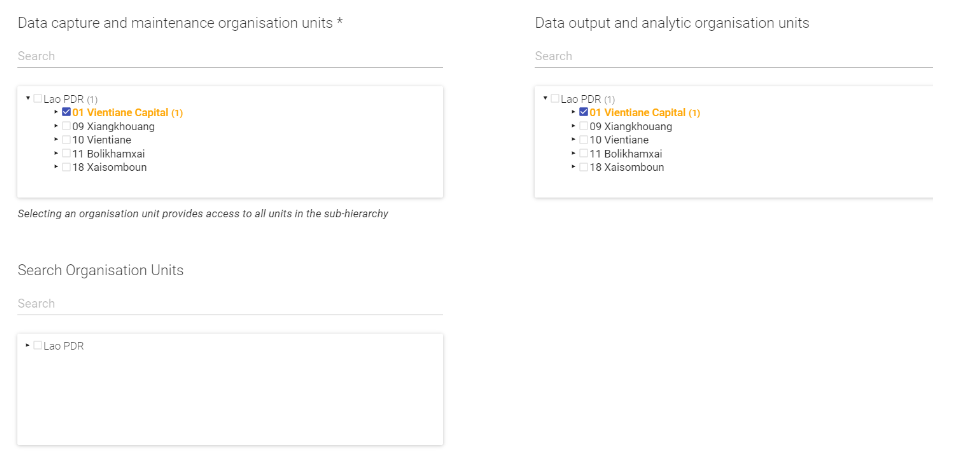

Under the search orgunit assignment, you will see the option “Maximum organisation unit level for data output.” This allows you to restrict a user to creating outputs up to a certain level if desired. For example, if I only wanted to allow a user to create district outputs and not regional or national outputs, I could place this restriction on the user. In normal cases, this will be blank however. 

Next, we see available user groups. Add this user to the malaria data capture and GEN access user groups for now. We will review user groups in more detail later on.

Lastly, we have Analytics dimension restrictions. We will not cover this in this academy.

Save this user when you are done. Using the details you made, you can also log in as the user and test the functionality to ensure they have the correct access.

## Exercise 3 - Create a new user role

### Create a new user role - Aggregate data analysis

Navigate to users and list out the user roles

Select the plus button to add a new user role.

Give the user role a name “your_initials_aggregate data analysis” and add a description like:

Allows a user to access aggregate data outputs via data visualizer, maps, reports, data,  dashboards and create public items to share with others from within these apps.

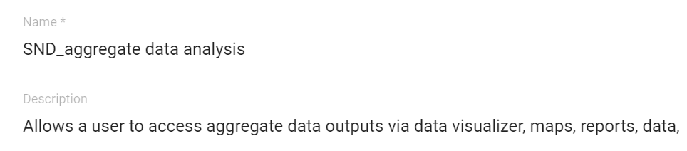

Let us now think through the permissions we want this role to grant.

1. They should be able to access the various analysis apps (dashboard, data quality, visualizer, mapsm, reports)
2. They should be able to add public reports from the analysis apps (ie. charts, maps, tables, that can be viewed by other users)

In order to provide a user with these authorities, we actually only need to use 2 sections

Metadata, to allow the creation of public objects
Apps, to give access to the analysis apps

We can start in the apps section and go from there as it is the most straightforward. We can grant them the following authorities

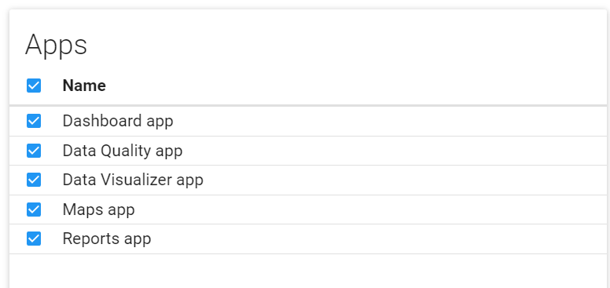

Next, let's look at the metadata section. You will notice that some of the authorities for reports are already selected, for example add/update private dashboard and delete dashboard. This is because by giving them access to the dashboard app, you also give them access to manage at least their own dashboards. 

To allow them to create public reports, we can modify the following authorities manually:

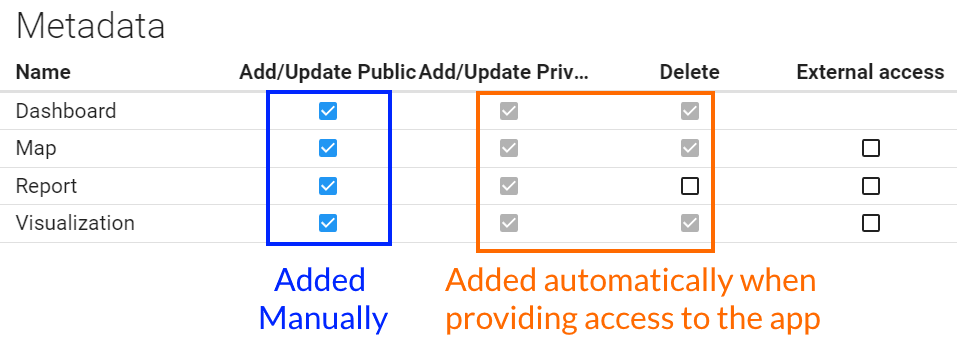

You can see we are just matching the apps we granted with the public reports we want them to be able to make.

We do not need any authorities from tracker, import-export or system. This will be true in most of the user roles that are not related to administration of the system when working with aggregate data.

We can now save this user role.

### Assign this user role to the user you previously created

Open the user you previously created and assigned the "data entry” user role to. Do not change any parameters, just assign them the tracker data analysis user role you just made.

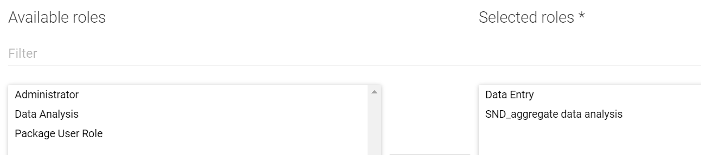

Save this change to the user.

### Login with the user you edited

You may want to clear your cache or try with incognito mode before logging in with this user.

After logging in, access the apps menu.

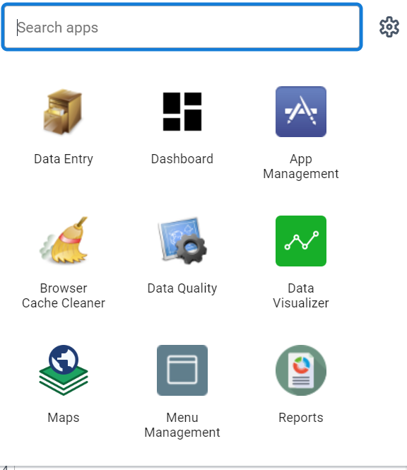

We can already see an immediate difference here in the apps they can access.

You can open a visualization from the dashboard to show they have this access

The user we are logged in with has two roles, and these roles give them distinct permissions. By creating roles this way, rather than creating a role for a user type, more flexibility is granted. For example, we could have a number of users that just have access to data analysis, but can not enter any data for. Same for data entry; or we can combine existing roles like we have done here.