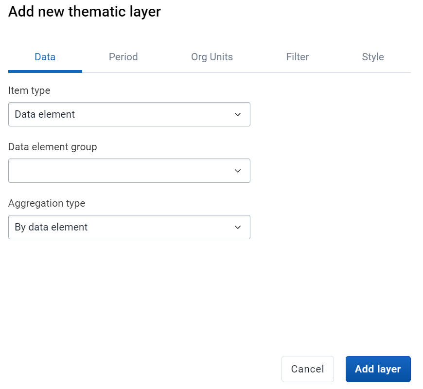
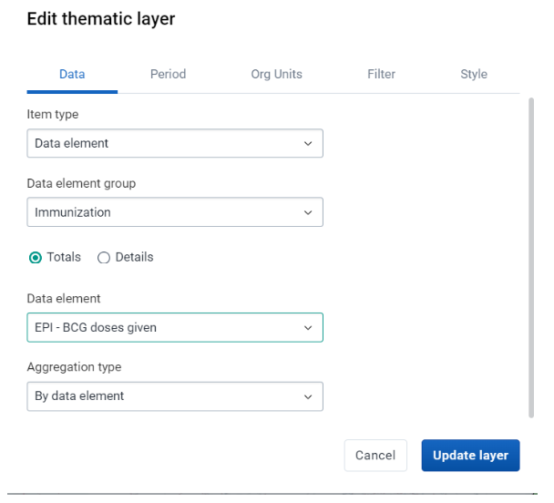
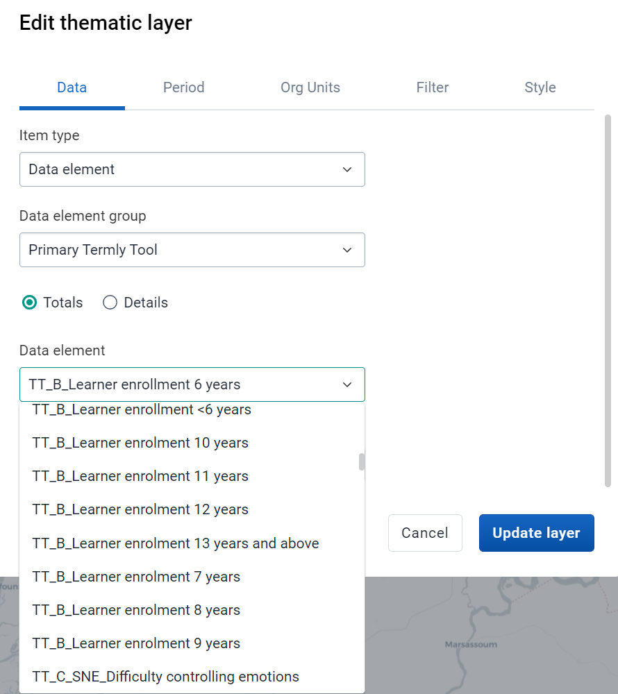
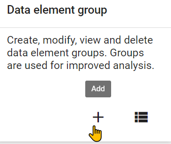
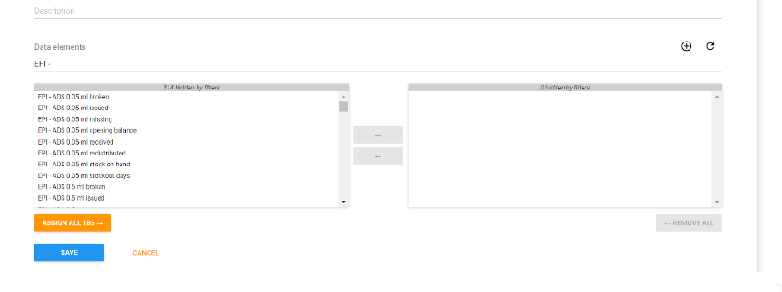
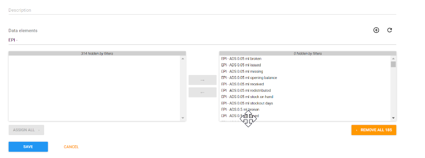

# Trainer’s Guide to Data Element Groups

## What is this guide?

This guide is a support document for DHIS2 Academy trainers for the session "Data Element Groups." This session follows the standard Academy training approach with 

1. a live demo session where the trainer demonstrate and explain the features, and 
   
2. a hands-­on session with exercises where participants get to practice the same features.

This guide will help the trainer​ prepare​​ for the live demo session. The “Live Demo step by step” section has a detailed walkthrough of all the steps to demonstrate with explanations and screenshots that should be easy to follow. Use that when preparing for the live demo session.

There is also a Quick Guide which lists the steps very briefly and this is meant as a lookup guide or “cheatsheet” WHILE doing the demo, to help the trainer remember all the steps and the flow of the demo.

## Learning objectives for this session

1. Describe why metadata is grouped in DHIS2
2. Identify when it is appropriate to group different items together
3. Define the terms in DHIS2 used to group items
4. See how data element groups are used in analysis
5. Create a data element group

## Time Requirements

- Live Demo: 
- Hands-on Exercises: 
- Assignment: 

## Background

## Preparations

## Best Practices

Before starting the demonstration, please keep in mind that the most important thing is that the audience is following, so make sure to ask questions to the audience to verify that they are following. If something is unclear, go back and go through it slowly. If you don’t have time for all the steps, it is better to cut some steps, than to go fast while nobody understands.

In an online setting, you will be breaking regularly to allow them to perform various ungraded exercises in order to keep them engaged.

In an in-person setting, the participants may be doing the demo with you at the same time. In this scenario, it is ideal if there are other trainer's moving around the room to support participant's as it will be difficult for the trainer leading the session to answer many individual questions during the demonstrations. 

## Quick Guide

1. Show how to use data element groups in maps
2. Discuss when more groups would be appropriate

STOP - Perform Exercise 1

3. Create a data element group in maintenance

STOP - Perform Exercise 2

## Live Demo step by step

### Review how data element groups can be used when analyzing data

Create a thematic map in the maps app.

The maps is is unique in that it does not allow you to select a data item unless it is within a group. 

This is due to the nature of maps app and not wanting it to be overwhelmed with a large request for all data items so it will continue to work in low bandwitdth settings.

In such a scenario, the only way to access your data elements and indicators is to place them within groups that allow you to more easily search for them.

While you can search for data elements and indicators that are not in any group in data visualizer, it is often not recommended. In fact, all of your data elements and indicators should be in groups.

Select data element as the data type along with the following inputs

- Data element group : Primary Termly Tool
- Data element : TT_B_Learner enrollment 6 years
- Aggregation type : by data element

This group is a bit large, with many data items located within it. As a suggestion, we could break this up into smaller groups so we could make it easier to find related data elements.

Discuss amongst the participants what some possible additonal groupings would be. 

For example:
- Learner enrolment
- Learner difficulty
- Reasons for leaving school
- Infrastructure (including water, lighting)

Etc.

Before updating the map modify these inputs

**Period**
- This year

**Org units**
- The Gambia

**Org units**
- The Gambia Districts

**Filter**
- School Term = Term 1

We can see in this case, while data element groups helps, and is even necessary in the maps map, there is some room for improvement that would help us refine our search parameters.

#### STOP - Perform Exercise 1

### Show how to manage DE Groups and DE Group Sets in Maintenance

Let us create a data element group for learner enrolment. 

Navigate to Maintenance -> Data Element

From here, we can add a data element group.

Creating a data element group is quite easy. Enter in the details for name, short name and code. Make sure you use your initials so it remains unique.

We also want to add our data elements to the group. Search for the data elements (in this case using learner enrolment) and assign all the data elements for learner enrolment to this particular group. 

After you do this, you can save the group. Note that, because you are not modifying any underlying data, these groups can be added and removed at any time.

#### STOP - Perform Exercise 2