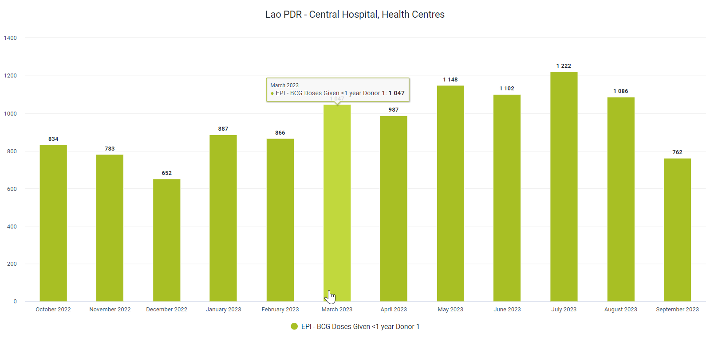

# Trainer’s Guide to Organisation Unit Groups and Group Sets

## What is this guide?

This guide is a support document for DHIS2 Academy trainers for the session "Organisation Unit Groups and Group Sets." This session follows the standard Academy training approach with 

1. a live demo session where the trainer demonstrate and explain the features, and 
   
2. a hands-­on session with exercises where participants get to practice the same features.

This guide will help the trainer​ prepare​​ for the live demo session. The “Live Demo step by step” section has a detailed walkthrough of all the steps to demonstrate with explanations and screenshots that should be easy to follow. Use that when preparing for the live demo session.

There is also a Quick Guide which lists the steps very briefly and this is meant as a lookup guide or “cheatsheet” WHILE doing the demo, to help the trainer remember all the steps and the flow of the demo.

## Learning objectives for this session

1. Review the concept of organisation units
2. Describe what organisation unit groups are
3. Describe what organisation unit group sets are
4. Use organisation unit groups in analysis apps
5. Use organisation unit group sets in analysis apps
6. Describe the limitations of creating organisation unit groups in maintenance
7. Retrieve organisation units via the API
8. Add organisation units to organisation unit groups via import/export
9. Configure organisation unit group sets in maintenance

## Time Requirements

- Live Demo: 
- Hands-on Exercises: 
- Assignment: 

## Background


## Preparations


## Best Practices

Before starting the demonstration, please keep in mind that the most important thing is that the audience is following, so make sure to ask questions to the audience to verify that they are following. If something is unclear, go back and go through it slowly. If you don’t have time for all the steps, it is better to cut some steps, than to go fast while nobody understands.

There are two potenital ways to conduct the session:

1. Break where it says stop and allow the participants to work through identified exercises
2. Allow the participants to follow along with you at the same time. In this scenario, it is ideal if there are other trainer's moving around the room to support participant's as it will be difficult for the trainer leading the session to answer many individual questions during the demonstrations. 

## Quick Guide

1. Review the presentation on organisation unit groups
2. Review how organisation unit groups and group sets can be used to visualize data
   1. Review and create the chart "EPI - BCG Doses Given < 1 Results, Last 12 months"

STOP - Perform Exercise 1

1. Show how to manage OU Groups and OU Group Sets in Maintenance
2. Review the process of creating OU Groups and Group Sets via the API
3. Retrieve the list of org units via the API

STOP - Perform Exercise 2

1. Create org unit groups via maintenance
2. Review the format of the orgunit group import file
3. Populate the orgunit group import file

STOP - Perform Exercise 3

1. Import the org unit groups into DHIS2 via the Import/Export app

STOP - Perform Exercise 4

1. Create the OU group set via maintenance

STOP - Perform Exerise 5

1. Explain the connection of data dimensions to analytics and use the created groups in visualizer

STOP - Perform Exercise 6

## Live Demo step by step

### Review the presentation on organisation unit groups

### Review how organisation unit groups and group sets can be used to visualize data

#### Review and create the chart "EPI - BCG Doses Given < 1 Results, Last 12 months"

You will start the session by recreating the following chart.


You can open this chart by navigating to data visualizer and opening the chart "EPI - BCG Doses Given < 1 Results, Last 12 months"

This chart has two organisation unit group sets that are being applied to it, located in the filter of the chart. In analysis, we can apply as many combination of data dimensions as required to create our intended input and organisation unit groups/group sets can help with this. 

They can also support the disaggregation of our data. 

Move the org unit group set "Type" from the filter to the category and update the chart.


We can now see the chart is disaggregated by the org unit groups within the group set "Type"

#### Create a new chart

To create a new chart select File - > New

Here are the inputs for the chart:

**Chart Type**
- Column

**Data**
- Data Type : Indicator 
- Indicator group: Immunization
- Indicator name: EPI - BCG Doses Given < 1 Results


**Period**
- Last 12 months

**Organisation unit**

When opening the org unit pane, explain that org unit groups can also be used to select relevant organisation units to include in your analysis. Using this option, we can not use the compound filtering options we observed in the first chart we were shown; however if you just want to quickly select a group of organisation units to use in analysis, this can be done. This is another reason why it is very useful to group your organisation units. Note that you can select multiple org unit groups in this selector.


As an example, you can select Central Hospital and District Hospitals as the org unit groups and update the chart.


Have a close look at the chart. ***The org unit groups are not added as data dimensions in this scenario*** so we can't disaggregate the data any further; however a filter is being applied to only show data from the org unit groups being shown. 

Clear the selection of any org unit groups selected here and just ensure Lao is selected as the org unit


Add in the org unit groups Central Hospital, District Hospitals, Health Centres and Provincial Hospital options from the type org unit group set data dimension


Alter the chart layout to look like the following


Then update the chart


Using the org unit group sets we have added, we can filter the chart further. As an example, we can remove some of the org unit types from the filter.


Update the chart and you will see the data is refined further



We can also use these dimensions to disaggregate our date in visualizations. Update the layout to the following


And update the visualization


From these examples, we can see there is a lot of flexibility introduced by using org unit groups and group sets in data analysis; and having them configured correctly will prove very useful.

#### STOP - Perform Exercise 1

### Show how to manage OU Groups and OU Group Sets in Maintenance

In order to create org unit groups and group sets in DHIS2, we can use the maintenance app. This should be a review for most participants.

The new aspect we will cover is the limitations. We can only manage up to 100 org units at a time when creating an org unit group. In most systems, this is not going to allow us to create the org unit groups that we would like to. 

Navigate to maintenance -> organisation unit and create a new organisation unit group. 

Try to create a group for all health centres using your initials as a prefix.


When you go to filter organisation units by name type in "HC." This will filter out health centres. You do not need to count manually, but the problem is ***it will only filter out 100 org units.*** This may not give us the result that we want, as we are not able to include all of the health centres we would want to in our org unit group. 

At this stage, maintenance is to limited to support us in the operation that we would like to perform unfortunately.

### Review the process of creating OU Groups and Group Sets via the API

Instead of creating the org unit group via maintenance, we are going to have to create the org unit group by importing it into DHIS2. In order to do this we will have to perform a couple of extra steps

1. We need to retrieve the org unit IDs of the org units we want to add to the org unit group. We will do this via the API.
2. We need to create a CSV file that shows the relationship between org units and the group we want to add them to
3. We can then import this into the DHIS2 instance

### Retrieve the list of org units via the API

Let us review with the group how to access the API very slowly. They should have watched two videos before attending the course, but there is always a chance they didn't!

Navigate to /api/resources and find the resource "Organisation Units" by searching for it


From here, we can see where the organisation units are located within the API


Copy this link and open it in your browser (the link may not be exactly the same; it will depend on where the instance URL is located during the academy)


Doing so will list all of the organisation units in the instance, seperated by a page break. 

Lets add a filter to get the organisation units that start with the prefix "HC" - short for health centre. We can do this by adding the following to the end our DHIS2 link:

```
/api/organisationUnits?filter=name:like:HC
```
This lists all the organisation units but it is still seperated by page. Let us turn the paging off

```
/api/organisationUnits?filter=name:like:HC&paging=false
```
We now have our list of org units showing the id and name. This is enough for our purposes as it is all we need for now.

You could explicitly define which properties you want to display as well, for example

```
/api/organisationUnits?filter=name:like:HC&fields=name,id,code&paging=false
```

This is optional for this demonstration.

Now what? We want to use these IDs to create an org unit group, so lets download the list. Some metadata can be downloaded as csv, which can be easier to work with in some cases. As we are constructing a csv file to import the org unit groups, this will come in very handy.

Download the list as a csv by using 

```
/api/organisationUnits.csv?filter=name:like:HC&paging=false
```
This will give us a csv file on our own computer with the id and name of the organisation units we have filtered via the API


#### STOP - Perform Exercise 2

### Create org unit groups via maintenance

Before we create the CSV file for import, lets create our org unit group. We are going to do this because, while we can import the org unit group seperately, it is a bit easier to have created the org unit group already before importing org units to it. Sometimes, a combination of using the maintenace app plus advanced operations can be helpful, as is the case here. 

Navigate to maintenance -> organisation unit and create a new organisation unit group. 

This time, create a group for all health centres using your initials as a prefix; however do not select any org units for the group yet. Save this group when you are done.


### Review the format of the orgunit group import file

Adding org units to an org unit group via a csv file is very simple. We just need a csv file with two columns:
- Column 1 : The ID of the org unit group you are importing to
- Column 2 : The ID of the org unit you are adding to the org unit group

Thats it! It will look something like this (you can retrieve examples files via the google drive for this academy)


See how the ID in the first column is repeated? That is because all the org units in column 2 are being imported to the same org unit group.

Open up Excel/Libreoffice/etc. to start creating the import file. It can look like this to start


Go to the csv file of the HC org units you downloaded via the API and copy all of the IDs you have retrieved into the second column. Paste this into the csv file you have created for importing the org unit groups.


Retrieve the ID of the org unit group by selecting the org unit group you made in maintenance and selecting show details.

 

A small box will appear where you can see the ID of the org unit group you have selected.


Copy this ID and place it into the first column of your spreadsheet and fill in the remaining cells within the column.


Make sure you save the file as a csv using the UTF-8 format.

#### STOP - Perform Exercise 3

### Import the org unit groups into DHIS2 via the Import/Export app

We can now import this file into DHIS2. Navigate to the import-export app then select metadata import from the side menu


Upload the file you have made by selecting "Upload file" and finding the file you have made. Then make the following changes


Make sure to provide a brief explanation as you select these options.

Perform a dry run and make sure everything looks ok.

If it does, import the file by selecting "start import." It should look like this if its all ok


Navigate to your org unit group set in maintenance and open it up. You should see that the org units have been assigned to the group


#### STOP - Perform Exercise 4

### Create the OU group set via maintenance

To finalize this process, you would normally have to create at least one more org unit group; however the steps you follow are the same as what we have shown now. Instead, we will use the org unit group you just made plus existing groups in order to create an ***org unit group set***. Within the group set, exclusivity is a key principle. This means an org unit should not belong to more then one org unit group within an org unit group set. Also, each of the org units in the entire system should be within one of the org unit groups belonging to the group set as well. This is so when we perform analysis with these org unit groups and group sets, we are not excluding org units from our totals.

Navigate to org unit group set and create a new one within maintenance (maintenance -> organisation unit -> add new org unit group set).

Add in the following groups, using the health centre group you created rather then the existing one.


Explain the fields as you create this org unit group. Save it when you are finished. 

#### STOP - Perform Excercise 5

### Explain the connection of data dimensions to analytics and use the created groups in visualizer

Note that in order to use this org unit group set in analysis, analytics will need to be run and "data dimension" should be ticked within the org unit group set. If this is not done, it can not be used as a dimension in analysis. Some caution should also be exercised not to have an overwhelming amount of dimensions for the user, as that will make it very hard for them to find what they need.

Make sure everyone created their org unit group before running analytics. Run analytics, then you can have them use the org unit groups and group sets to make a chart like our first example.

**Chart type**
- Stacked column

**Data**
- Data Type : Indicator 
- Indicator group: Immunization
- Indicator name: EPI - BCG Doses Given < 1 Results

**Period**
- Last 12 months

**Organisation unit**
- Lao PDR

**Organistion unit group set**
- the one you just made

You can now use your groups for selecting org units and your group sets as dimensions to disaggregate your data!


#### STOP - Perform Exercise 6