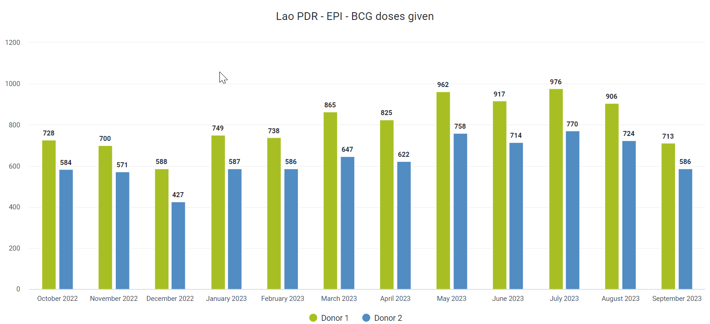
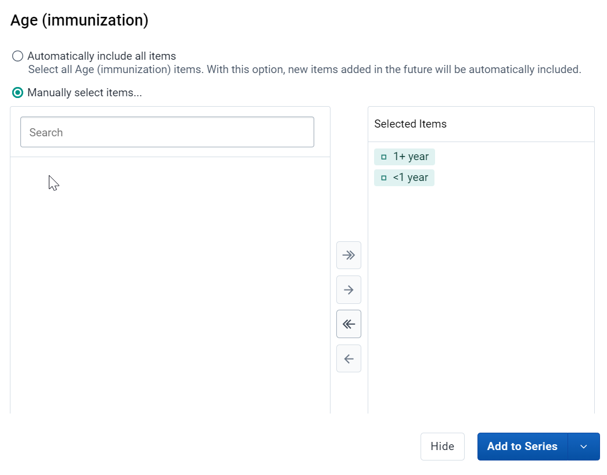
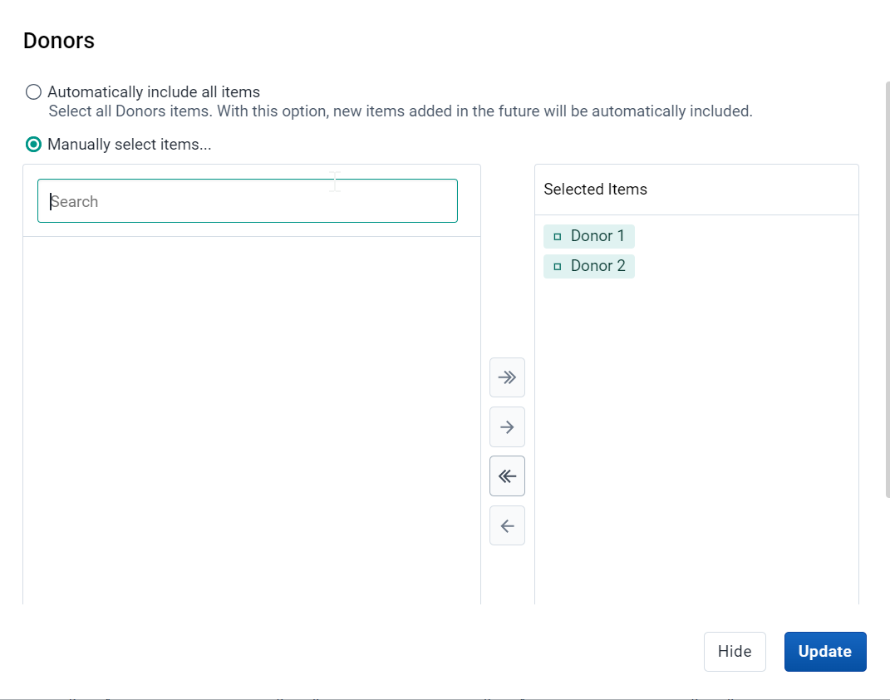
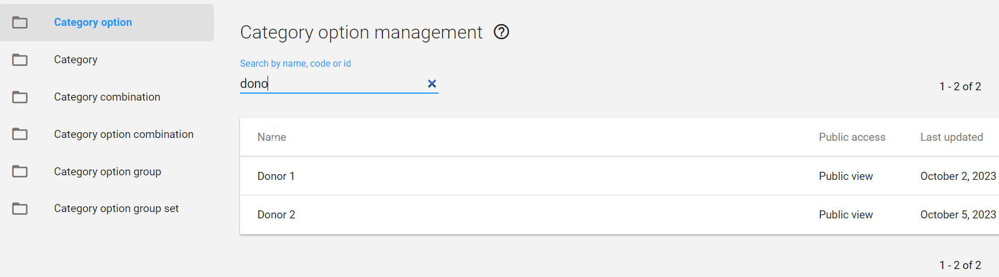
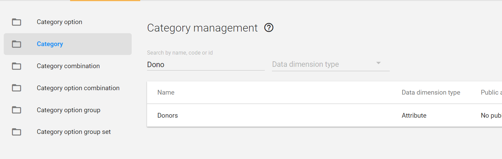
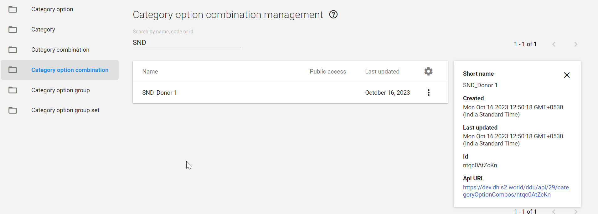

# Trainer’s Guide to the Attribute Model

## What is this guide?

This guide is a support document for DHIS2 Academy trainers for the session "Additional Dimensions : Attributes." This session follows the standard Academy training approach with 

1. a live demo session where the trainer demonstrate and explain the features, and 
   
2. a hands-­on session with exercises where participants get to practice the same features.

This guide will help the trainer​ prepare​​ for the live demo session. The “Live Demo step by step” section has a detailed walkthrough of all the steps to demonstrate with explanations and screenshots that should be easy to follow. Use that when preparing for the live demo session.

There is also a Quick Guide which lists the steps very briefly and this is meant as a lookup guide or “cheatsheet” WHILE doing the demo, to help the trainer remember all the steps and the flow of the demo.

## Learning objectives for this session

1. Describe what dataset attributes are
2. Use attributes in analysis apps
3. Configure attribute options, attribute categories, attribute category combos in maintenance

## Time Requirements

- Live Demo: 30 min
- Hands-on Exercises: 30 min
- Assignment: 30 min

## Background

## Preparations

## Best Practices

Before starting the demonstration, please keep in mind that the most important thing is that the audience is following, so make sure to ask questions to the audience to verify that they are following. If something is unclear, go back and go through it slowly. If you don’t have time for all the steps, it is better to cut some steps, than to go fast while nobody understands.

In an online setting, you will be breaking regularly to allow them to perform various ungraded exercises in order to keep them engaged.

In an in-person setting, the participants may be doing the demo with you at the same time. In this scenario, it is ideal if there are other trainer's moving around the room to support participant's as it will be difficult for the trainer leading the session to answer many individual questions during the demonstrations. 

## Quick Guide

1. Review the presentation Additional Dimensions - Attributes
2. Review a dataset in data entry that uses the attribute model (immunization)
3. Show how attribute categories can be used to visualize data
   1. Open the chart "EPI - BCG doses given by Donors" from the Immunization dashboard
   2. Create a new chart
      1. Chart type: column
      2. Data:
         1. Data Type : Data Element 
         2. Data Element group: Immunization
         3. Data Element Name: BCG doses given
         4. Attribute: Donors
      3. Period: This year
      4. Org unit: Lao

STOP - Perform Exercise 1

1. Show how to manage category options in maintenance
2. Create the options for Donor 1 and Donor 2

STOP - Perform Exercise 2

1. Show how to manage categories in maintenance
2. Create the attribute category Donors

STOP - Perform Exercise 3

1. Show how to manage attribute category combinations in maintenance
2. Create the attribute category combination Donors

STOP - Perform Exercise 4

1. Review where you apply these attribute category combos when creating a dataset

## Live Demo step by step

### Review the presentation Additional Dimensions - Attributes

[Link](https://docs.google.com/presentation/d/13CD4rhpDIC5XayY8mhELpcfNfEayYV4p/edit?usp=sharing&ouid=104677221247573000314&rtpof=true&sd=true)

### Review a dataset in data entry that uses the attribute model

There is a dataset one can view : Immunization is located at the facility level in the Lao hierarchy.

Select either one (or both) to review in data entry focusing on the use of attribute categories to disaggregate the data set.

### Show how attribute categories can be used to visualize data

Open the chart "EPI - BCG doses given by Donors" from the Immunization dashboard

This chart has two categories being used to disaggregate the data. 

Attribute category : Donors! We can see Donor 1, Donor 2.

We can add in additional dimensions as items or filters to our chart. 

As an example, we can select the disaggregate category "Age" and select some classes to filter our data further

Place the age dimension in the series and Donors in Filter and update the data. 

You will see this effects the output of the data we are now showing.

Note you can do this for any type of data set disaggregated using attribute categories.

#### Create a new chart

To create a new chart select File - > New

Here are the inputs for the chart:

**Chart Type**
- Column

**Data**
- Data Type : Indicators 
- Indicator group: Immunization
- Indicator Name: EPI - BCG doses given

**Period**
- 2021, 2022, 2023

**Organisation unit**
- Lao PDR

We now want to add in the Donor and Age data dimensions to the chart. We can note now that the attribute category "Donor" is not treated differently from any other available data dimension when we look at the side panel. There is no distinction to seperate it from other categories or org unit group sets either as the attribute category dimension can be used the same as the other ones that are available. As long as the data we are reviewing is disaggregated according to said dimension, it can be used to disaggregate and filter our data.

Add in the categories for Donor

and Age (Immunization)

Modify the layout and update the chart

You will see the disaggregations (categories) have now been applied.

#### STOP - Perform Exercise 1

### Show how to manage category options in maintenance

In our example, let us create the category options that we had used to disaggregate our Immunization data set. This consists only of Donor 1 and Donor 2. 

Navigate to maintenance -> Category -> Category Option

From this screen, the first thing you want to do is search for the category option you are creating. 

If I type in "Donor" as a category option, I will see that this already exists. Under normal circumstances, you would stop here. Never create a duplicate category option when it already exists. 

In this scenario, we want to go through the process of the attribute category model from start to finish; so we will create this category option for demonstration purposes only.

Create a new category option by selecting the plus icon.

Use your initals as a prefix and create the category option Donor 1

You can discuss the fields as you fill them in. Save the category option when you are finished.

Repeat this process to create the category options for Donor 2.

So far, nothing is actually different then when we create disaggregate category options.

#### STOP - Perform Exercise 2

### Show how to manage categories in maintenance

We want to create one category

- Donors

Navigate to maintenance -> Category -> Category

From this screen, the first thing you want to do is search for the category you are creating.

We will see Donors listed already. Under normal circumstances, you would stop here. Never create a duplicate categories when they already exist. 

In this scenario, we want to go through the process of the attribute category model from start to finish; so we will create these attribute categories for demonstration purposes only.

Create a new category by selecting the plus icon.

Use your initals as a prefix and create the category for Donors. Make sure you use the category options that you have created (intials_Donors) 

You can discuss the fields as you fill them in. In particular, make sure to review the data dimension type. This time, we will be using attribute. This is because this category is being applied to a data set, not a data element.

Also, explain that the data dimension tick box allows the category to show up on the left side menu in analysis apps. 

Ensure you use the category options that you made with your initials to create this new attribute category.

#### STOP - Perform Exercise 3

### Show how to manage attribute category combinations in maintenance

We want to create one attribute category combination

- Donors

Navigate to maintenance -> Category -> Category combination

From this screen, the first thing you want to do is search for the category you are creating.

The category combination already exists

In this scenario, we want to go through the process of the attribute category model from start to finish; so we will create this category combination for demonstration purposes only.

Create a new category combination by selecting the plus icon.

Use your initals as a prefix and create the category combination for for Donors. Make sure you use the categories that you have created (initials_Donors)

You can discuss the fields as you fill them in. In particular, make sure to review the data dimension type. We will use attribute once again. Interestingly, when you select attribute as the data dimension type, you will only be able to select from attribute categories to create your attribute category combination.

#### STOP - Perform Exercise 4

### Check the category option combinations 

We have succesfully created our category combination. It is now time to check if the category option combinations have been created. Based on what we made, we should have a total of 2 category option combinations

- Donor 1
- Donor 2

To check this,

Navigate to maintenance -> Category -> Category option combination

Search for your category combination, hit the action button followed by show details

Now that you have verified it has been created correctly, you can use the attribute category combination to disaggregate the data sets that you need.

> Note : the process to check if this has been generated correctly is the EXACT SAME as what was done for disaggregate category option combinations. This is because the underlying data model is also identical. The only difference is the classification (attribute) and that is now used to disaggregate a data set instead of a data element. 

#### STOP - Perform Exercise 5

### Review where you apply these attribute category combos when creating a dataset

Navigate to Maintenance -> Data Set and list the data sets. Search for the immunization data set. 

After opening these datasets, navigate to the category combination field. It is usually marked as "None" when there is no attribute category combination applied. In these cases however, you will see the attribute category combination that is required has been applied to the data sets in question.

