# Trainer’s Guide to Dashboards

## What is this guide?

This guide is a support document for DHIS2 Academy trainers for the session "Dashboards" This session follows the standard Academy training approach with 

1. a live demo session where the trainer demonstrate and explain the features, and 
   
2. a hands-­on session with exercises where participants get to practice the same features.

This guide will help the trainer​ prepare​​ for the live demo session. The “Live Demo step by step” section has a detailed walkthrough of all the steps to demonstrate with explanations and screenshots that should be easy to follow. Use that when preparing for the live demo session.

There is also a Quick Guide which lists the steps very briefly and this is meant as a lookup guide or “cheatsheet” WHILE doing the demo, to help the trainer remember all the steps and the flow of the demo.

## Learning objectives for this session

1. Describe how to navigate the dashboard
2. Demonstrate how to create and manage a dashboard
3. Demonstrate how to add previously created tables, charts and maps to the dashboard
4. Describe the concept of user org units as it applies to saved items in more detail
5. Describe how to share dashboards, with an emphasis on how user org units can supplement sharing

   
## Time Requirements

- Live Demo: 
- Hands-on Exercises: 
- Assignment: 

## Background

## Preparations

## Best Practices

## Quick Guide

1.
Review the recap slide
Have them perform the assignment

## Live Demo step by step

### Using Dashboards

#### Explain the dashboard interface

We can use the “HIV national” dashboard to explain the dashboard interface. Participants will be familiar with the dashboard by now as this was discussed in the initial overview demo and they have seen it every time they log in at this stage, so you may not need to spend a lot of time here. 

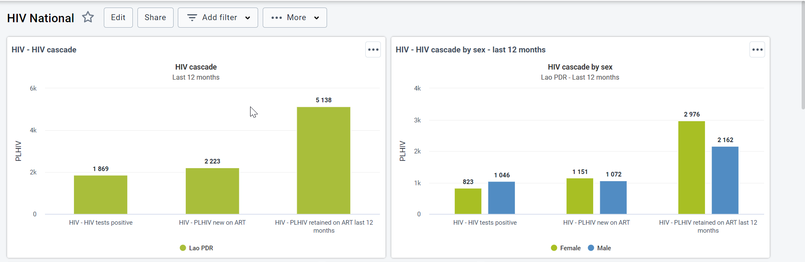

The top of the dashboard has the various dashboards the user has access to along with the search bar. Dashboards that have been “starred” appear first in the list of dashboards. You can ‘star’ the dashboard by using the star icon next to the name of the dashboard. You can also click on the “info” button to see a description of the dashboard. 

The “more” button allows you to access several additional features, such as viewing the description and printing the dashboard.

You can use the search bar to find particular dashboards. You can also expand the list of dashboards by using the “Show More” button or dragging the bar to be wider and include more dashboard items.  

#### Use the filter

Within the dashboard interface, we can decide which level of data we are seeing by using the filter. In the HIV National Dashboard, at the moment, all of the outputs are displaying data for for Lao. Select “Add filter” and “Organisation Unit” to apply an org unit filter. Select a province within the org unit filter and update the dashboard.

All of the outputs will be updated to use the filter that you have applied. You will also see a message at the top of the dashboard showing the filter you have applied.

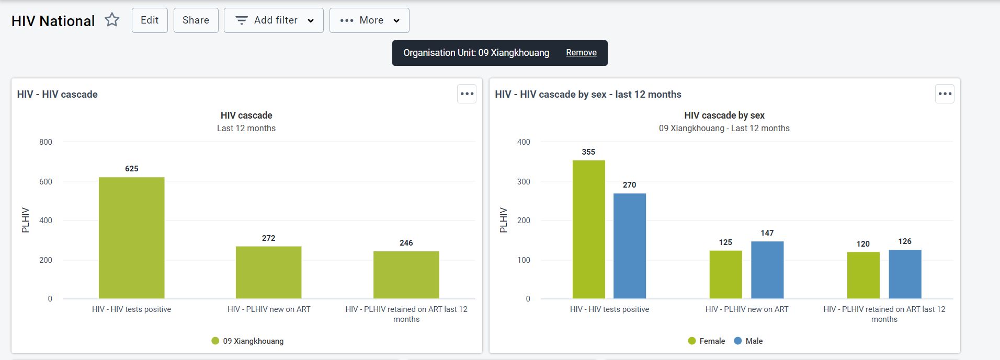

We can add other filters to the dashboard as well. This includes a period or data dimension. This feature is very useful as it filters all of the items on the dashboard at once. For example, you could also add a filter for the period, only viewing the a specific month of data.

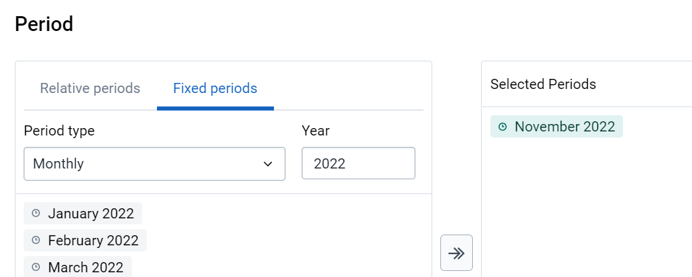

This will update all of the items on the dashboard to include data from the options you have filtered out only.

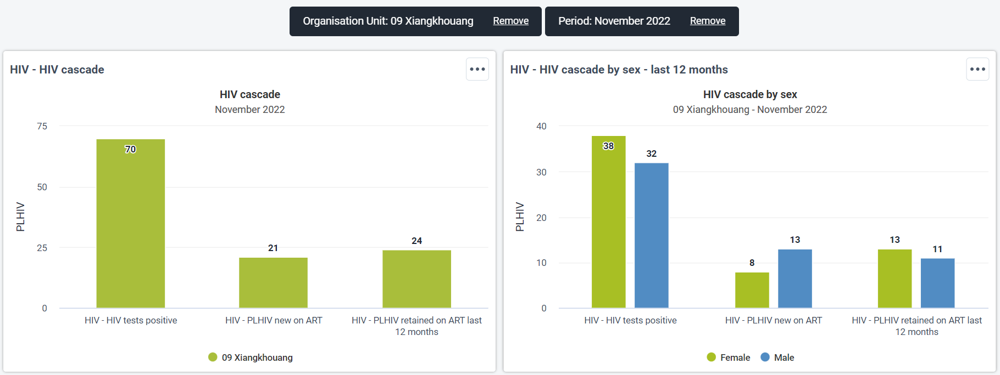

You can remove these filters by clicking on the “Remove” text next to the filter on the top of the dashboard.

#### Discuss how descriptions and interpretations are added to the dashboard

Select the chart HIV - HIV Cascade from the HIV National dashboard. When we save an item, we are asked for a description. This description appears in the panel within each app and can also appear within the dashboard item. It is recommended that all outputs have a description attached to them. 

To show the description, select the menu icon for the dashboard item followed by “Show interpretations and details.”

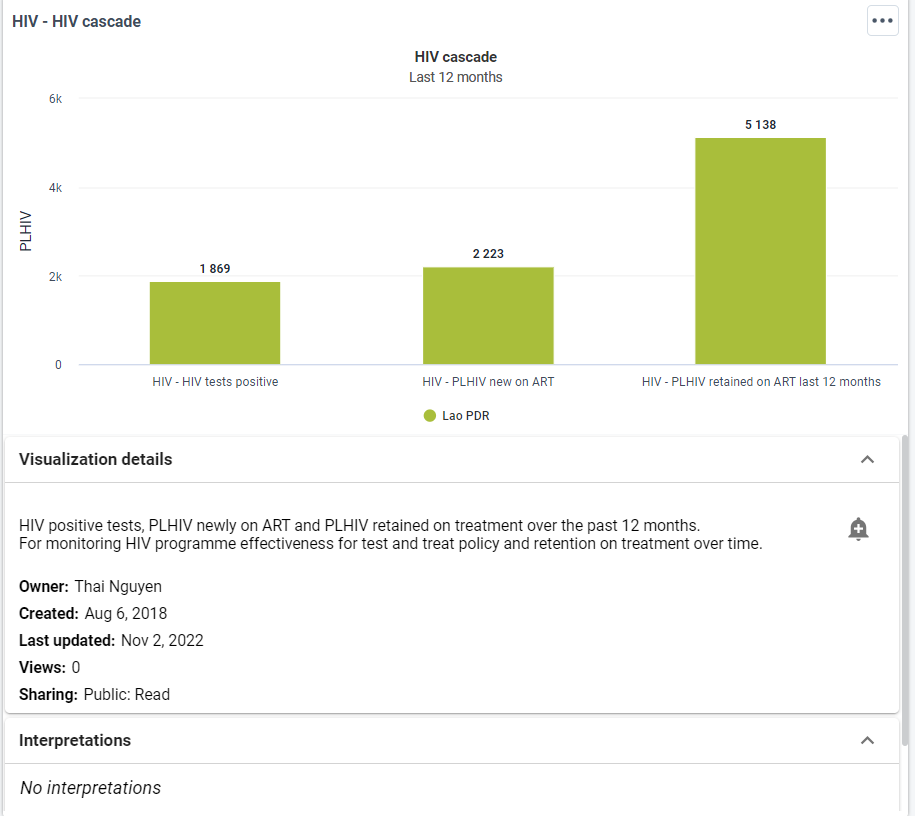

You can also add interpretations directly on the dashboard. When making these interpretations, you can directly tag individuals in your comment. They will receive a notification in the messages app and e-mail if it is configured. 

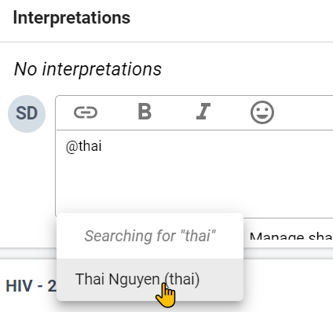

#### Review the interactivity of dashboard items

Dashboard items are meant to be interactive. This is true of charts, maps, and tables. De-select the male disaggregation on the chart HIV - HIV cascade by sex - last 12 months chart. This will cause those items to disappear. You can add it back in before proceeding. Hovering over items in the chart will also show a small description of the chart item.

Tables allow you to sort them within the dashboard. You can do this by selecting a column heading within a table.

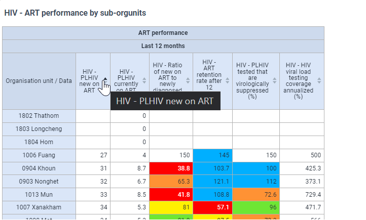

While maps allow you to show the legend, hover over thematic layers to see a more detailed description of the item you are reviewing

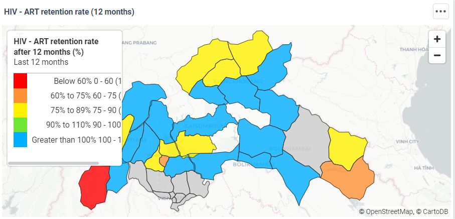

Note that all items (maps, tables, charts) can now be viewed in full screen by using the menu option. This may be useful if you want to focus on a specific dashboard item. You can do this by selecting the “View fullscreen” option in the menu for a dashboard item.

Dashboard items also allow for you to change between different output types. View the chart HIV - HIV cascade by sex - last 12 months. You can change it to a table as an example.

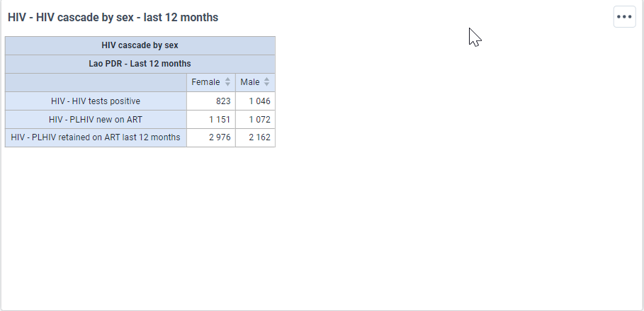

#### Printing Dashboards

From version 2.35 onwards DHIS2 supports printing of dashboards. 
To perform this click on the ‘More’ button at the top of the dashboard next to the ‘Add filter’ button. 

In the sub-menu that appears we have 2 options.

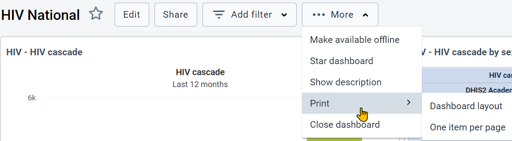

- Dashboard layout - will print in the same layout as it appears in the DHIS2 dashboard (eg: can have more than one dashboard item per row)
- One item per page - will print only one dashboard item per page and that item will occupy the entire page

Once you click on either of the options above, a print preview window will open. The following points are recommended for best print results.
- Use Chrome, Firefox or Edge web browser
- Wait for all dashboard items to load before printing
- Use A4 landscape paper size and default margin settings in the browser print dialog

You will see a preview of the dashboard print out after selecting one of the print options

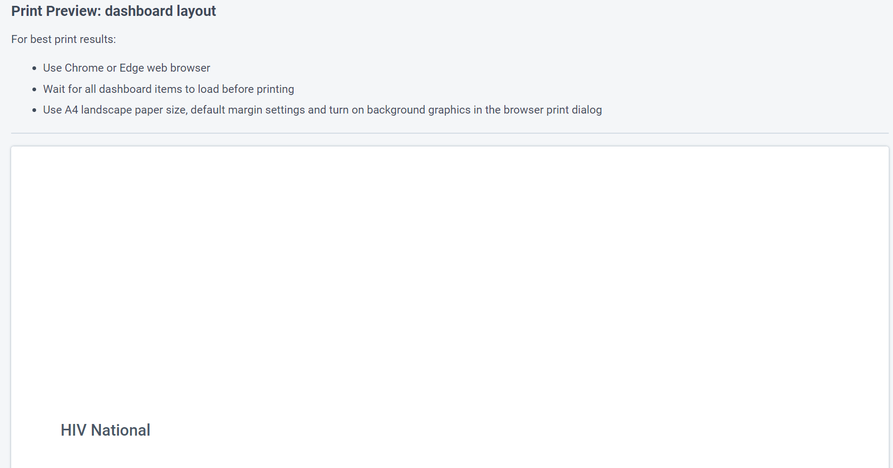

Once all the dashboard items are finished loading, click on the ‘Print’ button on the right top corner.

In the next window, select the printer you want as the ‘Destination’ and click on the ‘Print’ button on the bottom of the window. Note that this means you can also print to PDF if you would like.

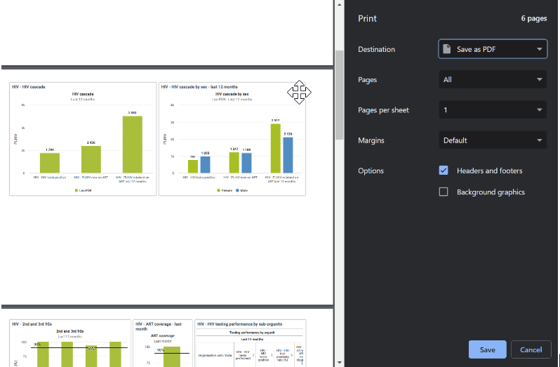

#### Accessing Dashboards from a Mobile Device

From 2.36, dashboards can be accessed via a mobile device without any additional customization requirements. You can just log in via your mobile device using a mobile browser and the dashboard will adjust its layout to fit the items accordingly. Both portrait and landscape orientations are supported. 

#### Making dashboards available offline

Dashboard can be made available to work offline. They will be stored in cache. As long as the person does not log out of DHIS2 while online/offline, they will be able to access the offline dashboard. You will not be able to demonstrate this fully, as if you turn your internet connection off you will disconnect from the demo.

To save a dashboard offline select More -> Make available offline

The dashboard will download to your cache and you will see an indicator beside the name of the saved dashboard.

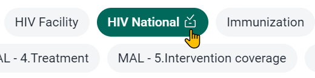

Now, if you go offline, you will be able to access this dashboard as long as you do not log out of DHIS2. You can even close the tab/browser as long as you have saved the link to access it next time. 

If you no longer want the dashboard stored offline, you can turn this off via the menu

#### STOP - Perform Exercise 1

### Creating Dashboards

#### Create a new dashboard

#### Discuss the filter settings

#### STOP - Perform Exercise 2

### Re-Using Dashboards Across Many Users

#### Review user org units

#### Discuss sharing

#### STOP - Perform Exercise 3