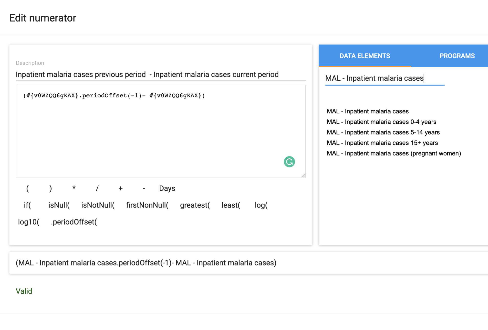

# Trainer’s Guide to Indicators

## What is this guide?

This guide is a support document for DHIS2 Academy trainers for the session "Indicators". This session follows the standard Academy training approach with 

1. a live demo session where the trainer demonstrate and explain the features, and 
   
2. a hands-­on session with exercises where participants get to practice the same features.

This guide will help the trainer​ prepare​​ for the live demo session. The “Live Demo step by step” section has a detailed walkthrough of all the steps to demonstrate with explanations and screenshots that should be easy to follow. Use that when preparing for the live demo session.

There is also a Quick Guide which lists the steps very briefly and this is meant as a lookup guide or “cheatsheet” WHILE doing the demo, to help the trainer remember all the steps and the flow of the demo.

## Learning objectives for this session

1. Define indicators in DHIS2
2. Create outputs using indicators and indicator groups
3. Create indicators in the maintenance app
4. Create indicator groups and group sets in the maintenance app
5. Describe the relationship between indicators and analytics
   
## Time Requirements

- Live Demo: 
- Hands-on Exercises: 
- Assignment: 

## Background

## Preparations

## Best Practices

## Quick Guide

1. Review the indicators presentation
2. Review the different types of indicators via the analysis apps
   
   1. Review the chart "EPI - Routine coverage (%), this year
   2. Review the chart BCG coverage (%), this year
   4. Create a new chart using indicator groups
      1. Chart Type: Year over year (line)
      2. Data Type : Indicators 
      3. Indicator group: Immunization - coverages
         1. Review the indicator group selection
      4. Indicator Name: OPV3 Coverage
      5. Organisation unit: Lao
      6. Series: This year, last 5 years
      7. Category: Months per year

STOP - Perform Exercise 1

1. Show how to create indicators in maintenance
   1. Create an indicator type
   2. Create a new indicator

STOP - Perform Exercise 2

1. Create an indicator using an attribute
   1. Search for the category option combination ID
   2. Place the ID in your numerator

STOP - Perform Exercise 3

1. Review the process of creating indicator groups
2. Explain connection of indicators to analytics and use the created indicators and indicator groups in visualizer

STOP - Perform Exercise 4

## Live Demo step by step

### Review the indicators presentation

### Review the different types of indicators via the analysis apps

#### Review the chart "EPI - Routine coverage (%), this year"

This chart shows us coverage rates, but applies the principles of annualisation. Numerators for the indicators on display are taken from data entered in DHIS2 on a monthly basis, however the denominators are yearly population estimates. In this scenario, the numerator is being multipled by a factor of 12 such that the annualised output can be displayed month-to-month. 

#### Review the chart BCG coverage (%), this year

This is annualised as we have discussed, but the numerator for this indicator is actually using the attribute category for results directly in its formula.

Remember, the immunization data is divided into Donor 1 and Donor 2 (you can review in data entry again if needed); so if we make an indicator and do not include our attribute category in our numerator, the indicator is going to give us a value including the Donor 1 + Donor 2; which would give us an incorrect value.

#### Create a new chart using indicator groups

We have already used indicator groups before to make an output using indicators. It is very useful to have this on hand so we can filter our indicators when we are searching for items. After we make our indicators, it is good practice that we place them in groups so we can find them more easily.

Create a new chart by selecting File -> New

**Chart Type**
- Year over year (line)

**Data**
- Data Type : Indicators 
- Indicator group: Immunization - coverages
- Indicator Name: OPV3 Coverage

It is a lot easier selecting our items from such lists then navigating all data items, particularly if we are not familiar with the data collection or system set up in detail.

**Organisation unit**
- Lao

**Series**
- This year, last 5 years

**Category**
- Months per year

#### STOP - Perform Exercise 1

### Show how to create indicators in maintenance

Navigate to Maintenance -> Indicators

You will be provided with a list of 6 modules
- Indicator: Used for creating the indicator itself
- Indicator type: For creating the multiplying factor
- Indicator group: For creating groups for indicators with similar characteristics
- Indicator group set: For creating groups of indicator groups

Program indicators and program indicator groups are for tracker and will not be covered here.

In this example, let us create an indicator for EPI - BCG coverage (%). The formula for this indicator is EPI - BCG doses given <1 year/Live births * 100%. This information is taken from Immunization form section : Vaccine administration children.

#### Create an indicator type

In order to create this indicator, we will need to make sure the factor of 100 is already there. If we navigate to factor, we will see that it is already there so we do not need to create (it is labeled as percentage with a factor of 100).

If we needed to create an indicator type, the process is very simple. Select the plus button to create the new indicator type then give it a name and factor. 

#### Create a new indicator

Now that we checked (or created) our indicator type, it is time to create our indicator. Navigate to the indicator in the maintenance app. This indicator (EPI - BCG Coverage %) is already available but we are going to create it for the sake of demonstration.

Select the plus sign to create the indicator.

Give the indicator a name, short name, code and description. Here is the description

Numerator: BCG doses given <1 yr Usually captured monthly

Denominator: Live births Usually captured annually; alternative denominators may include 'live births' reported routinely from health facilities and/or community sources

Also, use the Percentage indicator type, since we will be multiplying this indicator by a factor of 100.

Scroll down to edit the numerator and denominator of the indicator

First the numerator

Search for BCG doses given < 1 yr

Then the denominator

Search for GEN - PopulationLive Births. 

With this information selected, save the indicator. Note to the participants that you won't be able to use the indicator until the analytics process is run.

#### STOP - Perform Exercise 2

### Create an indicator using an attribute

Next, let us create the indicator for BCG doses given <1 Donor 1 (%). This indicator has a couple unique propoerties

1. It's annualized
2. It uses an attribute category (Donor 1) in its numerator

The formula for this indicator is 

- Numerator : BCG doses given < 1 Donor 1
- Denominator : Total BCG doses
- Factor/Indicator Type : Percentage (x100)

Navigate back to Maintenance -> Indicator and create a new indicator. 

Give the indicator a name, short name, code and description. Here is the description

The estimated % of children < 1 Donor 1 that have been given a BCG vaccination

This indicator should be annualized so it can calculate monthly coverages using yearly population totals. Make sure this item is selected.

Also, use the Percentage indicator type, since we will be multiplying this indicator by a factor of 100.

Scroll down to edit the numerator and denominator of the indicator

First the numerator

Search for EPI - BCG doses given <1 year.

Do you see an issue with this at ths point in time? 

The immunization data set is seperated into Donor 1 and Donor 2. If we take the total for this data element without seperating it by these attribute categories, we will get the wrong value. We need to add in the attribute category to our numerator; but there is no option to review the attribute categories when we are editing the indicator! 

We can add this into our formula but it is a bit of a hidden feature. We need to find the id of the attribute category option combination, then we can add it into our indicator. 

#### Search for the category option combination ID

***In a new tab (do not close the indicator tab)*** navigate to Maintenance -> Category option combination, and search for results, select the action button and show details

You should be able to retrive the ID of this item. Copy the ID and head back to your indicator tab.

You now need to add the attribute category option combination to your numerator formula.

Do this by adding a period after the disaggregate category combination id followed by the ID of the attribute category option combination. 

You will see that the description at the bottom now shows "Donor 1" as it has recognized this ID in your formula.

Save the numerator.

Then edit the denominator

Search for EPI - BCG doses given and add this to your denominator. 

With this information selected, save the indicator. Note to the participants that you won't be able to use the indicator until the analytics process is run.

#### STOP - Perform Exercise 3

### Working with logical expressions

Create the indicator “MAL - Inpatient cases decline(%).” This is already available but we are going to create it for the sake of practice.

Select the plus sign to create the indicator.

Give the indicator a name, short name, code and description. Here is the description

“Decline in inpatient malaria cases expressed as “cases reported in the previous period minus cases reported in the current period divided by cases reported in the previous period” within a given period”

Also, use the Percentage indicator type, since we will be multiplying this indicator by a factor of 100.

Scroll down to edit the numerator and denominator of the indicator

First the numerator

The numerator description should be “Inpatient malaria cases previous period - Inpatient malaria cases current period”

Search for “MAL - Inpatient malaria cases”, select the total without the category option Combinations, click the .periodOffset( and append to the data element expression with a factor of -1. This will be the expression for “Inpatient malaria cases previous period”. 

Add a minus sign after the expression and again search for “MAL - Inpatient malaria cases”, select the total without the category option Combinations, don’t add the periodOffset

Then the denominator

The denominator description should be “Inpatient malaria cases previous period”

Search for “MAL - Inpatient malaria cases”, select the total without the category option Combinations, click the .periodOffset and append to the data element expression with a factor of -1. This will be the expression for “Inpatient malaria cases previous period”. 

With this information selected, save the indicator. Note that you won't be able to use the indicator until the analytics process is run.

#### STOP - Perform Exercise 4

### Review the process of creating indicator groups

Navigate to Maintenance -> Indicator -> Indicator group

1. Click the add button.
2. Type in name of the indicator group
3. Select and assign all required indicators
4. Select the save button

Now that the indicator group has been created, users can now easily retrieve a list of assigned indicators to the above group just by selecting the group rather than going through the entire list of indicators to look for the specific indicators.

### Explain connection of indicators to analytics and use the created indicators and indicator groups in visualizer

In the background, off screen, run analytics. 

Then you can go to data visualizer or maps and test the indicators you have created.

#### STOP - Perform Exercise 5

