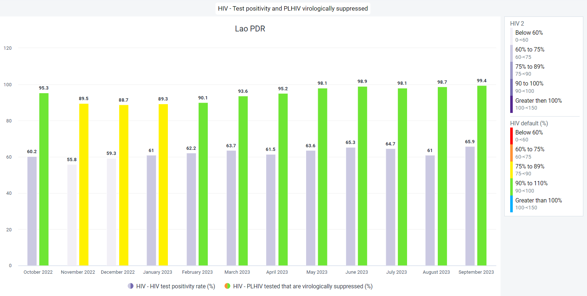
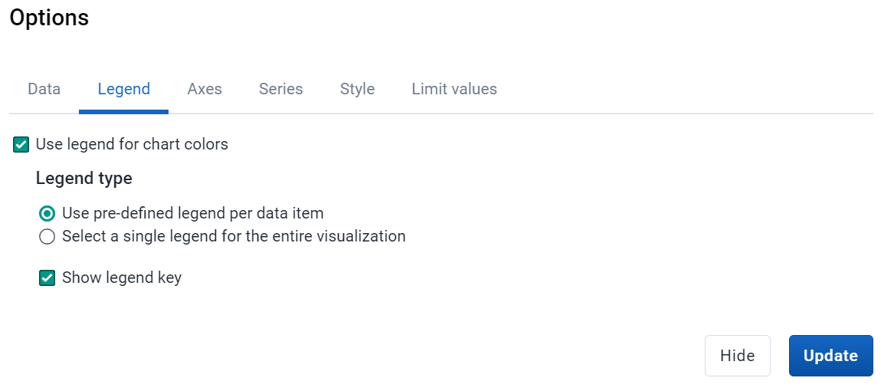
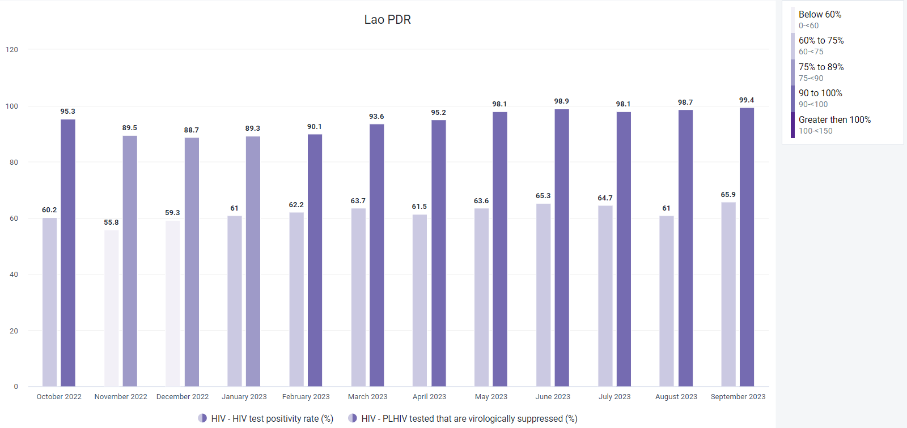
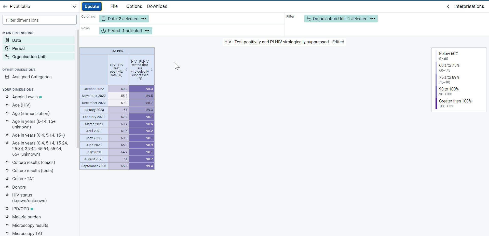
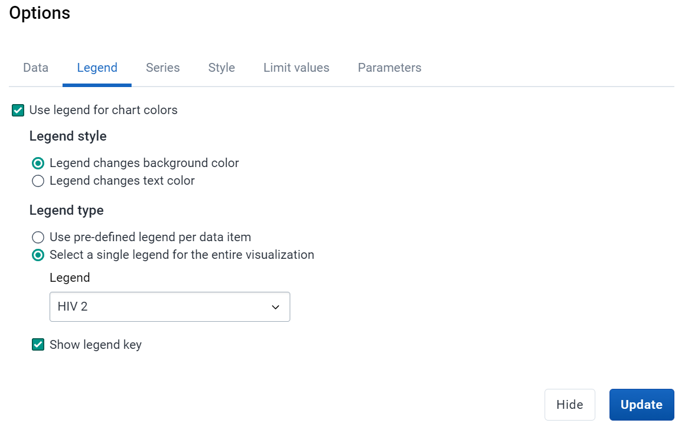
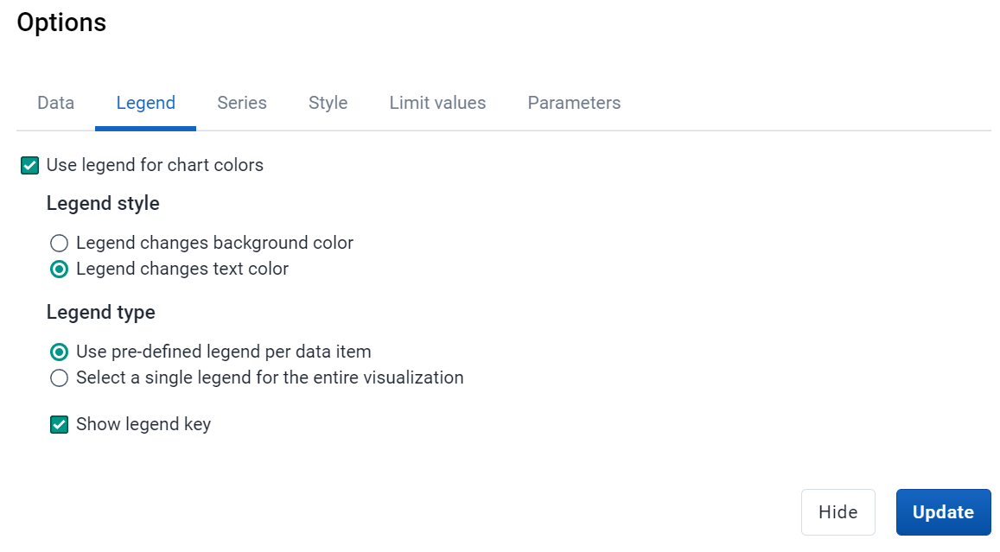
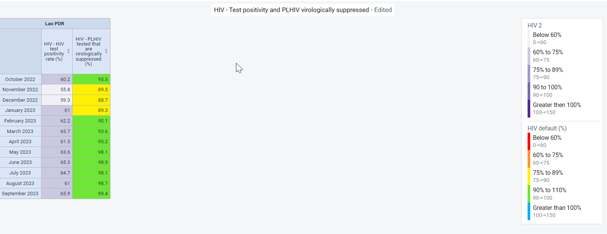

# Trainer’s Guide to Legends

## What is this guide?

This guide is a support document for DHIS2 Academy trainers for the session "Legends" This session follows the standard Academy training approach with 

1. a live demo session where the trainer demonstrate and explain the features, and 
   
2. a hands-­on session with exercises where participants get to practice the same features.

This guide will help the trainer​ prepare​​ for the live demo session. The “Live Demo step by step” section has a detailed walkthrough of all the steps to demonstrate with explanations and screenshots that should be easy to follow. Use that when preparing for the live demo session.

There is also a Quick Guide which lists the steps very briefly and this is meant as a lookup guide or “cheatsheet” WHILE doing the demo, to help the trainer remember all the steps and the flow of the demo.

## Learning objectives for this session

1. Describe what legends are
2. Use legends in analysis apps
3. Configure legends in maintenance
4. Assoociate legends with indicators and data elements

## Time Requirements

- Live Demo: 
- Hands-on Exercises: 
- Assignment: 

## Background

## Preparations

## Best Practices

## Quick Guide

## Live Demo step by step

### Show how to use legends in data visualizer

Navigate to data visualizer and open the chart "HIV - Test positivity and PLHIV virologically suppressed"

This chart has a couple interesting properties. We can see there are two data items selected, and that each of these data items has a legend applied to it. This is actually possible only when the data items themselves are associated with a legend directly. We will discuss how to configure this shortly. 

We also see that there is a legend panel to the right of the chart. This allows us to more quickly interpret what the colours on the chart are identifying.

Navigate to optionss -> legend in order to review the legends panel

Here we can see the options for the legends that are being applied. While we can select legends to apply to the chart, the chart right now is using legends that are automatically applied to the two indicators that have been selected.

We can change this so we actually select the legend we apply to the chart, but note this will restrict us to applying a single legend to the entire chart.

If we update the chart, we will see the following

Now both data items are using the same legend; it not nearly as distinct as the other version of the chart was but may be preferable depending on the situation.

The nice thing about these legends is that they can be used in both charts, as well as pivot table.

We could alter the chart to a pivot table and update the visualization.

The properties of the legends that we have applied carry over and colour the background cells of our 
table. 

Navigate to options -> legend in order to review the legends with the table open

We will notice that there is a couple of extra options here located under the heading "Legend style." In tables, we can use legends to colour either the background or the text/values themselves. 

We can modify some of the legend options

- Change style to text color
- Change type to pre-defined

If we update some of the options then update our table; we can see this doesn't exactly have the intended affect as the values become quite difficult to read against the white background of the table.

When using this feature, we do need to be a bit careful how we present our values or else it will become difficult to read.

Modify the options again and update the table (change the style to background color)

We can see this is a lot more clear and seperates our data more easily.

Note that there are some limitations to using legends in data visualizer, as not all output types support them. 

Visualizations that CAN use legends include:
- pivot table
- column
- gauge
- single value

Visualizations that CAN NOT use legends include:

- stacked column
- stacked bar
- line
- area
- stacked area
- pie
- radar
- year-overyear (line and column)
- scatter

Your best option to modify the colouring of these items is to use the color set tab in the options panel of data visualizer

#### STOP - Perform Exercise 1

### Show to to use legends in maps

From the EMIS - Primary school dashboard, open the map "Gross Enrolment in LBS, this year"

While all thematic maps have a legend applied to it, in this case a custom legend has been used to display the indicator data on this map.

Edit the thematic layer and navigate to the style panel

Here we can see the option for "pre-defined color legend" has been selected, along with the legend "EMIS - Gross Enrolment."

In maps, we can also use automatic colour legends if we want to, which will produce a legend based on the parameters we set. Select this option to review it. 

In this case, we can define the number of legend classifications (classes) that we want and select a colour scheme that will be automatically applied to our data.

Select a color scheme and update the map to see the effect this has on the map display.

The new legend works to represent our data, but is perhaps not as meaningful as a purpose-built legend that was being used to previously represent our data. 

You could update the legend again to review the original map and compare this with the automatic legend and discuss which one is more meaningful based on the data you are seeing.

#### STOP - Perform Exercise 2

### Show how to create legends

#### STOP - Perform Exercise 3

### Show how to have pre-defined legends associated with data elements and indicators